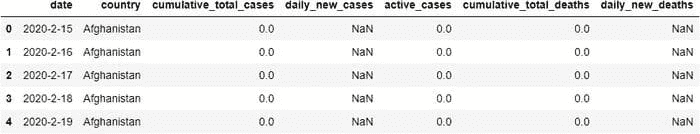
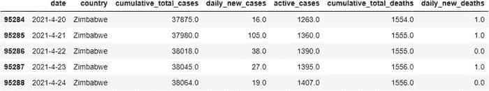
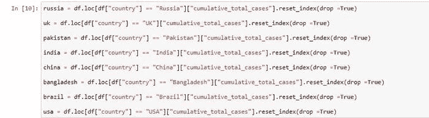
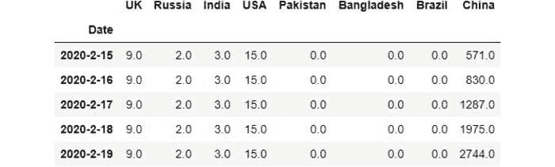
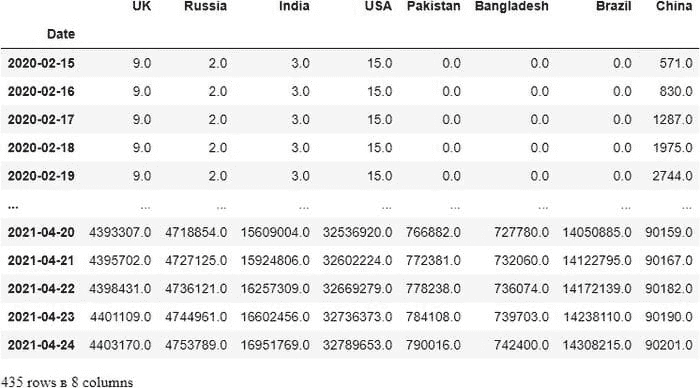
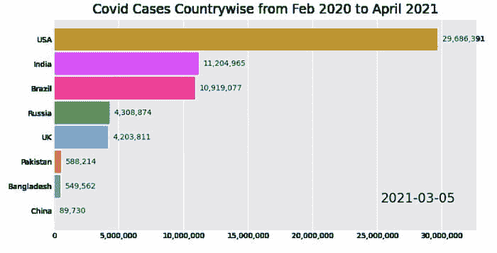

# Python 中的动画条形图竞赛

> 原文：[`www.kdnuggets.com/2021/05/animated-race-bar-charts-python.html`](https://www.kdnuggets.com/2021/05/animated-race-bar-charts-python.html)

评论

**作者 [Shelvi Garg](https://www.linkedin.com/in/shelvi-garg-3a7421108/), 数据科学家**

我们的任务是创建一个动画条形图竞赛（bcr），展示 2020 年 2 月至 2021 年 4 月期间各国的 covid-19 案例数量。

* * *

## 我们的三大课程推荐

 1\. [Google 网络安全证书](https://www.kdnuggets.com/google-cybersecurity) - 快速入门网络安全职业。

 2\. [Google 数据分析专业证书](https://www.kdnuggets.com/google-data-analytics) - 提升你的数据分析能力

 3\. [Google IT 支持专业证书](https://www.kdnuggets.com/google-itsupport) - 支持你所在组织的 IT 工作

* * *

*与其他允许使用预加载 bcr 数据集的教程不同，我们将处理和清理自己的数据集以制作竞赛图表*


输出结果：作者提供的图像

### 问题概述

我们的问题陈述是全球 covid-19 案例记录。

*“希望就是能够看到尽管有黑暗，仍然存在光明。” — 德斯蒙德·图图*

### 数据集说明

你可以在这里找到原始数据：[*https://github.com/shelvi31/Animated-Bar-Graph/blob/main/worldometer_coronavirus_daily_data.csv*](https://github.com/shelvi31/Animated-Bar-Graph/blob/main/worldometer_coronavirus_daily_data.csv)

如果你想跳过数据处理和清理步骤直接进行图表制作，这里是我修改后的数据集：[*https://github.com/shelvi31/Animated-Bar-Graph/blob/main/corona_dataset*](https://github.com/shelvi31/Animated-Bar-Graph/blob/main/corona_dataset)

这些数据由 Joseph Assaker 于 2021 年 4 月 24 日从 worldometers.info 上抓取。数据中包含 218 个国家。

所有国家的记录从 2020 年 2 月 15 日到 2021 年 4 月 24 日（每个国家 435 天），中国除外，中国的记录从 2020 年 1 月 22 日到 2021 年 4 月 24 日（每个国家 459 天）。

### 列表概述

*country: 表示行数据所观察的国家。*

*continent: 表示观察到的国家所在的大陆。*

*total_confirmed: 表示观察到的国家中确认病例的总数。*

*total_deaths: 表示观察到的国家中确认死亡的病例总数。*

*total_recovered: 表示观察到的国家中确认恢复的病例总数。*

*active_cases: 表示观察到的国家中的活跃病例数量。*

*serious_or_critical: 表示观察到的国家中处于严重或危急状态的病例的估计数量。*

*total_cases_per_1m_population: 指定了每 100 万人口中总病例的数量。*

*total_deaths_per_1m_population: 指定了每 100 万人口中总死亡人数的数量。*

*total_tests: 指定了在观察国家中完成的总测试数量。*

*total_tests_per_1m_population: 指定了每 100 万人口中完成的总测试数量。*

*population: 指定了观察国家中的人口数量。*

### 数据集致谢

本数据集中所有数据均从 worldometers.info 抓取。

你可以在我的 Jupyter 笔记本上找到完整的清洁代码：[*https://github.com/shelvi31/Animated-Bar-Graph/blob/main/Animated%20Bar%20Graph.ipynb*](https://github.com/shelvi31/Animated-Bar-Graph/blob/main/Animated%20Bar%20Graph.ipynb)

### 加载库

```py
import pandas as pd
import os
```

### 加载数据集

```py
df = pd.read_csv("worldometer_coronavirus_daily_data.csv")
```

### 处理数据集：让我们了解数据

```py
df.head()
```



```py
df.shape(95289, 7)df.tail()
```



由于国家众多，我们需要选择一些特定国家进行分析。

```py
df.loc[df["country"] == "Zimbabwe"].shape
Output:
(435, 7)
```

因此，我们为每个国家都有大约 450 天的数据。

```py
df.isnull().sum()Output:
date                           0
country                        0
cumulative_total_cases         0
daily_new_cases             6469
active_cases                   0
cumulative_total_deaths     6090
daily_new_deaths           19190
dtype: int64
```

### 选择用于条形图的国家

选择累积总病例列作为系列，并按国家名称对其进行分组。我将选择 8 个国家，最人口众多的以及我们的邻国进行评估



代码，作者提供的图像

我们为所有国家的数据只有 435 行。因此，中国的数据也只取 435 行。

### 处理中国的数据

```py
CHINA=[]
for i in range(0,435):
    CHINA.append(china[i])
```

### 转换为系列

```py
china = pd.Series(CHINA)china.shapeOutput:(435,)
```

### 太好了！现在我们所有列的长度都是相同的 - 435 天。

我们还需要选择日期列。由于日期在国家之间重复，我们只能检索前 459 个值，所有国家的数据最大天数为 435 天。

### 处理日期列

```py
date=[]
for i in range(0,435):
    date.append(df.date[i])
```

将列表转换为系列：

```py
DATE = pd.Series(date)
```

### 合并系列以创建新的数据库

由于我们现在有了不同的系列，我们为这些系列命名，这些名称之后会被转换为数据框的列

```py
data = {"UK": uk,
        "Russia": russia,
        "India" : india,
        "USA": usa,
        "Pakistan" : pakistan,
        "Bangladesh" : bangladesh,
        "Brazil":brazil,
        "China": china,
        "Date" : DATE
       }corona = pd.concat(data,axis = 1)corona.set_index("Date", inplace = True)corona.head()
```



```py
corona.shapeOutput:(435, 8)
```

### 检查是否有空值

```py
corona.isnull().sum()Output:
UK            0
Russia        0
India         0
USA           0
Pakistan      0
Bangladesh    0
Brazil        0
China         0
dtype: int64
```

### 将日期转换为日期时间格式

```py
corona.index = pd.to_datetime(corona.index)
```

最终！我们得到了所需的格式和国家！

我们还需要选择日期列

```py
corona
```



```py
corona.to_csv("corona_dataset",header=True,index=True)
```

### 太棒了！我们的数据框看起来很棒，可以继续进行！

现在让我们开始动画条形图的编码吧！

### 安装条形图比赛

```py
pip install bar_chart_race
```

注意事项：图表加载需要时间，因此请耐心等待。不要像我一样，因为结果没有在几分钟内显示而急于寻找不必要的错误或自我怀疑。

`P.s : 是的，我确实浪费了很多时间，以为存在错误，但实际上并没有，图表只是需要时间加载！！！ :p`

```py
import bar_chart_race as bcr

bcr.bar_chart_race(df=corona,filename=None,title= "Covid Cases Country-wise from Feb 2020 to April 2021")
```



输出，作者提供的图像

令人非常遗憾的是，注意到印度的病例在 4 月迅速增加，这导致了极大的恐慌、混乱和在我撰写这篇博客时的生命损失。


输出：作者提供的图片

如果你遇到任何与 FFmpeg 相关的错误：这里是解决该问题的逐步链接：

[`www.wikihow.com/Install-FFmpeg-on-Windows`](https://www.wikihow.com/Install-FFmpeg-on-Windows)

### 保存赛道条形图

你可以通过从图片底部的下载选项中下载来保存条形图。希望你喜欢这个有趣的教程。享受学习 :)

### **参考文献**

+   [`pypi.org/project/bar-chart-race/`](https://pypi.org/project/bar-chart-race/)

+   [`www.youtube.com/watch?v=Dawp5XOSEuk&t=350s`](https://www.youtube.com/watch?v=Dawp5XOSEuk&t=350s)

+   [`www.worldometers.info/`](https://www.worldometers.info/)

**个人简介：[Shelvi Garg](https://www.linkedin.com/in/shelvi-garg-3a7421108/)** 是一名数据科学家。兴趣和学习无边界。

[原文](https://garg-shelvi.medium.com/fun-data-science-project-animated-race-bar-graph-37ec8014ec95)。经许可转载。

**相关：**

+   一个简单的静态可视化通常是最佳方法

+   11 个完整 EDA（探索性数据分析）的基本代码块

+   2021 年数据科学家应了解的前 10 大 Python 库

### 更多相关内容

+   [通过《快速 Python 数据科学》提升你的 Python 技能！](https://www.kdnuggets.com/2022/06/manning-step-python-game-fast-python-data-science.html)

+   [优化 Python 代码性能：深入探讨 Python 分析器](https://www.kdnuggets.com/2023/02/optimizing-python-code-performance-deep-dive-python-profilers.html)

+   [Python 枚举：如何在 Python 中构建枚举](https://www.kdnuggets.com/python-enum-how-to-build-enumerations-in-python)

+   [用 Python 和 Scikit-learn 简化决策树的可解释性](https://www.kdnuggets.com/2017/05/simplifying-decision-tree-interpretation-decision-rules-python.html)

+   [Python 中的稀疏矩阵表示](https://www.kdnuggets.com/2020/05/sparse-matrix-representation-python.html)

+   [数据科学、数据可视化和…的前 38 大 Python 库](https://www.kdnuggets.com/2020/11/top-python-libraries-data-science-data-visualization-machine-learning.html)
