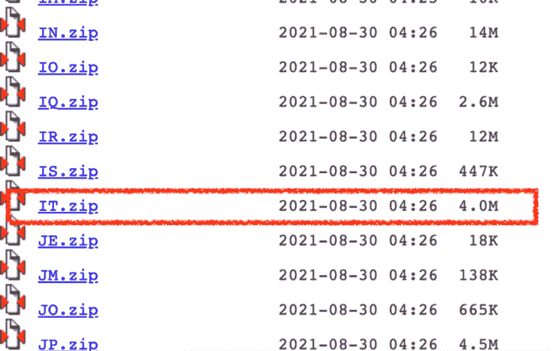
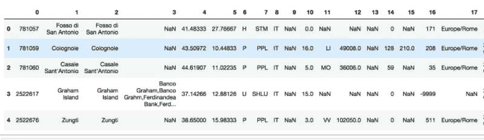

# 如何在 Python 中匿名化地点

> 原文：[`www.kdnuggets.com/2022/12/anonymise-places-python.html`](https://www.kdnuggets.com/2022/12/anonymise-places-python.html)


图片由 [Max Chen](https://unsplash.com/@maxchen2k?utm_source=medium&utm_medium=referral) 提供，来源于 [Unsplash](https://unsplash.com/?utm_source=medium&utm_medium=referral)

在本文中，我展示了如何在 Python 中识别和匿名化地点，**而无需使用 NLP 技术，如命名实体识别**。

> 地点识别基于地名表，该表从[Geonames 数据库](http://www.geonames.org/)构建。

**Geonames 是一个网络服务，包含（几乎）世界上所有地点。** Geonames 数据库可以在[此链接](https://download.geonames.org/export/dump/)免费下载。你可以下载包含所有世界国家的完整数据库，或只下载一个特定国家的数据库。

> 本文的核心思想是从 Geonames 数据库构建一个**地名表**并利用它来识别句子中的地点。实际上，**实施的算法搜索句子中的每个单词是否包含在地名表中**。为了搜索多于一个单词的地点，**考虑了 n-gram**。

本文的组织结构如下：

+   导入 Geonames 数据库

+   识别句子中的地点

+   匿名化句子中的地点

+   扩展匿名化函数

# 导入 Geonames 数据库

第一步涉及导入 Geonames 数据库，可以从[此链接](https://download.geonames.org/export/dump/)下载。你可以选择导入完整数据库（AllCountries.zip）或特定国家的数据库（例如，意大利的 IT.zip）。每个国家都通过其识别码来标识。

> 完整数据库更为详尽，但处理时间比单一国家数据库要长。

因此，你应根据要处理的文本选择合适的数据库。在本教程中，我重点关注意大利数据库，但相同的代码也可以用于其他数据库。

从 [Geonames 链接](https://download.geonames.org/export/dump/)下载 IT.zip 文件，解压后放入工作目录：



图片作者提供

然后将其导入 Pandas 数据框中：

```py
import pandas as pd
df = pd.read_csv('source/IT.txt', sep=' ', header=None)
```



图片作者提供

数据框的第 1 列包含用于构建地名表的地点列表：

```py
gaz = df[1]
gaz = gaz.tolist()
```

实施的地名表包含 119,539 个地点。

# 识别句子中的地点

现在，我定义一个接收文本作为输入并返回文本中所有地点的函数。该函数执行以下操作：

+   从文本中删除所有标点符号

+   将句子拆分为以空格字符分隔的标记。可以通过`split()`函数完成

+   从识别的标记开始，构建所有可能的 ngram，n ? 5。我利用 `nltk` 库的 `ngrams` 函数将文本拆分成 ngram。例如在句子：*Oggi sono andata a Parigi* 中，n ? 5 的 ngram 包括：

```py
(‘Oggi’, ‘sono’, ‘andata’, ‘a’, ‘Parigi’)
(‘Oggi’, ‘sono’, ‘andata’, ‘a’)
(‘sono’, ‘andata’, ‘a’, ‘Parigi’)
(‘Oggi’, ‘sono’, ‘andata’)
(‘sono’, ‘andata’, ‘a’)
(‘andata’, ‘a’, ‘Parigi’)
(‘Oggi’, ‘sono’)
(‘sono’, ‘andata’)
(‘andata’, ‘a’)
(‘a’, ‘Parigi’)
(‘Oggi’,)
(‘sono’,)
(‘andata’,)
(‘a’,)
(‘Parigi’,)
```

+   从最大的 ngram（n = 5）开始，搜索每个 ngram 是否包含在地名词典中。如果是，则找到一个地点，并可以将其添加到找到的地点列表中，并从原文本中移除该地点，否则继续。注意

函数的完整代码如下：

```py
from nltk import ngrams
import re
def get_places(txt):
    # remove punctuation
    txt = re.sub(r"[^\w\d'\s]+",'',txt)
    n = 5
    places = []

    for i in range(n,0,-1):
        tokens = ngrams(txt.split(), i)
        for t in tokens:
            token = " ".join(t)
            try:
                res = gaz.index(token)
            except ValueError:
                continue
            if res:
                places.append(token)
                txt = txt.replace(token,"")
    return places
```

现在我可以用一个例子来测试这个函数：

```py
txt = 'Oggi sono andata a Roma e a Milano.'
get_places(txt)
```

这会产生以下输出：

```py
['Roma', 'Milano']
```

# 在句子中匿名化地点

现在，我准备利用之前定义的函数来匿名化地点。简单来说，我可以用一个符号字符（例如 X）来替换找到的位置。所有搜索操作必须在原文本的副本上进行，以便保留原文本（即标点符号在操作时被移除）。

这里是完整的匿名化函数：

```py
def anonymise_places(txt):
    temp_txt = re.sub(r"[^\w\d'\s]+",'',txt)
    n = 5
    # remove punctuation
    for i in range(n,0,-1):
        tokens = ngrams(temp_txt.split(), i)
        for t in tokens:
            token = " ".join(t)
            try:
                res = gaz.index(token)
            except ValueError:
                continue
            if res:
                txt = txt.replace(token,"X")
                temp_txt = temp_txt.replace(token,"")
    return txt
```

# 扩展匿名化函数

实现的函数可以通过覆盖全世界的地名词典来扩展。然而，全球的 GeoNames 数据库约为 1.5 GB，因此管理起来较为困难。为此，你可以下载它，加载到 Pandas 中，然后仅选择感兴趣的列（即第 1 列），并将结果导出为新的 csv 文件，约为 274 MB：

```py
df_all = pd.read_csv('source/allCountries.txt', sep=' ', header=None)
df_all[1].to_csv('source/places.csv')
```

由于文件相当大，之前的操作可能需要一些时间。然后，你可以利用这个新文件作为地名词典，代替 IT.txt。

# 总结

在这篇文章中，我描述了如何在 Python 中匿名化地点，而无需使用 NLP 技术。所提出的方法基于使用一个地名词典，该词典是从 Geonames 数据库构建的。

本教程的完整代码可以从我的 [Github Repository](https://github.com/alod83/data-science/blob/master/TextAnalysis/Anonymise%20Places.ipynb) 下载。教程还包含在 `gradio` 中的一个函数测试，`gradio` 是一个非常强大的 Python Web 应用库。敬请关注有关 `gradio` 的教程 :)

**[Angelica Lo Duca](https://alod83.altervista.org/)** ([Medium](https://alod83.medium.com/)) (@alod83)在意大利比萨的国家研究委员会信息学与远程通讯研究所（IIT-CNR）担任研究员。她是比萨大学数字人文学科硕士课程中的“数据新闻学”教授。她的研究兴趣包括数据科学、数据分析、文本分析、开放数据、网络应用程序和数据新闻，应用于社会、旅游和文化遗产。她曾从事数据安全、语义网和关联数据的工作。Angelica 还是一位热情的技术作家。

[原文](https://towardsdatascience.com/how-to-anonymise-places-in-python-55597d0ded24)。转载许可。

* * *

## 我们的前三名课程推荐

 1\. [Google 网络安全证书](https://www.kdnuggets.com/google-cybersecurity) - 快速进入网络安全领域的职业生涯。

 2\. [Google 数据分析专业证书](https://www.kdnuggets.com/google-data-analytics) - 提升你的数据分析技能

 3\. [Google IT 支持专业证书](https://www.kdnuggets.com/google-itsupport) - 支持你的组织的 IT 工作

* * *

### 更多相关话题

+   [托管数据科学作品集的 5 个最佳平台](https://www.kdnuggets.com/2022/07/5-best-places-host-data-science-portfolio.html)

+   [通过《快速 Python 数据科学》提升你的 Python 技能！](https://www.kdnuggets.com/2022/06/manning-step-python-game-fast-python-data-science.html)

+   [优化 Python 代码性能：深入了解 Python 分析工具](https://www.kdnuggets.com/2023/02/optimizing-python-code-performance-deep-dive-python-profilers.html)

+   [Python Enum：如何在 Python 中构建枚举](https://www.kdnuggets.com/python-enum-how-to-build-enumerations-in-python)

+   [通过 Python 和 Scikit-learn 简化决策树的可解释性](https://www.kdnuggets.com/2017/05/simplifying-decision-tree-interpretation-decision-rules-python.html)

+   [Python 中的稀疏矩阵表示](https://www.kdnuggets.com/2020/05/sparse-matrix-representation-python.html)
