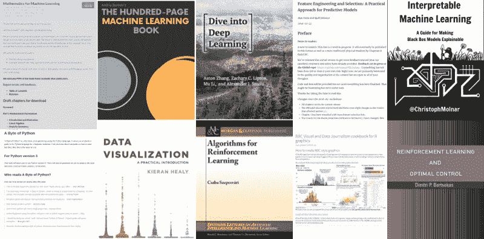

# 另有 10 本机器学习和数据科学必读的免费书籍

> 原文：[`www.kdnuggets.com/2019/03/another-10-free-must-read-books-for-machine-learning-and-data-science.html`](https://www.kdnuggets.com/2019/03/another-10-free-must-read-books-for-machine-learning-and-data-science.html)

 评论

谁喜欢免费的书籍？

考虑到“免费必读书籍”系列之前的安装版和更多版本的受欢迎程度，推出第三版高质量（免费！）书籍似乎是个好主意。在这里，你会找到一些关于基础机器学习的书籍，一些涉及特征工程和模型解释性等一般机器学习主题的书籍，一本深度学习入门书籍，一本关于 Python 编程的书籍，一对数据可视化的入门书籍，以及双重强化学习的努力。

* * *

## 我们的三大课程推荐

 1\. [谷歌网络安全证书](https://www.kdnuggets.com/google-cybersecurity) - 快速进入网络安全职业生涯的快车道。

 2\. [谷歌数据分析专业证书](https://www.kdnuggets.com/google-data-analytics) - 提升你的数据分析技能

 3\. [谷歌 IT 支持专业证书](https://www.kdnuggets.com/google-itsupport) - 支持你的组织进行 IT 支持

* * *

没什么好说的了，只能说“开始阅读吧！”

**1\. [机器学习数学](https://mml-book.com/)**

由马克·彼得·德森罗斯（Marc Peter Deisenroth）、A·阿尔多·费萨尔（A. Aldo Faisal）和郑顺（Cheng Soon Ong）著

> 我们正在编写一本关于机器学习数学的书，旨在激励人们学习数学概念。这本书并不打算覆盖高级机器学习技术，因为已经有很多书籍涉及这些内容。相反，我们的目标是提供阅读其他书籍所需的数学技能。

**2\. [一百页机器学习书籍](http://themlbook.com/wiki/doku.php)**

由安德烈·布尔科夫（Andriy Burkov）著

> 在一百页中了解机器学习的所有知识。监督学习和无监督学习，支持向量机，神经网络，集成方法，梯度下降，聚类分析和降维，自动编码器和迁移学习，特征工程和超参数调整！数学、直觉、插图，一百页全包含！
> 
> *先读后买*的原则意味着你可以自由下载这本书，阅读后与朋友和同事分享。如果你喜欢这本书，才需要购买它。

**3\. [深入学习](http://d2l.ai/)**

由阿斯顿·张（Aston Zhang）、扎克·C·利普顿（Zack C. Lipton）、穆·李（Mu Li）和亚历克斯·J·斯莫拉（Alex J. Smola）著

> 我们致力于创建一个资源，它可以（1）对所有人免费提供，（2）提供足够的技术深度，为实际成为应用机器学习科学家提供起点，（3）包含可运行的代码，向读者展示如何实际解决问题，（4）允许快速更新，无论是我们还是社区，都可以进行更新，以及（5）通过论坛补充技术细节的互动讨论和回答问题。

**4\. [Feature Engineering and Selection: A Practical Approach for Predictive Models](https://bookdown.org/max/FES/)**

by Max Kuhn and Kjell Johnson

> 《Feature Engineering and Selection》的目标是提供重新表示预测变量的工具，将这些工具放在良好的预测建模框架中，并传达我们在实际使用这些工具中的经验。最终，我们希望这些工具和我们的经验将帮助你生成更好的模型。
> 
> 就像在*Applied Predictive Modeling*中一样，我们使用 R 作为本文的计算引擎。

**5\. [Interpretable Machine Learning](https://christophm.github.io/interpretable-ml-book/)**

By Christoph Molnar

> 所有解释方法都进行了深入讲解并进行了批判性的讨论。它们在后台是如何工作的？它们的优缺点是什么？如何解释它们的输出？这本书将帮助你选择并正确应用最适合你机器学习项目的解释方法。
> 
> 本书专注于表格数据（也称为关系数据或结构化数据）的机器学习模型，而较少关注计算机视觉和自然语言处理任务。推荐机器学习从业者、数据科学家、统计学家以及任何其他对使机器学习模型可解释感兴趣的人阅读本书。

**6\. [A Byte of Python](https://python.swaroopch.com/)**

By Swaroop C. H.

> 《A Byte of Python》是一本关于使用 Python 语言编程的免费书籍。它作为初学者的教程或指南。如果你对计算机的了解仅限于如何保存文本文件，那么这本书就是为你准备的。

**7\. [BBC Visual and Data Journalism cookbook for R graphics](https://bbc.github.io/rcookbook/)**

By BBC

> 在 BBC 数据团队，我们开发了一个 R 包和 R 食谱，使使用 R 的 ggplot2 库创建符合我们内部风格的出版准备图形的过程更加可重复，同时也使新手更容易创建图形。
> 
> 下面的食谱希望能够帮助任何想要制作图形的人[.]

**8\. [Data Visualization: A practical introduction](https://socviz.co/index.html)**

By Kieran Healy

> 你应该查看你的数据。图表和图形可以让你深入了解你收集的信息的结构。好的数据可视化也能更容易地将你的想法和发现传达给其他人。除此之外，从自己的数据中生成有效的图表是培养读图和理解图表（无论是好的还是坏的）能力的最佳方式，这些图表可能出现在研究文章、商业幻灯片、公共政策倡导或媒体报道中。这本书教你如何做到这一点。

**9\. [强化学习算法](https://sites.ualberta.ca/~szepesva/RLBook.html)**

作者：Csaba Szepesvári

> 强化学习的目标是开发高效的学习算法，并理解这些算法的优点和局限性。强化学习因其广泛的实际应用而受到极大关注，这些应用从人工智能问题到运筹学或控制工程。本书重点介绍那些基于动态规划强大理论的强化学习算法。我们提供了相当全面的学习问题目录，描述了核心思想，列出了大量前沿算法，并讨论了它们的理论属性和局限性。

**10\. [强化学习与最优控制](http://web.mit.edu/dimitrib/www/RLbook.html)**

作者：Dimitri P. Bertsekas

> 本书的目的是考虑那些大型且具有挑战性的多阶段决策问题，这些问题理论上可以通过动态规划和最优控制来解决，但其精确解法在计算上不可行。我们讨论了依赖近似的解决方法，以生成具有足够性能的次优策略。这些方法统称为强化学习，也被称为近似动态规划和神经动态规划等其他名称。

**相关**：

+   10 本必须阅读的免费书籍，适用于机器学习和数据科学

+   更多 10 本必须阅读的免费书籍，适用于机器学习和数据科学

+   进入机器学习职业前应阅读的 5 本电子书

### 更多相关主题

+   [构建一个稳固的数据团队](https://www.kdnuggets.com/2021/12/build-solid-data-team.html)

+   [使用管道编写干净的 Python 代码](https://www.kdnuggets.com/2021/12/write-clean-python-code-pipes.html)

+   [成为优秀数据科学家所需的 5 个关键技能](https://www.kdnuggets.com/2021/12/5-key-skills-needed-become-great-data-scientist.html)

+   [每位初学者数据科学家应掌握的 6 种预测模型](https://www.kdnuggets.com/2021/12/6-predictive-models-every-beginner-data-scientist-master.html)

+   [2021 年最佳 ETL 工具](https://www.kdnuggets.com/2021/12/mozart-best-etl-tools-2021.html)

+   [停止学习数据科学以寻找目标，并通过寻找目标来…](https://www.kdnuggets.com/2021/12/stop-learning-data-science-find-purpose.html)
