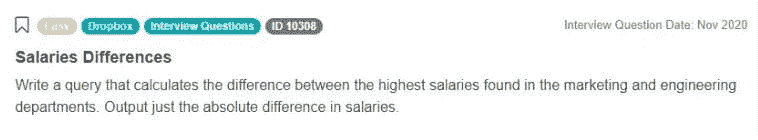
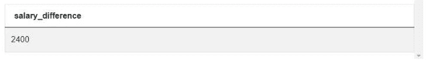
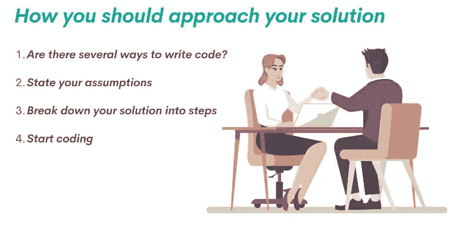
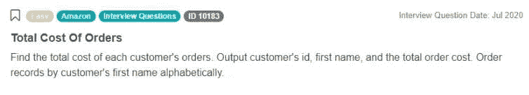
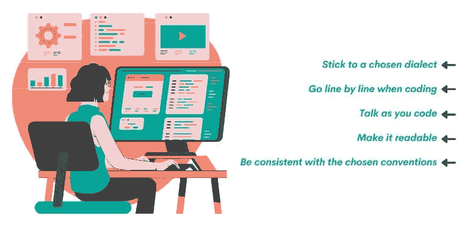
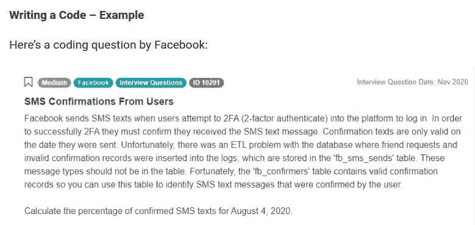

# 如何回答数据科学编码面试问题

> 原文：[`www.kdnuggets.com/2022/01/answer-data-science-coding-interview-questions.html`](https://www.kdnuggets.com/2022/01/answer-data-science-coding-interview-questions.html)


对于如何回答数据科学编码面试问题，没有固定的公式。没有一种方法可以总是有效。然而，有一些指导原则在大多数情况下会帮助你更好地回答编码问题。

这些指导原则基于参加面试和回答编码问题的经验。我们将这些指导原则分成四个部分。你可以将这些指导原则作为清单使用，特别是如果你对[data science coding interview questions](https://www.stratascratch.com/blog/data-science-coding-interview-questions-with-5-technical-concepts/)还不够熟悉的话。当然，之后你会找到自己的方法，也许会忽略一些要点，甚至加入一些对你更有效的内容。

但无论你的经验如何，如果你遵循这个清单，你就会提高对编码问题给出优秀回答的机会。

## 四部分清单

这个清单的四个部分是：

1.  问题分析

1.  解决方案的思路

1.  编写代码

1.  审查你的代码

现在你有了清单的概要，我们将逐一探讨每个部分，并解释其中包含的清单点。

## 1. 问题分析

清单中的问题分析部分涉及花费几分钟时间，彻底思考你刚刚得到的问题。正如你在处理实际商业问题时会看到的那样，首先思考问题并“浪费”一些时间从各个角度看待它总是更好。记住，思考绝不是浪费时间！

这几分钟的时间会在之后得到回报。如果你立即跳到编写解决方案，可能会发现一旦你意识到你的方法无法达到预期的解决方案，你就不得不从头开始。或者你需要不断更改和重写你的代码。

将帮助你练习思考问题的要点包括：

1.  理解问题

1.  分析你正在处理的表格和数据

1.  思考代码结果

**i. 理解问题**

为了确保你理解了问题，你需要非常仔细地阅读问题。慢慢阅读。阅读 2-3 遍，确保没有遗漏任何内容。这适用于所有[data science interview questions](https://www.stratascratch.com/blog/data-science-interview-guide-questions-from-80-different-companies/)，无论问题有多简单或多难。重点是，你不会知道你得到的问题是难还是易。有些问题看似简单，但它们实际上有一些陷阱，正是为了排除那些不够彻底、倾向于肤浅的候选人。

如果问题没有写清楚，也可以请面试官重复一遍，如果你没有听清楚的话。在这种情况下，一旦你理解了问题，也建议你将问题复述一遍给面试官。这样，你可以确保你理解正确，并允许面试官纠正自己，以防他们没有给你提供所有必要的信息。

**ii. 分析你所处理的表和数据**

一旦你理解了问题，接下来的逻辑步骤是分析你所给出的表。这意味着你需要分析表的数量以及它们如何相互关联（外键和主键）。

你还需要查看这些表中的数据。也就是说，每个表中有哪些列。每列的数据类型是什么。这一点很重要，因为你的代码将取决于你处理的是字符串数据、整数、货币或其他类型的数据。也许你甚至需要将一种数据类型转换为另一种，以获得期望的结果。

除了数据类型，还需要了解数据如何组织、排序和颗粒化。意思是，表中是否有重复值？数据是否以客户级别、交易级别等方式呈现？

**iii. 考虑代码结果**

在你开始编码之前，你应该知道你希望结果是什么样的。这当然也取决于你要回答的问题。

但要从结果的字面意思来思考，它会是单行中的一个值，还是包含几个列的表。如果是表格，你还需要考虑数据将如何汇总和排序，需要显示多少列等。

**问题分析 – 示例**

为了向你展示如何应用清单的第一部分，我们将使用 Dropbox 编程问题。问题如下：



*“编写一个查询，计算市场营销和工程部门中最高工资之间的差异。仅输出工资差异。”*

问题链接：[`platform.stratascratch.com/coding/10308-salaries-differences`](https://platform.stratascratch.com/coding/10308-salaries-differences?python=)

如果你仔细阅读问题，你会发现你需要找到最高的工资。好的，但不是每个部门的最高工资，而只是两个部门的：市场营销和工程。找到这两个部门的最高工资后，你需要计算它们之间的差异。

现在你理解了问题，你可以分析表和其中的数据。你将处理的表是 db_employee 和 db_dept。表 db_employee 包含有关公司员工的数据。它有五列：

| id | int |
| --- | --- |
| first_name | varchar |
| last_name | varchar |
| salary | int |
| department_id | int |

你看，名字列是 varchar 数据类型，而薪水是整数。了解薪水值中没有小数可能很重要。如果你使用这里提供的预览选项，你会发现这些数据是唯一的：每个员工只有一个分配的薪水值。还有一个重要的点是：这可能也是历史数据，其中包含每个员工多年来的所有以前薪水。还有一个名为 department_id 的列，它是一个外键，将此表与 db_dept 表连接起来：

| id | int |
| --- | --- |
| department | varchar |

这个表中只有两列。它只是一个部门列表，没有重复，表中显示了六个部门。

很好，你已经分析了数据。现在，回到问题上来，阅读第二句话。是的，这是关于你的解决方案需要是什么的指示。你不需要在一列中显示一个部门的最高薪水，在另一列中显示另一个部门的最高薪水，然后在第三列中显示它们之间的差异。不，输出将只是差异：



没有关于这个输出列应该命名为什么的指示。因此，不管你如何命名它或是否根本不命名它，都不会是错误的。重要的是你得到这个结果，仅此而已。

有了这些，你就有了编写高质量代码的基础。现在是时候考虑策略了：你将如何编写代码？

## 2\. 解决方案的方法

在开始编写代码之前，明确你的代码将是什么样子也很重要。编码应只是将你的（清晰的！）解决方案思路转化为编程语言。

当你考虑如何解决问题（或编写代码）时，请考虑以下几点：



1.  是否有几种方式来编写代码？

1.  陈述你的假设

1.  将你的解决方案分解为步骤

1.  开始编码

**i. 有没有几种方式来编写代码？**

在考虑解决方案时，首先想到的有时是最佳方案，但有时不是。你怎么知道呢？一旦得到第一个想法，诀窍是考虑是否还有其他方法来解决问题。在[编程语言](https://www.stratascratch.com/blog/top-5-data-science-programming-languages/)中，往往有几种可能的解决方案。

请记住这一点。有几个原因说明这点很重要。首先，可能存在一些简单的技巧或函数，可以轻松解决你认为需要用冗长代码解决的内容——例如，使用[窗口函数](https://www.stratascratch.com/blog/the-ultimate-guide-to-sql-window-functions/)或 CTE，而不是编写包含无尽子查询的代码。

总是选择更容易编写的解决方案，尽可能少的代码行。当你在面试时，你还需要管理你可用的时间。这是其中的一种方法。

当然，如果有几个或多或少同样复杂的解决方案，考虑代码的执行效果。在大量数据上，不同的代码可能会比其他代码花费更多的时间和内存。

简而言之，你应该从两个方面考虑代码效率。一是个人效率，即你写代码的速度。第二个是代码效率，即代码执行你所需功能的速度。

**ii. 陈述你的假设**

陈述你的假设很重要，原因有几个。第一个原因是大声说出来并写下来，这将帮助你发现你方法中的潜在问题。

第二个重要原因是它邀请你的面试官与你沟通，甚至提供一些帮助，他们通常会这样做。如果他们不知道你想做什么以及为什么，他们就无法帮助你。正如我们已经提到的，通常有几种返回相同结果的解决方案。沟通你的假设使面试官能够根据你选择的方法将你引导到正确的方向。或者甚至将你从完全错误的假设中引导出来，以免搞砸你的解决方案。

第三个原因是，有时候问题可能故意设计得模糊。这些问题并不太关心正确的解决方案，而是关心你的思维方式。因此，如果你陈述了你的假设，这将向面试官展示你的思维方式，他们通常对此非常感兴趣。

陈述假设的第四个也是最终的原因是，即使你得到的答案完全错误，但在你所陈述的假设范围内是正确的，你仍然有可能得到一些分数。在这种情况下，思考方式是：好吧，也许候选人完全误解了要求，但在他们理解的背景下，解决方案实际上是正确的。

这都涉及到[确保在面试问题中给出正确答案](https://www.stratascratch.com/blog/how-to-guarantee-the-right-answers-to-data-science-interview-questions/)。

**iii. 将你的解决方案分解为步骤**

这也是一个有用的点，它将使你更容易形成清晰的解决方案思路，并且在之后编写干净的代码。

在这种情况下，分解意味着写下来。是的，写下你解决方案中的所有关键步骤和功能。考虑一下你是否需要连接表，多少个表，以及你将使用哪种连接。你需要编写子查询还是 CTE？写下你的选择。考虑一下你需要使用哪些聚合函数，是否需要转换数据类型，数据是否需要按特定方式排序，是否需要过滤和分组，等等。

所有这些都是不同的步骤，所以把它们写下来，以及你将在每一步中使用的主要关键词。

**iv. 开始编码**

这在某种程度上是一个紧急点。如果你已经考虑了你的解决方案方法，但还是看不到完整的解决方案，那你应该开始编写代码。

这样做的思路是，即使你提供了一个不完整的解决方案，它也肯定比什么都不写要更有价值。此外，一些问题可能非常困难，即使是经验最丰富的人也难以立即看到完整的解决方案。开始编码，你可能会在过程中想到一个点子。如果没有，你至少还有东西可以展示。

还有一个额外的理由你需要记住：有些问题甚至没有意图得到答案。它们中的一些问题故意（且有意！）在面试时间内过于困难。没有人能完全解决它们。部分解决方案是任何人能获得的最好结果。所以，你将根据你比其他不完整解决方案的进展程度来评分。

**解决方案方法 – 示例**

既然你知道了如何思考解决方案的方法，让我们用一个面试问题来演示它在实践中的应用。我们将使用亚马逊编程面试问题：



*“找到每位客户订单的总成本。输出客户的 ID、名字和总订单成本。按客户名字的字母顺序排列订单记录。”*

问题链接：[`platform.stratascratch.com/coding/10183-total-cost-of-orders`](https://platform.stratascratch.com/coding/10183-total-cost-of-orders?python=)

我们需要使用来自两个表的数据，即表 customers 和表 orders。我们可以通过子查询编写代码来解决这个问题。然而，你可能知道，如果查询和子查询使用来自多个表的数据，那么也可以使用 JOIN 来编写解决方案。考虑到尽可能少写代码的建议，使用 JOIN 更为合适。

这个解决方案的假设是什么？一个假设可能是存在没有订单的客户。这意味着在表 customers 中可能存在不出现在表 orders 中的客户。第二个假设是我们不会展示没有订单的客户，因为问题中没有明确提到这一点。

现在，这已经引导我们到解决方案分解。我们必须输出两个已经存在的列，因此我们肯定会使用 SELECT。我们需要找到每个客户订单的总数。我们将使用 SUM() 聚合函数来求和。好的，表格必须连接。我们将使用 JOIN 关键字来完成。为什么不是其他连接？因为我们的假设是，我们只希望有至少一个订单的客户。使用 JOIN 将正好满足这一点：它将连接两个表格，并找到两个表格中都有的值（客户）。接下来呢？我已经使用了聚合函数，因此我必须使用 GROUP BY。结果必须按字母顺序排序，所以我将使用 ORDER BY 和 ASC。

最终的解决方案分解可能看起来像这样：

+   SELECT

+   SUM (total_order_cost)

+   JOIN

+   GROUP BY

+   ORDER BY ASC

在你的情况下，这不是紧急情况，因为你已经理解了所有内容，所以你可以继续下一个检查列表部分。或者你也可以在这里找到最常见的[SQL JOIN 面试问题](https://www.stratascratch.com/blog/sql-join-interview-questions/)。

## 3\. 编写代码

在评估问题并制定代码策略后，是时候开始编写代码了。



1.  坚持选择的方言

1.  编码时逐行进行

1.  一边编码一边讲解

1.  使其可读

1.  在选择的约定中保持一致

**i. 坚持选择的方言**

如果你在 SQL 编码面试中，这一点尤其重要。如你所知，存在 ANSI/ISO SQL 标准，并且有许多 SQL 方言。几乎每个 RDBMS 都使用自己的 SQL 方言。当然，你不能知道所有的方言。你面试的公司可能正在使用这些方言中的一种。

如果面试官不在乎你使用哪个方言，选择你最熟悉的方言。如果你对某个方言不太擅长，不要试图通过选择面试官使用的 SQL 方言来吸引面试官。选择你最熟悉的方言解决问题要比使用你不太确定的其他方言更好。如果你选择后者，你可能会比必要时更紧张。此外，对特定 SQL 方言不太熟悉可能会让你搞砸解决方案。

一旦选择了 SQL 方言，就要坚持使用。例如，如果你选择使用 PostgreSQL，不要与 T-SQL 混用。

**ii. 逐行进行**

拥有明确的解决方案分解将帮助你几乎不被察觉地检查这一点。由于你已经概述了代码的功能和部分，你只需要保持冷静，系统地按照解决方案大纲编写代码。代码不过是你思想的编程语言版本。如果你的思想和解决方案大纲清晰，你的代码也会如此。

如果你开始在一行和另一行之间跳跃，你会让自己和面试官感到困惑。这可能会导致你写出错误的代码。

**iii. 编码时讨论**

当你逐行编写代码时，你也应该谈论你在做什么。这很重要，因为当你大声说出你在做什么时，你更容易发现自己是否做错了什么。脑中一切听起来都很棒，但当你说出来时，不太好的想法会特别突出！这使你能够在编写代码时进行修正。否则，你可能会完成代码，却没有意识到自己做错了什么。

解释每一行的原因之一是，它再次邀请面试官参与你的解决方案。这样面试官就能理解你在做什么，并给你一些提示。如果你只是编写代码，并对自己所做的事情保持沉默，面试官也可能会关闭交流，只等你完成代码后再告诉你做得如何。

**iv. 使其可读**

从美学角度来看，结构良好的代码令人赏心悦目。不仅如此，这也使你和面试官更容易阅读你的代码。

使你的代码可读的主要因素在上面的一点中提到：尽可能简单地编写代码。然而，有些解决方案不能简单。即使是几行代码，如果你不付出努力使其易读，也可能变成一场噩梦。

记住的一个小贴士是使用空格、制表符和回车键，并且要多使用这些键！这些键是用来将你的代码分成若干部分，使代码更易于理解。想象一下，就像你说或写的任何东西一样。空格、制表符和回车键将使你的代码有逗号、句子和段落。

如果可能的话，使用表的别名。但尽量使别名具有自解释性。避免使用单字母别名，但也不要使别名过于冗长和描述性。变量名也是如此。

虽然 SQL 不区分大小写，但最好还是使用大写书写 SQL 关键字。这样会使它们在代码中更为突出，尤其是当所有列和表名都用小写字母时。

查看我们的文章 "[*最佳实践：如何编写 SQL 查询并构建你的代码*](https://www.stratascratch.com/blog/best-practices-to-write-sql-queries-how-to-structure-your-code/)"，重点讨论了如何改进你的 SQL 查询，特别是在性能和可读性方面。

**v. 遵循一致的约定**

没有规则要求你必须使用大写或小写字母；没有规定的命名约定，所以这完全取决于你以及你喜欢的方式。但无论你做什么，都要保持一致。

如果你想将所有新列名写成小写字母，并用下划线分隔单词，请这样做并保持这种方式。命名为 salary_per_employee 看起来相当好。但尽量避免将一个列命名为 salary_per_employee，另一个命名为 SalaryPerDepartment，第三个命名为 ‘Total Salary’，第四个命名为 MAX_sALAryPerdeparment。在阅读代码时，你会感到困扰，尤其是最后一个。

同样，编写表名、使用别名等时也是如此。保持一致性也会提高代码的可读性。

说到一致性，我们将向你展示这一检查清单部分在实际中的运作方式。

**编写代码 – 示例**

这是 Facebook 提出的编码问题：



“Facebook 在用户尝试通过 2FA（双因素认证）登录平台时，会发送 SMS 短信。为了成功完成 2FA，他们必须确认收到 SMS 短信消息。确认短信仅在发送日期有效。不幸的是，数据库中存在 ETL 问题，导致好友请求和无效的确认记录被插入到日志中，这些日志存储在 'fb_sms_sends' 表中。这些消息类型不应该出现在表中。幸运的是，'fb_confirmers' 表包含有效的确认记录，因此你可以使用这个表来识别用户确认的 SMS 短信消息。

计算 2020 年 8 月 4 日确认的 SMS 短信的百分比。”

问题链接: [`platform.stratascratch.com/coding/10291-sms-confirmations-from-users`](https://platform.stratascratch.com/coding/10291-sms-confirmations-from_users?python=)

如果你写出这样的代码，它将覆盖我们在此检查清单部分提到的所有内容：

```py
SELECT 	cust_id,
       	SUM(total_order_cost) AS revenue
FROM orders
WHERE EXTRACT('MONTH'
              FROM order_date :: TIMESTAMP) = 3
      	AND
      	EXTRACT('YEAR'
              FROM order_date :: TIMESTAMP) = 2019
GROUP BY cust_id
ORDER BY revenue DESC
```

假设 Facebook 使用 SQL Server，但你可以选择使用哪种 SQL 方言编写你的代码。你对 T-SQL 不熟悉，因此决定使用 PostgreSQL。

例如，EXTRACT() 和双冒号 (::) 是 PostgreSQL 中典型的函数。第一个函数从 datetime 数据类型中提取日期部分。T-SQL 中不存在这个函数！所以如果你告诉面试官你在写 T-SQL 然后使用这个函数，你会犯错。在 T-SQL 中，你应该使用 DATEPART() 函数。你还应该知道，在 PostgreSQL 中，这个函数叫做 DATE_PART()。一个下划线的差别可能会影响你的代码是否正常工作。

类似地，PostgreSQL 中的双冒号 (::) 用于数据类型转换。在 T-SQL 中它不起作用；你需要使用 CAST() 或 CONVERT()。

对这段代码进行解决方案分解会使你逐行编写代码变得容易。实际上这很简单。首先，你需要从表格中选择一些数据，筛选它，分组，最后排序。不要先写 WHERE 子句，然后去编写 SELECT 语句，再去进行数据类型转换或其他任何奇怪的编程方式。

在编码时，你可以这样跟面试官沟通：我正在使用 SUM()函数从表格 orders 中计算列 cust_id 的收入。然后，我使用 WHERE 子句根据列 order_date 中的月份和年份筛选数据。之后，我在客户级别上对数据进行分组，并按降序排列结果。

你会看到这段代码有缩进，每个关键部分都有新行，并且命名约定一致。如果我们没有遵循这些，你想看看代码会是什么样的吗？请看这里：

```py
SELECT cust_id,SUM(total_order_cost) AS REVENUE FROM ORDERS WHERE EXTRACT('MONTH' FROM order_date :: TIMESTAMP) = 3 AND EXTRACT('YEAR' FROM order_date :: TIMESTAMP) = 2019
GROUP BY cust_id order BY Revenue DESC
```

祝你阅读顺利！

## 4\. 审查你的代码

编写代码后，是时候在它成为最终答案之前进行审查。如果你已经遵循了检查清单上的所有项目，那么审查代码将会很容易。

审查你的代码，从某种程度上来说，就是将其与检查清单上的一些点进行对比：

1.  检查你剩余的时间

1.  对照所需输出检查代码

1.  对照声明的假设检查

1.  检查代码的可读性

1.  引导面试官了解解决方案

1.  优化你的代码

**i. 检查你剩余的时间**

本部分清单中的所有其他点都依赖于这一点。如果你没有剩余时间，那么你就无法做任何事情。你已经做了你能做的，你的代码就是你得到的答案，无论你喜不喜欢。

时间管理很重要，所以你应该有意留出一些时间来审查代码。理想情况下，你应该有时间进行以下三项检查。

**ii. 对照所需输出检查代码**

你应该回到你的问题中，看看你的代码是否真的返回了所需的结果。你是否忘记包括一些必需的列？你是否真的按要求对结果进行了排序？这些以及其他类似的问题是你应该问自己的。

如果有时间，纠正你犯的错误。如果没有时间，就保持代码原样，但写下你做错了什么。

**iii. 对照声明的假设检查代码**

你是根据一些假设编写了代码。回到你的假设列表中，检查你是否遵循了它们。

如果你做到了，那将是完美的。但在编写更复杂的代码时，你可能会丢弃一些假设或引入新的假设。也请将这些写下来。如果你没有遵循所有假设，但认为你应该遵循并且有时间修改代码，那就去做。如果没有时间，就保持原样。

**iv. 检查代码的可读性**

在这里，你应该检查你是否理解你刚刚写的内容。回到你的代码，再次检查每一行的语法和逻辑。逐行检查时，评估代码的可读性是否可以提高。你在命名约定中是否保持一致？你的别名是否清晰易懂？是否存在任何歧义？代码是否以逻辑方式和逻辑部分进行结构化？

如果有时间的话，再提高一下代码的可读性。如果没有时间，尽量写下或记住你本可以做得更好的地方。

**v. 带领面试官通过解决方案**

如果你完成了上述所有步骤，那么这一点应该自然会出现。最重要的是，当你解释你的代码时要诚实。

不管你在回顾代码时发现了什么错误，都要明确指出。不要指望面试官没有注意到它们。不要试图掩盖它们。承认你的错误，展示你知道自己做错了什么。每个人都会犯错误，但不是每个人都能意识到自己犯了错误并承认它们。这表明你即使犯了错，也知道自己在做什么。说到错误，[这里是数据科学面试中人们常犯的一些错误](https://www.stratascratch.com/blog/most-common-coding-mistakes-on-data-science-interviews/)。

如果你在输出中包含了不必要的列，请说明并继续解释你所拥有的输出。你偏离了最初的假设或加入了新的假设？请说明并解释原因。如果是因为错误，说明这不是故意的，但你看到你的解决方案应该包含一些额外的假设。说明这些假设是什么，以便你的代码能够正常工作。可读性也是如此：如果你看到可以改进你的代码，请解释如何改进。

通过做这些，你不仅能展示你的编码能力，还能表现出你的思维速度、责任心和诚实。这些都是所有公司非常看重的特质。

**vi. 优化你的代码**

编码面试中的最后一个问题通常是要求你优化你的代码。通过这种方式，面试官会测试你的 SQL 理论知识。例如，你知道 JOIN 操作可能会消耗大量计算时间吗？你会被要求找出是否有办法消除 JOIN 或子查询。例如，你通常可以使用一些函数，比如排名函数，来去除 WHERE 子句中的子查询，以找到最大值。

或者你知道某些数据类型上的操作速度如何。例如，字符串比较比整数比较要慢，所以也许有办法在字符串数据上进行操作吗？

## 结论

总结来说：如果你很好地构建你的方法，编写代码几乎应该是一种技术性操作。重点在于思考而非编码。编写代码应该以非常有组织的方式进行。

你应该考虑问题、手头的数据、可能的解决方案、你的假设以及你需要的函数。只有在这些都考虑清楚后，你才应该开始编写代码。一旦开始编码，你应该能够让面试官了解你的操作，并告知他们你每一步的进展。像在现实生活中一样，你需要检查和优化你的代码，然后再开始在生产环境中使用它。这次面试就是你的生产环境；合理管理你的时间，以便能够复查你的解决方案。

这些是你应该做的事情。我们帖子中还有更多准备技巧：[5 个准备数据科学面试的技巧](https://www.stratascratch.com/blog/5-tips-to-prepare-for-a-data-science-interview/)。

这些都不容易。这需要经验和实践；没有人能假装这一点。但按照这个检查清单，必定会为你的思维和面试表现增添坚实的结构，无论你的经验如何。它只能让你表现得更好。

**[内特·罗西迪](https://www.stratascratch.com)**是一位数据科学家和产品策略专家。他还是一名兼职教授，教授分析学，并且是[StrataScratch](https://www.stratascratch.com/)的创始人，这个平台帮助数据科学家通过来自顶级公司的真实面试问题来准备面试。在[Twitter: StrataScratch](https://twitter.com/StrataScratch)或[LinkedIn](https://www.linkedin.com/in/nathanrosidi/)上与他联系。

[原文](https://www.stratascratch.com/blog/how-to-answer-data-science-coding-interview-questions/)。经许可转载。

### 更多相关话题

+   [你必须知道的前 10 大高级数据科学 SQL 面试问题…](https://www.kdnuggets.com/2023/01/top-10-advanced-data-science-sql-interview-questions-must-know-answer.html)

+   [KDnuggets 新闻，5 月 4 日：9 门免费的哈佛课程来学习数据…](https://www.kdnuggets.com/2022/n18.html)

+   [数据科学必知的 15 个 Python 编程面试问题](https://www.kdnuggets.com/2022/04/15-python-coding-interview-questions-must-know-data-science.html)

+   [3 个数据科学领域的困难 Python 编程面试问题](https://www.kdnuggets.com/2023/03/3-hard-python-coding-interview-questions-data-science.html)

+   [谷歌通过将生成式 AI 加入 Docs 和 Gmail 来回应 ChatGPT](https://www.kdnuggets.com/2023/03/google-answer-chatgpt-adding-generative-ai-docs-gmail.html)

+   [12 个最具挑战性的数据科学面试问题](https://www.kdnuggets.com/2022/07/12-challenging-data-science-interview-questions.html)
