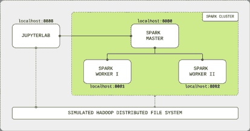
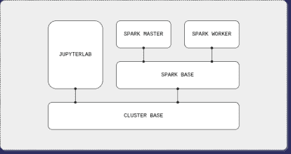

# Docker 上的 Apache Spark 集群

> 原文：[`www.kdnuggets.com/2020/07/apache-spark-cluster-docker.html`](https://www.kdnuggets.com/2020/07/apache-spark-cluster-docker.html)

评论

**作者 [André Perez](https://www.linkedin.com/in/andremarcosperez/)，Experian 的数据工程师**

由[Jez Timms](https://unsplash.com/@jeztimms)提供，来源于[Unsplash](https://unsplash.com/photos/r4lM2v9M84Q)的火花

* * *

## 我们的前三大课程推荐

 1\. [Google 网络安全证书](https://www.kdnuggets.com/google-cybersecurity) - 快速进入网络安全职业生涯。

 2\. [Google 数据分析专业证书](https://www.kdnuggets.com/google-data-analytics) - 提升你的数据分析技能

 3\. [Google IT 支持专业证书](https://www.kdnuggets.com/google-itsupport) - 支持你的组织的 IT

* * *

[Apache Spark](https://spark.apache.org/)可以说是最受欢迎的大数据处理引擎。它在[GitHub](https://github.com/apache/spark)上有超过 25k 的星标，这个框架是学习使用 Python、Scala 和 R 进行分布式系统并行计算的绝佳起点。

要开始使用，你可以通过使用众多优秀的 Docker 分发版之一在你的机器上运行 Apache Spark。[Jupyter](https://github.com/jupyter/docker-stacks)提供了一个出色的*docker 化* Apache Spark 与 JupyterLab 界面，但由于在单个容器上运行，缺少了框架的分布式核心。一些 GitHub [项目](https://github.com/big-data-europe/docker-spark)提供了分布式集群体验，但缺少 JupyterLab 界面，削弱了 IDE 提供的可用性。

我相信，一个全面的环境来学习和实践 Apache Spark 代码必须保持其分布式特性，同时提供极佳的用户体验。

这篇文章完全基于这一信念。

在接下来的部分中，我将向你展示如何构建自己的集群。到最后，你将拥有一个完整功能的 Apache Spark 集群，使用 Docker 构建，并配备一个 Spark 主节点、两个 Spark 工作节点和一个 JupyterLab 界面。它还将包括 Apache Spark Python API（PySpark）和一个模拟的 Hadoop 分布式文件系统（HDFS）。

**总结**

本文展示了如何使用 Docker 作为基础设施层在[独立模式](http://spark.apache.org/docs/latest/spark-standalone.html)下构建 Apache Spark 集群。它配备了以下内容：

+   Python 3.7，配有 PySpark 3.0.0 和 Java 8；

+   Apache Spark 3.0.0，配有一个主节点和两个工作节点；

+   JupyterLab IDE 2.1.5；

+   模拟 HDFS 2.7。

为了构建集群，我们需要创建、构建和组合 JupyterLab 和 Spark 节点的 Docker 镜像。你可以跳过教程，使用在我[GitHub](https://github.com/andre-marcos-perez/spark-cluster-on-docker)上托管的**开箱即用的分发版**。

**需求**

+   **Docker** 1.13.0+; *   **Docker Compose** 3.0+。

    **目录**

    1.  集群概述；

    1.  创建镜像；

    1.  构建镜像；

    1.  组合集群；

    1.  创建 PySpark 应用程序。

    ### 1\. 集群概述

    集群由四个主要组件组成：JupyterLab IDE、Spark 主节点和两个 Spark 工作节点。用户通过 Jupyter 笔记本提供的优雅 GUI 连接到主节点并提交 Spark 命令。主节点处理输入并将计算工作负载分配给工作节点，将结果发送回 IDE。组件通过 localhost 网络连接，并通过模拟 HDFS 的共享挂载卷共享数据。

    

    Apache Spark 集群概述

    如前所述，我们需要创建、构建和组合 JupyterLab 和 Spark 节点的 Docker 镜像，以构建集群。我们将使用以下 Docker 镜像层次结构：

    

    Docker 镜像层次结构

    集群基础镜像将下载并安装常见的软件工具（Java、Python 等），并创建 HDFS 的共享目录。在 Spark 基础镜像上，Apache Spark 应用程序将被下载并配置用于主节点和工作节点。Spark 主镜像将配置框架以运行为主节点。类似地，Spark 工作节点将配置 Apache Spark 应用程序以运行为工作节点。最后，JupyterLab 镜像将使用集群基础镜像来安装和配置 IDE 及 PySpark，即 Apache Spark 的 Python API。

    ### 2\. 创建镜像

    ### 2.1\. 集群基础镜像

    对于基础镜像，我们将使用一个 Linux 发行版来安装 Java 8（或 11），[Apache Spark 唯一要求](https://spark.apache.org/docs/latest/#downloading)。我们还需要安装 Python 3，以支持 PySpark 并创建共享卷以模拟 HDFS。

    集群基础镜像的 Dockerfile

    首先，选择 Linux 操作系统。Apache Spark 官方 GitHub 仓库中有一个用于 Kubernetes 部署的 [Dockerfile](https://github.com/apache/spark/blob/master/resource-managers/kubernetes/docker/src/main/dockerfiles/spark/Dockerfile)，使用内置 Java 8 运行时环境的小型 Debian 镜像。通过选择[相同的基础镜像](https://hub.docker.com/_/openjdk?tab=tags&page=1&name=8-jre-slim)，我们解决了操作系统选择和 Java 安装的问题。然后，我们从 Debian 官方软件包仓库获取[最新的 Python 版本](https://packages.debian.org/stable/python/python3)（目前为 3.7），并创建共享卷。

    ### 2.2\. Spark 基础镜像

    对于 Spark 基础镜像，我们将以 [standalone mode](http://spark.apache.org/docs/latest/spark-standalone.html) 模式获取并设置 Apache Spark，这是其最简单的部署配置。在这种模式下，我们将使用其资源管理器来设置容器，以主节点或工作节点的身份运行。相比之下，资源管理器如 [Apache YARN](https://hadoop.apache.org/docs/current/hadoop-yarn/hadoop-yarn-site/YARN.html) 会根据用户的工作负载动态分配容器作为主节点或工作节点。此外，我们将获取支持 Apache Hadoop 的 Apache Spark 版本，以允许集群使用基础集群镜像中创建的共享卷模拟 HDFS。

    Spark 基础镜像的 Dockerfile

    我们先从官方 [Apache 仓库](https://archive.apache.org/dist/spark/) 下载最新版本的 Apache Spark（当前版本为 3.0.0），并附带 Apache Hadoop 支持。然后，我们对下载的包进行一些操作（解压、移动等），准备进入设置阶段。最后，我们配置四个 Spark 变量，这些变量在主节点和工作节点中都是通用的：

    1.  **SPARK_HOME** 是框架用于设置任务的安装 Apache Spark 位置；

    1.  **SPARK_MASTER_HOST** 是主节点的**主机名**，用于工作节点连接；

    1.  **SPARK_MASTER_PORT** 是主节点的**端口**，用于工作节点连接；

    1.  **PYSPARK_PYTHON** 是 Apache Spark 用于支持其 Python API 的安装 Python 位置。

    ### 2.3\. Spark 主节点镜像

    对于 Spark 主节点镜像，我们将设置 Apache Spark 应用程序以主节点身份运行。我们将配置网络端口，以允许与工作节点的网络连接，并暴露主节点的 Web UI，这是一个监控主节点活动的网页。最后，我们将设置容器启动命令以将节点作为主实例启动。

    Spark 主节点镜像的 Dockerfile

    我们首先暴露配置在 **SPARK_MASTER_PORT** 环境变量中的端口，以允许工作节点连接到主节点。然后，我们暴露 **SPARK_MASTER_WEBUI_PORT** 端口，以便我们可以访问主节点 Web UI 页面。最后，我们设置容器启动命令，以运行 Spark 内置的部署脚本，并将 [master class](https://github.com/apache/spark/blob/master/core/src/main/scala/org/apache/spark/deploy/master/Master.scala) 作为参数。

    ### 2.4\. Spark worker 镜像

    对于 Spark worker 镜像，我们将设置 Apache Spark 应用程序以工作节点身份运行。与主节点类似，我们将配置网络端口以暴露工作节点 Web UI，这是一个监控工作节点活动的网页，并设置容器启动命令以将节点作为工作实例启动。

    Spark worker 镜像的 Dockerfile

    首先，我们暴露 **SPARK_WORKER_WEBUI_PORT** 端口，以允许访问 worker Web UI 页面，就像我们在 master 节点上做的一样。然后，我们设置容器启动命令，以 Spark 内置的部署脚本和 [worker class](https://github.com/apache/spark/blob/master/core/src/main/scala/org/apache/spark/deploy/worker/Worker.scala) 以及 master 网络地址作为参数。这将使 worker 节点在启动过程中连接到 master 节点。

    ### 2.5\. JupyterLab 镜像

    对于 JupyterLab 镜像，我们稍微回退一下，从集群基础镜像重新开始。我们将安装和配置 IDE，并使用与 Spark 节点上安装的稍有不同的 Apache Spark 发行版。

    JupyterLab 镜像的 Dockerfile

    我们首先安装 pip，Python 的包管理器，以及 Python 开发工具，以便在构建镜像和容器运行时安装 Python 包。然后，从 Python 包索引（PyPI）获取 [JupyterLab](https://pypi.org/project/jupyterlab/) 和 [PySpark](https://pypi.org/project/pyspark/)。最后，暴露默认端口以允许访问 JupyterLab Web 界面，并将容器启动命令设置为运行 IDE 应用程序。

    ### 3\. 构建镜像

    Docker 镜像已准备好，让我们来构建它们。注意，由于我们在 Dockerfile 中使用了 Docker *arg* 关键字来指定软件版本，我们可以轻松地更改集群的默认 Apache Spark 和 JupyterLab 版本。

    构建集群镜像

    ### 4\. 组建集群

    Docker compose 文件包含了我们集群的配方。在这里，我们将创建 JupyterLab 和 Spark 节点容器，暴露它们的端口给本地网络，并将它们连接到模拟的 HDFS。

    集群的 Docker compose 文件

    我们首先创建用于模拟 HDFS 的 Docker 卷。接下来，为每个集群组件创建一个容器。*jupyterlab* 容器暴露 IDE 端口，并将其共享的工作空间目录绑定到 HDFS 卷。同样，*spark-master* 容器暴露其 Web UI 端口和 *master-worker* 连接端口，并绑定到 HDFS 卷。

    我们通过创建两个名为 *spark-worker-1* 和 *spark-worker-2* 的 Spark worker 容器来完成。每个容器暴露其 Web UI 端口（分别映射为 8081 和 8082）并绑定到 HDFS 卷。这些容器有一个环境步骤，指定它们的硬件分配：

    +   **SPARK_WORKER_CORE** 是核心数量；

    +   **SPARK_WORKER_MEMORY** 是 RAM 的数量。

    默认情况下，我们为每个容器选择一个核心和 512 MB 的 RAM。可以随意调整硬件分配，但请确保遵守机器限制，以避免内存问题。此外，为 Docker 应用程序提供足够的资源以处理选定的值。

    要构建集群，请运行 Docker compose 文件：

    组建集群

    完成后，检查组件的 Web UI：

    +   **JupyterLab** 在 [localhost:8888](http://localhost:8888/)；

    +   **Spark 主节点** 在 [localhost:8080](http://localhost:8080/)；

    +   **Spark 工作节点 I** 在 [localhost:8081](http://localhost:8081/)；

    +   **Spark 工作节点 II** 在 [localhost:8082](http://localhost:8082/)；

    ### 5\. 创建一个 PySpark 应用程序

    集群运行正常后，让我们创建第一个 PySpark 应用程序。

    创建一个 PySpark 应用程序

    打开 JupyterLab IDE，创建一个 Python Jupyter notebook。通过使用 Spark 会话对象连接到 Spark 主节点来创建一个 PySpark 应用程序，使用以下参数：

    +   **appName** 是我们应用程序的名称；

    +   **master** 是 Spark 主节点连接 URL，Spark 工作节点用来连接到 Spark 主节点的相同 URL；

    +   **config** 是一个通用的 [Spark 单机模式配置](https://spark.apache.org/docs/latest/configuration.html)。在这里，我们将执行内存（即 Spark 工作节点 JVM 进程）与配置的工作节点内存进行匹配。

    运行单元格后，你将能够在 Spark 主节点网页 UI 的“运行中的应用程序”下看到该应用程序。最后，我们从 PyPI 安装 Python [wget](https://pypi.org/project/wget/) 包，并将 iris 数据集从 [UCI 资源库](https://archive.ics.uci.edu/ml/datasets/iris) 下载到模拟的 HDFS 中。然后我们用 PySpark 读取并打印数据。

    就这些了。我希望我能帮助你多了解一些 Apache Spark 内部工作原理和分布式应用程序的运作方式。祝学习愉快！

    **个人简介： [André Perez](https://www.linkedin.com/in/andremarcosperez/)** （[**@dekoperez**](https://twitter.com/dekoperez)）是 Experian 的数据工程师，同时也是圣保罗大学的硕士数据科学学生。

    [原文](https://towardsdatascience.com/apache-spark-cluster-on-docker-ft-a-juyterlab-interface-418383c95445)。已获转载许可。

    **相关：**

    +   使用 Apache Spark 和 PySpark 的好处与示例

    +   五个有趣的数据工程项目

    +   数据工程需要培养的技能

    ### 更多相关内容

    +   [使用聚类分析对数据进行分段](https://www.kdnuggets.com/using-cluster-analysis-to-segment-your-data)

    +   [Apache Druid 的演变](https://www.kdnuggets.com/2022/07/evolution-apache-druid.html)

    +   [如何使用 Apache Kafka 构建可扩展的数据架构](https://www.kdnuggets.com/2023/04/build-scalable-data-architecture-apache-kafka.html)

    +   [通过 Apache Gobblin 扩展数据管理](https://www.kdnuggets.com/2023/01/scaling-data-management-apache-gobblin.html)

    +   [Kubernetes 中的高可用 SQL Server Docker 容器](https://www.kdnuggets.com/2022/04/high-availability-sql-server-docker-containers-kubernetes.html)

    +   [每个数据科学家都应该知道的 12 条 Docker 命令](https://www.kdnuggets.com/2023/01/12-docker-commands-every-data-scientist-know.html)
