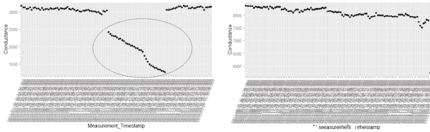

# 应用数据科学：解决预测性维护业务问题 第二部分

> 原文：[`www.kdnuggets.com/2018/02/applied-data-science-solving-predictive-maintenance-business-problem-2.html`](https://www.kdnuggets.com/2018/02/applied-data-science-solving-predictive-maintenance-business-problem-2.html)

 评论

**作者：托马斯·约瑟夫，Aspire Systems**

* * *

## 我们的前三个课程推荐

 1\. [谷歌网络安全证书](https://www.kdnuggets.com/google-cybersecurity) - 快速进入网络安全职业生涯。

 2\. [谷歌数据分析专业证书](https://www.kdnuggets.com/google-data-analytics) - 提升您的数据分析技能

 3\. [谷歌 IT 支持专业证书](https://www.kdnuggets.com/google-itsupport) - 支持您的组织 IT

* * *

在 [应用数据科学系列的第一部分，](https://bayesianquest.com/2017/09/30/applied-data-science-series-solving-a-predictive-maintenance-business-problem/) 我们讨论了数据科学过程的前三个阶段，即业务发现、数据发现和数据准备。在业务发现阶段，我们谈到了业务问题（即预测电池的使用寿命）如何定义涉及的变量选择。在数据发现阶段，我们讨论了数据的充足性以及数据的多样性和速度等其他因素，以及这些因素如何影响数据科学问题的制定。在最后阶段，我们简要介绍了数据点及其各种成分如何推动预测问题的制定。在这篇文章中，我们将进一步讨论如何使用探索性分析来获取特征工程的见解。

**探索性分析 – 揭示潜在趋势**

这一阶段涉及深入挖掘数据，获取数据感觉并提取特征工程的直觉。在进行探索性分析时，最好从领域团队那里获取有关变量之间关系和业务问题的意见。这些意见通常是这一阶段的起点。

现在让我们深入探讨我们预防性维护问题的背景，并发展一种探索性分析的理念。在工业电池的情况下，一个影响电池健康状态的关键变量是其导电性。结果表明，电池健康恶化的一个指标是导电性的急剧下降。掌握了这些信息后，我们的下一步任务应该是从我们现有的数据集中识别出有较高失败概率的电池。由于导电性的急剧下降是健康恶化的指标，因此不健康电池的导电性数据会比正常电池的波动更大。因此，识别失败电池的最佳方法是对导电性数据应用某种整合度量，如标准差或方差，并进一步深入分析那些与正常数据集明显不同的样本。

上图展示了所有电池的导电性标准差。现在可能对我们有兴趣的是红色区域，我们可以称之为“潜在失败区”。潜在失败区包括那些导电性值显示高标准差的电池。健康状况不佳的电池可能会表现出导电性的大幅下降，因此其值也会显示出较高的标准差。这意味着失败概率较高的电池样本很可能来自这个失败区域。然而，为了验证这一假设，我们必须深入挖掘失败区域的电池，寻找可能将它们与正常电池区分开来的模式。深入挖掘的另一个目标是从潜在模式中提取线索，以确定在预测模型中包含哪些特征。我们将在讨论特征工程时进一步探讨特征提取。现在让我们回到讨论如何深入分析失败区域并找出重要模式。需要注意的是，除了观察失败区域的样本外，我们还需要观察正常区域的模式，以帮助区分优劣。在特征工程阶段，通过观察不同模式获得的直觉将变得至关重要。

上图是来自不同区域的模式比较。左侧的图来自失败区域，右侧的图来自其他区域。我们可以清楚地看到，失败区域样本中的急剧下降是如何表现的。另一点需要注意的是下降的幅度。每个电池随着时间的推移都会出现导电率下降。然而，下降的幅度才是区分不健康电池和正常电池的关键。从左侧的图中，我们可以观察到导电率下降超过 50%，而右侧电池的下降则较为温和。另一个可以观察的方面是导电率的斜率。从两个图中可以明显看出，左侧电池的导电率曲线随着时间的推移更为陡峭。这些到目前为止得出的直觉可能在特征工程和建模的整体方案中变得至关重要。与我们到目前为止挖掘出的直觉类似，通过观察更多样本，还可以提取更多信息。探索性分析的哲学在于可视化越来越多的样本，观察模式并提取特征工程的线索。我们花在这方面的时间越多，获取的特征工程素材也越多。

**总结**

到目前为止，我们讨论了探索性分析阶段的不同考虑因素。总结一下，这里是这个阶段的一些要点。

1.  从相关领域团队那里获取有关我们试图解决的问题的输入。在我们的案例中，我们得到的线索是导电率与电池健康之间的关系。

1.  确定一个合并度量来分离异常样本。在上述例子中，我们使用了导电率值的标准差来寻找异常。

1.  一旦使用合并度量划分样本，便可可视化来自不同集的样本，以识别数据中的明显模式。

1.  从我们观察到的模式中提取特征工程的线索。在我们的例子中，我们确定了% 导电率下降和导电率随时间变化的斜率可能是潜在特征。

上述要点是对在探索性分析阶段思考的一般指南。

到目前为止的讨论集中在对单个变量的探索性分析上。接下来，我们需要将其他变量与我们已经观察到的变量连接起来，并识别出一致的趋势。当我们结合多个变量的趋势时，我们将能够揭示更多特征工程的见解。我们将在下一篇文章中继续讨论如何结合更多变量以及随后的特征工程。请关注此空间以获取更多信息。

**简介: [Thomas Joseph](https://www.linkedin.com/in/thomasjoseph24)** 是 Aspire Systems 的高级数据科学家，致力于扩大数据科学的影响力并实现卓越交付。

[原文](https://bayesianquest.com/2018/02/01/applied-data-science-series-solving-a-predictive-maintenance-business-problem-part-ii/)。已获许可转载。

**相关内容：**

+   应用数据科学：解决预测性维护业务问题

+   数据科学家的思维方式 – 第一部分

+   数据科学家的思维方式 – 第二部分

### 更多相关内容

+   [思维图谱：解决大语言模型中复杂问题的新范式](https://www.kdnuggets.com/graph-of-thoughts-a-new-paradigm-for-elaborate-problem-solving-in-large-language-models)

+   [解决 5 个复杂 SQL 问题：难解查询解析](https://www.kdnuggets.com/2022/07/5-hardest-things-sql.html)

+   [解决 MySQL 中幻读的终极指南](https://www.kdnuggets.com/2022/06/definitive-guide-solving-phantom-read-mysql.html)

+   [解决下一个数据科学问题的 5 步蓝图](https://www.kdnuggets.com/5-step-blueprint-to-your-next-data-science-problem)

+   [真实世界中的 NLP 应用范围：一种不同的…](https://www.kdnuggets.com/2022/03/different-solution-problem-range-nlp-applications-real-world.html)

+   [Python 中的遗传编程：背包问题](https://www.kdnuggets.com/2023/01/knapsack-problem-genetic-programming-python.html)
