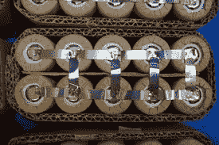
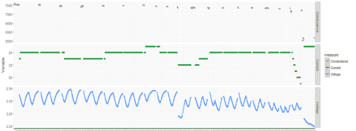

# 应用数据科学：解决预测性维护业务问题 第三部分

> 原文：[`www.kdnuggets.com/2018/10/applied-data-science-solving-predictive-maintenance-business-problem-3.html`](https://www.kdnuggets.com/2018/10/applied-data-science-solving-predictive-maintenance-business-problem-3.html)

 评论

**作者：托马斯·约瑟夫，Aspire Systems**

* * *

## 我们的前 3 名课程推荐

 1\. [Google 网络安全证书](https://www.kdnuggets.com/google-cybersecurity) - 快速进入网络安全职业。

 2\. [Google 数据分析专业证书](https://www.kdnuggets.com/google-data-analytics) - 提升你的数据分析能力

 3\. [Google IT 支持专业证书](https://www.kdnuggets.com/google-itsupport) - 支持组织的 IT 需求

* * *

在[系列的上一篇文章](https://bayesianquest.com/2018/02/01/applied-data-science-series-solving-a-predictive-maintenance-business-problem-part-ii/)中，我们讨论了探索性分析阶段，并展示了领域知识与单变量探索如何从数据中揭示直觉。在这篇文章中，我们将扩展分析到多个变量，并查看我们在探索阶段发展出的直觉如何生成新的建模特征。

在我们讨论的例子中，我们仅限于分析一个单一变量，即导电性。然而，为了获得更有意义的见解，我们需要将其他变量层层连接到我们分析的初始变量，以便获得更多问题的见解。就电池而言，除了导电性之外，一些关键变量还包括电压和放电。让我们将这两个变量与导电性曲线连接，以从数据中获取更多直觉。

上图描绘了三个变量在相同时间跨度内的变化。将多个变量绘制在相同时间跨度内的目的是揭示它们之间的可辨识趋势。对这个图的初步观察将显示一些明显的发现。

1.  电流和电压的下降与导电性的下降相结合。

1.  电压曲线的周期性特征。

1.  电压曲线低谷的逐渐下降。

经过一些观察，我们现在需要确定这些观察结果是否可以被归纳为某些明确的趋势。这只能通过观察许多类似变量的图表来验证。如果通过对许多电池的数据进行采样，如果我们能获得类似的观察结果，那么我们可以确定我们发现了一些解释不同变量行为的趋势。然而，仅仅发现一些趋势是不够的。我们必须从这些趋势中获得一些直觉，这将有助于将原始变量转化为对建模任务有帮助的形式。这是通过特征工程原始变量来实现的。

**特征工程**

很多时候，给定的原始变量集合不足以从模型中提取所需的预测能力。我们必须对原始变量进行转换，以生成新的变量，从而为更好的预测指标提供额外的推动力。需要进行什么转换，将基于我们在探索性分析阶段建立的直觉以及结合领域知识。以电池为例，让我们重新审视在探索性分析阶段建立的一些直觉，并看看这些直觉如何用于特征工程。

在[上一篇文章](https://bayesianquest.com/2018/02/01/applied-data-science-series-solving-a-predictive-maintenance-business-problem-part-ii/)中，我们发现导电性急剧下降是电池健康状况恶化的一个指标。因此，我们可以从导电性变量中提取一个可能的特征，即在固定时间范围内数据点的斜率。这种特征的理由是，如果导电性在一段时间内的急剧下降是电池健康状况恶化的指标，那么故障电池的数据点斜率会比健康电池更陡峭。观察发现，通过这种转换，对预测指标有积极的影响。这种转换的动态如下：如果我们有电池三年的导电性数据，我们可以取连续三个月的导电性数据窗口，并计算所有数据点的斜率，将其作为一个特征。通过这样做，变量的数据行数也会大大减少。

让我们再看看一个特征工程的例子，我们可以将其引入到变量“放电电压”中。从上图可以看出，放电电压呈现出波浪形状的曲线。事实证明，当电池放电时，电压首先下降，然后上升。这种行为被称为“Coupe De Fouet” (CDF) 效应。现在我们应该思考的是，如何将观察到的波浪形模式和关于 CDF 的知识结合成一个特征？我们必须深入挖掘领域知识。根据电池健康状态理论，对于健康电池和故障电池的 CDF 曲线有标准。这些标准由电池制造商规定。例如，制造标准规定了放电过程中电压会下降到一定的深度，并且在典型的 CDF 效应中会上升到一定的高度。观察到的 CDF 与制造商规定标准之间的偏差可以作为另一个特征。类似地，我们也可以考虑与电压相关的其他特征，如放电深度 (DOD)、循环次数等。我们的重点应该是利用现有的领域知识将原始变量转化为特征。

从以上两个例子中可以看出，特征工程的精髓在于将领域知识和数据中的趋势转化为更有意义的特征。构建模型的真实性很大程度上取决于特征的强度。现在我们已经了解了特征工程阶段，让我们来看一下这个用例的建模策略。

**建模阶段**

在 [本用例的第一部分](https://bayesianquest.com/2017/09/30/applied-data-science-series-solving-a-predictive-maintenance-business-problem/) 中，我们讨论了训练模型的标记策略。由于这个用例是预测哪块电池会故障以及故障的时间段，我们必须回顾从故障点标签开始的时间，以创建与故障时期相关的不同类别。在这个特定的案例中，通过将 3 个月的数据整合成一行来创建不同的特征。因此，故障前一个时间段将表示故障前的 3 个月。所以如果要求预测故障发生前 6 个月的情况，那么我们将有 4 个不同的类别，即故障点、故障前一个时间段（故障点前 3 个月）、故障前两个时间段（故障点前 6 个月）以及正常状态。所有故障前 6 个月的时间段都可以标记为正常状态。

关于建模，我们可以使用不同的分类算法（逻辑回归、朴素贝叶斯、SVM、随机森林、XGboost 等）进行抽样检查。最终模型的选择将基于抽样检查模型的准确性指标（灵敏度、特异性等）。另一个值得注意的方面是，数据集可能会高度不平衡，即正常电池类别的数量可能会不成比例地多于故障类别。在建模之前，尝试对数据集进行类别平衡的方法将是一个好主意。

**总结**

本文结束了关于工业电池预测分析的三部分系列。制造业中的任何用例都可能非常具有挑战性，因为涉及的变量非常技术化，需要相关领域团队的大量介入。数据科学团队中持续参与领域专家对这些项目的成功非常重要。

我已经尽力写下了这样一个困难用例的细节。我试图涵盖过程中的关键要素。如果对用例及其实施细节有任何疑问，可以通过以下电子邮件地址与我联系 bayesianquest@gmail.com。期待您的回复。在那之前，让我先告辞。

关注这个领域，获取更多类似的用例。

**简介：[托马斯·约瑟夫](https://www.linkedin.com/in/thomasjoseph24)** 是 Aspire Systems 的高级数据科学家，致力于拓展数据科学的影响力并实现卓越的交付。

[原文](https://bayesianquest.com/2018/10/07/applied-data-science-series-solving-a-predictive-maintenance-business-problem-part-iii/)。经许可转载。

**相关内容：**

+   应用数据科学：解决预测性维护业务问题

+   应用数据科学：解决预测性维护业务问题 第二部分

+   数据科学家的思维方式 – 第一部分

### 更多相关主题

+   [思维图谱：在大型语言模型中解决复杂问题的新范式](https://www.kdnuggets.com/graph-of-thoughts-a-new-paradigm-for-elaborate-problem-solving-in-large-language-models)

+   [解决 5 个复杂的 SQL 问题：棘手查询解析](https://www.kdnuggets.com/2022/07/5-hardest-things-sql.html)

+   [解决 MySQL 中幽灵读的终极指南](https://www.kdnuggets.com/2022/06/definitive-guide-solving-phantom-read-mysql.html)

+   [解决下一个数据科学问题的 5 步蓝图](https://www.kdnuggets.com/5-step-blueprint-to-your-next-data-science-problem)

+   [NLP 应用的现实世界范围：一种不同的……](https://www.kdnuggets.com/2022/03/different-solution-problem-range-nlp-applications-real-world.html)

+   [Python 中的遗传编程：背包问题](https://www.kdnuggets.com/2023/01/knapsack-problem-genetic-programming-python.html)
