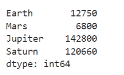
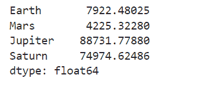
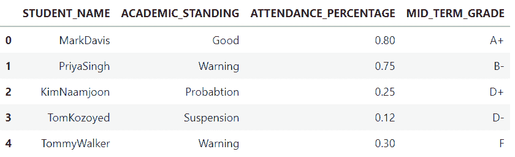
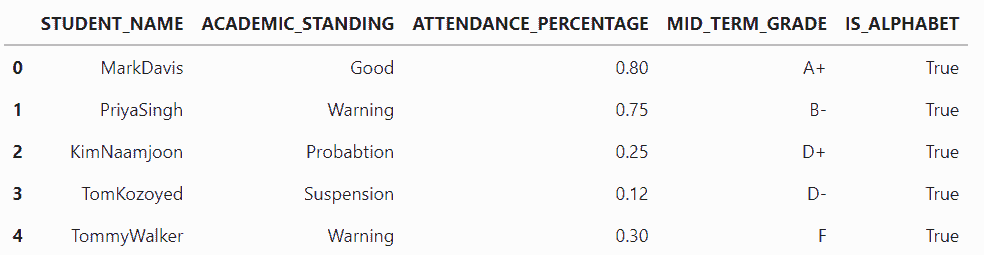
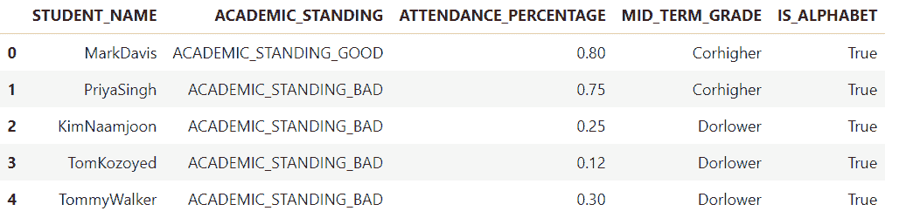
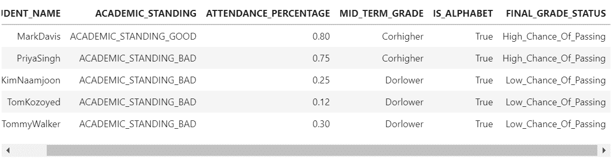

# 使用 apply() 方法与 Pandas Dataframes

> 原文：[`www.kdnuggets.com/2022/07/apply-method-pandas-dataframes.html`](https://www.kdnuggets.com/2022/07/apply-method-pandas-dataframes.html)


图片由 [Pakata Goh](https://unsplash.com/@pakata?utm_source=unsplash&utm_medium=referral&utm_content=creditCopyText) 拍摄，来源于 [Unsplash](https://unsplash.com/s/photos/python?utm_source=unsplash&utm_medium=referral&utm_content=creditCopyText)

**在本教程中，我们将涵盖以下内容：**

* * *

## 我们的前三大课程推荐

 1\. [Google 网络安全证书](https://www.kdnuggets.com/google-cybersecurity) - 快速进入网络安全职业生涯。

 2\. [Google 数据分析专业证书](https://www.kdnuggets.com/google-data-analytics) - 提升你的数据分析技能

 3\. [Google IT 支持专业证书](https://www.kdnuggets.com/google-itsupport) - 支持你的组织进行 IT 工作

* * *

1) 理解 Python 中的 apply() 方法及其使用时机

2) 在 Pandas Series 上实现 apply() 方法

3) 在 Pandas Data Frame 上实现 apply() 方法

4) 实现 apply() 方法以解决 Pandas Data Frame 上的四个用例

5) 结论

# 理解 Python 中的 apply() 方法及其使用时机？

apply() 方法主要用于数据清理，它专注于对 pandas Series 中的每个元素以及 pandas Data Frame 的每一行/列应用该方法。

让我们开始吧

# 在 Pandas Series 上实现 apply() 方法

Series 是一维数组，具有名为索引的轴标签，并包含不同类型的数据，如字符串、整数和其他 Python 对象。

我们来实现一个 Series 对象，包含两个列表，其中行星作为索引，直径以公里为数据

**代码：**

```py
import pandas as pd

import numpy as np

planetinfo = pd.Series(data=[12750, 6800, 142800, 120660],
                       index=["Earth", "Mars", "Jupiter", "Saturn"])

planetinfo
```

**输出：**



上述代码返回一个 planetinfo 对象及其对应的数据类型。由于对象的数据类型是 series，让我们看看如何使用 apply() 方法将每个行星的直径从公里转换为英里

**代码：**

```py
def km_to_miles(data):
  return 0.621371 * data

print(planetinfo.apply(km_to_miles))
```

**输出：**



上述代码返回了每个行星的直径从公里转换为英里。为了实现这一点，我们首先定义了一个名为 km_to_miles() 的函数，然后将该函数不带括号地传递给 apply() 方法。apply() 方法随后对 Series 中的每个数据点应用 km_to_miles() 函数。

# 在 Pandas Data Frame 上实现 apply() 方法

我们现在将创建一个虚拟数据框，以了解如何使用 apply() 方法进行数据框的行和列操作。我们将创建的虚拟数据框包含学生的详细信息，使用以下代码：

**代码：**

```py
studentinfo=pd.DataFrame({'STUDENT_NAME':["MarkDavis","PriyaSingh","KimNaamjoon","TomKozoyed","TommyWalker"],
                         "ACADEMIC_STANDING":["Good","Warning","Probabtion","Suspension","Warning"],
                         "ATTENDANCE_PERCENTAGE":[0.8,0.75,0.25,0.12,0.30],
                         "MID_TERM_GRADE": ["A+","B-","D+","D-","F"]})

studentinfo
```

**输出：**



我们现在已经创建了一个名为 studentinfo 的虚拟数据框，并将通过探索 4 个不同的用例来学习如何实现 apply() 方法。每个用例都是新的，并将通过使用 apply() 方法解决。

## Usecase_1

作为数据清洗检查的一部分，我们将检查 STUDENT_NAME 列中的所有值是否仅包含字母。为此，我们将定义一个名为 datacheck() 的函数，它获取 STUDENT_NAME 列并通过使用 [isalpha()](https://www.programiz.com/python-programming/methods/string/isalpha) 方法返回 True 或 False。结果的 True 或 False 将被返回到名为 IS_ALPHABET 的新列中，在 studentinfo 数据框中。

**代码：**

```py
def datacheck(data):
  if data.isalpha():
   return True
  else:
   return False
```

现在我们将在 studentinfo 数据框的 STUDENT_NAME 列上应用 datacheck() 函数，通过实现 apply() 方法。

**代码：**

```py
studentinfo["IS_ALPHABET"] = studentinfo["STUDENT_NAME"].apply(datacheck)
studentinfo
```

**输出：**



我们可以看到 datacheck() 函数如何应用于 STUDENT_NAME 列的每一行，返回的结果存储在一个名为 IS_ALPHABET 的新列中。

## Usecase_2

作为数据清洗检查的一部分，我们将减少 ACADEMIC_STANDING 列的基数，其中我们将把类别 Good 标记为 ACADEMIC_STANDING_GOOD，其余类别标记为 ACADEMIC_STANDING_BAD。

为了实现这个用例，我们将定义一个名为 reduce_cardinality() 的函数，它获取列 ACADEMIC_STANDING。在函数内部，将使用 [ifstatement](https://www.programiz.com/python-programming/if-elif-else) 进行比较检查，从而将结果 ACADEMIC_STANDING_GOOD 和 ACADEMIC_STANDING_BAD 返回到 ACADEMIC_STANDING 列。

**代码：**

```py
def reduce_cardinality(data):
  if data != "Good":
   return "ACADEMIC_STANDING_BAD"
  else:
   return "ACADEMIC_STANDING_GOOD"
```

现在我们将在 studentinfo 数据框的 ACADEMIC_STANDING 列上应用 reduce_cardinality() 函数，通过实现 apply() 方法。

**代码：**

```py
studentinfo["ACADEMIC_STANDING"]=studentinfo["ACADEMIC_STANDING"].apply(reduce_cardinality)

studentinfo
```

**输出：**


我们可以看到 reduce_cardinality() 函数如何应用于 ACADEMIC_STANDING 列的每一行，其中 ACADEMIC_STANDING 列中的原始值现在已被修改为两个不同的类别，即 ACADEMIC_STANDING_BAD 和 ACADEMIC_STANDING_GOOD，从而减少了数据的基数。

## Usecase_3

对于这个用例，我们将再次减少 MID_TERM 列的基数，其中我们将以 A、B、C 开头的成绩标记为 Corhigher，以 D、F、W 开头的成绩标记为 Dorlower。

为实现此用例，我们将定义一个名为 reduce_cardinality_grade() 的函数，该函数获取 MID_TERM_GRADE 列。在函数内部，将使用 [ifstatement](https://www.programiz.com/python-programming/if-elif-else) 和 [()startswith](https://www.w3schools.com/python/ref_string_startswith.asp) 方法进行比较检查，因此将 MID_TERM_GRADE 列的结果返回为 Corhigher 和 Dorlower。

**代码：**

```py
def reduce_cardinality_grade(data):
  if data.startswith('A'):
   return "Corhigher"
  elif data.startswith('B'):
   return "Corhigher"
  elif data.startswith('C'):
   return "Corhigher"
  else:
   return "Dorlower"
```

现在我们将通过实现 apply() 方法对 studentinfo 数据框的 MID_TERM_GRADE 列应用 reduce_cardinality_grade() 函数。

**代码：**

```py
studentinfo["MID_TERM_GRADE"]=studentinfo["MID_TERM_GRADE"].apply(reduce_cardinality_grade)

studentinfo
```

**输出：**



我们可以看到 reduce_cardinality_grade() 函数如何应用于 MID_TERM_GRADE 列的每一行，原始的 MID_TERM_GRADE 列中的值现在已被修改为两个不同的类别，即 Corhigher 和 Dorlower，从而减少了基数。

## Usecase_4

对于此用途，我们将在 check() 函数中创建一个名为 FINAL_GRADE_STATUS 的新列，该列的值将基于以下两个条件确定：

1) 如果学生的 ATTENDANCE_PERCENTAGE >= 0.6 并且 MID_TERM_GRADE 为 C 或更高，则 FINAL_GRADE_STATUS 将标记为 High_Chance_Of_Passing

2) 如果学生的 ATTENDANCE_PERCENTAGE < 0.6 并且 MID_TERM_GRADE 为 D 或更低，则 FINAL_GRADE_STATUS 将标记为 Low_Chance_Of_Passing

在函数内部，将使用 [ifstatement](https://www.programiz.com/python-programming/if-elif-else) 和 [and 操作符](https://www.programiz.com/python-programming/operators) 在 Python 中进行比较检查。

**代码：**

```py
def check(data):
  if (data["ATTENDANCE_PERCENTAGE"] >= 0.6) and (data["MID_TERM_GRADE"] == "Corhigher"):
   return "High_Chance_Of_Passing"
  elif (data["ATTENDANCE_PERCENTAGE"] < 0.6) and (data["MID_TERM_GRADE"] == "Dorlower"):
   return "Low_Chance_Of_Passing"
```

现在我们将通过实现 apply() 方法对 studentinfo 数据框的 ATTENDANCE_PERCENTAGE 和 MID_TERM_GRADE 列应用检查函数。axis=1 参数表示在数据框中按行迭代。

**代码：**

```py
studentinfo["FINAL_GRADE_STATUS"]=studentinfo[["ATTENDANCE_PERCENTAGE","MID_TERM_GRADE"]].apply(check,axis = 1)

studentinfo
```

**输出：**



我们可以看到 check() 函数如何应用于 MID_TERM_GRADE 和 ATTENDANCE_PERCENTAGE 列的每一行，从而返回一个名为 FINAL_GRADE_STATUS 的新列，值为 Corhigher 和 Dorlower。

# 结论

在本教程中，我们了解了如何通过探索不同的用例来使用 apply() 方法。apply() 方法使用户能够对 Series 或 pandas 数据框中的每个值执行不同类型的数据操作。

**[Priya Sengar](https://www.linkedin.com/in/priya-sengar/)** (**Medium**, **Github**) 是 Old Dominion University 的数据科学家。Priya 热衷于解决数据中的问题并将其转化为解决方案。

### 更多相关主题

+   [用 SQL 查询你的 Pandas 数据框](https://www.kdnuggets.com/2021/10/query-pandas-dataframes-sql.html)

+   [将 Pandas 数据框组合变得简单](https://www.kdnuggets.com/2022/09/combining-pandas-dataframes-made-simple.html)

+   [如何合并 Pandas DataFrames](https://www.kdnuggets.com/2023/01/merge-pandas-dataframes.html)

+   [合并 Pandas DataFrames 的 3 种方法](https://www.kdnuggets.com/2023/03/3-ways-merge-pandas-dataframes.html)

+   [将 JSON 转换为 Pandas DataFrames：正确解析的方法](https://www.kdnuggets.com/converting-jsons-to-pandas-dataframes-parsing-them-the-right-way)

+   [如何高效地使用 Pandas 合并大型 DataFrames](https://www.kdnuggets.com/how-to-merge-large-dataframes-efficiently-with-pandas)
