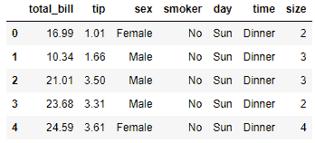
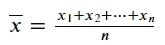
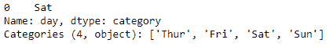
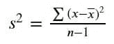
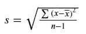
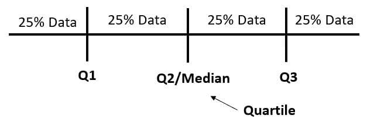
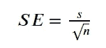
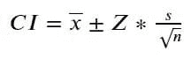

# 在 Python 中应用描述性和推断统计

> 原文：[`www.kdnuggets.com/applying-descriptive-and-inferential-statistics-in-python`](https://www.kdnuggets.com/applying-descriptive-and-inferential-statistics-in-python)


照片由 [Mikael Blomkvist](https://www.pexels.com/photo/laptop-beside-a-ceramic-vase-6483626/) 提供

统计学是一个涵盖从数据收集、数据分析到数据解释的领域。它是一个帮助相关方在面对不确定性时做出决策的研究领域。

* * *

## 我们的前 3 个课程推荐

 1\. [Google 网络安全证书](https://www.kdnuggets.com/google-cybersecurity) - 快速进入网络安全职业生涯。

 2\. [Google 数据分析专业证书](https://www.kdnuggets.com/google-data-analytics) - 提升你的数据分析技能

 3\. [Google IT 支持专业证书](https://www.kdnuggets.com/google-itsupport) - 支持你的组织的 IT

* * *

统计学领域的两个主要分支是描述性统计和推断统计。描述性统计是与数据总结相关的一个分支，使用各种方式，如总结统计、可视化和表格。而推断统计则更多地关注基于数据样本对总体的概括。

本文将通过 Python 示例讲解描述性统计和推断统计中的一些重要概念。让我们开始吧。

# 描述性统计

如我之前提到的，描述性统计侧重于数据总结。它是将原始数据处理成有意义信息的科学。描述性统计可以通过图形、表格或总结统计来执行。然而，总结统计是进行描述性统计的最受欢迎的方式，因此我们将重点关注这一点。

对于我们的示例，我们将使用以下数据集。

```py
import pandas as pd
import numpy as np
import seaborn as sns

tips = sns.load_dataset('tips')
tips.head()
```



有了这些数据，我们将探索描述性统计。在总结统计中，有两个最常用的：**集中趋势度量**和**分散度量**。

## 集中趋势度量

集中趋势是数据分布或数据集的中心。集中趋势度量是获取或描述数据中心分布的活动。集中趋势度量会给出一个定义数据中心位置的单一值。

在集中趋势度量中，有三种常见的测量方法：

### 1\. 平均数

平均数或均值是一种产生单一值输出的方法，表示我们数据中最常见的值。然而，平均数不一定是我们数据中观察到的值。

我们可以通过将数据中现有值的总和除以值的数量来计算均值。我们可以用以下方程表示均值：



作者提供的图片

在 Python 中，我们可以使用以下代码计算数据均值。

```py
round(tips['tip'].mean(), 3)
```

```py
2.998
```

使用 pandas 系列属性，我们可以获得数据均值。我们还将数据四舍五入，以便更容易读取数据。

均值作为中心趋势的度量有一个缺点，因为它受异常值的影响很大，可能会扭曲总结统计数据，无法最好地代表实际情况。在偏斜情况下，我们可以使用中位数。

### 2\. 中位数

中位数是数据中间位置的唯一值，如果我们将数据排序，它表示数据的中点位置（50%）。作为中心趋势的度量，当数据存在偏斜时，中位数更可取，因为它可以代表数据中心，因为异常值或偏斜值不会强烈影响它。

中位数是通过将所有数据值按升序排列并找到中间值来计算的。对于奇数个数据值，中位数是中间值；但对于偶数个数据值，中位数是两个中间值的平均值。

我们可以使用以下代码在 Python 中计算中位数。

```py
tips['tip'].median()
```

```py
2.9
```

### 3\. 众数

众数是数据中出现频率最高或最常见的值。数据可以有一个众数（单峰），多个众数（多峰），或者没有众数（如果没有重复值）。

众数通常用于分类数据，但也可以用于数值数据。然而，对于分类数据，它可能只使用众数。这是因为分类数据没有任何数值来计算均值和中位数。

我们可以使用以下代码计算数据的众数。

```py
tips['day'].mode()
```



结果是一个具有分类类型值的系列对象。‘Sat’值是唯一出现的，因为它是数据的众数。

## 分布度量

分布度量（或变异性、离散度）是描述数据值分布的测量。该测量提供了有关数据值在数据集内变动的信息。它通常与中心趋势度量一起使用，因为它们互补地提供整体数据信息。

分布的度量还有助于理解我们中心趋势度量的表现。例如，较高的数据分布可能表示观察到的数据之间存在显著的偏差，而数据均值可能无法最好地代表数据。

这里有各种分布度量可供使用。

1.  范围

范围是数据中最大值（Max）和最小值（Min）之间的差异。这是最直接的测量，因为信息只使用了数据的两个方面。

尽管标准差的使用可能有限，因为它不能提供关于数据分布的太多信息，但如果我们有一个特定的阈值用于数据，它可能有助于我们的假设。让我们尝试使用 Python 计算数据范围。

```py
tips['tip'].max() - tips['tip'].min()
```

```py
9.0
```

### 2\. 方差

方差是一个衡量分布的指标，它基于数据均值来描述数据的分布情况。我们通过将每个值与数据均值的差异平方后，再除以数据值的数量来计算方差。由于我们通常处理的是数据样本而非总体，我们需要将数据值的数量减去一。样本方差的公式见下图。



作者提供的图像

方差可以解释为指示数据离均值和彼此之间的分布程度的值。方差越高，数据分布越广。然而，方差计算对离群值非常敏感，因为我们对分数与均值的偏差进行了平方处理，这意味着我们对离群值赋予了更多的权重。

让我们尝试使用 Python 计算数据方差。

```py
round(tips['tip'].var(),3)
```

```py
1.914
```

上述方差可能暗示我们的数据具有较高的方差，但我们可能需要使用标准差来获得实际的数据显示测量值。

### 3\. 标准差

标准差是最常用的数据分布测量方法，它通过计算方差的平方根来得出。



作者提供的图像

方差和标准差的区别在于它们所提供的信息。方差值仅指示我们的值离均值有多远，并且方差单位与原始值不同，因为我们对原始值进行了平方处理。然而，标准差值与原始数据值的单位相同，这意味着标准差值可以直接用于测量数据的分布情况。

让我们尝试使用以下代码计算标准差。

```py
round(tips['tip'].std(),3)
```

```py
1.384
```

标准差的一个常见应用是估计数据区间。我们可以使用经验规则或 68-95-99.7 规则来估计数据区间。经验规则指出，68%的数据估计在数据均值±一个标准差内，95%的数据在均值±两个标准差内，而 99.7%的数据在均值±三个标准差内。超出此区间的数据可能被视为离群值。

### 4\. 四分位距

四分位距（IQR）是通过计算第一和第三四分位数据之间的差异来衡量数据分布的。四分位数本身是一个将数据分成四个不同部分的值。为了更好地理解，让我们看一下下面的图像。



作者提供的图像

四分位数是划分数据的值，而不是除法结果。我们可以使用以下`code`来找到四分位数值和 IQR。

```py
q1, q3= np.percentile(tips['tip'], [25 ,75])
iqr = q3 - q1

print(f'Q1: {q1}\nQ3: {q3}\nIQR: {iqr}')
```

```py
Q1: 2.0

Q3: 3.5625

IQR: 1.5625
```

使用 numpy 百分位函数，我们可以获得四分位数。通过减去第三四分位数和第一四分位数，我们得到 IQR。

IQR 可以通过获取 IQR 值并计算数据的上下限来识别数据离群值。上限公式是 Q3 + 1.5 * IQR，而下限是 Q1 - 1.5 * IQR。任何超过此限制的值都被认为是离群值。

为了更好地理解，我们可以使用箱线图来了解 IQR 离群值检测。

```py
sns.boxplot(tips['tip'])
```


上图展示了数据箱线图和数据位置。上限之后的黑点被视为离群值。

# 推断统计

推断统计是一个基于数据样本对总体信息进行概括的分支。使用推断统计是因为通常无法获得完整的数据总体，我们需要从数据样本中进行推断。例如，我们想了解印尼人对人工智能的看法。然而，如果我们对印尼人口中的每一个人进行调查，研究会花费太长时间。因此，我们使用代表总体的样本数据来推断印尼人口对人工智能的看法。

让我们深入探讨可以使用的各种推断统计。

### 1\. 标准误差

标准误差是推断统计的一种度量，用于根据样本统计量估计真实总体参数。标准误差的信息是，如果我们用来自同一总体的数据样本重复实验，样本统计量会如何变化。

均值的标准误差（SEM）是最常用的标准误差类型，因为它告诉我们均值在给定样本数据的情况下，能多好地代表总体。要计算 SEM，我们将使用以下方程。



图片由作者提供

均值的标准误差将使用标准差进行计算。样本数量越多，数据的标准误差就越小，较小的 SE 意味着我们的样本更好地代表数据总体。

要获得均值的标准误差，我们可以使用以下`code`。

```py
from scipy.stats import sem

round(sem(tips['tip']),3)
```

```py
0.089
```

我们通常报告与数据均值一起的 SEM，其中真实均值总体预计落在均值±SEM 范围内。

```py
data_mean = round(tips['tip'].mean(),3)
data_sem = round(sem(tips['tip']),3)
print(f'The true population mean is estimated to fall within the range of {data_mean+data_sem} to {data_mean-data_sem}')
```

```py
The true population mean is estimated to fall within the range of 3.087 to 2.9090000000000003
```

## 2\. 置信区间

置信区间也用于估计真实的总体参数，但它引入了置信水平。置信水平以一定的置信百分比估计真实总体参数的范围。

在统计学中，置信度可以被描述为一个概率。例如，90% 置信度的置信区间意味着真实的总体均值将在置信区间的上下值之间，100 次中有 90 次。CI 的计算使用以下公式。



作者提供的图像

上述公式有一个熟悉的符号，除了 Z。Z 符号是通过定义置信度（例如 95%）并使用 [z-临界值表](https://stats.libretexts.org/Courses/Taft_College/PSYC_2200%3A_Elementary_Statistics_for_Behavioral_and_Social_Sciences_(Oja)/Unit_1%3A_Description/5%3A_Using_z/5.03%3A_Introduction_to_the_z_table/5.03.2%3A_Table_of_Critical_Values_of_z) 来确定的 z 分数（95% 置信度下为 1.96）。此外，如果我们的样本较小或少于 30 个，我们应该使用 [t-分布表](https://www.ttable.org/)。

我们可以使用以下代码来获取 Python 中的 CI。

```py
import scipy.stats as st

st.norm.interval(confidence=0.95, loc=data_mean, scale=data_sem)
```

```py
(2.8246682963727068, 3.171889080676473)
```

上述结果可以解释为我们的数据真实的总体均值在 2.82 到 3.17 的范围内，置信度为 95%。

## 3\. 假设检验

假设检验是一种推论统计方法，用于从数据样本得出关于总体的结论。估计的总体可以是总体参数或概率。

在假设检验中，我们需要一个称为原假设（H0）和备择假设（Ha）的假设。原假设和备择假设总是彼此相反。假设检验程序将使用样本数据来确定原假设是否可以被拒绝，或者我们是否不能拒绝它（这意味着我们接受备择假设）。

当我们执行假设检验方法以查看是否必须拒绝原假设时，我们需要确定显著性水平。显著性水平是第 1 类错误（当 H0 为真时拒绝 H0）允许发生的最大概率。通常，显著性水平为 0.05 或 0.01。

为了从样本中得出结论，假设检验使用 P 值来假设原假设为真时测量样本结果的可能性。当 P 值小于显著性水平时，我们拒绝原假设；否则，我们不能拒绝它。

假设检验是一种可以在任何总体参数中执行的方法，也可以在多个参数上执行。例如，下面的代码将对两个不同的总体进行 t 检验，以查看这些数据是否显著不同。

```py
st.ttest_ind(tips[tips['sex'] == 'Male']['tip'], tips[tips['sex'] == 'Female']['tip'])
```

```py
Ttest_indResult(statistic=1.387859705421269, pvalue=0.16645623503456755)
```

在 t 检验中，我们比较两个组之间的均值（成对检验）。t 检验的原假设是两个组的均值没有差异，而备择假设是两个组的均值存在差异。

t 检验结果显示男性和女性之间的差异不显著，因为 P 值高于 0.05 的显著性水平。这意味着我们未能拒绝零假设，并得出结论，两组均值之间没有差异。

当然，上述测试只是简化了假设检验的示例。在进行假设检验时，我们需要了解许多假设，并且有许多测试可以满足我们的需求。

# 结论

我们需要了解统计学的两个主要分支：描述性统计和推断统计。描述性统计关注于数据的总结，而推断统计则处理数据的概括，以对总体进行推断。在这篇文章中，我们讨论了描述性统计和推断统计，并提供了使用 Python 代码的示例。

**[Cornellius Yudha Wijaya](https://www.linkedin.com/in/cornellius-yudha-wijaya/)** 是一名数据科学助理经理和数据撰稿人。在全职工作于 Allianz Indonesia 的同时，他喜欢通过社交媒体和写作媒体分享 Python 和数据相关的技巧。

### 更多相关主题

+   [描述性统计关键术语解释](https://www.kdnuggets.com/2017/05/descriptive-statistics-key-terms-explained.html)

+   [数据科学、统计学和机器学习词典](https://www.kdnuggets.com/2022/05/data-science-statistics-machine-learning-dictionary.html)

+   [数据科学家和分析师的统计学基础](https://www.kdnuggets.com/2023/08/fundamentals-statistics-data-scientists-analysts.html)

+   [数据科学中的统计学：理论与概述](https://www.kdnuggets.com/statistics-in-data-science-theory-and-overview)

+   [数据科学中的统计与概率](https://www.kdnuggets.com/2022/06/statistics-probability-data-science.html)

+   [KDnuggets 新闻，7 月 6 日：12 个必备的数据科学 VSCode 扩展…](https://www.kdnuggets.com/2022/n27.html)
