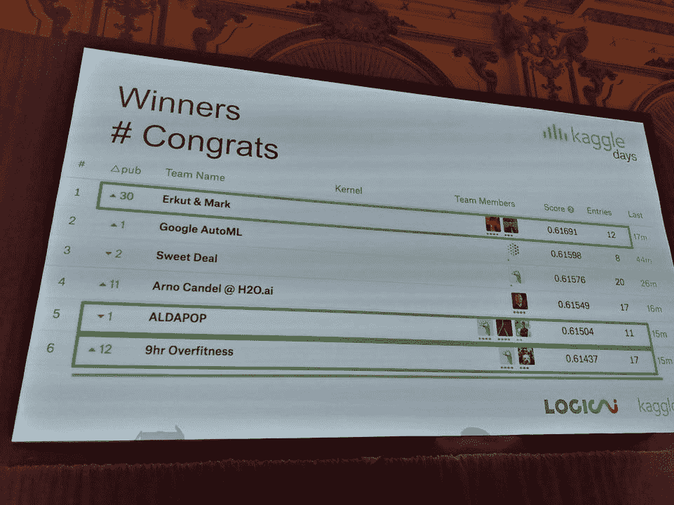
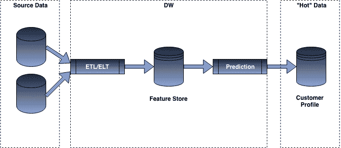
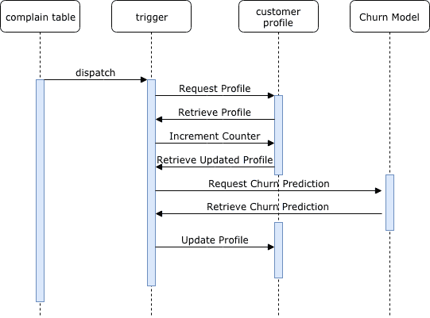
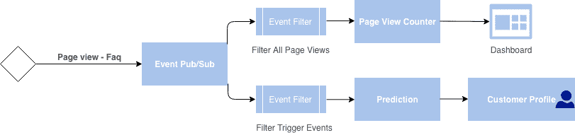
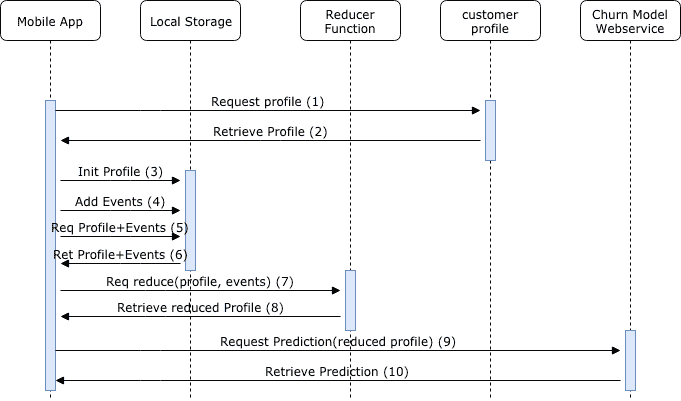

# 机器学习模型生产部署的不同方法概述

> 原文：[`www.kdnuggets.com/2019/06/approaches-deploying-machine-learning-production.html`](https://www.kdnuggets.com/2019/06/approaches-deploying-machine-learning-production.html)

评论

**[Julien Kervizic](https://www.linkedin.com/in/julienkervizic/)，GrandVision NV 高级企业数据架构师**


* * *

## 我们的前三大课程推荐

 1\. [谷歌网络安全证书](https://www.kdnuggets.com/google-cybersecurity) - 快速进入网络安全职业生涯。

 2\. [谷歌数据分析专业证书](https://www.kdnuggets.com/google-data-analytics) - 提升你的数据分析技能

 3\. [谷歌 IT 支持专业证书](https://www.kdnuggets.com/google-itsupport) - 支持你的组织的 IT 工作

* * *

将模型投入生产有不同的方法，具体用例会影响其优缺点。例如，在流失预测的用例中，拥有一个静态值可以在有人拨打客服电话时轻松查找，但如果在特定事件发生时，模型能够用新获得的信息重新运行，将会带来额外的价值。

通常有不同的方式将模型训练和投入生产：

+   **训练**：一次性、批量和实时/在线训练

+   **服务**：批量、实时（数据库触发器、Pub/Sub、网络服务、应用内）

每种方法都有其自身的优点和权衡，需要考虑。

### 一次性训练

模型不一定需要持续训练才能投入生产。通常，数据科学家可以通过临时训练一个模型，并将其投入生产，直到其性能下降到需要刷新为止。


**从 Jupyter 到生产**

数据科学家在原型设计和进行机器学习时，通常会在他们选择的环境中操作，即[Jupyter](https://jupyter.org/) Notebooks。这本质上是一个先进的 GUI，在一个 [repl](https://en.wikipedia.org/wiki/Read%E2%80%93eval%E2%80%93print_loop) 上，允许你保存代码和命令输出。

使用这种方法，将从 Jupyter 中的某段代码临时训练的模型推送到生产中是完全可行的。不同类型的库和其他笔记本提供商进一步帮助将数据科学家的工作台与生产连接起来。

**模型格式**

[Pickle](https://docs.python.org/3/library/pickle.html) 将 Python 对象转换为比特流，并允许将其存储到磁盘上，并在以后重新加载。它提供了一种良好的格式来存储机器学习模型，前提是其预期应用程序也是用 Python 构建的。

[ONNX](https://github.com/onnx) 开放神经网络交换格式，是一种开放格式，支持在库和语言之间存储和移植预测模型。大多数深度学习库支持它，sklearn 也有一个库扩展，用于将其模型转换为 [ONNX 格式](https://github.com/onnx/sklearn-onnx/blob/master/docs/tutorial.rst)。

[PMML](https://en.wikipedia.org/wiki/Predictive_Model_Markup_Language) 或预测模型标记语言，是另一种预测模型的交换格式。与 ONNX 类似，sklearn 也有一个库扩展，用于将模型转换为 [PMML 格式](https://github.com/jpmml/sklearn2pmml)。然而，它的缺点是仅支持某些类型的预测模型。PMML 自 1997 年以来就存在，因此有大量应用程序利用该格式。例如，[SAP](https://archive.sap.com/kmuuid2/a07faefd-61d7-2c10-bba6-89ac5ffc302c/Integrating%20Real-time%20Predictive%20Analytics%20into%20SAP%20Applications.pdf) 能够利用某些版本的 PMML 标准，类似地，CRM 应用程序如 [PEGA](https://community.pega.com/knowledgebase/supported-pmml-model-types) 也是如此。

[POJO 和 MOJO](http://docs.h2o.ai/h2o/latest-stable/h2o-docs/productionizing.html#about-pojos-and-mojos) 是 [H2O.ai](https://www.h2o.ai/) 的导出格式，旨在提供一个易于嵌入到 Java 应用程序中的模型。然而，它们非常特定于使用 H2O 的平台。

**训练**

对于一次性的模型训练，模型可以由数据科学家即时训练和微调，或通过 AutoML 库进行训练。然而，拥有一个易于复现的设置有助于推进到生产化的下一个阶段，即：批量训练。

### 批量训练

虽然在生产中实现模型并非完全必要，但批量训练允许根据最新的训练不断刷新模型的版本。

批量训练可以从 AutoML 类型的框架中受益，AutoML 使您能够执行/自动化活动，如特征处理、特征选择、模型选择和参数优化。它们最近的表现已达到或超越了最勤奋的数据科学家。

[LinkedIn 帖子](https://www.linkedin.com/pulse/future-data-science-one-image-charles-givre/?fbclid=IwAR0zVvLTmiDT4ReAqe59HjCXym_pNXW6AvC2RgeC-zY5sEESnhKHYI_TfT8)

使用它们允许比传统的模型训练方法更全面的模型训练：仅仅是重新训练模型权重。

存在不同的技术支持这种连续批量训练，这些技术可以通过混合使用[airflow](https://medium.com/analytics-and-data/airflow-the-easy-way-f1c26859ee21)来管理不同的工作流和类似[tpot](https://epistasislab.github.io/tpot/)的 AutoML 库来设置。不同的云服务提供商提供他们的 AutoML 解决方案，可以纳入数据工作流。例如，Azure 将机器学习预测和模型训练与他们的[数据工厂服务](https://azure.microsoft.com/es-es/blog/retraining-and-updating-azure-machine-learning-models-with-azure-data-factory/)集成。

### 实时训练

实时训练可以通过‘在线机器学习’模型实现，支持这种训练方法的算法包括 K-means（通过小批量）、线性回归和逻辑回归（通过随机梯度下降）以及朴素贝叶斯分类器。

Spark 提供了 StreamingLinearAlgorithm/StreamingLinearRegressionWithSGD 来执行这些操作，sklearn 提供了 SGDRegressor 和 SGDClassifier 可进行增量训练。在 sklearn 中，增量训练通过 partial_fit 方法进行，如下所示：

```py

import pandas as pd
from sklearn import linear_model

X_0 = pd.DataFrame([[0,0], [1,0]] )
y_0 = pd.DataFrame([[0], [0]])

X_1 = pd.DataFrame([[0,1], [1,1], [1,1]])
y_1 = pd.DataFrame([[1], [1], [1]])

clf = linear_model.SGDClassifier()

clf.partial_fit(X_0, y_0, classes=[0,1])
print(clf.predict([[0,0]])) # -> 0
print(clf.predict([[0,1]])) # -> 0

clf.partial_fit(X_1, y_1, classes=[0,1])
print(clf.predict([[0,0]])) # -> 0
print(clf.predict([[0,1]])) # -> 1

```

部署这种类型的模型时，需要认真考虑操作支持和监控，因为模型可能对新数据和噪音敏感，模型性能需要实时监控。在离线训练中，你可以筛选[高杠杆点](https://en.wikipedia.org/wiki/Leverage_%28statistics%29)并纠正这种类型的输入数据。而当你基于新数据点不断更新模型训练时，这种操作会变得更加困难。

训练在线模型时出现的另一个挑战是它们不会衰减历史信息。这意味着，如果数据集发生结构性变化，模型仍需重新训练，并且模型生命周期管理将承担很大负担。

### 批量预测与实时预测

在决定设置批量还是实时预测时，了解为什么实时预测很重要是很有必要的。这可能是为了在重要事件发生时获取新的评分，例如客户拨打客服电话时的流失评分。这些好处需要与实时预测带来的复杂性和成本影响进行权衡。

**负载影响**

实时预测需要处理峰值负载。根据所采取的方法以及预测的使用方式，选择实时方法可能还需要额外的计算能力，以便在某个 SLA 内提供预测。这与批量方法形成对比，后者的预测计算可以根据可用容量分散到一天中。

**基础设施影响**

进行实时预测需要承担更高的运营责任。人们需要能够监控系统的工作情况，遇到问题时得到警报，并考虑故障转移责任。对于批量预测，运营义务要低得多，虽然需要一些监控，并且希望有警报，但对直接了解问题的需求要低得多。

**成本影响**

进行实时预测也会有成本影响，需要更多的计算能力，无法在一天内分散负载可能会迫使你购买比实际需要更多的计算容量，或支付价格上涨的费用。根据采取的方法和要求，可能还会因为需要更强大的计算能力以满足服务水平协议（SLA）而产生额外费用。此外，选择实时预测时，基础设施的足迹往往更大。一个潜在的注意事项是，在特定场景下，选择依赖于应用内预测的成本可能实际上会比批量方法更便宜。

**评估影响**

实时评估预测性能可能比批量预测更具挑战性。例如，当你面临一系列连续操作，短时间内为某个客户产生多个预测时，你如何评估性能？实时预测模型的评估和调试管理要复杂得多。这些模型还需要一个日志收集机制，用于收集不同的预测和产生分数的特征，以便进行进一步评估。

### 批量预测集成

批量预测依赖于两种不同的信息，一种是预测模型，另一种是我们将提供给模型的特征。在大多数批量预测架构中，ETL 操作用于从特定的数据存储（特征存储）中提取预计算的特征，或在多个数据集之间执行某种类型的转换，以提供预测模型的输入。然后，预测模型在数据集中的所有行上进行迭代，提供不同的分数。

批量预测模型服务的示例流程

一旦所有预测计算完成，我们可以将分数“服务”到不同的系统中。这可以根据我们想要使用分数的用例以不同的方式完成，例如，如果我们想在前端应用程序中使用分数，我们可能会将数据推送到“缓存”或 NoSQL 数据库，如 Redis，以提供毫秒级的响应。而对于某些用例，例如创建电子邮件旅程，我们可能会依赖 CSV SFTP 导出或数据加载到更传统的 RDBMS 中。

### **实时预测集成**

将模型推送到生产环境以用于实时应用需要 3 个基本组件：客户/用户概况、一组触发器和预测模型。


**概况：** 客户概况包含与客户相关的所有属性以及进行预测所需的不同属性（例如：计数器）。这是进行客户级别预测所必需的，以减少从多个地方提取信息的延迟，并简化机器学习模型在生产中的集成。在大多数情况下，需要类似类型的数据存储，以有效地提取驱动预测模型所需的数据。

**触发器：** 触发器是引发过程启动的事件，例如客户流失、拨打客户服务中心电话、检查订单历史信息等。

**模型：** 模型需要经过预训练，并通常导出为之前提到的 3 种格式之一（pickle、ONNX 或 PMML），以便能够轻松地迁移到生产环境中。

将模型用于评分目的的生产有几种不同的方法：

+   *依赖数据库集成：* 许多数据库供应商已经付出了显著的努力，将高级分析用例集成到数据库中。无论是通过直接集成 Python 或 R 代码，还是通过导入 PMML 模型。

+   *利用发布/订阅模型：* 预测模型本质上是一个应用程序，依赖数据流并执行某些操作，例如提取客户概况信息。

+   *Web 服务：* 在模型预测周围设置 API 包装器，并将其部署为 Web 服务。根据 Web 服务的设置方式，它可能会或可能不会提取驱动模型所需的数据。

+   *应用内：* 还可以将模型直接部署到本地或 Web 应用程序中，并让模型在本地或外部数据源上运行。

***数据库集成***

如果数据库的总体规模相对较小（< 1M 用户概况）且更新频率较低，将一些实时更新过程直接集成到数据库中是有意义的。

Postgres 具有一个集成，允许将 Python 代码作为函数或存储过程运行，称为[PL/Python](http://PL/Python)。该实现可以访问所有属于**PYTHONPATH**的库，因此能够使用如 Pandas 和 SKlearn 等库来执行一些操作。

这可以与 Postgres 的[触发器](https://www.tutorialspoint.com/postgresql/postgresql_triggers.htm)机制结合使用，执行数据库运行并更新流失评分。例如，如果在投诉表中添加了新条目，则实时重新运行模型将非常有价值。



**序列流**

流程可以按以下方式设置：

*新事件:* 当投诉表中插入新行时，会生成一个事件触发器。

*触发器:* 触发器函数会更新客户档案表中该客户的投诉次数，并获取该客户的更新记录。

*预测请求:* 基于此，将通过 PL/Python 重新运行流失模型并获取预测结果。

*客户档案更新:* 然后可以使用更新后的预测重新更新客户档案。下游流程可以在检查客户档案是否已更新为新的流失预测值后发生。

**技术**

不同的数据库能够支持 Python 脚本的运行，例如之前提到的 PostGres 有本地的 Python 集成，但 Ms SQL Server 也可以通过其 [数据库中的机器学习服务](https://www.sqlshack.com/how-to-use-python-in-sql-server-2017-to-obtain-advanced-data-analytics/) 支持，而 Teradata 等其他数据库能够通过外部脚本命令运行 R/Python 脚本。Oracle 通过其数据挖掘扩展支持 [PMML 模型](https://docs.oracle.com/database/121/DMPRG/GUID-55C6ADBF-DA64-48B6-A424-5F0A59CD406D.htm#DMPRG701)。

**发布/订阅**

通过发布/订阅模型实现实时预测可以有效地通过节流处理负载。对于工程师而言，这也意味着他们可以通过一个“日志”数据流提供事件数据，多个应用程序可以订阅这个流。

一个如何设置的示例如下：



页面视图事件被触发到一个特定的事件主题上，在这个主题上有两个应用程序，一个订阅页面视图计数器，另一个订阅预测。这两个应用程序从主题中过滤出特定相关的事件以满足各自的目的，并消费主题中的不同消息。页面视图计数器应用提供数据以支持仪表板，而预测应用则更新客户档案。


**序列流：**

事件消息在发生时被推送到发布/订阅主题，预测应用轮询该主题以获取新消息。当预测应用检索到新消息时，它将请求并获取客户档案，并使用消息和档案信息进行预测。然后，它将最终将预测结果推送回客户档案以供进一步使用。

可以设置一个略有不同的流程，其中数据首先被一个“增强应用”消费，该应用将档案信息添加到消息中，然后将其推送回新的主题，最终由预测应用消费并推送到客户档案中。

**技术：**

在数据生态系统中，支持这种用例的典型开源组合是 Kafka 和 Spark 流处理，但在云上也可以进行不同的设置。在 Google 上，Google Pub/Sub/数据流（Beam）提供了一个不错的替代组合；在 Azure 上，Azure-Service Bus 或 Eventhub 与 Azure Functions 的组合可以很好地处理消息并生成这些预测。

*Web 服务*

我们可以将模型实施为 Web 服务。将预测模型实现为 Web 服务特别适用于工程团队的分散情况，并且需要处理多个不同的接口，如 Web、桌面和移动。

与 Web 服务的接口可以以不同方式设置：

+   通过提供标识符，让 Web 服务拉取所需信息，计算预测并返回其值。

+   或者接受一个有效负载，将其转换为数据框，进行预测并返回其值。

第二种方法通常建议在有大量交互发生并且使用本地缓存以缓冲与后端系统同步时，或在需要基于不同粒度（例如会话预测）进行预测时使用。

使用本地存储的系统，通常有一个还原函数，其作用是计算如果将本地存储中的事件重新集成，会形成什么样的客户档案。因此，它提供了基于本地数据的客户档案近似值。



**序列流程**

处理使用移动应用进行预测的流程，可以分为 4 个阶段。

*应用初始化（1 到 3）****：*** 应用程序初始化，向客户档案发出请求，检索其初始值，并在本地存储中初始化档案。

*应用程序（4）：* 应用程序将发生在应用程序中的不同事件存储到本地存储中的一个数组里。

*预测准备（5 到 8）****：*** 应用程序希望检索新的流失预测，因此需要准备提供给流失 Web 服务的信息。为此，它向本地存储发出初始请求，以检索档案的值和已存储的事件数组。一旦检索到这些数据，它会向还原函数发出请求，将这些值作为参数提供，还原函数输出一个更新的档案，将本地事件重新集成到档案中。

*Web 服务预测 (9 到 10)：* 应用程序向流失预测 Web 服务发出请求，提供从第 8 步更新的*/减少的客户档案作为有效负载的一部分。Web 服务可以使用有效负载提供的信息生成预测并将其值输出回应用程序。

**技术**

有许多技术可以用来提供预测 Web 服务：

*函数*

AWS Lambda 函数、Google Cloud 函数和 Microsoft Azure Functions（尽管 Python 支持目前处于 Beta 阶段）提供了一个简单的接口，便于部署可扩展的 Web 服务。

例如，在 Azure 上，可以通过一个大致如下的函数来实现预测 Web 服务：

```py

import logging

import azure.functions as func
import pandas as pd
from sklearn.linear_model import LogisticRegression
from sklearn.externals import joblib

def main(req: func.HttpRequest) -> func.HttpResponse:
    logging.info('Python HTTP trigger function processed a request.')
    if req.body:
        try:
            logging.info("Converting Request to DataFrame")
            req_body = req.get_json()
            df_body  = pd.DataFrame([req_body])

            logging.info("Loadding the Prediction Model")
            filename = "model.pckl"
            loaded_model = joblib.load(filename)
            # Features names need to have been added to the pickled model
            feature_names = loaded_model.feature_names
            # subselect only the feature names 

            logging.info("Subselecting the dataframe")
            df_subselect = df_body[feature_names]

            logging.info("Predicting the Probability")
            result = loaded_model.predict_proba(df_subselect)
            # We are looking at the probba prediction for class 1
            prediction = result[0][1]

            return func.HttpResponse("{prediction}".format(prediction=prediction), status_code=200)

        except ValueError:
            pass
    else:
        return func.HttpResponse(
             "Please pass a name on the query string or in the request body",
status_code=400
        )

```

*容器*

另一种替代函数的方法是通过 Docker 容器（Amazon ECS、Azure Container Instance 或 Google Kubernetes Engine）部署 Flask 或 Django 应用程序。例如，Azure 提供了通过其 [Azure 机器学习服务](https://docs.microsoft.com/en-us/azure/machine-learning/service/how-to-deploy-and-where) 设置预测容器的简单方法。

*笔记本*

不同的笔记本提供商，如 [databricks](https://docs.databricks.com/applications/mlflow/models.html) 和 [dataiku](https://www.dataiku.com/dss/features/model-deployment/)，已显著致力于简化其环境中的模型部署。这些提供了将 Web 服务设置到本地环境或部署到外部系统（如 Azure ML 服务、Kubernetes 引擎等）的功能。

**应用内**

在某些情况下，如果存在法律或隐私要求，不允许将数据存储在应用程序外部，或者存在上传大量文件的限制，则在应用程序中使用模型往往是正确的方法。

Android-ML Kit 或类似的 Caffe2 允许在本地应用程序中使用模型，而 [Tensorflow.js](https://www.tensorflow.org/js) 和 [ONNXJS](https://github.com/Microsoft/onnxjs) 允许直接在浏览器或利用 JavaScript 的应用程序中运行模型。

### 考虑因素

除了模型的部署方法外，在部署到生产环境时还有一些重要的考虑因素。

**模型复杂性**

模型本身的复杂性是第一个要考虑的因素。线性回归和逻辑回归等模型相对容易应用，通常占用的存储空间不多。使用更复杂的模型，如神经网络或复杂的集成决策树，会导致计算时间更长，冷启动时加载到内存中所需时间更长，并且运行成本更高。

**数据来源**

重要的是要考虑生产环境中的数据源与训练中使用的数据源之间可能发生的差异。虽然用于训练的数据需要与生产中将要使用的上下文保持一致，但通常重新计算每个值以实现完全同步是不切实际的。

**实验框架**

建立实验框架，进行 A/B 测试以评估不同模型的性能与客观指标的对比。同时确保有足够的跟踪以准确调试和评估模型的后期性能。

### 总结

选择如何将预测模型部署到生产环境中是一个相当复杂的事务，处理预测模型生命周期管理的方式有很多种，存储模型的格式也各不相同，部署方式多种多样，技术领域非常广泛。

了解特定用例、团队的技术和分析成熟度、整体组织结构及其互动，有助于找到将预测模型部署到生产环境中的正确方法。

**个人简介：[Julien Kervizic](https://www.linkedin.com/in/julienkervizic/)** 是 GrandVision NV 的高级企业数据架构师。

[原文](https://medium.com/analytics-and-data/overview-of-the-different-approaches-to-putting-machinelearning-ml-models-in-production-c699b34abf86)。经许可转载。

**相关：**

+   如何在 5 分钟内使用 Flask 为机器学习模型构建 API

+   管理你的机器学习生命周期与 MLflow  –  第一部分

+   将机器学习投入生产

### 更多相关内容

+   [使用 Python 的自动化机器学习：不同方法的比较…](https://www.kdnuggets.com/2023/03/automated-machine-learning-python-comparison-different-approaches.html)

+   [Feature Store Summit 2023：部署机器学习模型的实用策略…](https://www.kdnuggets.com/2023/09/hopsworks-feature-store-summit-2023-practical-strategies-deploying-ml-models-production-environments)

+   [AI 生成的体育亮点：不同的方法](https://www.kdnuggets.com/2022/03/aigenerated-sports-highlights-different-approaches.html)

+   [将你的机器学习模型部署到云中的生产环境](https://www.kdnuggets.com/deploying-your-ml-model-to-production-in-the-cloud)

+   [机器学习的数据标注：市场概述、方法和工具](https://www.kdnuggets.com/2021/12/data-labeling-ml-overview-and-tools.html)

+   [文本总结方法概述](https://www.kdnuggets.com/2019/01/approaches-text-summarization-overview.html)
