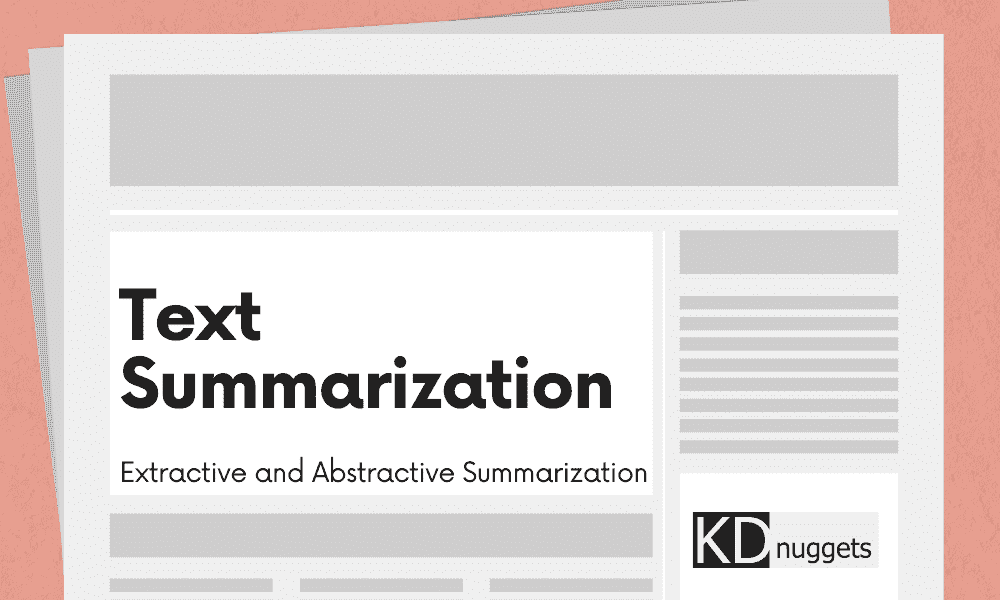
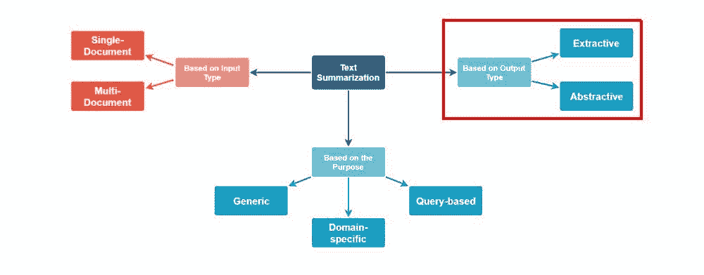

# 文本总结方法概述

> 原文：[`www.kdnuggets.com/2019/01/approaches-text-summarization-overview.html`](https://www.kdnuggets.com/2019/01/approaches-text-summarization-overview.html)

图片由编辑提供

人类语言文本的*真实*语义理解，其有效总结的表现，可能是自然语言处理（NLP）的圣杯。这个说法听起来并不夸张：因为真正的人类语言理解确实是 NLP 的圣杯，而真正有效的总结必然涉及真实的理解，这一点通过传递性可以得到支持。

不幸的是——或者说不幸的是，这取决于你的观点——目前我们无法依靠真正的“理解”来进行文本总结。然而，事情必须继续进行，目前确实存在一系列实际的文本总结技术，其中一些已经存在了几十年。这些技术采取不同的方法来实现相同的目标，并且可以被归类为几个较窄的类别，以追求它们共同的目标。

本文将介绍目前采用的主要文本总结方法，并讨论它们的一些特征。

# 自动化文本总结技术

明确来说，当我们谈到“自动化文本总结”时，我们指的是利用机器通过某种形式的启发式或统计方法来进行文档或文档的总结。在这种情况下，总结是一个简短的文本，准确捕捉和传达我们希望总结的文档中最重要和相关的信息。如上所述，目前有许多经过验证的自动化文本总结技术正在使用中。

有几种方法可以对自动化文本总结技术进行分类，如图 1 所示。本文将从总结*输出类型*的角度探讨这些技术。在这方面，技术可以分为 2 类：抽取式和抽象式。

**图 1.** 自动化文本总结方法（来源：[Kushal Chauhan, Jutana](https://medium.com/jatana/unsupervised-text-summarization-using-sentence-embeddings-adb15ce83db1)，已修改）。

**抽取式文本总结** 方法通过识别文本中的重要句子或摘录，并逐字复现这些内容作为总结的一部分。不会生成新的文本；总结过程中只使用现有文本。

**抽象文本总结**方法采用更强大的自然语言处理技术来解释文本并生成新的总结文本，而不是选择最具代表性的现有摘录进行总结。

尽管这两种方法都是有效的文本总结方法，但要让你相信抽象技术远比实现难度更大应该不难。实际上，现在大多数总结过程都是基于抽取的。这并不意味着抽象方法应该被忽视或忽略；相反，对其实现的研究——以及对人类语言真正语义理解的研究——是值得追求的，在我们能够自信地说我们在这一领域真正取得了进展之前，还需要做大量的工作。

因此，本文其余部分将重点关注抽取式文本总结的具体内容及其不同的实现技术。

# 抽取式总结

抽取式总结技术各有不同，但它们都共享相同的基本任务：

1.  构建输入文本（待总结文本）的中间表示

1.  基于构建的中间表示对句子进行评分

1.  选择一个包含前*k*最重要句子的摘要

任务 2 和任务 3 足够简单；在*句子评分*中，我们希望确定每个句子传达文本摘要重要方面的效果，而*句子选择*则使用一些特定的优化方法进行。每个这两个步骤的算法可能有所不同，但概念上相当简单：使用某种度量分配分数给每个句子，然后通过某种明确的句子选择方法从最高分的句子中进行选择。

第一个任务，中间表示，可能需要进一步阐述。

# 中间表示

在对自然语言进行句子评分和选择之前，需要对其进行某种程度的理解，创建每个句子的中间表示可以实现这个目的。中间表示的两个主要类别，*主题表示*和*指标表示*，在下面简要定义了它们及其子类别。

**主题表示** - 通过关注文本主题识别来转换文本；该方法的主要子类别包括：

+   基于频率的方法

+   主题词方法

+   [潜在语义分析](https://en.wikipedia.org/wiki/Latent_semantic_analysis)（LSA）

+   贝叶斯主题模型——例如[潜在狄利克雷分配](https://en.wikipedia.org/wiki/Latent_Dirichlet_allocation)（LDA）

两种最流行的词频方法是词概率和[TF-IDF](https://en.wikipedia.org/wiki/Tf%E2%80%93idf)。

在主题词方法中，有两种计算句子重要性的方法：通过句子包含的主题签名的数量（句子讨论的主题数量），或者通过句子包含的主题与文本中包含的主题数量的比例。因此，第一个方法倾向于奖励较长的句子，而第二个方法则衡量主题词密度。

潜在语义分析和贝叶斯主题模型方法（如 LDA）的解释超出了本文的范围，但可以在上述链接中阅读。

**图 2.** 构建词袋特征向量（来源：[Dipanjan Sarkar](https://towardsdatascience.com/understanding-feature-engineering-part-3-traditional-methods-for-text-data-f6f7d70acd41)）。

**指示器表示** - 将文本中的每个句子转换为一个重要性特征列表；可能的特征包括：

+   句子长度。

+   句子位置。

+   句子是否包含特定单词（请参见图 2 以了解这种特征提取方法的示例，[词袋模型](https://en.wikipedia.org/wiki/Bag-of-words_model)）。

+   句子是否包含特定短语。

使用一组特征来表示和排序文本数据可以通过两种总体指示器表示方法之一来完成：图方法和机器学习方法。

使用**图表示**：

+   我们发现子图最终表示文本中涉及的主题。

+   我们能够在文本中隔离重要句子，因为这些句子会与更多的其他句子连接（如果你将句子视为顶点，句子相似性表示为边）。

+   我们不需要考虑特定语言的处理，并且相同的方法可以应用于各种语言。

+   我们通常发现，通过图揭示的句子相似性获得的语义信息，在总结性能上往往优于更简单的频率方法。

使用**机器学习表示**：

+   总结问题被建模为分类问题。

+   我们需要标注的训练数据来建立一个分类器，以将句子分类为摘要句子或非摘要句子。

+   为了应对标注数据困境，半监督学习等替代方案显示出希望。

+   我们发现某些假设句子之间有依赖关系的方法通常比其他技术表现更好。

文本摘要是自然语言处理的一个令人兴奋的子领域。虽然多种提取式摘要的方法正在使用并每天进行研究，但对上述概念基础的理解应使你能够对这些方法有一定的了解，至少在 30,000 英尺的层面上。你也应该能够自信地阅读最近的论文或实施博客文章，具备进行此类工作的基本理解。

这些信息大部分得益于 Mehdi Allahyari, Seyedamin Pouriyeh, Mehdi Assefi, Saeid Safaei, Elizabeth D. Trippe, Juan B. Gutierrez, 和 Krys Kochut 的论文[文本摘要技术：简要调查](https://arxiv.org/abs/1707.02268)。

## 参考文献与进一步阅读：

+   [文本摘要技术：简要调查](https://arxiv.org/abs/1707.02268)，Mehdi Allahyari, Seyedamin Pouriyeh, Mehdi Assefi, Saeid Safaei, Elizabeth D. Trippe, Juan B. Gutierrez, Krys Kochut, 2017。

+   [使用句子嵌入的无监督文本摘要](https://medium.com/jatana/unsupervised-text-summarization-using-sentence-embeddings-adb15ce83db1)，Kushal Chauhan, 2018。

此外，本文集中在提取式摘要，但你可以在以下内容中找到有关抽象摘要的更多信息：

+   [使用文档上下文向量和递归神经网络的抽象和提取式文本摘要](https://arxiv.org/abs/1807.08000)，Chandra Khatri, Gyanit Singh, Nish Parikh, 2018。

+   [使用序列到序列模型的神经抽象文本摘要](https://arxiv.org/abs/1812.02303)，Tian Shi, Yaser Keneshloo, Naren Ramakrishnan, Chandan K. Reddy, 2018。

**[Matthew Mayo](https://www.linkedin.com/in/mattmayo13/)** ([**@mattmayo13**](https://twitter.com/mattmayo13)) 是一位数据科学家，也是 KDnuggets 的主编，KDnuggets 是一个开创性的在线数据科学和机器学习资源。他的兴趣包括自然语言处理、算法设计与优化、无监督学习、神经网络以及机器学习的自动化方法。Matthew 拥有计算机科学硕士学位和数据挖掘研究生文凭。他可以通过 editor1 at kdnuggets[dot]com 联系。

* * *

## 我们的前三大课程推荐

 1\. [谷歌网络安全证书](https://www.kdnuggets.com/google-cybersecurity) - 快速进入网络安全职业生涯。

 2\. [谷歌数据分析专业证书](https://www.kdnuggets.com/google-data-analytics) - 提升你的数据分析能力

 3\. [谷歌 IT 支持专业证书](https://www.kdnuggets.com/google-itsupport) - 支持你的组织的 IT

* * *

### 更多相关内容

+   [机器学习的数据标注：市场概览、方法和工具](https://www.kdnuggets.com/2021/12/data-labeling-ml-overview-and-tools.html)

+   [自动化文本摘要入门](https://www.kdnuggets.com/2019/11/getting-started-automated-text-summarization.html)

+   [文本摘要开发：使用 GPT-3.5 的 Python 教程](https://www.kdnuggets.com/2023/04/text-summarization-development-python-tutorial-gpt35.html)

+   [使用 GPT-3 进行摘要生成](https://www.kdnuggets.com/2022/04/packt-summarization-gpt3.html)

+   [解锁 GPT-4 摘要生成：密度提示链法](https://www.kdnuggets.com/unlocking-gpt-4-summarization-with-chain-of-density-prompting)

+   [使用 BERT 的提取式摘要生成](https://www.kdnuggets.com/extractive-summarization-with-llm-using-bert)
