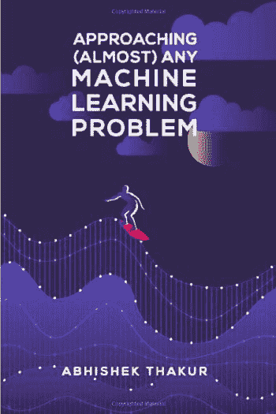

# 《Approaching (Almost) Any Machine Learning Problem》

> 原文：[`www.kdnuggets.com/2021/02/approaching-almost-any-machine-learning-problem.html`](https://www.kdnuggets.com/2021/02/approaching-almost-any-machine-learning-problem.html)

评论

目前有越来越多的作品探讨如何处理机器学习问题，其中许多都很优秀。但有多少本是由一位 4 次 Kaggle 大师撰写的呢？

[Abhishek Thakur](https://www.kaggle.com/abhishek)，这位 4 次获得 Kaggle 大师称号的专家——现任职于 Hugging Face 从事 NLP 工作——去年编写并发布了他的书 **[Approaching (Almost) Any Machine Learning Problem](https://github.com/abhishekkrthakur/approachingalmost)**（AAAMLP）。这本书可以通过 [Amazon 购买](https://www.amazon.com/dp/8269211508)，价格非常合理，比大多数类似内容的书籍便宜得多。

* * *

## 我们的前三个课程推荐

 1\. [Google 网络安全证书](https://www.kdnuggets.com/google-cybersecurity) - 快速进入网络安全职业。

 2\. [Google 数据分析专业证书](https://www.kdnuggets.com/google-data-analytics) - 提升你的数据分析技能

 3\. [Google IT 支持专业证书](https://www.kdnuggets.com/google-itsupport) - 支持你的组织的 IT

* * *

另外，然而，Abhishek 最近在其 [Github 仓库上免费发布了整本书](https://github.com/abhishekkrthakur/approachingalmost)，可以以 PDF 格式获取。

有两个细节需要你立即了解 AAAMLP，直接来自作者：

> 这 **不是** 一本传统的书籍。
> 
> 这本书预计你已经具备机器学习和深度学习的基础知识。

第二点很容易解释，因为这绝对不是一本“从零开始”的机器学习书籍。如果你还不熟悉基础机器学习概念和 Python 编程，你需要寻找其他学习材料。

第一点部分可以解释为 AAAMLP 设计为一本代码跟随书，这也是为什么它的代码没有在其 Github 仓库上单独共享。你想理解并实现其中建议的方法吗？你需要在阅读的同时输入代码，这样可以更好地理解你正在做的事情。这与大多数其他书籍不同。

此外，书的后半部分专注于解决特定机器学习问题类型的全面方法，每个章节都专门讨论这些不同类型的内容。总体而言，这与大多数其他书籍有所不同。

这本书大约 300 页，涵盖了很多内容。请参见下面的完整目录了解更多信息：

1.  设置工作环境

1.  监督学习与无监督学习

1.  交叉验证

1.  评估指标

1.  安排机器学习项目

1.  类别变量的处理

1.  特征工程

1.  特征选择

1.  超参数优化

1.  图像分类与分割的方法

1.  文本分类/回归的方法

1.  组合和堆叠的方法

1.  可重复代码与模型服务的方法

你可以看到，在早期会花费一些时间在更基本的概念上，但即使这些也不是你通常书本上的解释。你将直接进入它们的实际用处以及如何为自己的项目编写这些概念的代码。

一旦监督学习与无监督学习、交叉验证和评估指标等关键基础主题章节完成后，接下来的任务是项目导向的方法来安排你的代码和其他文件，之后是更多实际的数据预处理和准备章节。随后将涉及实用的超参数优化。

一旦这些章节完成，将处理具体问题方法的更全面内容，包括图像分类、文本分类、组合和可重复性及模型服务。在这些章节中，这本书真正发光，从实用的角度提升到作为一个优秀的指南，通过遵循 Thakur 的蓝图，你可以实现更多。

这本书的一个很好的补充材料是[Thakur 的 YouTube 频道](https://www.youtube.com/AbhishekThakurAbhi)。除了其他人的精彩讨论和建议外，Thakur 还对书中有章节的多个概念进行了视频编码演示。这是一个很好的方式来巩固和获得这些主题的额外见解。我强烈推荐他的频道作为超越书本的资源。

如果你喜欢这本书，应该考虑通过购买 AAAMLP 来支持 Thakur 的工作，因为 Kindle 和纸质书的价格都非常合理。不管怎样，Thakur 希望任何读过书的人都能在 Google、Amazon 或 Goodreads 上留下评论。

AAAMLP 是一本独特的书，融合了实用的“*如何做*”与示范的“*可以做*”，是任何希望认真实施机器学习解决方案的人的优秀指南。我强烈推荐这本书和作者 Abhishek Thakur 的 YouTube 频道。

**相关**：

+   2021 年 15 本免费数据科学、机器学习和统计学电子书

+   麻省理工学院免费微积分课程：理解深度学习的关键

+   从零开始的机器学习：免费在线教科书

### 更多相关内容

+   [停止学习数据科学以寻找目标，并寻找目标以……](https://www.kdnuggets.com/2021/12/stop-learning-data-science-find-purpose.html)

+   [学习数据科学统计的顶级资源](https://www.kdnuggets.com/2021/12/springboard-top-resources-learn-data-science-statistics.html)

+   [一桩 90 亿美元的 AI 失败，进行了审视](https://www.kdnuggets.com/2021/12/9b-ai-failure-examined.html)

+   [成功的数据科学家的五大特征](https://www.kdnuggets.com/2021/12/5-characteristics-successful-data-scientist.html)

+   [是什么使 Python 成为初创企业的理想编程语言](https://www.kdnuggets.com/2021/12/makes-python-ideal-programming-language-startups.html)

+   [每个数据科学家都应该知道的三个 R 库（即使你使用 Python）](https://www.kdnuggets.com/2021/12/three-r-libraries-every-data-scientist-know-even-python.html)
