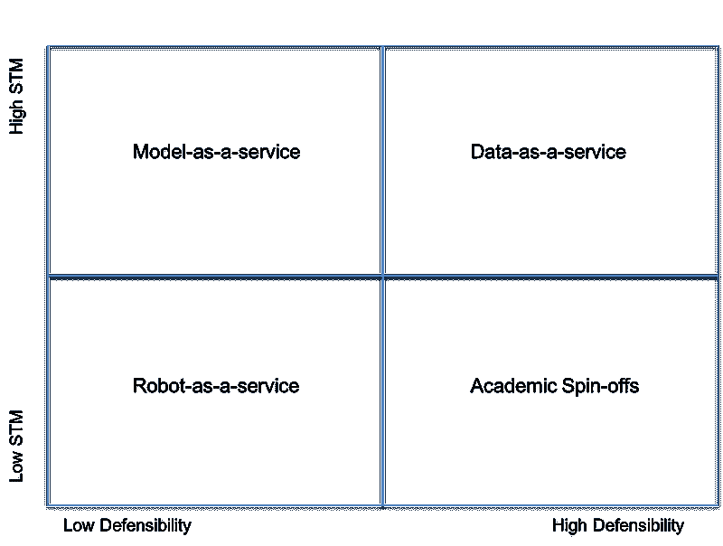

# 人工智能分类矩阵

> 原文：[`www.kdnuggets.com/2016/11/artificial-intelligence-classification-matrix.html`](https://www.kdnuggets.com/2016/11/artificial-intelligence-classification-matrix.html)

 评论

[之前的帖子](https://www.linkedin.com/today/author/0_1Vba-OcRDYE1f-C6okrX7s)中讨论的所有问题可能会产生两个主要的横向问题：即在达到相关里程碑之前可能会耗尽资金，以及是否应该追求特定的商业应用以实现盈亏平衡，而不是专注于产品开发。

在分类不同的机器智能初创公司方面，可能有几种不同的思考方式（例如，Bloomberg Beta 投资者 Shivon Zilis 在 2015 年提出的分类非常准确且有用）。不过，我认为过于狭窄的框架可能会适得其反，鉴于该领域的灵活性以及从一个组过渡到另一个组的便利性，因此我更愿意创建一个四大类的分类。

1.  **学术衍生公司**：这些公司更加长期研究导向，解决难以突破的问题。团队通常非常有经验，他们是推动领域发展的真正创新者；

1.  **数据即服务 (DaaS)**：这一组包括收集特定大型数据集的公司，或创建新的数据源以连接不相关的孤岛；

1.  **模型即服务 (MaaS)**：这似乎是最广泛存在的公司类型，它由那些将其模型商品化以产生收入的公司组成。它们可以出现三种不同形式：

    1.  *狭义人工智能*——专注于通过新数据、创新算法或更好的界面解决特定问题的公司；

    1.  *价值提取者*——使用其模型从数据中提取价值和洞察的公司。提供的解决方案通常可能会集成到客户的技术栈中（通过 API 或专门构建在客户平台上）或提供完整的解决方案。所有提供的模型可以是*已训练*（操作模型）或*待训练*（原始模型）；

    1.  *赋能者*——使最终用户能够进行自己的分析（全功能平台），或允许公司提高日常工作流程的效率，或者通过创建中间产品（例如应用程序）来释放新的机会的公司。

1.  **机器人即服务 (RaaS)**：这一类由虚拟和物理代理组成，用户可以与之互动。虚拟代理和聊天机器人覆盖了低成本的一侧，而物理世界系统（例如，自驾车、传感器等）、无人机和实际机器人则是资本和人才密集的一侧。

* * *

## 我们的前三大课程推荐

 1\. [Google 网络安全证书](https://www.kdnuggets.com/google-cybersecurity) - 快速进入网络安全职业道路。

 2\. [Google 数据分析专业证书](https://www.kdnuggets.com/google-data-analytics) - 提升你的数据分析技能

 3\. [Google IT 支持专业证书](https://www.kdnuggets.com/google-itsupport) - 支持你的组织的 IT 需求

* * *

这种分类的结果可以总结为以下矩阵，将各组根据短期货币化（STM）和业务防御能力进行绘制。

**图 1：人工智能分类矩阵**

从更具可行性的产品开始，MaaS 是在短期内货币化其产品潜力最大的公司，但也最难以防御。另一方面，DaaS 是较难复制的，但仍然高度盈利。学术衍生公司是长期投资，基于扎实的科学研究，使其独特但从第一天起并不具备价值。最后，RaaS 公司可能面临更多问题，因为硬件组件的高过时性和创建正确的互动界面的困难。这种分类不旨在根据业务的优劣进行排名，也不意味着属于特定类别的公司不会盈利或成功（例如，X.ai 是一家在 RaaS 领域具有高盈利性的公司）。它不过是一个通用化工具，旨在通过正确的视角来看待这一领域。

**简历： [弗朗切斯科·科雷亚](https://www.linkedin.com/in/francesco-corea-6b4b4a44)** 是一名总部位于英国伦敦的决策科学家和数据战略师。

[原文](https://medium.com/@corea.fr/artificial-intelligence-classification-matrix-77376efe195c#.p61xb48sv)。转载授权。

**相关：**

+   欧洲机器智能概况

+   构建数据创业公司时如何构建你的团队

+   4 大趋势颠覆数据科学市场

### 更多相关话题

+   [你是否应该成为一名自由职业人工智能工程师？](https://www.kdnuggets.com/2021/12/ucsd-become-freelance-artificial-intelligence-engineer.html)

+   [2022 年人工智能项目创意](https://www.kdnuggets.com/2022/01/artificial-intelligence-project-ideas-2022.html)

+   [人工智能与元宇宙](https://www.kdnuggets.com/2022/02/artificial-intelligence-metaverse.html)

+   [基于人工智能的系统中的不确定性量化](https://www.kdnuggets.com/2022/04/uncertainty-quantification-artificial-intelligencebased-systems.html)

+   [人工智能如何改变数据集成](https://www.kdnuggets.com/2022/04/artificial-intelligence-transform-data-integration.html)

+   [2022 年最值得学习的人工智能技能](https://www.kdnuggets.com/2022/08/indemand-artificial-intelligence-skills-learn-2022.html)
