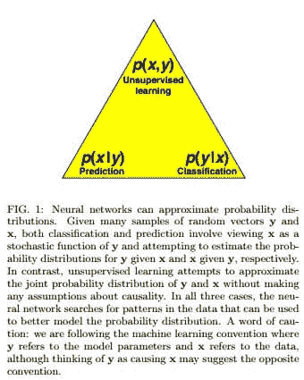
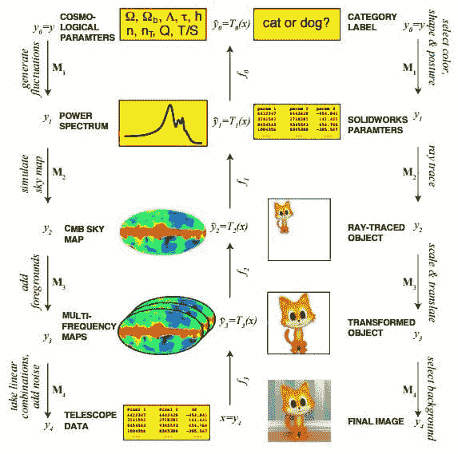

# arXiv 论文聚焦：为何深度学习和廉价学习效果如此显著？

> 原文：[`www.kdnuggets.com/2016/12/arxiv-spotlight-deep-cheap-learning.html`](https://www.kdnuggets.com/2016/12/arxiv-spotlight-deep-cheap-learning.html)

深度学习为何如此有效？而... 廉价学习呢？

[Henry W. Lin（哈佛大学）和 Max Tegmark（麻省理工学院）](https://arxiv.org/abs/1608.08225) 的一篇名为“深度学习和廉价学习为何如此有效？”的最新论文从不同的角度探讨了深度学习为何如此有效。它还介绍了（至少对我来说）“廉价学习”这一术语。

首先，为了明确，“廉价学习”并不是指使用低端 GPU；接下来解释它与参数减少的关系：

> 尽管著名的数学定理保证了神经网络可以很好地逼近任意函数，但实际兴趣的函数类可以通过“廉价学习”用比通用函数少得多的参数来逼近，因为它们具有追溯到物理定律的简化特性。

本文的核心思想是，神经网络的成功不仅归功于数学，也同样归功于物理（可能更多），并且由于对称性、局部性、组合性和多项式对数概率等概念的简化物理函数，可以与深度学习与其试图建模的现实之间的关系类似地看待。你[可能已经听说过这个](https://www.technologyreview.com/s/602344/the-extraordinary-link-between-deep-neural-networks-and-the-nature-of-the-universe/)在九月份的新闻；这是该新闻的基础论文。

更多来自摘要：

> 我们进一步论证了，当生成数据的统计过程具有物理学和机器学习中普遍存在的某种层次结构形式时，深度神经网络比浅层网络更高效。我们通过信息理论来形式化这些主张，并讨论与重整化群程序的关系。我们证明了各种“无平坦定理”，表明在没有效率损失的情况下，这些高效深度网络无法被浅层网络准确逼近：平坦化即使是线性函数也可能代价高昂，而平坦化多项式的代价则是指数级的；我们使用群论技术表明，在一个隐藏层中，n 个变量的乘积不能使用少于 2^n 个神经元。

通过一些数学和几个定理，论文如下：展示了“浅层”神经网络的结果，具有少量层；展示了增加网络深度如何在不增加表现力的情况下提供多项式或指数级的效率提升；总结了结论并讨论了关于重整化和深度学习的技术问题。

论文结论中的一个有趣摘录：

> 虽然以前的普遍性定理保证存在一个神经网络，它可以在误差 ε 范围内逼近任何光滑函数，但它们不能保证神经网络的规模不会随着 ε 的减小而增长到无穷大，或者激活函数 σ 不会变得病态。我们通过构造性证明，给定一个多变量多项式和任何通用非线性，具有固定规模和通用光滑激活函数的神经网络确实可以高效地逼近该多项式。

摘要可以在 [这里](https://arxiv.org/abs/1608.08225) 找到，而这是一份 [直接链接](https://arxiv.org/pdf/1608.08225v2.pdf) 到论文的链接。

**相关**：

+   arXiv 论文聚焦：通过预测 API 偷窃机器学习模型

+   arXiv 论文聚焦：利用面部图像进行自动化犯罪推断

+   再看 5 篇 arXiv 深度学习论文的解释

* * *

## 我们的三大课程推荐

 1\. [谷歌网络安全证书](https://www.kdnuggets.com/google-cybersecurity) - 快速进入网络安全职业的快车道。

 2\. [谷歌数据分析专业证书](https://www.kdnuggets.com/google-data-analytics) - 提升你的数据分析能力

 3\. [谷歌 IT 支持专业证书](https://www.kdnuggets.com/google-itsupport) - 支持你的组织的 IT

* * *

### 更多相关内容

+   [ChatGPT 是做什么的，它为何有效？](https://www.kdnuggets.com/2023/04/chatgpt-work.html)

+   [它活了！用 Python 和一些便宜的基础组件构建你的第一个机器人](https://www.kdnuggets.com/2023/06/manning-build-first-robots-python-cheap-basic-components.html)

+   [5 本便宜的机器学习大师书籍](https://www.kdnuggets.com/5-cheap-books-to-master-machine-learning)

+   [5 本便宜的数据科学大师书籍](https://www.kdnuggets.com/5-cheap-books-to-master-data-science)

+   [什么是 K-Means 聚类，它的算法是如何工作的？](https://www.kdnuggets.com/2023/05/kmeans-clustering-algorithm-work.html)

+   [逻辑回归是如何工作的？](https://www.kdnuggets.com/2022/07/logistic-regression-work.html)
