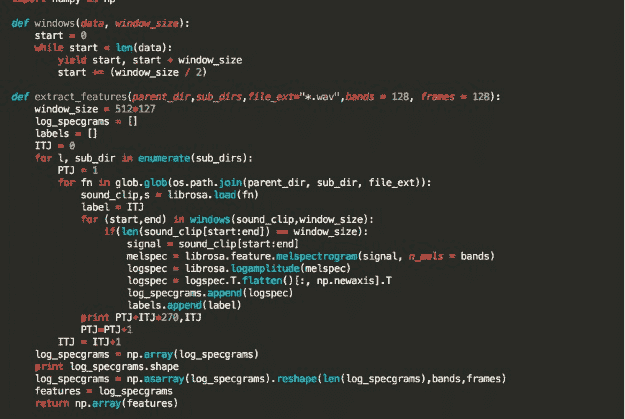
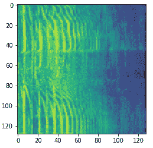
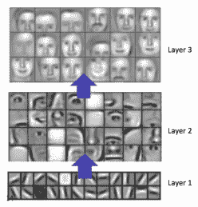
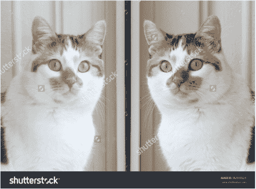

# 使用深度神经网络构建音频分类器

> 原文：[`www.kdnuggets.com/2017/12/audio-classifier-deep-neural-networks.html`](https://www.kdnuggets.com/2017/12/audio-classifier-deep-neural-networks.html)

评论

**作者** [Narayan Srinivasan](https://www.linkedin.com/in/narayansrinivasan97/)。

理解声音是我们大脑执行的基本任务之一。这可以大致分为语音和非语音声音。我们已有了噪声鲁棒的语音识别系统，但仍然没有通用的声学场景分类器，能使计算机像人类一样听取和解释日常声音并据此采取行动，比如在听到喇叭声或听到狗在身后吠叫时移开。

我们的模型复杂度取决于我们的数据，因此，获得标注的数据在机器学习中非常重要。机器学习系统的复杂性来源于数据本身，而不是算法。近年来，我们看到深度学习系统在图像识别和标注领域取得了突破性进展，像 [ResNet](https://arxiv.org/abs/1512.03385)、[GoogleNet](https://www.cv-foundation.org/openaccess/content_cvpr_2015/papers/Szegedy_Going_Deeper_With_2015_CVPR_paper.pdf) 等架构在 ImageNet 竞赛中打破了基准，在 1000 个图像类别中的分类准确率超过了 95%（前 5 名准确率）。这得益于大量的标注数据集和带有 GPU 加速的更快计算机，这使得训练深度模型变得更加容易。

我们面临的构建噪声鲁棒声学分类器的问题是缺乏大规模的数据集，但谷歌最近推出了 [AudioSet](https://research.google.com/audioset/) —— 这是一个来自 YouTube 视频的大量标注音频集合（10 秒片段）。之前，我们有 [ESC-50](https://github.com/karoldvl/ESC-50) 数据集，包含 2000 个录音，每个类别 40 个，涵盖了许多日常声音。

**步骤 1\. 提取特征**

尽管深度学习消除了对手工设计特征的需求，但我们仍然需要为数据选择一个表示模型。我们没有直接使用音频文件作为振幅与时间信号，而是使用具有 128 个组件（频带）的对数尺度 mel 频谱图，覆盖听觉频率范围（0-22050 Hz），使用 23 毫秒（44.1 kHz 下的 1024 个样本）的窗口大小和相同持续时间的跳跃大小。这种转换考虑到人耳以对数尺度听取声音，且人耳蜗对频率相近的声音区分度不高。随着频率的增加，这种效应变得更强。因此，我们仅考虑不同频带的功率。这个示例代码提供了将音频文件转换为频谱图图像的见解。我们使用了 glob 和 librosa 库 - 这段代码是转换为频谱图的标准代码，你可以根据需要进行修改。

在接下来的代码中，

parent_dir = 主目录的名称字符串。

sub_dirs = 要探索的父目录内的目录列表

因此，所有位于 area parent_dir/sub_dirs/*.wav 的 *.wav 文件被提取，遍历所有子目录。

对于感兴趣的人，有一篇关于 mel 尺度和 mfcc 系数的有趣文章。 [Ref](https://practicalcryptography.com/miscellaneous/machine-learning/guide-mel-frequency-cepstral-coefficients-mfccs/)。

现在，音频文件被表示为一个 128（帧）x 128（频带）的频谱图图像。





音频分类问题现在被转化为图像分类问题。我们需要检测图像中是否存在特定实体（‘狗’、‘猫’、‘车’等）。

**步骤 2：选择架构**

我们使用卷积神经网络（CNN）来分类频谱图图像。这是因为 CNN 在检测图像中不同部分的局部特征模式（例如边缘）方面表现更好，并且在捕捉逐层变得越来越复杂的层次特征方面也很擅长，如图中所示。



另一种思考方式是使用递归神经网络（RNN）来捕捉声音数据中的序列信息，通过一次传递一帧，但由于在大多数情况下 CNN 的表现优于独立的 RNN - 我们在这个实验中没有使用 RNN。在许多情况下，RNN 与 CNN 一起使用以提高网络性能，我们将在未来实验这些架构。[[Ref]](https://arxiv.org/abs/1704.07709)

**步骤 3：迁移学习**

由于卷积神经网络（CNN）逐层学习特征，我们可以观察到最初的几层学习到基本特征，如各种边缘，这些边缘在许多不同类型的图像中是共同的。迁移学习是指在一个包含大量相似数据的数据集上训练模型，然后修改网络以便在目标任务上表现良好，而在目标任务中我们没有很多数据。这也叫做 ***微调*** - [这个博客](https://sebastianruder.com/transfer-learning/index.html) 对迁移学习进行了很好的解释。

**步骤 4. 数据增强**

在处理小数据集时，学习数据的复杂表示非常容易过拟合，因为模型只是记忆数据集而无法泛化。击败这一问题的一种方法是将音频文件增强成许多具有轻微变化的文件。

我们在这里使用的技术是时间拉伸和音调移动 - [Rubberband](https://github.com/breakfastquay/rubberband) 是一个易于使用的库，用于此目的。

```py
rubberband -t 1.5 -p 2 input.wav output.wav
```

这条单行终端命令给我们一个新的音频文件，长度比原始文件长 50%，且音调上升了一个八度。

为了可视化这意味着什么，请查看我从互联网获取的这张猫的图片。



如果我们只有右侧的图像，我们可以使用数据增强来制作该图像的镜像，结果仍然是一只猫（额外的训练数据！）。对于计算机来说，这两者是完全不同的像素分布，有助于它学习更通用的概念（如果 A 是狗，那么 A 的镜像也是狗）。

同样地，我们应用时间拉伸（无论是减慢声音还是加快声音），以及

音调移动（使其更尖锐或更柔和）以获得更通用的训练数据（由于训练集较小，这在此情况下也提高了 8-9% 的验证准确性）。

我们观察到每个声音类别的模型性能受到每组增强方式的不同影响，这表明通过应用类别条件数据增强可以进一步提高模型性能。

过拟合是深度学习领域的一个主要问题，我们可以使用数据增强作为应对这一问题的一种方法，其他隐式泛化的方法包括使用 dropout 层和 L1、L2 正则化。[[Ref]](https://www.jmlr.org/papers/volume15/srivastava14a.old/source/srivastava14a.pdf)

因此，在这篇文章中，我们提出了一种深度卷积神经网络架构，它帮助我们对音频进行分类，并且如何有效地使用迁移学习和数据增强来提高模型在小数据集情况下的准确性。

**个人简介：** [Narayan Srinivasan](https://www.linkedin.com/in/narayansrinivasan97/) 对构建自动驾驶车辆感兴趣。他是印度理工学院马德拉斯分校的毕业生。

**相关内容**

+   [**AI 从业者需要应用的 10 种深度学习方法**](https://www.kdnuggets.com/2017/12/10-deep-learning-methods-ai-practitioners-need-apply.html)

+   [**MLDB：机器学习数据库**](https://www.kdnuggets.com/2016/10/mldb-machine-learning-database.html)

+   [**比尔·英蒙谈如何听到客户的声音**](https://www.kdnuggets.com/2017/12/hearing-voice-your-customer.html)

* * *

## 我们的前三大课程推荐

 1\. [谷歌网络安全证书](https://www.kdnuggets.com/google-cybersecurity) - 快速开启网络安全职业生涯。

 2\. [谷歌数据分析专业证书](https://www.kdnuggets.com/google-data-analytics) - 提升你的数据分析技能

 3\. [谷歌 IT 支持专业证书](https://www.kdnuggets.com/google-itsupport) - 支持你所在组织的 IT 工作

* * *

### 相关主题

+   [从理论到实践：构建 k-最近邻分类器](https://www.kdnuggets.com/2023/06/theory-practice-building-knearest-neighbors-classifier.html)

+   [创建一个使用 Python 从音频中提取主题的 Web 应用程序](https://www.kdnuggets.com/2023/01/creating-web-application-extract-topics-audio-python.html)

+   [Bark: 终极音频生成模型](https://www.kdnuggets.com/2023/05/bark-ultimate-audio-generation-model.html)

+   [WavJourney：探索音频故事生成的世界](https://www.kdnuggets.com/wavjourney-a-journey-into-the-world-of-audio-storyline-generation)

+   [神经网络与深度学习：教科书（第 2 版）](https://www.kdnuggets.com/2023/07/aggarwal-neural-networks-deep-learning-textbook-2nd-edition.html)

+   [深度神经网络不会引领我们走向 AGI](https://www.kdnuggets.com/2021/12/deep-neural-networks-not-toward-agi.html)
