# 使用 Python 进行深度学习的音频数据分析（第一部分）

> 原文：[`www.kdnuggets.com/2020/02/audio-data-analysis-deep-learning-python-part-1.html`](https://www.kdnuggets.com/2020/02/audio-data-analysis-deep-learning-python-part-1.html)

评论

### 介绍

尽管大多数文献和关于深度学习的讨论集中在计算机视觉和自然语言处理（NLP）上，但音频分析——包括自动语音识别（ASR）、数字信号处理以及音乐分类、标记和生成——是深度学习应用的一个不断增长的子领域。一些最受欢迎和广泛应用的机器学习系统，如虚拟助手 Alexa、Siri 和 Google Home，大多是建立在能够从音频信号中提取信息的模型之上的产品。

音频数据分析是对数字设备捕获的音频信号进行分析和理解的过程，广泛应用于企业、医疗、生产力和智能城市等领域。应用包括从客户支持电话中分析客户满意度、媒体内容分析和检索、医学诊断辅助和患者监测、听力障碍者的辅助技术，以及公共安全的音频分析。

* * *

## 我们的三大课程推荐

 1\. [谷歌网络安全证书](https://www.kdnuggets.com/google-cybersecurity) - 快速进入网络安全职业的捷径。

 2\. [谷歌数据分析专业证书](https://www.kdnuggets.com/google-data-analytics) - 提升你的数据分析技能

 3\. [谷歌 IT 支持专业证书](https://www.kdnuggets.com/google-itsupport) - 支持你的组织的 IT

* * *

在本系列文章的第一部分，我们将讨论在开始音频数据分析之前你需要了解的所有内容，并从音频文件中提取必要的特征。我们还将建立一个用于音乐流派分类的人工神经网络（ANN）。在第二部分，我们将通过创建卷积神经网络完成相同的任务，并比较它们的准确性。

### 目录

+   音频文件概述

+   音频处理的应用

+   使用 Python 进行音频处理

+   声谱图

+   从音频信号中提取特征

+   使用人工神经网络（ANN）进行流派分类。

### 音频文件概述

音频片段是 .wav 格式的数字音频文件。声音波通过在离散时间间隔（称为采样率，CD 质量音频通常为 44.1kHz，意味着每秒采样 44,100 次）进行采样来数字化。

每个样本是特定时间间隔内波的幅度，位深度决定了样本的详细程度，也称为信号的动态范围（通常为 16bit，这意味着一个样本的幅度值范围从 65,536 到）。

> **什么是采样和采样频率？**
> 
> **在信号处理中，采样是将连续信号减少为一系列离散值。采样频率或速率是指在某一固定时间段内采样的数量。高采样频率会减少信息损失但计算开销较高，而低采样频率则信息损失较大但计算速度快且便宜。**

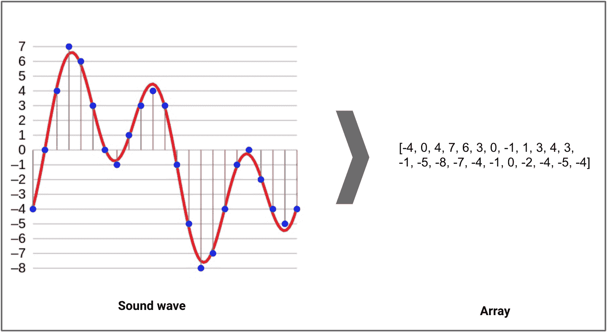

一种声音波形，以红色表示，数字化后以蓝色表示（经过采样和 4 位量化），结果数组显示在右侧。原始 © Aquegg | 维基媒体公用资源

### 音频处理的应用

音频处理的潜在应用有哪些？这里列出了一些：

+   根据音频特征索引音乐收藏。

+   推荐音乐用于广播频道

+   音频文件的相似性搜索（即 Shazam）

+   语音处理和合成 — 为对话代理生成人工声音

### 使用 Python 处理音频数据

声音以**音频**信号的形式表示，具有如频率、带宽、分贝等参数。典型的音频信号可以表示为振幅和时间的函数。

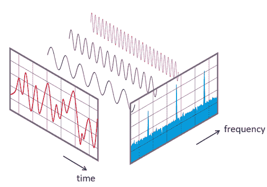

[来源](https://commons.wikimedia.org/wiki/File:FFT-Time-Frequency-View.png)

已经有设备可以帮助你捕捉这些声音，并将其表示为计算机可读的格式。这些格式的示例包括：

+   wav (Waveform Audio File) 格式

+   mp3 (MPEG-1 Audio Layer 3) 格式

+   WMA (Windows Media Audio) 格式

一般的音频处理过程包括提取与当前任务相关的声学特征，然后进行决策方案的处理，包括检测、分类和知识融合。幸运的是，我们有一些有用的 Python 库，使这个任务更容易。

**Python 音频库：**

Python 有一些很棒的音频处理库，如 Librosa 和 PyAudio。还有一些用于基本音频功能的内置模块。

我们将主要使用两个库进行音频采集和播放：

**1. Librosa**

这是一个用于分析音频信号的 Python 模块，主要面向音乐。它包括构建 MIR（音乐信息检索）系统的核心部分，并且有很好的[文档](https://librosa.github.io/librosa/)和许多示例与教程。

**安装：**

```py
pip install librosa
or
conda install -c conda-forge librosa
```

为了提升更多的音频解码能力，你可以安装 *ffmpeg*，它包含了许多音频解码器。

**2. IPython.display.Audio**

`[**IPython.display.Audio**](https://ipython.org/ipython-doc/stable/api/generated/IPython.display.html#IPython.display.Audio)` 让你可以在 jupyter notebook 中直接播放音频。

我在下面的页面上上传了一个随机音频文件。现在让我们在你的 jupyter 控制台中加载这个文件。

**[Vocaroo | 在线录音机](https://voca.ro/iMPozIbzB8T)**

Vocaroo 是一种快速便捷的方式来在互联网分享语音消息。

**加载音频文件：**

```py
import librosa
audio_data = '/../../gruesome.wav'
x , sr = librosa.load(audio_data)
print(type(x), type(sr))#<class 'numpy.ndarray'> <class 'int'>print(x.shape, sr)#(94316,) 22050
```

这将返回一个音频时间序列，作为默认采样率(sr)为 22KHZ 的 numpy 数组。我们可以通过以 44.1KHz 重采样来更改此行为。

```py
librosa.load(audio_data, sr=44100)
```

或禁用重采样。

```py
librosa.load(audio_path, sr=None)
```

采样**率**是每秒传输的音频样本数，以 Hz 或 kHz 为单位。

**播放音频：**

使用`**IPython.display.Audio**`，你可以在你的 jupyter notebook 中播放音频。

```py
import IPython.display as ipd
ipd.Audio(audio_data)
```

这将返回一个音频小部件：


**可视化音频：**

我们可以使用`[**librosa.display.waveplot**](https://librosa.github.io/librosa/generated/librosa.display.waveplot.html#librosa.display.waveplot)`绘制音频数组：

```py
%matplotlib inline
import matplotlib.pyplot as plt
import librosa.display
plt.figure(figsize=(14, 5))
librosa.display.waveplot(x, sr=sr)
```

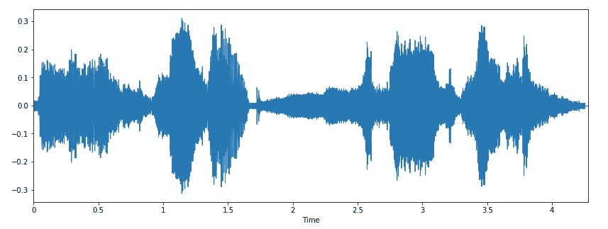

这里，我们有一个波形的幅度包络图。

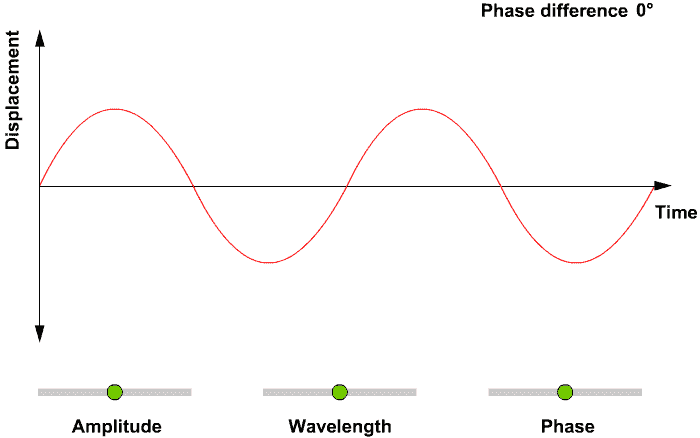

[什么是信号中的幅度、波长和相位？](https://gfycat.com/ickyfilthybobolink)

### 声谱图

声谱图是一种可视化表示信号强度或“**响度**”的方式，显示了在特定波形中各种频率随时间的变化情况。人们不仅可以看到，例如，2 Hz 与 10 Hz 之间的能量多寡，还可以看到能量水平随时间的变化。

声谱图通常被描绘为一个[热图](https://en.wikipedia.org/wiki/Heat_map)，即通过变化的颜色或亮度显示强度的图像。

我们可以使用`[**librosa.display.specshow**](https://librosa.github.io/librosa/generated/librosa.display.specshow.html)**`显示声谱图。

```py
X = librosa.stft(x)
Xdb = librosa.amplitude_to_db(abs(X))
plt.figure(figsize=(14, 5))
librosa.display.specshow(Xdb, sr=sr, x_axis='time', y_axis='hz')
plt.colorbar()
```

`.stft()`将数据转换为短时傅里叶变换。 [STFT](https://www.youtube.com/watch?v=g1_wcbGUcDY)将信号转换，使我们能够知道在给定时间的给定频率的幅度。使用 STFT，我们可以确定音频信号在给定时间播放的各种频率的幅度。`.specshow`用于显示声谱图。

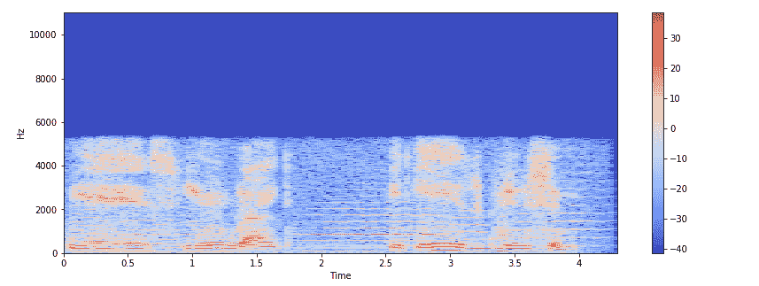

垂直轴显示频率（从 0 到 10kHz），水平轴显示剪辑的时间。由于我们看到所有的动作都发生在频谱的底部，我们可以将频率轴转换为对数轴。

```py
librosa.display.specshow(Xdb, sr=sr, x_axis='time', y_axis='log')
plt.colorbar()
```

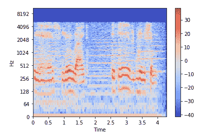

**创建音频信号：**

```py
import numpy as np
sr = 22050 # sample rate
T = 5.0    # seconds
t = np.linspace(0, T, int(T*sr), endpoint=False) # time variable
x = 0.5*np.sin(2*np.pi*220*t)# pure sine wave at 220 Hz
#Playing the audio
ipd.Audio(x, rate=sr) # load a NumPy array
#Saving the audio
librosa.output.write_wav('tone_220.wav', x, sr)
```

### 从音频信号中提取特征

每个音频信号由许多特征组成。然而，我们必须提取与我们试图解决的问题相关的特征。提取特征以用于分析的过程称为特征提取。让我们详细研究一些特征。

**频谱特征**（基于频率的**特征**），通过将时间信号转换到频域获得，例如基本频率、频率成分、**频谱**质心、**频谱**流量、**频谱**密度、**频谱**roll-off 等。

**1\. 频谱质心**

**频谱质心**指示频谱能量的中心频率，换句话说，它表示声音的“质心”位置。这类似于加权平均：

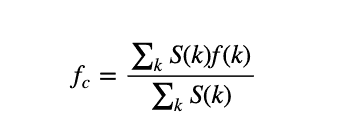

其中 S(k)是频率 bin k 处的频谱幅度，f(k)是 bin k 处的频率。

`[**librosa.feature.spectral_centroid**](https://librosa.github.io/librosa/generated/librosa.feature.spectral_centroid.html#librosa.feature.spectral_centroid)`计算信号中每一帧的频谱质心：

```py
import sklearn
spectral_centroids = librosa.feature.spectral_centroid(x, sr=sr)[0]
spectral_centroids.shape
(775,)
# Computing the time variable for visualization
plt.figure(figsize=(12, 4))frames = range(len(spectral_centroids))
t = librosa.frames_to_time(frames)
# Normalising the spectral centroid for visualisation
def normalize(x, axis=0):
    return sklearn.preprocessing.minmax_scale(x, axis=axis)
#Plotting the Spectral Centroid along the waveform
librosa.display.waveplot(x, sr=sr, alpha=0.4)
plt.plot(t, normalize(spectral_centroids), color='b')
```

`.spectral_centroid`将返回一个数组，其列数等于样本中存在的帧数。

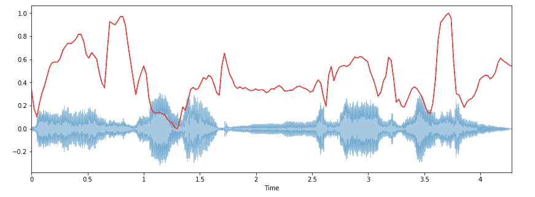

频谱质心在开始时有上升。

**2\. 频谱 roll-off**

这是信号形状的度量。它表示高频率衰减至 0 的频率。为了获得它，我们必须计算在功率谱中 85%功率位于低频的频带的比例。

`[**librosa.feature.spectral_rolloff**](https://librosa.github.io/librosa/generated/librosa.feature.spectral_rolloff.html#librosa.feature.spectral_rolloff)`计算信号中每一帧的 roll-off 频率：

```py
spectral_rolloff = librosa.feature.spectral_rolloff(x+0.01, sr=sr)[0]
plt.figure(figsize=(12, 4))librosa.display.waveplot(x, sr=sr, alpha=0.4)
plt.plot(t, normalize(spectral_rolloff), color='r')
```

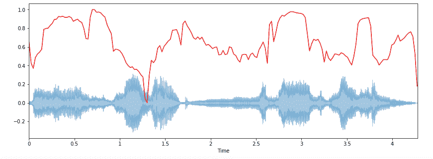

**3\. 频谱带宽**

频谱带宽定义为光带在峰值最大值一半处的宽度（或半峰宽[全宽半最大值 FWHM]），由两条垂直红线和波长轴上的λSB 表示。

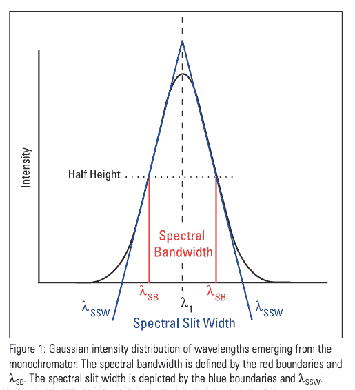

`[**librosa.feature.spectral_bandwidth**](https://librosa.github.io/librosa/generated/librosa.feature.spectral_bandwidth.html#librosa.feature.spectral_bandwidth)`计算顺序-p 频谱带宽：

```py
spectral_bandwidth_2 = librosa.feature.spectral_bandwidth(x+0.01, sr=sr)[0]
spectral_bandwidth_3 = librosa.feature.spectral_bandwidth(x+0.01, sr=sr, p=3)[0]
spectral_bandwidth_4 = librosa.feature.spectral_bandwidth(x+0.01, sr=sr, p=4)[0]
plt.figure(figsize=(15, 9))librosa.display.waveplot(x, sr=sr, alpha=0.4)
plt.plot(t, normalize(spectral_bandwidth_2), color='r')
plt.plot(t, normalize(spectral_bandwidth_3), color='g')
plt.plot(t, normalize(spectral_bandwidth_4), color='y')
plt.legend(('p = 2', 'p = 3', 'p = 4'))
```

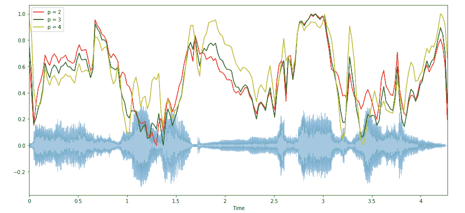

**4\. 过零率**

测量信号平滑性的一种非常简单的方法是计算信号片段内的过零次数。声音信号缓慢振荡——例如，100 Hz 的信号每秒将经过零 100 次——而一个无声擦音每秒可以有 3000 次过零。

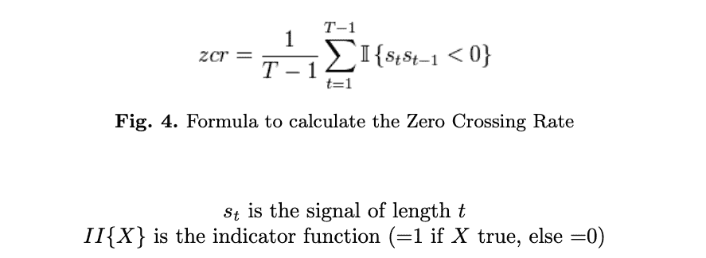

对于金属和摇滚等高打击音，通常值较高。现在让我们可视化一下，看看如何计算过零率。

```py
x, sr = librosa.load('/../../gruesome.wav')
#Plot the signal:
plt.figure(figsize=(14, 5))
librosa.display.waveplot(x, sr=sr)
# Zooming in
n0 = 9000
n1 = 9100
plt.figure(figsize=(14, 5))
plt.plot(x[n0:n1])
plt.grid()
```

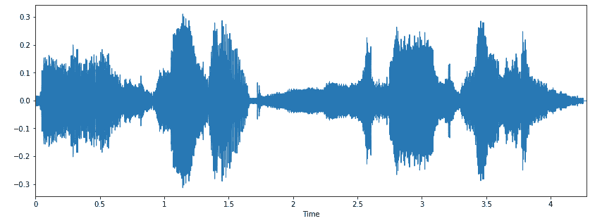

放大

```py
n0 = 9000
n1 = 9100
plt.figure(figsize=(14, 5))
plt.plot(x[n0:n1])
plt.grid()
```

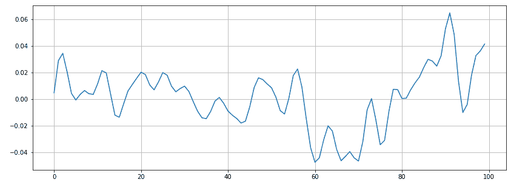

似乎有 16 个过零点。我们来用 Librosa 验证一下。

```py
zero_crossings = librosa.zero_crossings(x[n0:n1], pad=False)
print(sum(zero_crossings))#16
```

**5\. Mel 频率倒谱系数（MFCCs）**

信号的梅尔频率倒谱系数（MFCCs）是一组小特征（通常约 10-20 个），它们简洁地描述了频谱包络的整体形状。它模拟了人类声音的特征。

```py
mfccs = librosa.feature.mfcc(x, sr=fs)
print(mfccs.shape)
(20, 97)
#Displaying  the MFCCs:
plt.figure(figsize=(15, 7))
librosa.display.specshow(mfccs, sr=sr, x_axis='time')
```

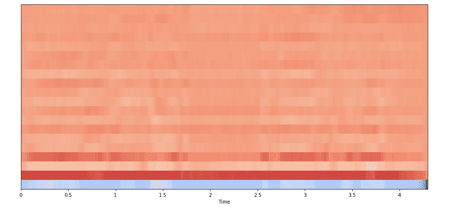

**6. 色度特征**

**色度特征或向量**通常是一个 12 维的特征向量，表示信号中每个音高类别{C, C#, D, D#, E, …, B}的能量含量。简而言之，它提供了一种强有力的方式来描述音乐片段之间的相似度。

`[librosa.feature.chroma_stft](https://librosa.github.io/librosa/generated/librosa.feature.chroma_stft.html#librosa.feature.chroma_stft)`用于计算色度特征。

```py
chromagram = librosa.feature.chroma_stft(x, sr=sr, hop_length=hop_length)
plt.figure(figsize=(15, 5))
librosa.display.specshow(chromagram, x_axis='time', y_axis='chroma', hop_length=hop_length, cmap='coolwarm')
```

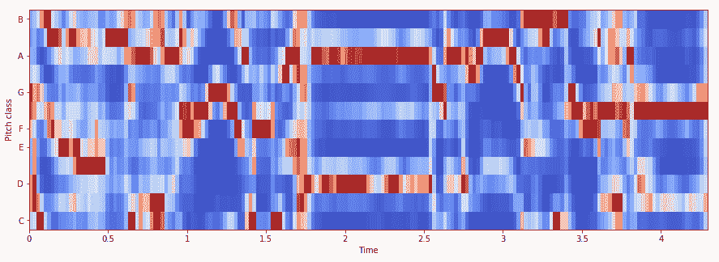

现在我们了解了如何使用 Python 处理音频数据并提取重要特征。在接下来的部分中，我们将使用这些特征构建一个 ANN 模型用于音乐流派分类。

### 使用 ANN 进行音乐流派分类

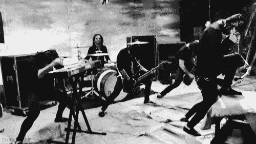

[鸣谢](http://bestanimations.com/Music/Music.html)

该数据集用于 G. Tzanetakis 和 P. Cook 在 IEEE Transactions on Audio and Speech Processing 2002 中发表的著名论文《音频信号的音乐流派分类》。

数据集包含 1000 个每个 30 秒长的音频轨道。它包含 10 种流派，每种流派由 100 个轨道组成。这些轨道都是 22050 Hz 单声道 16 位音频文件，格式为.wav。

数据集可以从[marsyas 网站](http://marsyas.info/downloads/datasets.html)下载。

数据集包含 10 种流派，即

+   蓝调

+   古典

+   乡村

+   迪斯科

+   嘻哈

+   爵士

+   金属

+   流行

+   雷鬼

+   摇滚

每种流派包含 100 首歌曲。总数据集：1000 首歌曲。

在继续之前，我建议使用[Google Colab](https://colab.research.google.com/notebooks/intro.ipynb#recent=true)来处理与神经网络相关的所有任务，因为它是**免费的**，并且提供 GPU 和 TPU 作为运行环境。

**路线图：**

首先，我们需要将音频文件转换为 PNG 格式图像（频谱图）。从这些频谱图中，我们需要提取有意义的特征，即 MFCCs、频谱质心、零交叉率、色度频率、频谱滚降。

一旦特征提取完成，它们可以被附加到 CSV 文件中，以便 ANN 可以用于分类。

如果我们想处理图像数据而不是 CSV，我们将使用 CNN（第二部分的范围）。

那么我们开始吧。

1. 提取并加载数据到 Google Drive，然后在 Colab 中挂载驱动器。

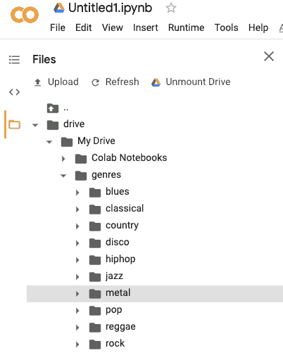

数据加载后的 Google Colab 目录结构。

2. 导入所有所需的库。

```py
**import** **librosa**
**import** **pandas** **as** **pd**
**import** **numpy** **as** **np**
**import** **matplotlib.pyplot** **as** **plt**
%matplotlib inline
**import** **os**
**from** **PIL** **import** **Image**
**import** **pathlib**
**import** **csv****from** **sklearn.model_selection** **import train_test_split
from sklearn.preprocessing import LabelEncoder, StandardScaler****import keras
from keras import layers
from keras import layers
import keras
from keras.models import Sequential****import** **warnings**
warnings.filterwarnings('ignore')
```

3. 现在将音频数据文件转换为 PNG 格式图像，或者基本上为每个音频提取频谱图。

```py
cmap = plt.get_cmap('inferno')
plt.figure(figsize=(8,8))
genres = 'blues classical country disco hiphop jazz metal pop reggae rock'.split()
for g in genres:
    pathlib.Path(f'img_data/{g}').mkdir(parents=True, exist_ok=True)
    for filename in os.listdir(f'./drive/My Drive/genres/{g}'):
        songname = f'./drive/My Drive/genres/{g}/{filename}'
        y, sr = librosa.load(songname, mono=True, duration=5)
        plt.specgram(y, NFFT=2048, Fs=2, Fc=0, noverlap=128, cmap=cmap, sides='default', mode='default', scale='dB');
        plt.axis('off');
        plt.savefig(f'img_data/{g}/{filename[:-3].replace(".", "")}.png')
        plt.clf()
```

一首具有蓝调流派的歌曲的频谱图样本。


一首蓝调风格的歌曲的谱图

现在，由于所有音频文件已转换为其各自的谱图，提取特征变得更容易。

4\. 为我们的 CSV 文件创建一个头部。

```py
header = 'filename chroma_stft rmse spectral_centroid spectral_bandwidth rolloff zero_crossing_rate'
for i in range(1, 21):
    header += f' mfcc{i}'
header += ' label'
header = header.split()
```

5\. 从谱图中提取特征：我们将提取梅尔频率倒谱系数 (MFCC)、谱质心、零交叉率、色度频率和谱滚降。

```py
file = open('dataset.csv', 'w', newline='')
with file:
    writer = csv.writer(file)
    writer.writerow(header)
genres = 'blues classical country disco hiphop jazz metal pop reggae rock'.split()
for g in genres:
    for filename in os.listdir(f'./drive/My Drive/genres/{g}'):
        songname = f'./drive/My Drive/genres/{g}/{filename}'
        y, sr = librosa.load(songname, mono=True, duration=30)
        rmse = librosa.feature.rmse(y=y)
        chroma_stft = librosa.feature.chroma_stft(y=y, sr=sr)
        spec_cent = librosa.feature.spectral_centroid(y=y, sr=sr)
        spec_bw = librosa.feature.spectral_bandwidth(y=y, sr=sr)
        rolloff = librosa.feature.spectral_rolloff(y=y, sr=sr)
        zcr = librosa.feature.zero_crossing_rate(y)
        mfcc = librosa.feature.mfcc(y=y, sr=sr)
        to_append = f'{filename} {np.mean(chroma_stft)} {np.mean(rmse)} {np.mean(spec_cent)} {np.mean(spec_bw)} {np.mean(rolloff)} {np.mean(zcr)}'    
        for e in mfcc:
            to_append += f' {np.mean(e)}'
        to_append += f' {g}'
        file = open('dataset.csv', 'a', newline='')
        with file:
            writer = csv.writer(file)
            writer.writerow(to_append.split())
```

6\. 数据预处理：包括加载 CSV 数据、标签编码、特征缩放和数据拆分为训练集和测试集。

```py
data = pd.read_csv('dataset.csv')
data.head()# Dropping unneccesary columns
data = data.drop(['filename'],axis=1)#Encoding the Labels
genre_list = data.iloc[:, -1]
encoder = LabelEncoder()
y = encoder.fit_transform(genre_list)#Scaling the Feature columns
scaler = StandardScaler()
X = scaler.fit_transform(np.array(data.iloc[:, :-1], dtype = float))#Dividing data into training and Testing set
X_train, X_test, y_train, y_test = train_test_split(X, y, test_size=0.2)
```

7\. 构建一个 ANN 模型。

```py
model = Sequential()
model.add(layers.Dense(256, activation='relu', input_shape=(X_train.shape[1],)))
model.add(layers.Dense(128, activation='relu'))
model.add(layers.Dense(64, activation='relu'))
model.add(layers.Dense(10, activation='softmax'))model.compile(optimizer='adam',
              loss='sparse_categorical_crossentropy',
              metrics=['accuracy'])
```

8\. 拟合模型

```py
classifier = model.fit(X_train,
                    y_train,
                    epochs=100,
                    batch_size=128)
```

经过 100 个周期，准确率：0.67

### 结论

好了，第一部分到此结束。在本文中，我们对音频数据进行了相当好的分析。我们了解了如何提取重要特征，并实现了人工神经网络 (ANN) 来分类音乐类型。

在第二部分，我们将直接在谱图上使用卷积神经网络进行相同的操作。

我希望你们喜欢阅读。请在评论区分享你的想法或疑问。

[**使用 Python 深度学习进行音频数据分析（第二部分）**](https://levelup.gitconnected.com/audio-data-analysis-using-deep-learning-with-python-part-2-4a1f40d3708d)

-   感谢阅读。

**简介： [纳盖什·辛格·乔汉](https://www.linkedin.com/in/nagesh-singh-chauhan-6936bb13b/)** 是 CirrusLabs 的大数据开发人员。他在电信、分析、销售、数据科学等多个领域拥有超过 4 年的工作经验，专注于各种大数据组件。

[原文](https://levelup.gitconnected.com/audio-data-analysis-using-deep-learning-part-1-7f6e08803f60)。经授权转载。

**相关：**

+   音频文件处理：使用 Python 处理 ECG 音频

+   R 中音频文件处理基础

+   2020 年要读的人工智能书籍

### 更多相关话题

+   [每个数据科学家都应该了解的三个 R 库（即使你使用 Python）](https://www.kdnuggets.com/2021/12/three-r-libraries-every-data-scientist-know-even-python.html)

+   [是什么让 Python 成为初创企业的理想编程语言](https://www.kdnuggets.com/2021/12/makes-python-ideal-programming-language-startups.html)

+   [停止学习数据科学以寻找目标，找到目标再……](https://www.kdnuggets.com/2021/12/stop-learning-data-science-find-purpose.html)

+   [学习数据科学统计学的顶级资源](https://www.kdnuggets.com/2021/12/springboard-top-resources-learn-data-science-statistics.html)

+   [成功数据科学家的 5 个特征](https://www.kdnuggets.com/2021/12/5-characteristics-successful-data-scientist.html)

+   [一个 90 亿美元的人工智能失败，进行检讨](https://www.kdnuggets.com/2021/12/9b-ai-failure-examined.html)
