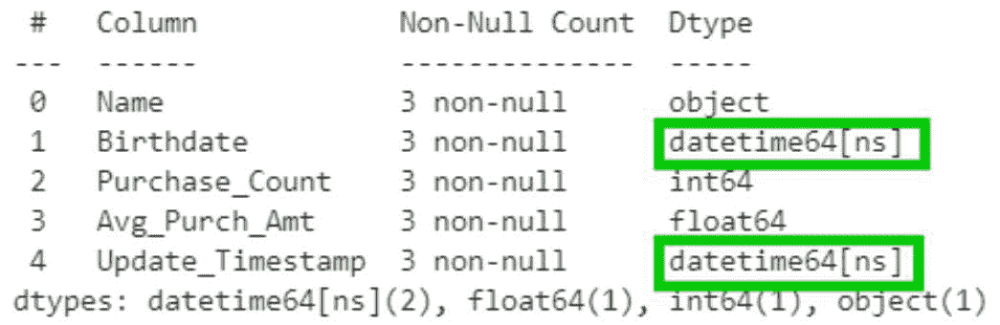
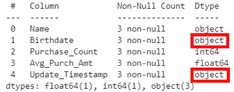
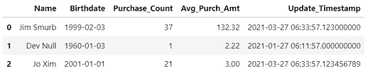

# 如何在读取 CSV 文件时自动检测日期/日期时间列并设置其数据类型

> 原文：[`www.kdnuggets.com/2021/10/auto-detect-date-datetime-columns-and-set-their-datatype-when-reading-a-csv-file-in-pandas.html`](https://www.kdnuggets.com/2021/10/auto-detect-date-datetime-columns-and-set-their-datatype-when-reading-a-csv-file-in-pandas.html)

评论

**由[David B Rosen (博士)](http://linkedin.com/in/rosen1)撰写，IBM 全球融资部门自动化信贷审批首席数据科学家**



假设我有一个 CSV 数据文件，我想将其读取到一个 Pandas 数据框中，其中一些列是日期或日期时间，但我不想提前识别/指定这些列的名称。相反，我希望自动获得`df.info()`输出中显示的数据类型，如*上方*所示，其中适当的列已被*自动*分配为日期时间数据类型（绿色轮廓框）。下面是实现的方法：

```py
from dt_auto import read_csv
df=read_csv('myfile.csv')
```

请注意，我上面**没有**直接调用 pd.read_csv（Pandas 版本的 read_csv）。我的 dt_auto.read_csv 函数（见下面的代码）已经调用了 pd.read_csv()本身，然后自动检测并转换了两个检测到的日期时间列的数据类型。（这个数据框的内容将在下面展示。）

如果我使用了常规的 Pandas pd.read_csv()，我将仅获得默认的通用对象数据类型，如下所示（红色轮廓框）：

```py
from pandas import read_csv
df=read_csv('myfile.csv')
df.info()
```



请注意，与原始代码唯一的区别在于导入语句，我将“from dt_auto”更改为“from pandas”。只要你在整个代码中仅使用“=read_csv()”，而不是将其限定为“=pd.read_csv()”或“=dt_auto.read_csv()”，这就足够了。

这是我的`dt_auto.py`（“日期时间自动化”）的内容：

```py
import pandas as pd
def dt_inplace(df):
    """Automatically detect and convert (in place!) each
    dataframe column of datatype 'object' to a datetime just
    when ALL of its non-NaN values can be successfully parsed
    by pd.to_datetime().  Also returns a ref. to df for
    convenient use in an expression.
    """
    from pandas.errors import ParserError
    for c in df.columns[df.dtypes=='object']: #don't cnvt num
        try:
            df[c]=pd.to_datetime(df[c])
        except (ParserError,ValueError): #Can't cnvrt some
            pass # ...so leave whole column as-is unconverted
    return df
def read_csv(*args, **kwargs):
    """Drop-in replacement for Pandas pd.read_csv. It invokes
    pd.read_csv() (passing its arguments) and then auto-
    matically detects and converts each column whose datatype
    is 'object' to a datetime just when ALL of the column's
    non-NaN values can be successfully parsed by
    pd.to_datetime(), and returns the resulting dataframe.
    """
    return dt_inplace(pd.read_csv(*args, **kwargs))
```

但这不是有风险吗？如果其中一列并不是完全的日期时间列怎么办？当然，你可能会有一些看起来像日期但实际上不是的模糊字符串，但有两个原因说明这段代码不会盲目转换或丢失非日期时间字符串：

1.  这段代码**不会**转换列中的任何值，除非**每个**非 NaN 值都能成功被 pd.to_datetime 解析并转换为日期时间。换句话说，我们不会让它将字符串转换为 pd.NaT（“失败”结果），因为它无法将其理解为日期时间。

1.  它**不会**尝试转换已经被解释为除对象以外的任何类型的列，即任何特定类型如 int64 或 float64，即使 pd.to_datetime 可能会（但很可能不希望）将像 2000 这样的数字转换为日期 2000-01-01。

根据我的经验，`dt_auto.read_csv` 函数在典型的数据框上运行时间不长。即使有很多非日期时间对象（字符串）列，它几乎总是很快在每个这样的列的顶部遇到一个不能被解析为日期时间的值，然后放弃并转到下一列，而不尝试解析列中其余的值。

这是 `dt_auto.read_csv()` 生成的数据框的样子，尽管你可能不能仅通过查看它来判断两个适当的列确实是日期时间数据类型。实际情况是，CSV 文件在 `Update_Timestamp` 的秒数中有不同数量的小数位（有三位、没有和九位），但日期时间数据类型本身无论如何都显示九位这样的数字。CSV 文件中的出生日期实际上只有日期（没有时间），但被存储为完整的日期时间，小时、分钟和秒都为零（包括小数部分为零），但列中的所有时间组件都是零，导致 Pandas 仅显示日期（年-月-日）。



当然，`pd.to_datetime`，因此 `dt_auto.read_csv` 默认情况下不能处理所有可能的日期和日期时间格式，但它可以处理许多常见的无歧义（通常是年 月 日）格式，例如由 `dataframe.to_csv` 方法和许多其他工具（包括许多 ISO 日期时间格式）写入的格式（这些格式通常用“ T ”将日期和时间分开，而不是用空格）。我还没有尝试包含时区信息的日期时间，因为我通常不会看到这样的数据，但请在回复评论中告知这些是否可以通过进一步修改代码来更好地处理。

你怎么看？你觉得这篇小文章有用吗？Pandas 本身是否应该添加（例如到 `pd.read_csv` 函数中？）这个功能，以便你无需复制/导入我上面提到的 `dt_auto.py` 代码？我很乐意看到你在这里的评论和问题。

感谢 Elliot Gunn。

**简介: [David B Rosen (PhD)](http://linkedin.com/in/rosen1)** 是 IBM Global Financing 自动化信用审批的首席数据科学家。可以在 [dabruro.medium.com](https://dabruro.medium.com/) 找到更多 David 的著作。

[原文](https://towardsdatascience.com/auto-detect-and-set-the-date-datetime-datatypes-when-reading-csv-into-pandas-261746095361)。经许可转载。

**相关内容:**

+   5 个 Python 数据处理技巧和代码片段

+   CSV 文件用于存储？不，谢谢。还有更好的选择

+   如何查询你的 Pandas 数据框

* * *

## 我们的前 3 个课程推荐

 1\. [Google 网络安全证书](https://www.kdnuggets.com/google-cybersecurity) - 快速进入网络安全职业道路。

 2\. [谷歌数据分析专业证书](https://www.kdnuggets.com/google-data-analytics) - 提升你的数据分析技能

 3\. [谷歌 IT 支持专业证书](https://www.kdnuggets.com/google-itsupport) - 支持你所在组织的 IT

* * *

### 了解更多相关内容

+   [如何使用 [ ]、.loc、iloc、.at 等选择 Pandas 中的行和列](https://www.kdnuggets.com/2019/06/select-rows-columns-pandas.html)

+   [4 种重命名 Pandas 列的方法](https://www.kdnuggets.com/2022/11/4-ways-rename-pandas-columns.html)

+   [逐步指南：阅读和理解 SQL 查询](https://www.kdnuggets.com/a-step-by-step-guide-to-reading-and-understanding-sql-queries)

+   [使用 Python 的 Watchdog 监控你的文件系统](https://www.kdnuggets.com/monitor-your-file-system-with-pythons-watchdog)

+   [在 Python 中并行处理大型文件](https://www.kdnuggets.com/2022/07/parallel-processing-large-file-python.html)

+   [KDnuggets 新闻，7 月 20 日：机器学习算法解释……](https://www.kdnuggets.com/2022/n29.html)
