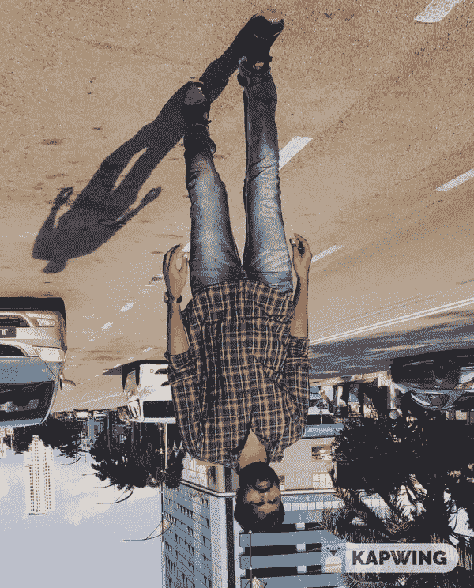
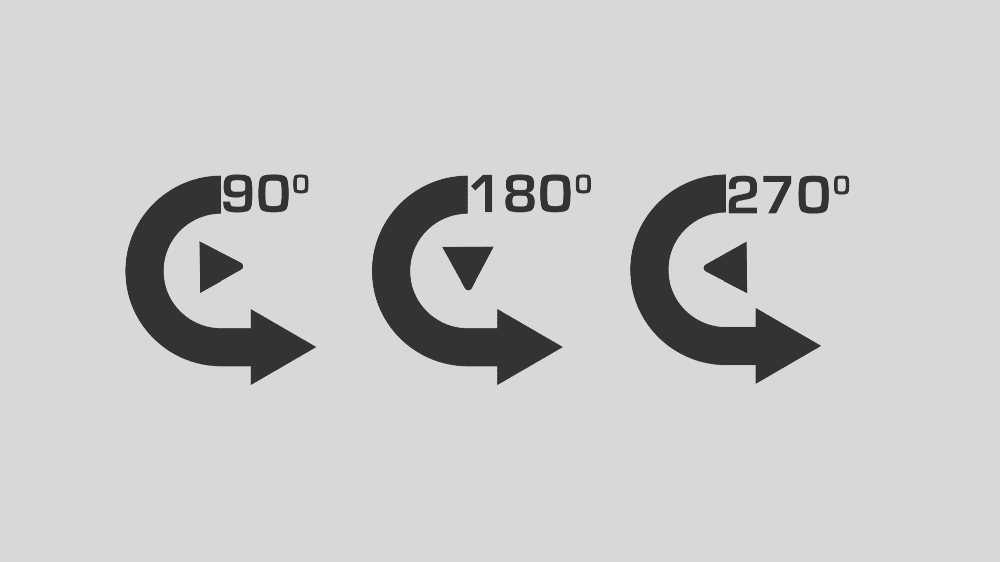
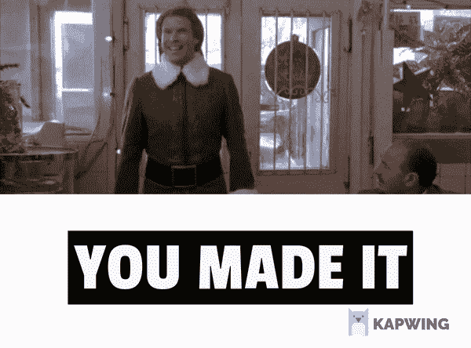

# 使用深度学习自动旋转图像

> 原文：[`www.kdnuggets.com/2020/07/auto-rotate-images-deep-learning.html`](https://www.kdnuggets.com/2020/07/auto-rotate-images-deep-learning.html)

评论

**由 [Bala Venkatesh](https://www.linkedin.com/in/bala-venkatesh-67964247/) 提供，数据科学家**



演示

* * *

## 我们的前三大课程推荐

 1\. [Google 网络安全证书](https://www.kdnuggets.com/google-cybersecurity) - 快速进入网络安全职业的快车道。

 2\. [Google 数据分析专业证书](https://www.kdnuggets.com/google-data-analytics) - 提升你的数据分析技能

 3\. [Google IT 支持专业证书](https://www.kdnuggets.com/google-itsupport) - 支持您的 IT 组织

* * *

让我们看看如何在没有手动旋转的情况下自动旋转图像。如今，计算机视觉在全球范围内已经取得了很大进展。我只是尝试并实现了一种使用计算机视觉自动旋转图像的小技术。

**自动旋转图像的步骤：**

1.  读取输入图像。

1.  使用 Caffe 模型检测人脸。

1.  如果未检测到人脸，则旋转图像。

1.  再次检测旋转后的图像中的人脸。

1.  使用三个角度旋转图像直到检测到人脸。

在实施该技术之前，我们将了解所需的依赖库和模型。

1.  **OpenCV**

1.  **Numpy**

1.  **Caffe 模型（深度学习）**

***第 1 步：*** 导入上述所有所需的库。

```py
import cv2
import numpy as np
```

***第 2 步：*** 下载 [Caffe 模型及文件和 prototxt 文件](https://github.com/balavenkatesh3322/Face_Recognition/tree/master/model)。让我们看看为什么需要这两个文件以及它们的作用。

**Caffe 模型文件是什么？**

**Caffe** 是一个由伯克利视觉与学习中心（BVLC）开发的深度学习框架。它用 C++ 编写，并具有 Python 和 Matlab 绑定。通过使用我们的数据集训练模型，我们将获得一个具有扩展名的训练 **模型** 文件。

**deploy.prototxt 文件是什么？**

**prototxt** 是一个文本 **文件**，其中包含有关神经网络结构的信息：神经网络中的层列表。每层的参数，如名称、类型、输入维度和输出维度。层之间的连接。该 prototxt 文件仅用于部署模型，不能用于训练模型。

***第 3 步：*** 这是使用 OpenCV 读取图像文件的主要方法。然后将图像传递到 detect_face 方法（*第 4 步*），它会给出 True（已检测到）或 False（未检测到）。如果返回 FALSE，则表示图像角度不正确，因此我们需要按以下角度逐步旋转图像。

**旋转角度 -> 90 -> 180 -> 270**



旋转角度

```py
def main(): 
 frame = cv2.imread(‘6.jpg’)
 original_status = detect_face(frame)
 (h, w) = frame.shape[:2]
 # calculate the center of the image
 center = (w / 2, h / 2)
 scale = 1.0
 angle_90 = 90
 angle_180 = 180
 angle_270 = 270
 if original_status is None:
 status_90 = rotate_image(frame,center,scale,angle_90)
   if status_90 is None:
    status_180 = rotate_image(frame,center,scale,angle_180)
      if status_180 is None:
         status_270 = rotate_image(frame,center,scale, angle_270)
```

***步骤 4:*** 这是使用 Caffe 模型检测人脸的 detect_face 方法。我们可以使用 OpenCV [dnn 模块](https://docs.opencv.org/master/d2/d58/tutorial_table_of_content_dnn.html) 通过 **readNetFromCaffe** 方法读取 Caffe 模型。然后将我们的图像转换为 blob 以传递给神经网络，基于输出权重，它将返回概率值。我使用了 0.7 作为最小准确度值。如果值超过这个阈值，我们可以检测到人脸图像。Caffe 模型是通过正确角度的人脸图像进行训练的，因此只有当人脸图像角度正确时，才能检测到。

```py
def detect_face(frame):net = cv2.dnn.readNetFromCaffe(‘deploy.prototxt’,        ‘res10_300x300_ssd_iter_140000.caffemodel’)

    (h, w) = frame.shape[:2]blob = cv2.dnn.blobFromImage(cv2.resize(frame,(300,300)), 1.0,   (300,300), (104.0,177.0,123.0))net.setInput(blob)faces = net.forward()for i in range(0, faces.shape[2]):
     confidence = faces[0,0,i,2]

    if confidence < 0.7:
      continuebox = faces[0,0,i,3:7] * np.array([w,h,w,h])
  (startX, startY, endX, endY) = box.astype(‘int’)text = “face “ + “{:.2f}%”.format(confidence * 100)cv2.imwrite(‘test.jpg’,frame)
    return True
```

***步骤 5:*** 让我们看看如何使用 OpenCV 旋转图像。

```py
def rotate_image(frame,center,scale,angle):
 (h, w) = frame.shape[:2]
 M = cv2.getRotationMatrix2D(center, angle, scale)
 frame = cv2.warpAffine(frame, M, (h, w))
 return detect_face(frame)
```

### 结论

就这样。你做到了！！终于，你可以看到正确角度的图像了。



> 祝大家学习愉快！！如果你需要任何帮助或支持，请通过 [LinkedIn](https://www.linkedin.com/in/bala-venkatesh-67964247/) 和 [Twitter](https://twitter.com/balavenkatesh22) 联系我。

**个人简介：[Bala Venkatesh](https://www.linkedin.com/in/bala-venkatesh-67964247/)** 是一名数据科学家。他对从根本上理解技术并分享想法和代码充满热情。

[原文](https://medium.com/analytics-vidhya/how-to-auto-rotate-the-image-using-deep-learning-c34b2e0e157d)。经许可转载。

**相关：**

+   使用 Tensorflow.js 实现计算机视觉应用的 6 个简单步骤

+   构建一个使用 TensorFlow 和 Streamlit 生成逼真面孔的应用

+   构建完美商店的图像识别

### 更多相关主题

+   [使用 Datawig，这是一个用于缺失值插补的 AWS 深度学习库](https://www.kdnuggets.com/2021/12/datawig-aws-deep-learning-library-missing-value-imputation.html)

+   [使用管道编写干净的 Python 代码](https://www.kdnuggets.com/2021/12/write-clean-python-code-pipes.html)

+   [学习数据科学、机器学习和深度学习的坚实计划](https://www.kdnuggets.com/2023/01/mwiti-solid-plan-learning-data-science-machine-learning-deep-learning.html)

+   [人工智能、分析、机器学习、数据科学、深度学习…](https://www.kdnuggets.com/2021/12/developments-predictions-ai-machine-learning-data-science-research.html)

+   [15 本免费机器学习和深度学习书籍](https://www.kdnuggets.com/2022/10/15-free-machine-learning-deep-learning-books.html)

+   [KDnuggets 新闻，11 月 2 日：数据科学的当前状态…](https://www.kdnuggets.com/2022/n43.html)
