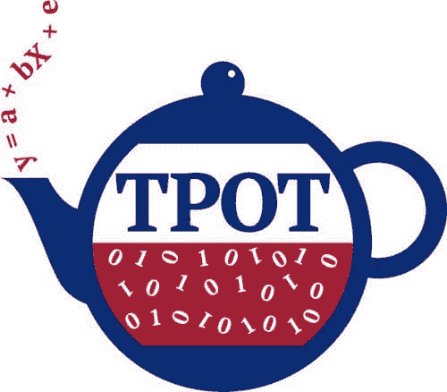
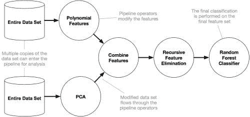

# 自动化机器学习：对 TPOT 首席开发者 Randy Olson 的采访

> 原文：[`www.kdnuggets.com/2016/11/autoamted-machine-learning-interview-randy-olson-tpot.html`](https://www.kdnuggets.com/2016/11/autoamted-machine-learning-interview-randy-olson-tpot.html)

自动化机器学习在过去几个月中成为了一个相当受关注的话题。一个最近的 KDnuggets 博客比赛聚焦于这个主题，并生成了一些有趣的想法和项目。值得注意的是，通过比赛，我们的读者被介绍到 Auto-sklearn，这是一个自动化机器学习管道生成器，并在与其开发者的后续采访中了解了更多关于该项目的信息。

然而，在那场比赛之前，KDnuggets 的读者已被介绍到 TPOT，“你的数据科学助手”，这是一个智能自动化整个机器学习过程的开源 Python 工具。

对于与 scikit-learn 兼容的数据集，[TPOT](https://github.com/rhiever/tpot)可以自动优化一系列特征预处理器和机器学习模型，以最大化数据集的交叉验证准确率，并输出作为 Python 代码的最佳模型，利用 scikit-learn。该机器学习管道生成和优化项目由著名且高产的机器学习和数据科学专家[ Randy Olson](http://www.randalolson.com/about/) 领导。

Randy 是[宾夕法尼亚大学生物医学信息学研究所](http://upibi.org/)的高级数据科学家，他与[Jason H. Moore 教授](http://www.epistasis.org/)合作（由 NIH 授予的 R01 AI117694 资助）。Randy 活跃于[Twitter](https://twitter.com/randal_olson)，他的一些其他项目可以在他的[GitHub](https://github.com/rhiever)上找到。值得注意的是，Randy 制作了一个非常出色的 Jupyter notebook 数据分析和机器学习项目合集，[data analysis and machine learning projects](https://github.com/rhiever/Data-Analysis-and-Machine-Learning-Projects)，还有一个直观的项目叫做[datacleaner](https://github.com/rhiever/datacleaner)，可能会引起一些人的兴趣。

Randy 同意抽出时间与我们的读者讨论 TPOT 和自动化机器学习。

**Matthew Mayo：首先，感谢你抽出时间与我们交谈，Randy。你之前已向我们的读者介绍了你的自动化机器学习库 TPOT，但我们可以先让你介绍一下自己，并提供一些关于你背景的信息吗？**

**兰迪·奥尔森**：当然！简而言之，我是宾夕法尼亚大学生物医学信息学研究所的高级数据科学家，我在这里为生物医学应用开发机器学习软件。作为爱好，我经营一个个人博客（[randalolson.com/blog](http://randalolson.com/blog)），在这个博客中我将数据科学应用于日常问题，向人们展示数据科学如何与几乎任何主题相关。我还是一个积极的开放科学倡导者，所以你可以在 GitHub 上找到我的所有工作（[github.com/rhiever](https://github.com/rhiever)），如果你想学习和了解我的项目是如何运作的。

**TPOT 是一个合作项目，对吗？那你的合作伙伴呢？能否给我们一些关于他们的信息，或者指引我们找到更多信息？**

没错！尽管 TPOT 现在几乎是我的“软件宝宝”，但有很多人贡献了他们的时间和代码给 TPOT。举几个例子：

[Daniel Angell](https://github.com/teaearlgraycold) 是德雷克塞尔大学的软件工程学生，他在 2016 年夏季对 TPOT 重构提供了大量帮助。每当 TPOT 直接导出到 scikit-learn 管道时，你可以感谢 Daniel。

[Nathan Bartley](https://github.com/bartleyn) 是芝加哥大学的计算机科学硕士生，他在早期 TPOT 设计阶段参与了大量工作。Nathan 和我共同撰写了一篇关于 TPOT 的研究论文，该论文在[GECCO 2016](http://gecco-2016.sigevo.org/index.html/HomePage)上获得了最佳论文奖。

[Weixuan Fu](https://github.com/weixuanfu2016) 是生物医学信息学研究所的新程序员。尽管他对 TPOT 项目还很陌生，但他已经做出了几项重要贡献，包括为 TPOT 管道评估设置时间限制。事实证明，当你需要支持 Mac、Linux 和 Windows 时，为函数调用设置时间限制可能非常困难，但 Weixuan 解决了这个问题。

**你的 TPOT 帖子信息丰富，并很好地描述了这个项目。然而，已经过去了几个月，我知道你一直在推广和分享这个项目，它现在在 Github 上已经有超过 1500 颗星，并被分叉了近 200 次。你是否还有什么额外的内容希望我们的读者了解 TPOT，或者自你原始帖子以来发生了哪些新的进展？你是否想分享关于未来开发计划的任何信息？**

自从我们在 KDnuggets 上分享关于 TPOT 的原始帖子以来，TPOT 已经取得了很大的进展。大多数变化都是在“幕后”微调优化过程，但也有一些主要变化：

+   TPOT 支持回归问题，使用[TPOTRegressor](https://github.com/rhiever/tpot#regression)类。

+   TPOT 现在可以直接与 scikit-learn 管道对象配合使用，这意味着它也可以导出到 scikit-learn 管道中。这使得 TPOT 导出的代码*干净*了很多。

+   TPOT 探索了更多的 scikit-learn 模型和数据预处理器。我们在每次发布中都在对模型、预处理器和参数进行微调。

+   TPOT 允许你为 TPOT 优化过程设置时间限制，包括每个管道级别（这样 TPOT 就不会花费数小时来评估单个管道）和 TPOT 优化过程级别（这样你*知道* TPOT 优化过程何时结束）。

在不久的将来，我们主要将重点放在加速 TPOT，特别是在大型数据集上的运行。目前，TPOT 在大型（50,000+ 记录）数据集上可能需要数小时甚至数天才能完成，这可能使某些用户难以使用。我们有一整套加速 TPOT 的技巧——包括在多核计算系统上并行化 TPOT——所以只需时间就能将这些功能推出。

**显然，TPOT 可以应用于各种领域和众多任务，可能与我们想象的机器学习可以应用的范围一样广。我想，考虑到它的发展历史，你肯定在日常工作中使用它。你能给我们举一个它如何让你的工作变得更轻松的例子吗？**

尽管我的一半工作是机器学习软件开发，但另一半工作涉及与宾夕法尼亚大学的医生合作，并从他们收集的生物医学数据集中提取见解。每次我接触到一个新的数据集——在完成初步数据清理和探索性数据分析之后——我都会在我们的计算集群上运行至少十几个 TPOT 实例，看看 TPOT 是否能发现一个有用的数据模型。在 TPOT 运行时，我仍然会自己手动探索一些更简单的模型，但当我需要深入研究更复杂的模型时，TPOT 节省了我大量的时间，这样我几乎不再需要手动运行这些复杂的模型了。

我有一个很好的例子，就是我们将 TPOT 应用于我老板，杰森·H·穆尔教授，曾经参与的一个 [膀胱癌研究](https://www.ncbi.nlm.nih.gov/pubmed/16311243)。我们希望看看是否能复制研究中的发现，因此我们使用了一个定制版本的 TPOT 来为我们找到最佳模型。在对模型进行几小时的调整后，TPOT 复制了原始研究中的发现，并找到了与其合作者花费数周时间才找出的相同管道。作为额外的好处，TPOT 发现了一个更复杂的管道，通过发现两个变量之间的新交互，实际上*改进*了其合作者所发现的结果。如果当时他们有 TPOT 那该多好啊，嗯？

**你认为自动化机器学习将会发展到哪里？最终目标是完全自动化的系统，有限的人为干预，从而导致数据科学家和机器学习专家的衰退吗？还是更可能的是，自动化将成为协助机器学习科学家的另一种工具？**

在不久的将来，我预计自动化机器学习（AutoML）将接管机器学习模型构建过程：一旦数据集处于（相对）干净的格式，AutoML 系统将能够比 99%的人类更快地设计和优化机器学习管道。也许 AutoML 系统将能够扩展到涵盖数据清理过程的更大部分，但许多任务——例如将问题表述为机器学习问题——将仍然完全由人类完成。然而，技术专家在预测技术未来方面臭名昭著的[无能](http://www.forbes.com/sites/robertszczerba/2015/01/05/15-worst-tech-predictions-of-all-time/#23703b1625c1)，所以也许我应该拒绝评论 AutoML 的长期发展方向。

不过，我可以自信地评论的一个长期趋势是，AutoML 系统*将*成为机器学习领域的主流，并且未来的 AutoML 系统很可能会变得具有互动性。用户和 AutoML 系统将不再独立工作，而是协同工作：当用户手动尝试不同的管道时，AutoML 系统将实时从用户的经验中学习，并调整其优化过程。AutoML 系统将不断推荐迄今为止发现的最佳管道，并允许用户对这些管道提供反馈——这些反馈随后将被纳入到 AutoML 的优化过程中，依此类推。实质上，AutoML 系统将类似于“数据科学助手”，能够将高性能计算系统的巨大计算能力与人类设计师的解决问题能力结合起来。

**作为对之前问题的跟进，你认为数据科学家和其他使用机器学习的人会很快失业吗？或者，如果这个想法过于激进，当前围绕数据科学的炒作是否会被自动化所削弱？如果是的话，到什么程度？**

我认为 AutoML 的目的并不是取代数据科学家，就像智能代码自动完成工具并不是为了取代计算机程序员一样。对我来说，AutoML 的目的是将数据科学家从重复和耗时的任务（例如机器学习管道设计和超参数优化）中解放出来，让他们可以将更多时间用于更难以自动化的任务。例如，将异质 HTML 文件解析成干净的数据集或将“人类问题”转化为“机器学习问题”对于经验丰富的数据科学家来说是相对简单的任务，但目前 AutoML 系统尚无法实现。我的座右铭是：“自动化无聊的工作，让我们专注于有趣的工作。”

**关于 TPOT 或自动化机器学习的最后一点想说的吗？**

AutoML 是一个非常新的领域，我们只是刚刚开始挖掘其潜力。在我们在这个领域继续深入之前，我认为有必要退一步问一下：我们（用户）希望从 AutoML 系统中获得什么？亲爱的读者，你对 AutoML 系统有什么期望？

**我代表我们的读者感谢你， Randy。**

**相关：**

+   TPOT：用于自动化数据科学的 Python 工具

+   比赛获胜者：使用 Auto-sklearn 赢得 AutoML 挑战

+   自动化数据科学与机器学习：与 Auto-sklearn 团队的访谈

* * *

## 我们的前三大课程推荐

 1\. [Google 网络安全证书](https://www.kdnuggets.com/google-cybersecurity) - 快速进入网络安全职业生涯。

 2\. [Google 数据分析专业证书](https://www.kdnuggets.com/google-data-analytics) - 提升你的数据分析技能

 3\. [Google IT 支持专业证书](https://www.kdnuggets.com/google-itsupport) - 为你的组织提供 IT 支持

* * *

### 更多相关主题

+   [使用 TPOT 优化机器学习管道](https://www.kdnuggets.com/2021/05/machine-learning-pipeline-optimization-tpot.html)

+   [使用 Streamlit 进行 DIY 自动化机器学习](https://www.kdnuggets.com/2021/11/diy-automated-machine-learning-app.html)

+   [使用 Python 进行自动化机器学习：案例研究](https://www.kdnuggets.com/2023/04/automated-machine-learning-python-case-study.html)

+   [使用 Python 进行自动化机器学习：不同方法的比较…](https://www.kdnuggets.com/2023/03/automated-machine-learning-python-comparison-different-approaches.html)

+   [深度神经网络不会引导我们走向通用人工智能](https://www.kdnuggets.com/2021/12/deep-neural-networks-not-toward-agi.html)

+   [开始使用自动化文本摘要](https://www.kdnuggets.com/2019/11/getting-started-automated-text-summarization.html)
