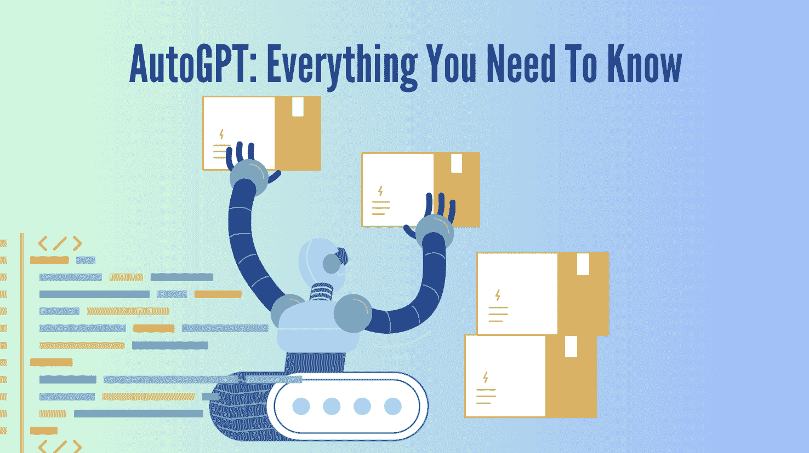

# AutoGPT：你需要知道的一切

> 原文：[`www.kdnuggets.com/2023/04/autogpt-everything-need-know.html`](https://www.kdnuggets.com/2023/04/autogpt-everything-need-know.html)



作者图片

在过去几周，我们接收到大量关于 ChatGPT、GPT-4 等的重大新闻。你们中的一些人可能看到过 AutoGPT 的相关信息，但很自然地，我不怪你们；你们可能认为它只是另一个 GPT 插件或 Chrome 扩展。但 AutoGPT 不止于此。

* * *

## 我们的三大课程推荐

 1\. [Google Cybersecurity Certificate](https://www.kdnuggets.com/google-cybersecurity) - 快速进入网络安全职业生涯。

 2\. [Google Data Analytics Professional Certificate](https://www.kdnuggets.com/google-data-analytics) - 提升您的数据分析技能

 3\. [Google IT Support Professional Certificate](https://www.kdnuggets.com/google-itsupport) - 支持您组织的 IT

* * *

# 什么是 AutoGPT？

[AutoGPT](https://github.com/Torantulino/Auto-GPT) 通过 API 结合了 GPT-3.5 和 GPT-4，允许创建不断迭代自己提示并审查每次迭代以改进和构建的项目。这是如何实现的呢？

AutoGPT 需要：

+   AI 名称

+   AI 角色

+   最多 5 个目标

例如：

+   **名称**：Chef-GPT

+   **角色**：一个旨在从网上找到普通食谱，并将其转变为米其林星级食谱的 AI。

+   **目标 1**：在网上找到一个简单的食谱

+   **目标 2**：将这个简单的食谱转变为米其林星级版本。

一旦 AutoGPT 达到描述和目标，它将开始自主进行，直到项目达到令人满意的水平。

那么，AutoGPT 的好处是什么呢？首先，重要的是要注意 GPT 具备使用 GPT-4 编写自身代码的能力。它还可以执行 Python 脚本，使其能够递归地调试、开发、构建并持续自我改进。很疯狂，对吧？AutoGPT 是一个自我改进的 AI - 展示了真正的 AGI（人工通用智能）能力。

AutoGPT 的反馈循环如下：

1.  计划

1.  批评

1.  行动

1.  阅读反馈

1.  计划

AutoGPT 将读取和编写不同的文件，并浏览网络，同时回顾和检查自身的提示 - 以确保项目符合用户的需求。你给它一个目标，它会在网络上抓取最佳信息，然后自主完成任务，并不断自我改进。

AutoGPT 会在每个提示后询问你的许可，以确保项目朝着正确的方向发展。

这是一个 [示例](https://twitter.com/VarunMayya/status/1643902198164717569?cxt=HHwWgoC88dyVqNAtAAAA)，展示了 AutoGPT 为计算机科学工程师 Varun Mayya 创建应用的过程。AutoGPT 发现 Varun 没有 Node，于是搜索如何安装 Node，找到了一个 Stackoverflow 文章并下载、解压，然后为 Varun 启动了服务器。

# 我该如何使用 AutoGPT？

使用 AutoPGT 时，将从你的 OpenAI 账户中扣除积分。然而，你可以使用最多 18 美元，这在免费版本中已包含。

正如我之前提到的，AutoGPT 在每次提示后都需要你的许可，这意味着你需要进行大量测试。这让你可以在花费任何费用之前测试并调整你的 AI 项目。

## 安装和要求

要使用 AutoGPT，你需要：

+   [Python 3.8 或更高版本](https://www.tutorialspoint.com/how-to-install-python-in-windows)

+   [OpenAI API 密钥](https://platform.openai.com/account/api-keys)

+   [GPT-4 API 访问](https://openai.com/waitlist/gpt-4-api)

+   [PINECONE API 密钥](https://www.python.org/downloads/)

+   [ElevenLabs API](https://beta.elevenlabs.io/) 用于文本转语音项目

在你的 CMD、Bash 或 Powershell 窗口中，克隆仓库：

```py
git clone https://github.com/Torantulino/Auto-GPT.git
```

进入项目目录：

```py
cd 'Auto-GPT'
```

安装所需的依赖项：

```py
pip install -r requirements.txt
```

接着，你需要导航到文件夹，并将 `.env.template` 重命名为 `.env`。完成后，打开 `.env`。然后你需要用你的 `OPENAI_API_KEY` 替换掉其中的密钥。

如果你将其用于语音目的，你也需要填写你的 `ELEVEN_LABS_API_KEY`。

如何获取你的密钥：

+   从 [`platform.openai.com/account/api-keys`](https://platform.openai.com/account/api-keys) 获取 OpenAI API 密钥。

+   从 [`elevenlabs.io`](https://elevenlabs.io/) 获取 ElevenLabs API 密钥。

一旦完成并成功，你需要在 CMD、Bash 或 Powershell 窗口中运行：

```py
python scripts/main.py
```

你已经准备好开始使用 AutoGPT 了！

如果遇到任何问题，请参考 [GitHub](https://github.com/Torantulino/Auto-GPT)。

## AutoGPT 演示

你可以从 [Auto-GPT GitHub 仓库](https://github.com/Torantulino/Auto-GPT) 下载演示视频。

# 总结

我在 Twitter、LinkedIn、YouTube 等平台上浏览了关于 AutoGPT 的新闻。似乎每个人对 AutoGPT 的实际能力有不同的看法和体验。如果你有机会使用 AutoGPT，请在评论中告诉我们你到目前为止能创造出什么。

如果你想跟上 AutoGPT 的未来，我建议你关注其背后的团队在 Twitter 上的账号：[SigGravitas](https://twitter.com/SigGravitas)

你认为 AI 世界中接下来会发生什么？

**[Nisha Arya](https://www.linkedin.com/in/nisha-arya-ahmed/)** 是一名数据科学家、自由技术作家以及 KDnuggets 的社区经理。她特别关注提供数据科学职业建议、教程和理论知识。她还希望探索人工智能如何/能如何促进人类寿命的延续。作为一个热衷学习的人，她寻求拓宽自己的技术知识和写作技能，同时帮助指导他人。

### 更多相关主题

+   [KDnuggets 新闻，4 月 13 日：数据科学家应该了解的 Python 库…](https://www.kdnuggets.com/2022/n15.html)

+   [朴素贝叶斯算法：你需要知道的一切](https://www.kdnuggets.com/2020/06/naive-bayes-algorithm-everything.html)

+   [关于张量的所有你需要知道的事](https://www.kdnuggets.com/2022/05/everything-need-know-tensors.html)

+   [关于数据湖屋的所有你需要知道的事](https://www.kdnuggets.com/2022/09/everything-need-know-data-lakehouses.html)

+   [关于 MLOps 的一切：KDnuggets 技术简报](https://www.kdnuggets.com/tech-brief-everything-you-need-to-know-about-mlops)

+   [ChatGPT：你需要知道的一切](https://www.kdnuggets.com/2023/01/chatgpt-everything-need-know.html)
