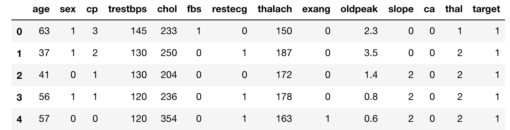
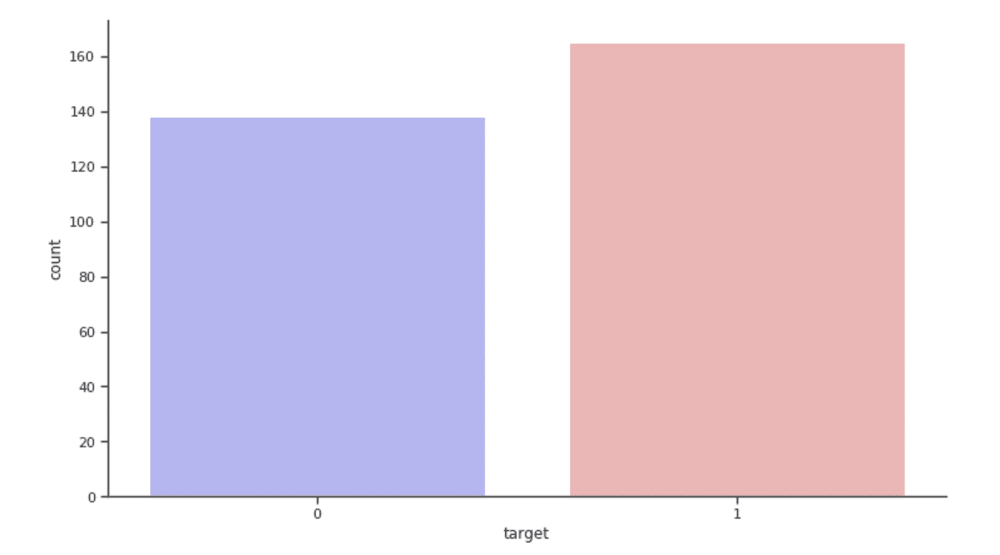

# 自动化您的模型超参数调整

> 原文：[`www.kdnuggets.com/2019/09/automate-hyperparameter-tuning-models.html`](https://www.kdnuggets.com/2019/09/automate-hyperparameter-tuning-models.html)

评论

照片由[Marcin Nowak](https://unsplash.com/@marcin?utm_source=medium&utm_medium=referral)拍摄，来源于[Unsplash](https://unsplash.com/?utm_source=medium&utm_medium=referral)。

当我们创建机器学习模型时，一个常见的任务就是如何调整它们。

人们最终采用不同的手动方法。一些有效，一些无效，很多时间都花在了期待和反复运行代码上。

***所以这就引出了终极问题：我们能否自动化这个过程？***

不久前，我在[**“如何赢得数据科学竞赛”**](https://www.coursera.org/specializations/aml?siteID=lVarvwc5BD0-BShznKdc3CUauhfsM7_8xw&utm_content=2&utm_medium=partners&utm_source=linkshare&utm_campaign=lVarvwc5BD0)Coursera 课程中的一次课堂竞赛中工作。学到了很多新东西，其中之一就是 Hyperopt——一个贝叶斯参数调整框架。

我感到惊讶。我把 Mac 和 Hyperopt 留在了晚上，早晨醒来时得到了结果。这太棒了，我避免了很多尝试和错误。

***这篇文章关于自动化超参数调整，因为我们的时间比机器更重要。***

### 那么，Hyperopt 是什么？

来自 Hyperopt 网站：

> *Hyperopt 是一个用于在尴尬搜索空间上进行串行和并行优化的 Python 库，这些空间可能包括实值、离散和条件维度*

***简单来说，这意味着我们得到一个优化器，它可以为我们最小化/最大化任何函数。*** 例如，我们可以用它来最小化对数损失或最大化准确率。

我们都知道网格搜索或随机网格搜索的工作原理。

网格搜索逐个检查参数，而随机搜索随机检查参数。

***Hyperopt 以一组超参数作为输入空间，在其中进行搜索，并根据过去试验的结果进行移动。***

> 因此，Hyperopt 的目标是以一种有信息的方式搜索参数空间。

我不会详细讲解。但如果你想了解更多关于它的工作原理，可以看看 J Bergstra 的[**论文**](https://conference.scipy.org/proceedings/scipy2013/pdfs/bergstra_hyperopt.pdf)。这是 Github 上的[**文档**](https://github.com/hyperopt/hyperopt/wiki/FMin)。

### 我们的数据集

为了说明 Hyperopt 的工作原理，我将使用[heart dataset](https://www.kaggle.com/ronitf/heart-disease-uci)来自 UCI，因为它是一个简单的数据集。为什么不利用数据科学做一些有益的事情，而不仅仅是创造利润呢？

这个数据集根据一些变量预测心脏病的存在。

这是数据集的快照：

这就是目标分布的样子：

### Hyperopt 分步指南

所以，在尝试运行 hyperopt 时，我们需要创建两个 Python 对象：

1.  ***目标函数：*** 目标函数以超参数空间作为输入，并返回损失。在这里我们称我们的目标函数为 `objective`

1.  ***超参数字典：*** 我们将通过使用变量 `space` 来定义一个超参数空间，这实际上只是一个字典。我们可以为不同的超参数值选择不同的分布。

最后，我们将使用 hyperopt 包中的 `fmin` 函数通过 `space` 最小化我们的 `objective`。

你可以在这个 [Kaggle Kernel](https://www.kaggle.com/mlwhiz/how-to-use-hyperopt?scriptVersionId=20362799) 中跟随代码。

### 1\. 创建目标函数

在这里我们创建一个目标函数，它以超参数空间作为输入：

+   首先我们定义一个分类器，在这个例子中是 XGBoost。试着查看我们如何从空间中访问参数。例如 `space[‘max_depth’]`

+   我们将分类器拟合到训练数据上，然后在交叉验证集上进行预测。

+   我们计算所需的度量，我们希望最大化或最小化。

+   由于我们在 hyperopt 中只使用 `fmin` 进行最小化，如果我们想最小化 `logloss`，我们只需按原样传递我们的度量。如果我们想最大化准确性，我们将尝试最小化 `-accuracy`

### 2\. 为你的分类器创建空间

现在，我们 ***为我们的分类器创建超参数搜索空间***

为此，我们将使用许多 hyperopt 内置的函数来定义各种分布。

如下面的代码所示，我们为我们的 `subsample` 超参数使用 0.7 到 1 之间的均匀分布。我们还为 subsample 参数 `x_subsample` 赋予了一个标签。你需要为你定义的每个超参数提供不同的标签。我通常在我的参数名称前加上 `x_` 来创建这个标签。

你还可以定义很多其他的分布。目前 hyperopt 的优化算法认可的一些最有用的随机表达式包括：

+   `hp.choice(label, options)` — 返回选项中的一个，选项应该是一个列表或元组。

+   `hp.randint(label, upper)` — 返回范围 [0, upper) 内的随机整数。

+   `hp.uniform(label, low, high)` — 返回一个均匀分布在 `low` 和 `high` 之间的值。

+   `hp.quniform(label, low, high, q)` — 返回类似 round(uniform(low, high) / q) * q 的值

+   `hp.normal(label, mu, sigma)` — 返回一个以均值 mu 和标准差 sigma 正态分布的实数值。

还有很多其他的分布。你可以在[这里](https://github.com/hyperopt/hyperopt/wiki/FMin)查看它们。

### 3\. 最后，运行 Hyperopt

一旦我们运行这个，就能得到我们模型的最佳参数。结果显示，我们通过这样做达到了 90%的准确率。

***现在我们可以用这些最佳参数重新训练我们的 XGboost 算法，然后就完成了。***

### 结论

运行上述步骤给了我们相当好的超参数用于我们的学习算法。这为我节省了大量时间来思考各种其他假设并进行测试。

我在调整模型时经常使用这个。***根据我的经验，这整个过程中的关键部分是设置超参数空间，而这需要经验和对模型的了解。***

所以，Hyperopt 是一个非常棒的工具，但千万不要忽视理解你的模型是如何工作的。这在长远中会非常有帮助。

你可以在这个 [Kaggle Kernel](https://www.kaggle.com/mlwhiz/how-to-use-hyperopt?scriptVersionId=20362799) 中获得完整的代码。

### 继续学习

如果你想了解更多关于实用数据科学的内容，可以看看 [**“如何赢得数据科学比赛”**](https://www.coursera.org/specializations/aml?siteID=lVarvwc5BD0-BShznKdc3CUauhfsM7_8xw&utm_content=2&utm_medium=partners&utm_source=linkshare&utm_campaign=lVarvwc5BD0) Coursera 课程。从这门由一位最富盛名的 Kaggle 竞赛选手讲授的课程中学到了很多新东西。

感谢阅读。我将来也会写更多面向初学者的文章。请在 [**Medium**](https://medium.com/@rahul_agarwal?source=post_page---------------------------) 关注我，或订阅我的 [**博客**](http://eepurl.com/dbQnuX?source=post_page---------------------------) 以获取最新信息。一直以来，我欢迎反馈和建设性的批评，可以通过 Twitter 联系我 [@mlwhiz](https://twitter.com/MLWhiz?source=post_page---------------------------)。

此外，小小的免责声明 - 这篇文章中可能包含一些关联链接，因为分享知识从来都不是坏事。

**个人简介: [Rahul Agarwal](https://www.linkedin.com/in/rahulagwl/)** 是沃尔玛实验室的数据科学家。

[原文](https://towardsdatascience.com/automate-hyperparameter-tuning-for-your-models-71b18f819604)。经授权转载。

**相关:**

+   如何自动化超参数优化

+   在 Google Colab 中使用 Hyperas 进行 Keras 超参数调优

+   自动化机器学习: 到底有多少？

* * *

## 我们的前三个课程推荐

 1\. [Google 网络安全证书](https://www.kdnuggets.com/google-cybersecurity) - 快速通道进入网络安全职业生涯。

 2\. [谷歌数据分析专业证书](https://www.kdnuggets.com/google-data-analytics) - 提升你的数据分析技能

 3\. [谷歌 IT 支持专业证书](https://www.kdnuggets.com/google-itsupport) - 支持你所在组织的 IT

* * *

### 了解更多相关话题

+   [使用网格搜索和随机搜索在 Python 中调整超参数](https://www.kdnuggets.com/2022/10/hyperparameter-tuning-grid-search-random-search-python.html)

+   [超参数调整：GridSearchCV 和 RandomizedSearchCV 解析](https://www.kdnuggets.com/hyperparameter-tuning-gridsearchcv-and-randomizedsearchcv-explained)

+   [使用 Promptr 和 GPT 自动化你的代码库](https://www.kdnuggets.com/2023/04/automate-codebase-promptr-gpt.html)

+   [用 Python 自动化的 5 个任务](https://www.kdnuggets.com/2021/06/5-tasks-automate-python.html)

+   [使用 Python 自动化 Microsoft Excel 和 Word](https://www.kdnuggets.com/2021/08/automate-microsoft-excel-word-python.html)

+   [用 GPT-4 和 Python 自动化枯燥的工作](https://www.kdnuggets.com/2023/03/automate-boring-stuff-chatgpt-python.html)
