# 如何利用机器学习在 GitHub 上自动化任务，实现趣味和盈利

> 原文：[`www.kdnuggets.com/2019/05/automate-tasks-github-machine-learning-fun-profit.html`](https://www.kdnuggets.com/2019/05/automate-tasks-github-machine-learning-fun-profit.html)

 评论

**由 [Hamel Husain](https://twitter.com/HamelHusain)、[Michal Jastrzębski](https://twitter.com/_inc0_) 和 [Jeremy Lewi](https://twitter.com/jeremylewi) 发表**

### 引言：构建一个标签问题的模型并将其作为产品发布！

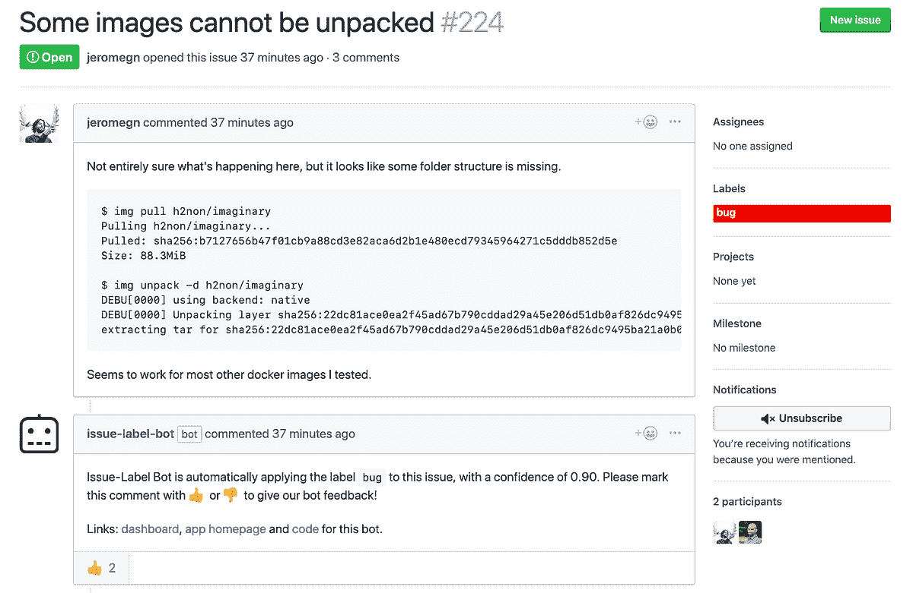

[链接](https://github.com/genuinetools/img/issues/224)到此问题。更多示例可以在 [这里](https://mlbot.net/) 查看。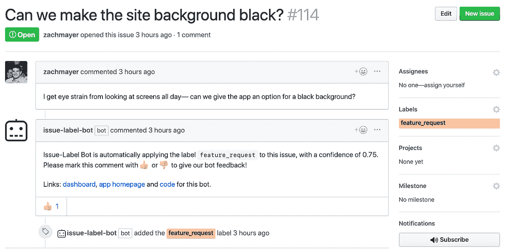

[链接](https://github.com/hamelsmu/Issue-Label-Bot-Examples/issues/114)到此问题。更多示例可以在 [这里](https://mlbot.net/) 查看

[**从此页面将此应用安装到您的 GitHub 仓库**](https://mlbot.net/)**。**

### 动机：难以捉摸的完美机器学习问题

寻找理想的机器学习问题可能像寻宝或追逐龙一样。 [图片来源](https://polycount.com/discussion/179516/help-on-creating-a-wide-a-treasure-room-full-of-gold)。

我们的数据科学家朋友和同事会将理想的预测建模项目描述为一种情况：

+   存在 **大量数据**，这些数据已经被标记，或者可以推断出标签。

+   数据可以用来解决 **实际问题**。

+   问题涉及到一个 **您感兴趣的领域**，或者您要解决的问题是您自己的 **您可以成为第一个客户**。

+   有 **一个平台**，您的数据产品可以接触到 **大量观众**，并且有 **收集反馈和改进** 的机制。

+   您可以以 **最小的开销和时间** 创建这些，最好是使用您熟悉的语言和工具。

+   如果产品成功，有办法 **实现盈利**。

上述列表是理想的，数据科学家遇到符合所有这些条件的问题是幸运的（作者觉得即使能找到符合一半条件的问题也很幸运！）。

### 进入 GH-Archive & GitHub 应用程序：数据与机会相遇的地方

今天，我们介绍一个我们认为符合上述标准的数据集、平台和领域！

**数据集**：[**GH-Archive**](https://www.gharchive.org/)。

GH-Archive 通过从 [这些事件](https://developer.github.com/v3/activity/events/types/) 中摄取大部分数据，记录了 GitHub 上大量的数据，这些事件来自 [GitHub REST API](https://developer.github.com/v3/)。这些事件以 JSON 格式从 GitHub 发送到 GH-Archive，称为 [负载](https://developer.github.com/v3/activity/events/types/)。下面是编辑问题时收到的负载示例：

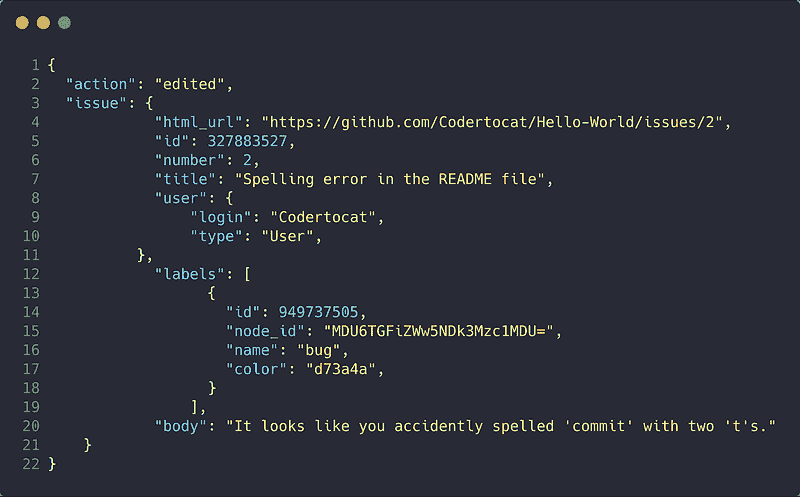

[这个示例](https://developer.github.com/v3/activity/events/types/#webhook-payload-example-14)的一个截断版本。

正如你所想，由于 GitHub 上的事件类型和用户数量庞大，负载的数量也很大。幸运的是，[这些数据存储在 BigQuery](http://www.gharchive.org/#bigquery)中，允许通过 SQL 接口快速检索！获取这些数据的成本非常经济，因为 Google 在你首次注册账户时会给你 $300，如果你已经有账户，成本也很合理。

由于数据是以 JSON 格式存在的，解析这些数据的语法可能有些不熟悉。我们可以使用*JSON_EXTRACT*函数来获取我们需要的数据。下面是一个从 issue 负载中提取数据的简单示例：

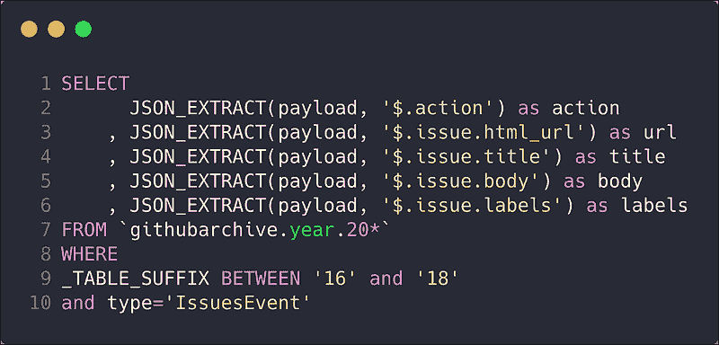

你可能会用到的用于 BigQuery 中 GH-Archive 数据的示例查询语法。请特别注意所使用的语法。

关于如何从 BigQuery 中提取 GitHub issues 的逐步解释可以在[本文的附录部分](https://towardsdatascience.com/how-to-create-data-products-that-are-magical-using-sequence-to-sequence-models-703f86a231f8)找到。然而，需要注意的是，除了 issue 数据之外，还可以获取[几乎所有](https://developer.github.com/v3/activity/events/types/#event-types--payloads)在 GitHub 上发生的数据！你甚至可以从 BigQuery 中检索大量的[公共仓库代码](https://github.com/hamelsmu/code_search/blob/master/notebooks/1%20-%20Preprocess%20Data.ipynb)。

**平台**: [**GitHub 应用**](https://developer.github.com/apps/)** 和 **[**GitHub 市场**](https://developer.github.com/marketplace/)**

GitHub 平台允许你构建可以执行多种操作的应用程序，例如[与 issues 交互](https://developer.github.com/v3/issues/)，[创建仓库](https://developer.github.com/v3/repos/)或[在 pull requests 中修复代码](https://fixmie.com/)。由于你的应用程序只需接收来自 GitHub 的[payloads](https://developer.github.com/v3/activity/events/types/)并调用[REST API](https://developer.github.com/v3/)，你可以使用任何你选择的语言来编写应用程序，包括 Python。

最重要的是，[GitHub 市场](https://github.com/marketplace)为你提供了一种[在可搜索平台上列出你的应用](https://developer.github.com/marketplace/#apps)并向用户收取月费的方式。这是一个将你的创意货币化的好方法。你甚至可以托管[未经验证的免费应用](https://developer.github.com/marketplace/#unverified-apps)以收集反馈并进行迭代。

令人惊讶的是，尽管有这些公共数据集，但使用机器学习的 GitHub 应用并不多！提高对此的认识是本文的动机之一。

### 一个端到端的示例：使用机器学习自动标记 GitHub Issues

自动标记问题可以帮助组织和查找信息。照片由[Susan Yin](https://unsplash.com/@syinq?utm_source=medium&utm_medium=referral)提供

为了展示如何创建你自己的应用，我们将带你完成创建一个可以自动标记问题的 GitHub 应用的过程。请注意，该应用的所有代码，包括模型训练步骤，都位于[这个 GitHub 仓库](https://github.com/hamelsmu/MLapp)。

### **步骤 1：注册你的应用并完成前置要求。**

首先，你需要设置你的开发环境。完成[这篇文章](https://developer.github.com/apps/quickstart-guides/setting-up-your-development-environment/)中的第 1-4 步。你不需要阅读关于“Ruby 编程语言”的部分或超出第 4 步的内容。即使那部分是可选的，也要确保你设置了 Webhook 密钥。

请注意，[GitHub 应用与 OAuth 应用之间的区别](https://developer.github.com/apps/differences-between-apps/)。对于本教程，我们关注的是 GitHub 应用。你不需要过于担心这个问题，但了解这些区别是有帮助的，以防你在查阅文档时需要用到。

### **步骤 2：熟悉使用 Python 与 GitHub API 进行交互。**

你的应用需要与 GitHub API 进行交互，以便在 GitHub 上执行操作。使用你选择的编程语言中的预构建客户端可以使工作更轻松。虽然[官方文档](https://developer.github.com/apps/quickstart-guides/using-the-github-api-in-your-app/)中展示了如何使用 Ruby 客户端，但还有[第三方客户端](https://developer.github.com/v3/libraries/)支持许多其他语言，包括 Python。对于本教程，我们将使用[Github3.py 库](https://github3.readthedocs.io/en/master/)。

与 GitHub API 作为应用进行接口交互的最混乱的方面之一是认证。在接下来的说明中，使用 curl 命令，而不是文档中的 Ruby 示例。

首先，你必须通过签署一个 JSON Web Token (JWT)来[以应用身份进行认证](https://developer.github.com/apps/building-github-apps/authenticating-with-github-apps/#authenticating-as-a-github-app)。一旦你签署了 JWT，你可以用它来[以应用安装身份进行认证](https://developer.github.com/apps/building-github-apps/authenticating-with-github-apps/#authenticating-as-an-installation)。在以应用安装身份认证后，你将收到一个安装访问令牌，你可以用它来与 REST API 交互。

请注意，以应用身份认证是通过 GET 请求完成的，而以应用安装身份认证是通过 PUT 请求完成的。尽管在示例 CURL 命令中说明了这一点，但这是我们在开始时遗漏的一个细节。

尽管你将使用[Github3.py library](https://github3.readthedocs.io/en/master/)，但了解上述认证步骤仍然很有用，因为可能存在一些不受支持的路线，你可能希望使用[requests](http://docs.python-requests.org/en/master/)库自行实现。这就是我们的情况，所以我们最终编写了一个名为[**mlapp**](https://github.com/hamelsmu/MLapp/blob/master/flask_app/mlapp.py)的轻量级包装器，帮助我们与问题进行交互，该包装器的定义见[此处](https://github.com/hamelsmu/MLapp/blob/master/flask_app/mlapp.py)。

以下是可以用来创建问题、发表评论和应用标签的代码。这段代码也可以在[这个笔记本](https://github.com/hamelsmu/MLapp/blob/master/notebooks/GitHub-api-example.ipynb)中找到。

上述代码创建了[这个 GitHub 问题](https://github.com/hamelsmu/simple_flask_app/issues/1)。这段代码也可以在[这个笔记本](https://github.com/hamelsmu/MLapp/blob/master/notebooks/GitHub-api-example.ipynb)中找到。

你可以在[这里](https://github.com/hamelsmu/simple_flask_app/issues/1)查看由此代码创建的问题。

### 第 3 步：获取和准备数据。

如前所述，我们可以使用[GH-Archive](https://www.gharchive.org/)托管在[BigQuery](https://www.gharchive.org/#bigquery)上的服务来检索问题示例。此外，我们还可以检索人们为每个问题手动应用的标签。以下是我们用来构建这些标签的帕累托图的查询：

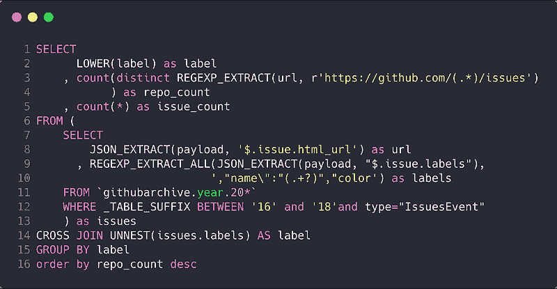

[链接](https://console.cloud.google.com/bigquery?sq=123474043329:b424d2bbd79844999b970a0bc8498efa)到这个查询。该查询生成的数据可在[此电子表格](https://docs.google.com/spreadsheets/d/1NPacnVsyZMBneeewvPGhCx512A1RPYf8ktDN_RpKeS4/edit?usp=sharing)中获得。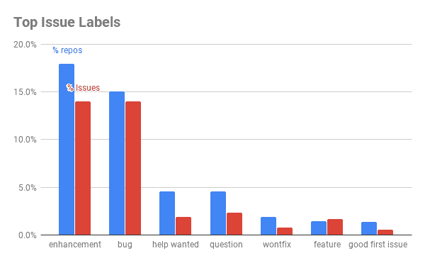

来自公共数据集的主要问题标签。这里展示的只是极长尾部的一部分（未显示）。

[此电子表格](https://docs.google.com/spreadsheets/d/1NPacnVsyZMBneeewvPGhCx512A1RPYf8ktDN_RpKeS4/edit?usp=sharing)包含整个帕累托图的数据。存在一个长尾的问题标签，这些标签并非互斥。例如，*enhancement*和*feature*标签可以组合在一起。此外，标签的质量和含义可能因项目而异。尽管存在这些障碍，我们决定简化问题，并使用我们在手动查看前~200 个标签后构建的启发式方法将尽可能多的标签归类为三个类别：*feature request*、*bug*和*question*。此外，我们还咨询了一个大型开源项目[Kubeflow](https://github.com/kubeflow)的维护者，作为我们的第一个客户来验证我们的直觉。

我们尝试创建一个名为*other*的第四类，以便有负样本，包含不在前三类中的项目。然而，我们发现这些“其他”类别的信息很混乱，因为其中有许多错误、功能请求和问题。因此，我们将训练集限制为我们可以归类为*功能请求*、*错误*或*问题*的问题。

需要注意的是，这种训练数据的安排远非理想，因为我们希望训练数据尽可能地接近真实问题的分布。然而，我们的目标是构建一个最小可行产品，以最少的时间和费用进行迭代，因此我们采用了这种方法。

最后，我们特别注意了去重问题。为了保守起见，我们解决了以下类型的重复（通过任意选择重复集合中的一个问题）：

1.  在同一仓库中具有相同标题的问题。

1.  内容相同的问题，不论标题如何。通过仅考虑问题正文中前 75% 和后 75% 的字符来进一步去重。

用于对问题进行分类和去重的 SQL 查询可以通过[这个链接](https://console.cloud.google.com/bigquery?sq=123474043329:01abf8866144486f932c756730ddaff1)查看。你无需运行这个查询，因为来自[Kubeflow](https://www.kubeflow.org/)项目的朋友们已经运行了这个查询，并将生成的数据作为 CSV 文件托管在 Google Cloud Bucket 上，你可以通过遵循[这个笔记本中的代码](https://github.com/hamelsmu/MLapp/blob/master/notebooks/Issue_Labeling_Model.ipynb)来获取数据。对原始数据的探索以及数据集中所有字段的描述也位于[这个笔记本中](https://github.com/hamelsmu/MLapp/blob/master/notebooks/Issue_Labeling_Model.ipynb)。

### 第 4 步：构建和训练模型。

现在我们有了数据，下一步是构建和训练模型。对于这个问题，我们决定借用一个[我们为类似问题构建的文本预处理管道](https://towardsdatascience.com/how-to-create-data-products-that-are-magical-using-sequence-to-sequence-models-703f86a231f8)并应用于此。这个预处理管道清理原始文本，标记数据，构建词汇表，并将文本序列填充到相等长度，这些步骤在我们先前博客文章的[“准备和清理数据”部分](https://towardsdatascience.com/how-to-create-data-products-that-are-magical-using-sequence-to-sequence-models-703f86a231f8)中有详细说明。完成问题标记的代码在[这个笔记本](https://github.com/hamelsmu/MLapp/blob/master/notebooks/Issue_Labeling_Model.ipynb)中概述。

我们的模型接受两个输入：问题标题和正文，并将每个问题分类为*错误*、*功能请求*或*问题*。下面是我们使用 [tensorflow.Keras](https://www.tensorflow.org/guide/keras)定义的模型架构：

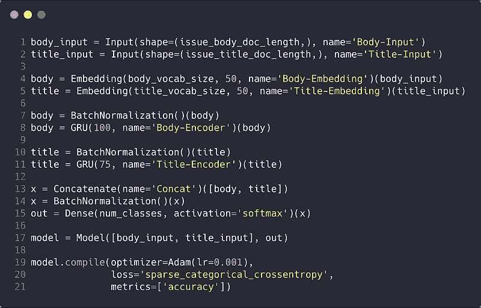

代码可在 [这个笔记本](https://github.com/hamelsmu/MLapp/blob/master/notebooks/Issue_Labeling_Model.ipynb)中找到。

关于这个模型的几点说明：

+   解决这个问题并不一定要使用深度学习。我们只是利用了为另一个密切相关的问题构建的现有管道，以便快速启动。

+   模型架构非常简单。我们的目标是保持尽可能简单，以展示你可以使用简单的方法构建一个真实的数据产品。我们没有花很多时间调整或尝试不同的架构。

+   我们预计通过使用更先进的架构或改进数据集，这个模型还有很大的提升空间。我们在*下一步*部分提供了几个提示。

**评估模型**

下面是一个混淆矩阵，展示了我们模型在三个类别的测试集上的准确度。模型在分类问题时确实很挣扎，但在区分错误和功能方面表现相当不错。

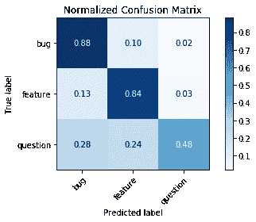

请注意，由于我们的测试集不能代表所有问题（因为我们将数据集过滤到只有我们可以分类的问题），因此上述准确度指标应该谨慎对待。我们通过从用户那里收集明确的反馈来在一定程度上缓解这个问题，这使我们能够非常快速地重新训练模型并调试问题。我们将在后面的部分讨论明确的反馈机制。

**做出预测**

以下是对玩具示例的模型预测。完整的代码可以在 [这个笔记本](https://github.com/hamelsmu/MLapp/blob/master/notebooks/Issue_Labeling_Model.ipynb)中找到。

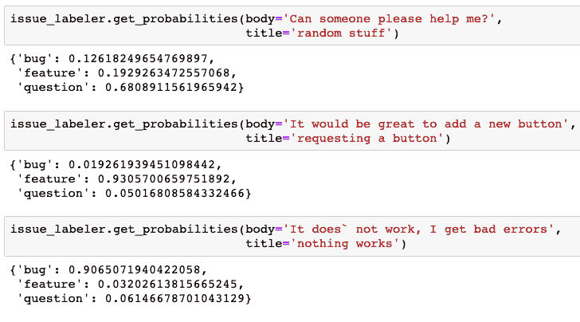

[链接](https://github.com/hamelsmu/MLapp/blob/master/notebooks/Issue_Labeling_Model.ipynb)到笔记本。

我们希望选择合理的阈值，以便模型不会向用户发送过多错误的预测（这意味着在某些情况下，我们的应用可能不会提供任何预测）。我们通过在多个仓库上测试系统并咨询多个维护者来选择阈值，以确定一个可接受的[假阳性率](https://en.wikipedia.org/wiki/False_positive_rate)。

### 第五步：使用 Flask 对负载进行响应。

现在你有了一个可以进行预测的模型，以及一种以编程方式向问题添加评论和标签的方法（第二步），剩下的就是将这些部分粘合在一起。你可以通过以下步骤完成：

1.  启动一个 web 服务器，监听来自 GitHub.com 的负载（你在第 1 步中注册应用时指定了 GitHub 将发送负载的端点）。

1.  验证有效负载是否来自 GitHub（在[这个脚本](https://github.com/hamelsmu/MLapp/blob/master/flask_app/app.py)中由 verify_webhook 函数演示）。

1.  如果需要，可以使用 GitHub API（你在第 2 步中学习的）来响应有效负载。

1.  记录适当的数据和反馈到数据库，以便于模型重新训练。

一种很好的实现方式是使用像[Flask](http://flask.pocoo.org/)这样的框架和像[SQLAlchemy](http://flask-sqlalchemy.pocoo.org/2.3/)这样的数据库接口。如果你已经熟悉 Flask，以下是一个简化版本的代码，它在 GitHub 通知打开问题时应用预测标签：

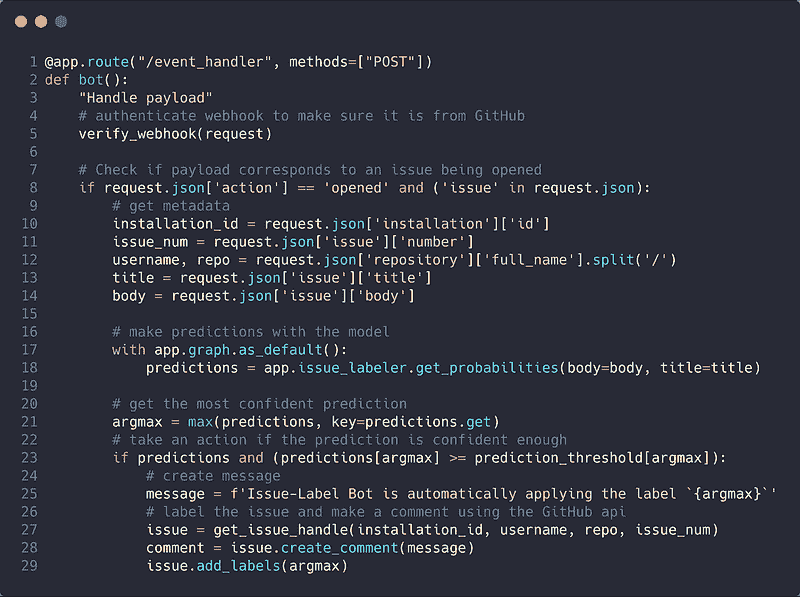

这段代码也可以在[这里](https://github.com/hamelsmu/MLapp/blob/master/flask_app/app.py)找到。

即使你对 Flask 或 SQLAlchemy 不熟悉也不用担心。你可以从这个精彩的[关于 Flask、HTML、CSS 和 JavaScript 的 MOOC](https://www.edx.org/course/cs50s-web-programming-with-python-and-javascript)中学习你需要了解的所有内容。如果你是数据科学家，这门课程真的非常值得投资时间，因为它可以让你以轻量级的方式为你的数据产品构建界面。我们参加了这门课程，对其印象深刻。

我们将剩下的[flask 代码](https://github.com/hamelsmu/MLapp)作为练习留给读者。

### 收集明确的用户反馈。

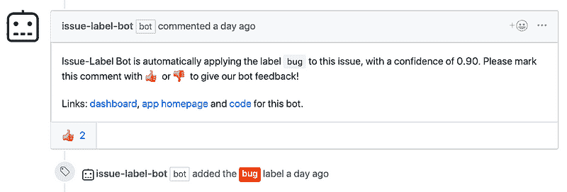

这张截图取自[这个问题](https://github.com/genuinetools/img/issues/224)。

如上所示，通过要求用户用 ???? 或 ???? 对预测做出反应来请求明确反馈。我们可以将这些反应存储在数据库中，从而重新训练和调试我们的模型。这也许是将数据产品作为 GitHub 应用程序推出的最激动人心和重要的方面之一！

你可以在[我们应用的主页](https://mlbot.net/)上看到更多预测和用户反馈的示例。例如，这是 kubeflow/kubeflow 仓库的页面：

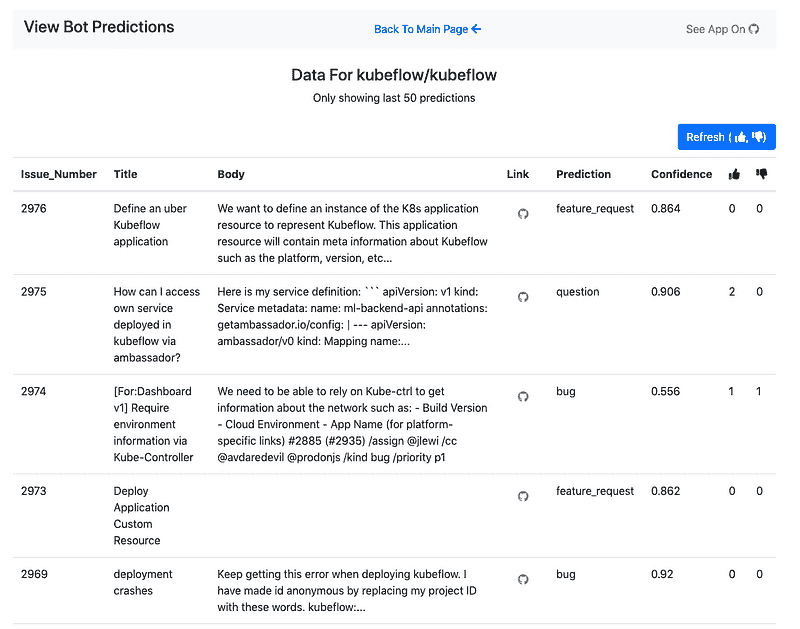

[链接](https://mlbot.net/data/kubeflow/kubeflow) 到此页面。

### 请安装我们的应用程序，它是免费的！

如果你喜欢到目前为止阅读的内容并希望支持这个项目，请在你的公开仓库上安装这个应用（即使在私人仓库中安装，也不会进行预测），并在我们的机器人进行预测时提供反馈 ???? ????。

[**这里是安装我们应用的链接**](https://github.com/apps/issue-label-bot)。

### 结论：构建自己的机器学习驱动应用的技巧

+   不要害怕**使用公开数据集**。你可以做的不仅仅是标注问题（请参阅资源部分以获取想法）。

+   **不要害怕快速迭代，即使解决方案不完美**。构建模型有时是项目中最小的组件，获取用户反馈是非常宝贵的，这样你就不会浪费时间。

+   **尽量咨询至少一个真实的客户或用户**，并让他们指导和验证决策。

+   **利用机会收集明确的用户反馈**。这将使你能够快速改进你的解决方案和模型。

### 第二部分 & 下一步

我们没有涵盖的一个方面是如何在大规模下服务你的应用。当你刚开始时，可能不需要担心这个问题，可以在你喜欢的云提供商的单台服务器上进行服务。你还可以使用 [像 Heroku](https://devcenter.heroku.com/articles/container-registry-and-runtime) 这样的服务，这在下方资源部分链接的 Flask 课程中有介绍。

在第二部分中，我们将涵盖以下内容：

+   如何在 Kubernetees 上部署你的 Flask 应用，以便它可以扩展到许多用户。

+   使用 [Argo pipelines](https://argoproj.github.io/) 来管理模型训练和服务流程。

我们相信有很多机会可以改进我们在这篇文章中展示的方法。我们有以下一些想法：

+   构建更好的标签和不属于标签集的负样本。

+   使用 [fastai](https://docs.fast.ai/) 的工具来探索最先进的架构，例如 [Multi-Head Attention](https://docs.fast.ai/text.models.html#MultiHeadAttention)。

+   在大型语料库上进行预训练，然后在 GitHub 问题上进行微调，以使用户能够预测特定于仓库的标签，而不是一个小的全局标签集。

+   使用额外的数据，例如有关仓库或打开问题的用户的信息，也许学习这些实体的嵌入。

+   允许用户自定义标签阈值和标签名称，以及选择要预测的标签。

### 资源

+   我们应用的 [网站](https://mlbot.net/)。

+   我们应用的 [安装页面](https://github.com/apps/issue-label-bot)。

+   [GitHub 仓库](https://github.com/hamelsmu/MLapp) 中包含了所有这些代码。

+   需要灵感来构建其他数据产品，使用机器学习和公共 GitHub 数据集？看看这些示例：(1) [GitHub 问题摘要](https://towardsdatascience.com/how-to-create-data-products-that-are-magical-using-sequence-to-sequence-models-703f86a231f8) 和 (2) 自然语言 [语义代码搜索](https://towardsdatascience.com/semantic-code-search-3cd6d244a39c)。

+   [Stack exchange 提供的公共数据](https://archive.org/details/stackexchange) 可能对迁移学习有用。最近利用这些数据的一个酷炫的机器学习项目是 [stackroboflow.com](https://stackroboflow.com/about/index.html)。

+   [源代码上的机器学习](https://ml4code.github.io/)，是对将机器学习应用于代码的文献综述，由 [Miltos Allamanis](https://miltos.allamanis.com/) 编写。

+   优秀的 Flask 课程： [HarvardX CS50 Web](https://www.edx.org/course/cs50s-web-programming-with-python-and-javascript)。

+   [fastai](https://www.fast.ai/) 提供的 [机器学习](http://course18.fast.ai/ml) 和 [深度学习](http://course.fast.ai/) MOOCs。

+   我们的代码库和相关教程假设用户对 Docker 有一定了解。 [这篇博客](https://towardsdatascience.com/how-docker-can-help-you-become-a-more-effective-data-scientist-7fc048ef91d5) 为数据科学家提供了 Docker 的简明介绍。

+   [Kubeflow 项目](https://www.kubeflow.org/) 包含我们将在本博客文章第二部分中使用的资源。此外，本文内容将成为 [即将到来的讲座](https://conferences.oreilly.com/artificial-intelligence/ai-ny/public/schedule/detail/73422) 的主题，讲座定于 2019 年 4 月 17 日。

### 联系我们！

我们希望你喜欢这篇博客。请随时与我们联系：

+   [Hamel Husain](https://twitter.com/HamelHusain)

+   [Michal Jastrzębski](https://twitter.com/_inc0_)

+   [Jeremy Lewi](https://twitter.com/jeremylewi)

### 免责声明

本文中提出的任何想法或观点均为我们个人观点。本文中的任何想法或技术不一定预示着任何公司的未来产品。此博客仅用于教育目的。

[原始内容](https://towardsdatascience.com/mlapp-419f90e8f007?sk=760e18a2d6e60999d7eb2887352a92a8)。经许可转载。

**相关：**

+   合成数据生成：新数据科学家的必备技能

+   趋势深度学习 Github 仓库

+   在 TensorFlow 中比较 MobileNet 模型

* * *

## 我们的前三推荐课程

 1\. [Google 网络安全证书](https://www.kdnuggets.com/google-cybersecurity) - 快速进入网络安全职业的捷径

 2\. [Google 数据分析专业证书](https://www.kdnuggets.com/google-data-analytics) - 提升你的数据分析能力

 3\. [Google IT 支持专业证书](https://www.kdnuggets.com/google-itsupport) - 支持你组织的 IT

* * *

### 更多相关内容

+   [Python 中的进度条与 tqdm 的乐趣与利润](https://www.kdnuggets.com/2022/09/progress-bars-python-tqdm-fun-profit.html)

+   [用 Python 自动化的 5 个任务](https://www.kdnuggets.com/2021/06/5-tasks-automate-python.html)

+   [让你快速了解生成 AI 的短小有趣课程](https://www.kdnuggets.com/short-and-fun-courses-to-get-you-up-to-speed-about-generative-ai)

+   [适合初学者的有趣 Python 项目！](https://www.kdnuggets.com/2022/10/beginner-friendly-python-projects-fun.html)

+   [使用 Python 自动化 Microsoft Excel 和 Word](https://www.kdnuggets.com/2021/08/automate-microsoft-excel-word-python.html)

+   [使用 GPT-4 和 Python 自动化无聊的任务](https://www.kdnuggets.com/2023/03/automate-boring-stuff-chatgpt-python.html)
