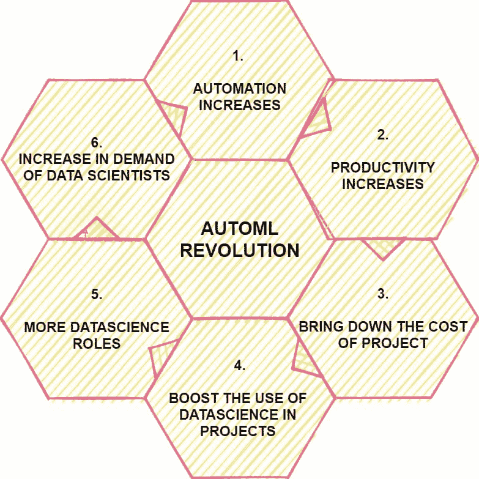

# 使用 Python 进行自动化机器学习：不同方法的比较

> 原文：[`www.kdnuggets.com/2023/03/automated-machine-learning-python-comparison-different-approaches.html`](https://www.kdnuggets.com/2023/03/automated-machine-learning-python-comparison-different-approaches.html)

图片来源 pch.vector [来自 Freepik](https://www.freepik.com/free-vector/man-robot-with-computers-sitting-together-workplace-artificial-intelligence-workforce-future-flat-illustration_20827812.htm#query=automatic%20machine%20learning&position=1&from_view=search&track=ais)

随着大型组织数据量的增加，人们展示了对销售、营销等模式的理解，这些模式是由特定组织中大量的数据形成的，人们比以往任何时候都更倾向于学习机器学习和数据分析，这种需求在疫情后仍将持续。

在处理机器学习项目的数据处理和超参数调整时，你可能会感到对一种自动化方法的渴望，这种方法可以节省你从调整亿万参数到尝试和测试不同模型的繁琐过程，这些模型能够很好地适应你的训练数据集。

对于这种需求，答案是肯定的；在当今世界，许多工具不仅可以自动化数据处理阶段，还可以帮助选择用于预测分析的相关模型。

图片来源：[Analytics Vidhya](https://www.analyticsvidhya.com/blog/2021/04/does-the-popularity-of-automl-means-the-end-of-data-science-jobs/)

因此，自动化机器学习（AutoML）是有必要的。

因此，在本文中，我将简要介绍当前时代的 AutoML。

# 什么是 AutoML？

简单来说，你可以将自动化机器学习视为通过仅仅执行特定命令来将机器学习（ML）模型应用于现实世界问题。最终，剩下的工作和管道将由工具处理。具体来说，这个过程自动化了通用机器学习管道中的几个步骤，例如为我们的数据集选择最佳模型、使用交叉验证进行超参数调整等。如果我们对内部工作感到好奇，工具将通过选择不同的超参数值创建不同的管道，然后选择在测试数据集上提供更好评估指标的管道。

# 各种 AutoML 平台的比较

开源和企业级 AutoML 解决方案有显著差异：开源解决方案只能自动化算法选择和超参数调整，而企业级解决方案则能做更多（见“我们可以期待 AutoML 工具做什么”一节）。此外，开源解决方案获得的结果远远低于企业级解决方案。

Google Cloud AutoML、Microsoft Azure AutoML、H2O.ai 和 TPOT 是流行的自动化机器学习（AutoML）工具，它们提供了一种更简单的方法来构建和部署机器学习模型，无需编码和数据科学专长。然而，每种工具都有其优点和限制。

## Google Cloud AutoML

1.  由于其用户友好的界面和高性能，Google Cloud AutoML 已获得越来越高的受欢迎度。

1.  你可以在几分钟内创建自定义机器学习模型。

1.  该平台与各种 Google Cloud 服务良好集成，提供了可扩展性，并且从用户的角度来看易于使用。

1.  要查找示例代码，请访问这个[链接](https://cloud.google.com/automl/docs/quickstart)

## Microsoft Azure AutoML

1.  Azure AutoML 为不熟悉编码的用户提供了透明的模型选择过程。

1.  这是一项基于云的服务，允许你创建和管理机器学习解决方案。作为一个平台，Azure 可以在有一定编程经验的情况下学习。

1.  该平台与各种 Azure 服务具有良好的集成，最终可以在 GPU 实例上运行，因此我们可以快速部署。

1.  要查找示例代码，请访问这个[链接](https://docs.microsoft.com/en-us/azure/machine-learning/how-to-configure-auto-train)

## H2O.ai

1.  该公司提供一个开源包和一个名为 Driverless AI 的商业 AutoML 服务。

1.  自成立以来，该平台在金融服务和零售行业被广泛采用。

1.  这使得企业能够快速开发世界级的 AI 模型和应用程序。

1.  该平台完全开源，提供了许多算法，并且适用于处理涉及速度和规模的大数据等。

1.  要查找示例代码，请访问这个[链接](https://docs.h2o.ai/h2o/latest-stable/h2o-docs/automl.html)

## TPOT

1.  TPOT（基于树的管道优化工具）是一个免费的 Python 包。

1.  尽管免费，该包在各种数据集上取得了卓越的结果，包括 Iris 数据集的约 97%准确率、MNIST 数字识别的 98%以及 Boston Housing Prices 预测的约 10 均方误差（MSE）。

1.  该平台完全开源，在准确性方面提供了非常高的结果，并且能够快速处理大量数据。

1.  要查找示例代码，请访问这个[链接](https://epistasislab.github.io/tpot/using/#example-1-a-quick-start)

# 我对选择 AutoML 平台的评价

在我看来，H2O 是最好的开源平台，旨在实现机器学习的民主化。它的综合范围和 H2O Flow 的基于网络的界面使其在开源解决方案中名列前茅。我从头开始创建了一个客户流失的机器学习项目，甚至没有写一行代码。

H2O Driverless AI 是最全面、可定制的企业解决方案。尽管保持对建模的高度控制和理解，我迅速生成了一个比 H2O-3 更好的客户流失模型。

总之，我希望你喜欢这篇文章并觉得它有用。如果你有任何建议或反馈，请通过[LinkedIn](https://www.linkedin.com/in/aryan-garg-1bbb791a3/)与我联系。

**[Aryan Garg](https://www.linkedin.com/in/aryan-garg-1bbb791a3/)** 是一名电气工程学的 B.Tech. 学生，目前在本科的最后一年。他的兴趣领域在于 Web 开发和机器学习。他已经追求了这个兴趣，并渴望在这些方向上工作更多。

* * *

## 我们的三大课程推荐

 1\. [谷歌网络安全证书](https://www.kdnuggets.com/google-cybersecurity) - 快速进入网络安全职业轨道。

 2\. [谷歌数据分析专业证书](https://www.kdnuggets.com/google-data-analytics) - 提升你的数据分析能力

 3\. [谷歌 IT 支持专业证书](https://www.kdnuggets.com/google-itsupport) - 支持你的组织的 IT 需求

* * *

### 更多相关话题

+   [AI 生成的体育精彩瞬间：不同的方法](https://www.kdnuggets.com/2022/03/aigenerated-sports-highlights-different-approaches.html)

+   [Python 和 R 中机器学习算法的比较](https://www.kdnuggets.com/2023/06/machine-learning-algorithms-python-r.html)

+   [数据挖掘与机器学习有何不同？](https://www.kdnuggets.com/2022/06/data-mining-different-machine-learning.html)

+   [Python 中加载数据的 5 种不同方式](https://www.kdnuggets.com/2020/08/5-different-ways-load-data-python.html)

+   [NLP 中不同词嵌入技术的终极指南](https://www.kdnuggets.com/2021/11/guide-word-embedding-techniques-nlp.html)

+   [现实世界中 NLP 应用的范围：一种不同的…](https://www.kdnuggets.com/2022/03/different-solution-problem-range-nlp-applications-real-world.html)
