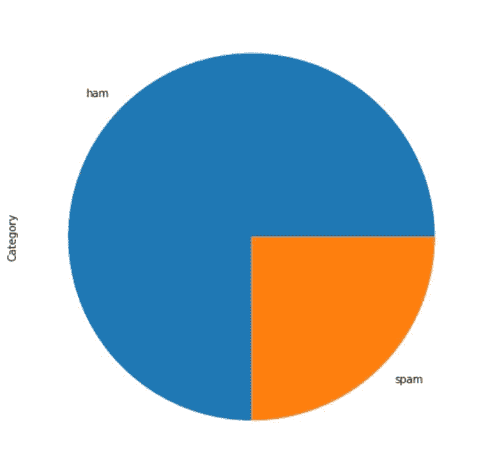
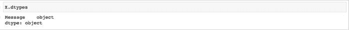
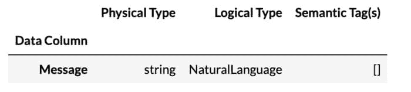
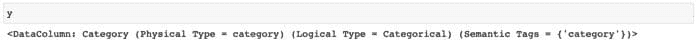
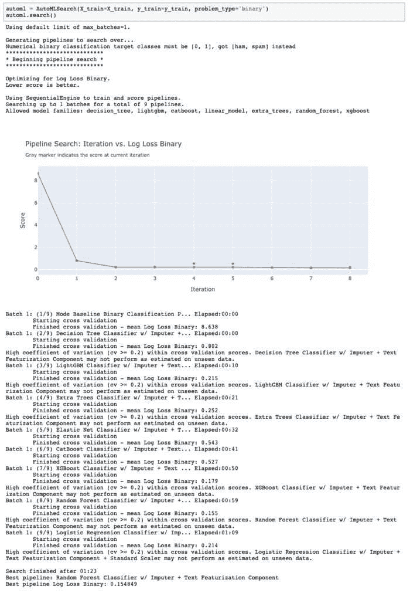
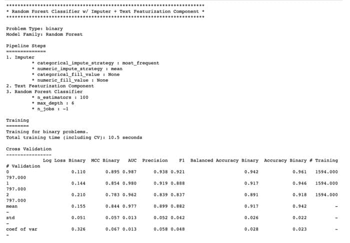
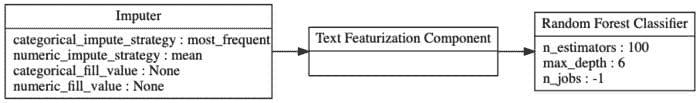
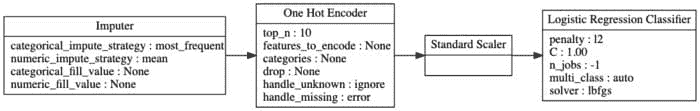

# 使用 EvalML 进行自动化文本分类

> 原文：[`www.kdnuggets.com/2021/04/automated-text-classification-evalml.html`](https://www.kdnuggets.com/2021/04/automated-text-classification-evalml.html)

评论

**由 [Angela Lin](https://www.linkedin.com/in/angela97lin/) 提供，EvalML 软件工程师**


文本可以是丰富且信息量大的数据类型。它可以用于多种任务，包括情感分析、主题提取和垃圾邮件检测。然而，原始文本不能直接输入到机器学习算法中，因为大多数模型只能理解数值。因此，为了在机器学习中使用文本作为数据，必须首先对其进行处理并转换为数值。

在这篇文章中，我们将学习如何使用 [EvalML](https://github.com/alteryx/evalml) 通过将其构建为一个二分类问题来检测垃圾短信。EvalML 是一个用 Python 编写的 AutoML 库，它使用 [Woodwork](https://github.com/alteryx/woodwork) 来检测和指定数据的处理方式，并使用 [nlp-primitives 库](https://github.com/alteryx/nlp_primitives) 从原始文本数据中创建有意义的数值特征。

### 垃圾邮件数据集

我们在这个演示中使用的数据集包含英语的 SMS 短信，其中一些标记为合法（“ham”），另一些标记为垃圾邮件。为了这个演示，我们修改了 [Kaggle 上的原始数据集](https://www.kaggle.com/uciml/sms-spam-collection-dataset)，将所有输入文本列合并，并对多数类别（“ham”）进行下采样，使“ham”与“spam”的比例为 3:1。以下对数据的引用将始终指代我们修改过且较小的数据集。

让我们加载数据并显示几行，以了解我们的短信内容是什么样的：

```py
from urllib.request import urlopen
import pandas as pd

input_data = urlopen('https://featurelabs-static.s3.amazonaws.com/spam_text_messages_modified.csv')
data = pd.read_csv(input_data)
X = data.drop(['Category'], axis=1)
y = data['Category']display(X.head())
```

 我们输入数据的一个样本

我们可以绘制目标值的频率，以验证我们修改过的数据集中“ham”与“spam”的比例是否约为 3:1。

```py
y.value_counts().plot.pie(figsize=(10,10))
```



“ham”与“spam”的比例约为 3:1

由于“ham”与“spam”的比例为 3:1，我们可以创建一个简单的模型，该模型总是将消息分类为多数类“ham”，从而获得 75% 的 [准确率](https://en.wikipedia.org/wiki/Accuracy_and_precision#In_binary_classification)。这个模型的 [召回率](https://en.wikipedia.org/wiki/Precision_and_recall#Recall) 也会是 0%，因为它无法正确分类任何少数类“spam”样本，且平衡准确率为 50%。这意味着一个机器学习模型应具有大于 75% 的准确率、大于 0% 的召回率和大于 50% 的平衡准确率，才能算作有用。

|  | 基线模型（总是猜测多数类） |
| --- | --- |
| 准确率 | 75% |
| 平衡准确率 | 50% |
| 召回率 | 0% |

让我们使用 EvalML 生成一个模型，看看我们是否能比这个简单模型做得更好！

### 介绍 Woodwork

在将我们的数据输入到 EvalML 之前，我们有一个更基本的问题需要解决：我们如何指定我们的数据应该被视为*文本*数据？仅使用`pandas`，我们无法区分文本数据和非文本数据（例如分类数据），因为 pandas 使用相同的`object`数据类型来存储这两者。我们如何确保我们的模型正确地将我们的文本消息视为文本数据，而不是数百种不同的唯一类别？

pandas 默认将“Message”视为“object”数据类型

EvalML 利用开源的 [Woodwork](https://github.com/alteryx/woodwork) 库来检测和指定每个特征应该如何处理，而不考虑其底层的物理数据类型。这意味着我们可以对具有相同物理数据类型的列进行不同的处理。例如，我们可以指定希望将某些包含文本的列视为分类列，而将其他包含文本的列视为自然语言列，即使这些列具有相同的底层`object`数据类型。这种区分使我们能够澄清在`pandas`中可能具有相同底层数据类型但最终表示不同数据类型的特征之间的模糊性。

在这里，我们用我们的特征初始化一个 Woodwork `DataTable`。我们的单一`Message`特征被自动检测为自然语言或文本列。

```py
import woodwork as ww
X = ww.DataTable(X)

# Note: We could have also manually set the Message column to 
# natural language if Woodwork had not automatically detected
from evalml.utils import infer_feature_types
X = infer_feature_types(X, {'Message': 'NaturalLanguage'})
```

我们的“Message”特征被自动检测为自然语言（文本）列

我们还可以为我们的目标初始化一个 Woodwork `DataColumn`。

```py
y = ww.DataColumn(y)
```

我们的目标被自动检测为分类列。这是合理的，因为我们有一个二分类问题，涉及两类文本消息：垃圾邮件和正常邮件。

我们的目标（“y”）被自动检测为分类列

### 运行 AutoMLSearch

现在，让我们将数据输入到 `[AutoMLSearch](https://evalml.alteryx.com/en/stable/user_guide/automl.html)` 中，看看我们是否能生成一个非平凡的机器学习模型来检测垃圾邮件。AutoML 是自动化构建、训练和评估机器学习模型的过程。`AutoMLSearch` 是 EvalML 的 AutoML 接口。

首先，我们将把数据分成训练集和测试集。我们将使用训练集来训练和寻找最佳模型，然后在测试集上验证模型的表现。

EvalML 提供了一个实用方法，使这变得简单。我们需要做的就是指定我们有一个二分类问题，并且我们希望将 20% 的数据保留为测试数据。

```py
from evalml.preprocessing import split_data

X_train, X_holdout, y_train, y_holdout = split_data(X, y, problem_type='binary', test_size=0.2)
```

接下来，我们可以通过指定问题类型并传入我们的训练数据来设置`AutoMLSearch`。我们有一个二分类问题，因为我们试图将消息分类为两个类别之一：ham 或 spam。

```py
automl = AutoMLSearch(X_train=X_train, y_train=y_train, problem_type='binary')
```

调用构造函数会初始化一个为我们的数据配置的`AutoMLSearch`对象。现在，我们可以调用`automl.search()`来启动 AutoML 过程。这将自动生成数据的管道，并训练各种模型集合。

```py
automl.search()
```

EvalML 的 AutoML 搜索已经训练并评估了九种不同的模型。

要了解`AutoMLSearch`构建了哪些类型的管道，我们可以抓取表现最好的管道并更详细地检查它。我们可以调用`automl.describe_pipeline(id)`来查看管道组件和性能的详细信息，或`automl.graph(pipeline)`来查看管道作为组件流的可视化表示。

```py
# rankings are ordered from best to worst, 
# so 0th index is the best pipeline

best_pipeline_id = automl.rankings.iloc[0]["id"])
automl.describe_pipeline(best_pipeline_id)
```

我们最佳管道的描述

```py
# We can also grab the best performing pipeline like this
automl.best_pipeline
automl.graph(automl.best_pipeline)
```

我们最佳管道的图示表示

通过检查表现最好的管道，我们可以更好地理解`AutoMLSearch`在做什么，以及它用我们的文本数据构建了哪些管道。最佳管道由一个`Imputer`、一个`Text Featurization Component`和一个`Random Forest Classifier`组件组成。让我们分解并了解这个管道是如何构建的：

1.  `AutoMLSearch`总是将一个`Imputer`添加到每个生成的管道中以处理缺失值。默认情况下，`Imputer`会用每列的均值填充数值列中的缺失值，用每列中最频繁的类别填充分类列中的缺失值。由于我们的输入中没有任何分类或数值列，`Imputer`不会转换我们的数据。

1.  由于`AutoMLSearch`识别了一个文本列（我们的`Message`特征），它向每个管道中附加了一个`Text Featurization Component`。该组件首先通过去除所有非字母数字字符（空格除外）并将文本输入转换为小写来清理文本输入。然后，组件通过使用[LSA](https://en.wikipedia.org/wiki/Latent_semantic_analysis)和[nlp-primitives package](https://github.com/alteryx/nlp_primitives)将清理后的文本特征替换为代表性的数值特征来处理这些文本特征。如果我们想在机器学习中处理文本特征，这个组件是必要的，因为大多数机器学习模型不能原生处理文本数据。因此，我们需要这个组件来帮助从原始文本输入中提取有用的信息，并将其转换为模型可以理解的数值。

1.  最后，每个管道都有一个估计器（模型），它在我们转换后的训练数据上进行拟合，并用于进行预测。我们的最佳管道有一个[随机森林分类器](https://en.wikipedia.org/wiki/Random_forest)。如果我们查看其他管道，我们还会看到构建了 LightGBM 分类器、决策树分类器、XGBoost 分类器等的管道。

### 最佳管道性能

现在，让我们看看我们的最佳管道在各种指标上的表现如何，看看我们是否可以通过在测试数据上对管道进行评分来击败基准模型。

```py
>>> scores = best_pipeline.score(X_holdout, y_holdout,  objectives=evalml.objectives.get_core_objectives('binary') + ['recall'])
>>> scores
OrderedDict([('MCC Binary', 0.9278003804626707),
			 ('Log Loss Binary', 0.1137465525638786),
			 ('AUC', 0.9823022077397945),
             ('Precision', 0.9716312056737588),
             ('F1', 0.9448275862068964),
             ('Balanced Accuracy Binary', 0.9552772006397513),
             ('Accuracy Binary', 0.9732441471571907),
             ('Recall', 0.9194630872483222)])
```

我们的最佳管道表现明显优于基准

|  | 基准模型（始终猜测多数类） | 带有文本特征化组件的管道 |
| --- | --- | --- |
| 准确率 | 75% | 97.32% |
| 平衡准确率 | 50% | 95.53% |
| 召回率 | 0% | 91.95% |

在我们关注的三个指标（准确率、平衡准确率和召回率）上，我们显著超越了基准模型！借助 EvalML，我们能够构建一个能够较好地检测垃圾邮件的模型，只需几行代码，甚至在调整二分类决策阈值之前。

### 文本的重要性

我们之前讨论过，Woodwork 已经自动检测到我们的`Messages`列是一个自然语言特征。我们现在明白了`AutoMLSearch`能够创建一个`Text Featurization Component`，因为它识别了这个自然语言列。为了说明这为什么有用，我们可以手动将我们的`Messages`特征设置为分类特征，运行相同的步骤，并比较我们的分数。

```py
from evalml.utils import infer_feature_types

# manually set "Message" feature as categorical 
X = infer_feature_types(X, {'Message': 'Categorical'}) 

X_train, X_holdout, y_train, y_holdout = split_data(X, y, problem_type='binary', test_size=0.2, random_seed=0)

automl_no_text = AutoMLSearch(X_train=X_train, y_train=y_train,                              problem_type='binary')
automl_no_text.search()
```

如果我们对这次找到的最佳管道进行评分，我们会得到 75.2%的准确率、50.3%的平衡准确率和 0.6%的召回率。这些分数仅比我们基准模型的分数稍微好一点！

```py
>>> best_pipeline_no_text = automl_no_text.best_pipeline
>>> scores = best_pipeline_no_text.score(X_holdout, y_holdout,
objectives=evalml.objectives.get_core_objectives('binary') + ['recall'])
>>> scores

OrderedDict([('MCC Binary', 0.0710465299061946),
			 ('Log Loss Binary', 0.5576891229036224),
			 ('AUC', 0.5066740407467751),
             ('Precision', 1.0),
             ('F1', 0.013333333333333332),
             ('Balanced Accuracy Binary', 0.5033557046979866),
             ('Accuracy Binary', 0.7525083612040134),
             ('Recall', 0.006711409395973154)])
```

我们的最佳管道的分数与基准分数相比没有显著提升

|  | 基准模型（始终猜测多数类） | 带有文本特征化组件的管道 | 不带文本特征化组件的管道 |
| --- | --- | --- | --- |
| 准确率 | 75% | 97.32% | 75.25% |
| 平衡准确率 | 50% | 95.53% | 50.34% |
| 召回率 | 0% | 91.95% | 0.67% |

这意味着与之前找到的最佳模型不同，这个模型与简单的基准模型相比没有更大的提升，也不比总是猜测多数“正常”类别要好。通过观察构成这个管道的组件，我们可以更好地理解为什么。

```py
automl_no_text.graph(best_pipeline_no_text)
```

如果我们将“Message”视为分类特征，我们最佳管道的图表

因为`AutoMLSearch`这次被告知将“消息”视为分类特征，所以每个管道都包含了一个独热编码器（而不是文本特征化组件）。该独热编码器对这些文本的前 10 个最常见的“类别”进行了编码；然而，由于每条文本都是独一无二的，这意味着仅对 10 条独特的文本消息进行了编码，而其余的消息则被丢弃了。这样做几乎移除了我们数据中的所有信息，因此我们最好的管道无法比我们的简单基线模型表现得更好。

### 接下来是什么？

在这篇文章中，我们介绍了如何使用 EvalML 来将文本消息分类为垃圾邮件或非垃圾邮件（ham），并学习了 EvalML 如何在 Woodwork 和 nlp-primitives 库的帮助下检测并自动处理文本特征。你可以通过下方的资源链接进一步了解 Woodwork 和 nlp-primitives。最后，务必查看我们前实习生 Clara Duffy 写的[博客文章](https://innovation.alteryx.com/natural-language-processing-featuretools/)，以了解更多关于 nlp-primitives 的信息。

特别感谢 Becca McBrayer 编写了[演示](https://evalml.alteryx.com/en/stable/demos/text_input.html)，这篇博客文章正是基于这个演示写的！

### 更多资源

+   [EvalML 文本数据演示](https://evalml.alteryx.com/en/stable/demos/text_input.html)

+   [关于 nlp-primitives 的博客文章](https://innovation.alteryx.com/natural-language-processing-featuretools/)

+   [nlp-primitives GitHub 仓库](https://github.com/alteryx/nlp_primitives)

+   [Woodwork 文档](https://woodwork.alteryx.com/en/stable/index.html)

**简介：[Angela Lin](https://www.linkedin.com/in/angela97lin/)** 是团队中的一名软件工程师，该团队负责构建开源的 EvalML 自动化机器学习 Python 包。

[原文](https://innovation.alteryx.com/using-text-data-in-evalml-with-woodwork/)。经许可转载。

**相关：**

+   入门 5 个重要的自然语言处理库

+   自然语言处理管道解析

+   如何在命令行清理文本数据

* * *

## 我们的前三个课程推荐

 1\. [Google 网络安全证书](https://www.kdnuggets.com/google-cybersecurity) - 快速进入网络安全职业生涯。

 2\. [Google 数据分析专业证书](https://www.kdnuggets.com/google-data-analytics) - 提升你的数据分析技能

 3\. [Google IT 支持专业证书](https://www.kdnuggets.com/google-itsupport) - 支持你所在组织的 IT 工作

* * *

### 更多相关话题

+   入门自动化文本摘要)

+   [什么是文本分类？](https://www.kdnuggets.com/2022/07/text-classification.html)

+   [文本分类任务的最佳架构：基准测试…](https://www.kdnuggets.com/2023/04/best-architecture-text-classification-task-benchmarking-options.html)

+   [使用 Streamlit 的 DIY 自动化机器学习](https://www.kdnuggets.com/2021/11/diy-automated-machine-learning-app.html)

+   [使用 Python 进行自动化机器学习：案例研究](https://www.kdnuggets.com/2023/04/automated-machine-learning-python-case-study.html)

+   [利用 ChatGPT 进行自动化数据清理和预处理](https://www.kdnuggets.com/2023/08/harnessing-chatgpt-automated-data-cleaning-preprocessing.html)
