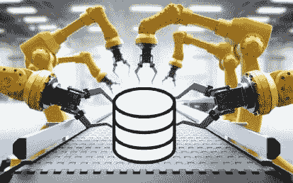

# 自动化如何改善数据科学家的角色

> 原文：[`www.kdnuggets.com/2020/10/automation-improving-data-scientists.html`](https://www.kdnuggets.com/2020/10/automation-improving-data-scientists.html)

评论 

来源: [数据科学中的自动化](https://towardsdatascience.com/automation-in-data-science-f11fe389d49b)

* * *

## 我们的前三个课程推荐

 1\. [Google 网络安全证书](https://www.kdnuggets.com/google-cybersecurity) - 快速进入网络安全职业轨道。

 2\. [Google 数据分析专业证书](https://www.kdnuggets.com/google-data-analytics) - 提升你的数据分析能力

 3\. [Google IT 支持专业证书](https://www.kdnuggets.com/google-itsupport) - 支持你的组织 IT

* * *

很多人担心自动化是否会最终取代数据科学家的工作。更可能的结果——而且这种情况已经在发生——是数据自动化将增强科学家们花费时间的方式，并改善他们的成果。以下是五种方式它可以提供帮助。

### **1\. 加速项目完成时间**

从数据中获取洞察是决策者最常关注的方面。然而，虽然不那么令人兴奋但却至关重要的任务，比如整理、清理和格式化信息，可能会占据比人们最初意识到的更多项目时间。投资于自动化可以让数据科学团队更高效、更灵活。

举例来说，一家利用数据科学的银行领导发现获取关键洞察所需的时间超过了预期。他们通过自动化补充了工作。在做出这个改变之前，公司每三个月完成一到两个项目。引入自动化[让他们在相同的时间框架内完成了十倍的项目](https://www.techrepublic.com/article/how-automation-speeds-up-data-science-projects/)。

### **2\. 为有价值的任务提供更多时间**

即使数据自动化越来越受欢迎，它也不会取代公司雇佣科学家的需求。相反，自动化工具将提供[更多时间用于那些对公司最有价值的职责](https://www.cdotrends.com/story/15059/why-automation-will-not-kill-data-science-jobs)。

例如，与其将大量工作时间用于将信息整理成正确的格式，数据专业人员可以利用他们的判断分析结果，或专注于创建帮助企业追踪趋势的算法。

最聪明的技术工具不能替代人类的智慧和经验。它们也可能无法检测到可能导致不可靠结果的错误。数据科学自动化在不需要人类知识的重复任务中表现优异。这种方法使人们能够以个人有益的方式运用他们的技能，同时也造福于雇主。

### **3\. 允许数据科学家在任何地方工作**

回顾与数据自动化相关的近期历史，可以看到它如何改善了几乎所有使用它的行业。

在一个例子中，制药专家探索了一个[自动发送全球通知](https://trifectaclinical.com/the-case-for-a-cloud-based-safety-letter-notification-system/)的系统，关于基于某一国家法规的药物安全事件。云计算的兴起也推动了自动化系统在数据处理中的采用。

根据 2016-2022 年全球自动化即服务市场的市场研究报告，[该行业将增长到 62.3 亿美元](https://www.marketsandmarkets.com/Market-Reports/automation-as-a-service-market-57656106.html)，到期末实现 28.1%的年均增长率。分析师指出，云计算是增长的重要推动因素。例如，如果数据科学家使用自动化即服务工具来减少手动任务，他们可能会通过云完成工作，并在任何地方进行工作。

### **4\. 帮助更多的数据科学项目成功**

广泛引用的研究[表明大多数数据科学](https://www.datanami.com/2020/10/01/most-data-science-projects-fail-but-yours-doesnt-have-to/)项目失败。这发生的原因多种多样，包括数据孤岛和技能短缺。

然而，自动化可以为专业人士提供他们所需的资源，使即将到来或当前的项目每一个都获得成功的机会。例如，它可以帮助人们更快地测试假设，从而更有效地排除错误的假设。

数据科学自动化还使与信息打交道的专家能够追求持续改进。正如之前提到的，自动化技术有助于加快项目完成速度。

然而，它也可能带来整体更好的结果。当工具处理最重复的任务时，数据科学家可以利用他们的脑力和经验在项目可能失败时采取纠正措施。

### **5\. 促进更准确的结果**

在数据领域，一个经常被提到的警告是算法的聪明程度仅仅取决于构建它的人类。

一些人倾向于让自动化工具尽可能多地完成任务，但这种方法往往会导致错误。因此，一些专家提倡所谓的增强智能。它结合了人工智能（AI）与人类知识。

一家公司利用 AI [对成千上万](https://www.forbes.com/sites/ganeskesari/2020/10/19/go-beyond-artificial-intelligence-why-your-business-needs-augmented-intelligence/#2c6e202d23c2) 的客户评论进行分类，用于年度调查。算法的平均准确率为 90%，但在一些类别中降至 60%。公司通过引入人工专业知识来处理置信度较低的分组，从而弥补了这一差距。这种方法提高了准确性，并产生了可信的结果。

### **数据科学自动化展现潜力**

人类的专业知识无疑将数据科学的努力提升到了极致。然而，公司不应忽视数据科学自动化产品如何帮助熟练人员以最有效、最有用的方式处理信息。

**个人简介：德文·帕蒂达** 是一位大数据和技术作家，同时也是 [**ReHack.com**](https://rehack.com/) 的总编辑。

**相关内容：**

+   AutoML 何时会取代数据科学家？调查结果与分析

+   预测分析在劳动行业中的潜力

+   数据科学家开发出更快速的污染减少和温室气体排放削减方法

### 相关话题

+   [数据科学工作流中的自动化](https://www.kdnuggets.com/2023/03/automation-data-science-workflows.html)

+   [免费 Python 自动化课程](https://www.kdnuggets.com/2022/07/free-automate-python-course.html)

+   [3 个有用的 Python 自动化脚本](https://www.kdnuggets.com/2022/11/3-useful-python-automation-scripts.html)

+   [超越准确性：利用 NLP 测试库评估与改进模型](https://www.kdnuggets.com/2023/04/john-snow-beyond-accuracy-nlp-test-library.html)

+   [提升 SQL 查询性能的 5 个技巧](https://www.kdnuggets.com/5-tips-for-improving-sql-query-performance)

+   [获得数据工程师职位：免费课程和认证](https://www.kdnuggets.com/landing-a-data-engineer-role-free-courses-and-certifications)
