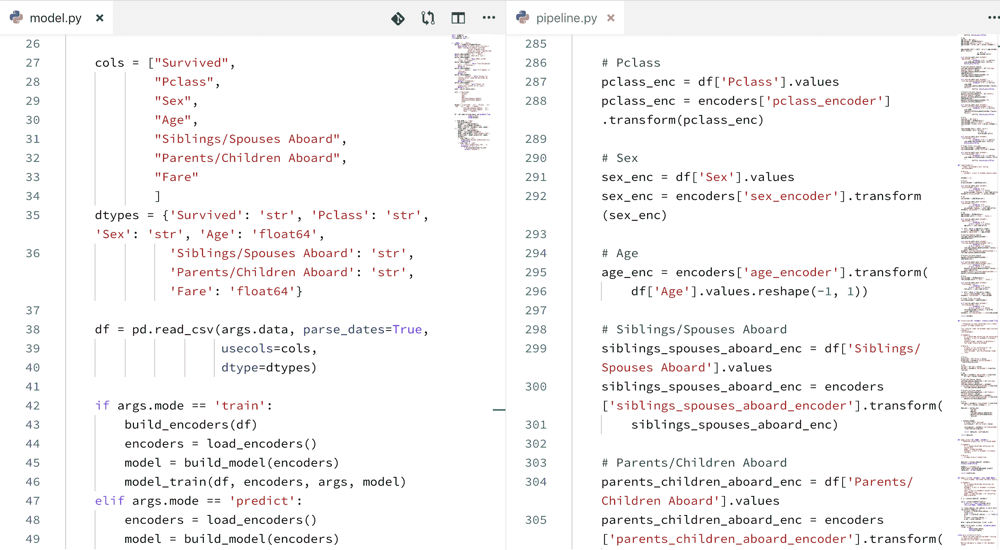

# 自动化机器学习项目实施复杂性

> 原文：[`www.kdnuggets.com/2019/11/automl-implementation-complexities.html`](https://www.kdnuggets.com/2019/11/automl-implementation-complexities.html)

评论 

图片由 Soroush Zargar 提供，来源于 Unsplash

自动化机器学习（AutoML）涵盖了一个相当广泛的任务范围，这些任务可以合理地被认为是机器学习流程的一部分。

一个 AutoML “解决方案”可能包括数据预处理、特征工程、算法选择、算法架构搜索和超参数调整等任务，或者这些任务的某些子集或变体。因此，自动化机器学习现在可以被视为从仅执行单一任务（如自动化特征工程），到完全自动化的流程（从数据预处理、特征工程到算法选择等）的任何事物。

然而，实际的 AutoML 还有一个重要维度，即其实施复杂性。这一维度决定了实现和配置 AutoML 项目所需的配置和工程努力。有些解决方案可以轻松集成到现有的软件 API 中；有些是现有 API 的封装；还有些则进一步远离现有 API，通过命令行或单行代码调用。

为了展示 AutoML 之路上实施复杂性的差异，让我们看看 3 个具体的软件项目如何处理这样的 AutoML “解决方案”，即 Keras Tuner、AutoKeras 和 automl-gs。我们将看到这些项目在哲学上彼此间的差异，并了解实现这些方法所需或适合的不同级别的机器学习知识。

请注意，这些项目中的前两个直接与 Keras 和 TensorFlow 相关，因此它们特定于神经网络。然而，其他 AutoML 软件在这些相对实施复杂性下并不一定特定于神经网络；这两个工具仅提供了一种在实施复杂性之间进行比较的简便方法。

还需要注意的是，所评估的复杂性是解决方案的实际代码实现复杂性。还有许多其他的 AutoML 相关复杂性会影响其整体复杂性，包括数据集的大小、维度等。

### Keras Tuner

让我们从[Keras Tuner](https://keras-team.github.io/keras-tuner/)开始，我将其称为“需要一些组装”的自动化机器学习项目。为了成功实施该项目的解决方案，您需要对神经网络、其架构和使用 Keras 库编写代码有一定了解。因此，这比本文讨论的其他库更为“深入”。

本质上，Keras Tuner 为 Keras 提供自动化的超参数调优。您定义一个 Keras 模型，并注明希望包含在自动化调优中的超参数以及搜索空间，然后 Keras Tuner 执行繁重的工作。这些超参数可以包括条件参数，搜索空间可以限制到您喜欢的程度，但本质上这是一个超参数调优应用程序。

回想一下，本文提到的复杂性不是指特定项目执行的 AutoML 任务数量，而是实现这些任务的代码的复杂性。在这方面，鉴于我们可以称之为底层基础库代码的部分必须编写并与我们的 AutoML 库集成，Keras Tuner 代表了 AutoML 实现复杂性谱系中更复杂的一端。

Keras Tuner 最可能的用户是机器学习工程师或数据科学家。您不太可能发现具有少量或没有编码或机器学习专业知识的特定领域专家直接跳转到 Keras Tuner，而不是下面的其他项目之一。要了解原因，这里是如何实现一些非常基础的 Keras Tuner 代码的快速概述（示例来自[Keras Tuner 文档网站](https://github.com/keras-team/keras-tuner)）。

首先，您需要一个函数来返回一个编译好的 Keras 模型。它接受一个参数，从中采样超参数：

```py
from tensorflow import keras
from tensorflow.keras import layers
from kerastuner.tuners import RandomSearch

def build_model(hp):
    model = keras.Sequential()
    model.add(layers.Dense(units=hp.Int('units',
                                        min_value=32,
                                        max_value=512,
                                        step=32),
                           activation='relu'))
    model.add(layers.Dense(10, activation='softmax'))
    model.compile(
        optimizer=keras.optimizers.Adam(
            hp.Choice('learning_rate',
                      values=[1e-2, 1e-3, 1e-4])),
        loss='sparse_categorical_crossentropy',
        metrics=['accuracy'])
    return model
```

然后，您需要一个调优器，它指定了模型构建函数、优化目标、试验次数等内容。

```py
tuner = RandomSearch(
    build_model,
    objective='val_accuracy',
    max_trials=5,
    executions_per_trial=3,
    directory='my_dir',
    project_name='helloworld')
```

然后开始搜索最佳超参数配置：

```py
tuner.search(x, y,
             epochs=5,
             validation_data=(val_x, val_y))
```

最后，要么检查最佳模型，要么打印结果总结：

```py
# Best model(s)
models = tuner.get_best_models(num_models=2)

# Summary of results
tuner.results_summary()
```

您可能会犹豫是否将此实现的代码称为极其复杂，但当您与以下项目进行比较时，我希望您改变主意。

要查看上述代码的更多细节、Keras Tuner 的一般过程以及您可以对该项目做的更多工作，请参见[其网站](https://keras-team.github.io/keras-tuner/)。

### AutoKeras

接下来是[AutoKeras](https://github.com/keras-team/autokeras)，我将其称为“现成的”解决方案，这是一种预打包的、或多或少已经准备好的解决方案，使用更为限制性的代码模板。AutoKeras 自我描述为：

> AutoML 的**终极目标**是为具有有限数据科学或机器学习背景的领域专家提供易于访问的深度学习工具。

为了实现这一点，AutoKeras 执行了 Keras 神经网络模型的架构搜索和超参数调整。

这是使用 AutoKeras 的基本代码足迹：

```py
import autokeras as ak

clf = ak.ImageClassifier()
clf.fit(x_train, y_train)
results = clf.predict(x_test)
```

如果你使用过 Scikit-learn，这种语法应该很熟悉。上述代码使用了`task` API；不过，还有其他更复杂的 API。你可以在[项目文档网站](https://autokeras.com/tutorial/)上找到这些附加 API 的更多信息和更详细的教程。

显然，上述 AutoKeras 代码的复杂性相比 Keras Tuner 显著降低。然而，当你降低复杂性时，确实会牺牲一些精度，这是明显的权衡。对于具有有限机器学习专业知识的领域专家来说，这可能是一个不错的平衡点。

### automl-gs

我们要查看的第三种解决方案是[automl-gs](https://github.com/minimaxir/automl-gs)，它从 30,000 英尺的高度审视 AutoML 实现。这超越了“现成”实现的复杂性，提供了一种有点类似 Staples 简易按钮的方法。

automl-gs 提供了一个“零代码/模型定义接口”。你只需将其指向一个 CSV 文件，确定要预测的目标字段，然后让它自动运行。它生成的 Python 代码可以集成到现有的机器学习工作流中，类似于[流行的 AutoML 工具 TPOT](https://github.com/EpistasisLab/tpot)的功能。automl-gs 还宣称它不是黑箱，因为你可以看到数据是如何处理的，模型是如何构建的，从而在事后进行调整。

automl-gs 执行数据预处理，并目前使用神经网络（通过 Keras）和 XGBoost 构建模型，同时计划实现 CatBoost 和 LightGBM。

这里是调用 automl-gs 的两种方法的比较，通过命令行和通过一行代码。请注意，你可以在[项目网站](https://github.com/minimaxir/automl-gs)上找到关于配置选项的更多信息以及检查输出的内容。

命令行：

```py
automl_gs titanic.csv Survived
```

Python 代码：

```py
from automl_gs import automl_grid_search
automl_grid_search('titanic.csv', 'Survived')
```

现在应该很容易比较这三种级别的 AutoML 项目复杂性。

automl-gs 可以通过单个命令行命令或单行 Python 代码 API 调用执行。因此，这个项目可能被任何人使用，从寻找项目基准的专业数据科学家，到具有有限编码技能或没有统计知识的业余爱好者，寻求数据科学的入门（在这里插入关于操控你不理解的力量的标准警告）。虽然一个业余项目基于预测做出一些重要决策可能会有问题（在我看来不太可能），但将机器学习和 AutoML 开放给任何想要了解更多的人确实具有价值。



automl-gs 输出代码示例 ([来源](https://github.com/minimaxir/automl-gs))

类似于 TPOT，我认为这里的价值在于创建项目基准的潜在低门槛。可以将 automl-gs 指向一个 CSV，让它并行地进行操作，同时手动制作竞争解决方案，并比较结果。这也可以通过其他 AutoML 工具完成，但这种低复杂度工具的绝对简单性依赖于几乎无需设置和考虑的特性，使得它能够非常快速地启动。能够在之后审查模型并进行编辑也很有吸引力，可以作为这种并行 AutoML/手动模型构建过程的另一层添加。

### 重点内容

机器学习呈现出一系列可以以不同程度自动化的任务，以帮助简化流程并提高成功率。自动化机器学习项目在自动化任务的方式以及对这些任务的配置、执行和后续操作的控制精度上采取不同的方法。希望这里突出介绍的 3 个项目能提供一些关于 AutoML 工具的实际代码复杂度差异的具体示例，以及它们如何以及对谁有用。

**相关**：

+   GitHub 仓库劫掠者与机器学习的自动化

+   自动化超参数调整您的模型

+   自动化机器学习：究竟多少？

* * *

## 我们的前 3 个课程推荐

 1\. [Google 网络安全证书](https://www.kdnuggets.com/google-cybersecurity) - 快速进入网络安全职业轨道。

 2\. [Google 数据分析专业证书](https://www.kdnuggets.com/google-data-analytics) - 提升您的数据分析能力

 3\. [Google IT 支持专业证书](https://www.kdnuggets.com/google-itsupport) - 支持您的组织 IT

* * *

### 更多相关主题

+   [停止学习数据科学以寻找目标，并寻找目标来…](https://www.kdnuggets.com/2021/12/stop-learning-data-science-find-purpose.html)

+   [学习数据科学统计的顶级资源](https://www.kdnuggets.com/2021/12/springboard-top-resources-learn-data-science-statistics.html)

+   [一个 90 亿美元的 AI 失败，探讨](https://www.kdnuggets.com/2021/12/9b-ai-failure-examined.html)

+   [成功数据科学家的 5 个特征](https://www.kdnuggets.com/2021/12/5-characteristics-successful-data-scientist.html)

+   [是什么让 Python 成为初创公司的理想编程语言](https://www.kdnuggets.com/2021/12/makes-python-ideal-programming-language-startups.html)

+   [每个数据科学家都应该知道的三个 R 库（即使你使用 Python）](https://www.kdnuggets.com/2021/12/three-r-libraries-every-data-scientist-know-even-python.html)
