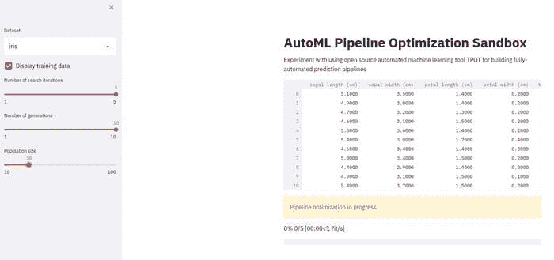
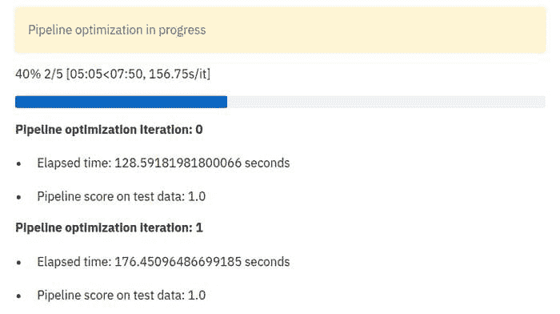
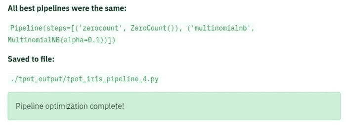
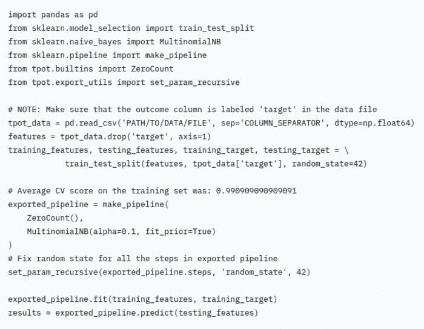

# 如何创建一个 AutoML 管道优化沙箱

> 原文：[`www.kdnuggets.com/2021/09/automl-pipeline-optimization-sandbox.html`](https://www.kdnuggets.com/2021/09/automl-pipeline-optimization-sandbox.html)

评论

你可能了解自动化机器学习（AutoML）。你很可能听说过开源的 AutoML 工具 [TPOT](https://github.com/EpistasisLab/tpot)，也就是你的 *数据科学助手*。你甚至可能看过我最近的文章，介绍了如何使用 TPOT 优化机器学习管道（你可能还没看过，所以这是你去看看它的机会... 我会等你）。

无论如何，当这些调节按钮可见且易于调整时，探索 AutoML 和机器学习优化的各种调节按钮将更具意义。在本文中，我们将实现一个版本的 TPOT 示例，我们在上一篇文章中查看过，将其作为一个 Streamlit 应用程序。

如果你不熟悉 [Streamlit](https://streamlit.io/)，这是 30,000 英尺的概述：

> Streamlit 可以在几分钟内将数据脚本转化为可分享的网页应用程序。
> 
> 全部使用 Python。完全免费。不需要前端经验。

### 概述

除了本文中使用的内容，我不会进一步详细介绍 Streamlit，但你可以在这里找到这个很棒的介绍，以及 Streamlit 备忘单，基本覆盖了在了解其工作原理后你需要知道的一切，[点击这里](https://share.streamlit.io/daniellewisdl/streamlit-cheat-sheet/app.py)。

除了快速了解实现 Streamlit 项目外，你还将获得一个沙箱网页应用程序，允许使用一对著名数据集进行管道优化实验。通过一些修改，你还应该能够让沙箱与其他数据集一起运行，并扩展功能以包括更多调节按钮。



我们使用 Streamlit 和 TPOT 构建的“AutoML 管道优化沙箱”网页应用程序

我不会重新讲述原始博客文章（请随意现在阅读），但简而言之，我们正在创建一个脚本来自动化预处理和建模的优化——包括有限数量的预处理转换以及算法选择——用于对鸢尾花和数字数据集的分类任务。确实，数据集比较无聊，但使用知名数据来设置应用程序并不是一个坏主意，正如我上面所说，修改几行代码后，你可以尝试任何其他数据集。

关于这个优化过程的一些注意事项，除了上述内容，还有：

+   用于模型评估的交叉验证

+   对建模进行多次迭代（由于 TPOT 内部使用遗传算法）— 对如此小的数据集可能没有用，但随着进展可能会有帮助

+   比较这些多次迭代的结果管道——它们都是相同的吗？

+   你知道 TPOT 现在在后台使用 PyTorch 来构建神经网络进行预测吗？

最后一点今天我们不考虑，但请记住以备未来使用。

让我们看一下创建这个简单 Streamlit 应用所需的代码。

### 代码

首先，导入：

```py
import streamlit as st

import timeit
import pandas as pd
import matplotlib.pyplot as plt

from tpot import TPOTClassifier
from sklearn.model_selection import StratifiedKFold
from sklearn.model_selection import train_test_split
from sklearn.datasets import load_digits, load_iris
from sklearn import metrics
from stqdm import stqdm
```

一切应该都相当直接。最后一个导入，`stqdm`，是一个 [tqdm](https://github.com/tqdm/tqdm) 风格的进度条，专门为 Streamlit 编写。

接下来，这是数据加载器函数：

```py
@st.cache
def load_data(dataset, train_size, test_size, random_state):
	"""Load data"""
	ds = ''
	if dataset == 'digits':
		ds = load_digits()
		df = load_digits(as_frame=True)
	if dataset == 'iris':
		ds = load_iris()
		df = load_iris(as_frame=True)
	X_train, X_test, y_train, y_test = train_test_split(ds.data, ds.target, train_size=train_size, test_size=test_size, random_state=random_state)
	return X_train, X_test, y_train, y_test, df['frame']
```

我们使用 Scikit-learn 的 load_iris() 和 load_digits() 函数（TPOT 与之紧密集成）来提取相应的数据集。请注意，这里将数据集分为训练集和测试集，训练/测试特征/标签都分别返回，并提供一个完整的数据集数据框以供展示给用户，因为这样看起来更好，尤其是在 Streamlit 上展示时（Streamlit 能够使用其 `write()` 方法解释和正确显示各种对象）。还有其他方法可以实现，但对于如此小的数据集，这种方式简单而且没有问题。注意 @st.cache 装饰器，它缓存了函数的结果以便未来应用运行时使用，而不是每次都重新加载数据。

现在我们设置一些全局 Streamlit 配置，设置侧边栏，分配一些变量，并使用上述函数加载数据：

```py
# Set title and description
st.title("AutoML Pipeline Optimization Sandbox")
st.write("Experiment with using open source automated machine learning tool TPOT for building fully-automated prediction pipelines")

# Create sidebar
sidebar = st.sidebar
dataset = sidebar.selectbox('Dataset', ['iris','digits'])
train_display = sidebar.checkbox('Display training data', value=True)
search_iters = sidebar.slider('Number of search iterations', min_value=1, max_value=5)
generations = sidebar.slider('Number of generations', min_value=1, max_value=10)
population_size = sidebar.select_slider('Population size', options=[10,20,30,40,50,60,70,80,90,100])

random_state = 42
train_size = 0.75
test_size = 1.0 - train_size
checkpoint_folder = './tpot_checkpoints'
output_folder = './tpot_output'
verbosity = 0
n_jobs = -1
times = []
best_pipes = []
scores = []

# Load (and display?) data
X_train, X_test, y_train, y_test, df = load_data(dataset)
if train_display:
	st.write(df)
```

将上面的代码与先前作为独立脚本实现的文章或 Streamlit 快捷参考进行比较，相关内容应该都相当直接。

注意到设置交互式用户配置变量的简易性，这些变量随后被用于我们的代码中，以及设置侧边栏的简易性。我们可以使用滑块、复选框和下拉框来选择和显示数据集，并设置遗传算法 TPOT 内部用于优化过程的搜索迭代次数、代数和种群大小。应该越来越容易看出，如何在不费太多力气的情况下将其开放给自定义数据集。

接下来，让我们定义评分方法、模型评估方法和实际的搜索方法。之后，显示优化循环，其中包括一些特定于迭代的输出以便用户参考。

```py
# Define scoring metric and model evaluation method
scoring = 'accuracy'
cv = ('stratified k-fold cross-validation',
       StratifiedKFold(n_splits=10,  
       shuffle=True,
       random_state=random_state))

# Define search
tpot = TPOTClassifier(cv=cv[1],
		      scoring=scoring,
	              verbosity=verbosity,
		      random_state=random_state,
		      n_jobs=n_jobs,
		      generations=generations,
		      population_size=population_size,
		      periodic_checkpoint_folder=checkpoint_folder)

# Pipeline optimization iterations
with st.spinner(text='Pipeline optimization in progress'):
	for i in stqdm(range(search_iters)):
		start_time = timeit.default_timer()
		tpot.fit(X_train, y_train)
		elapsed = timeit.default_timer() - start_time
		score = tpot.score(X_test, y_test)
		best_pipes.append(tpot.fitted_pipeline_)
		st.write(f'\n__Pipeline optimization iteration: {i}__\n')
		st.write(f'* Elapsed time: {elapsed} seconds')
		st.write(f'* Pipeline score on test data: {score}')
	tpot.export(f'{output_folder}/tpot_{dataset}_pipeline_{i}.py')
```

此时，你应该将 `write()`、`spinner()`、`success()` 和 Streamlit 快捷参考中的其他显示功能进行比较。

一旦运行，上述优化循环将输出类似以下内容的结果：



最后，我们需要评估我们的结果：

```py
# check if pipelines are the same
result = True
first_pipe = str(best_pipes[0])
for pipe in best_pipes:
	if first_pipe != str(pipe):
		result = False
if (result):
	st.write("\n__All best pipelines were the same:__\n")
	st.write(best_pipes[0])
else:
	st.write('\nBest pipelines:\n')
	st.write(*best_pipes, sep='\n\n')

st.write('__Saved to file:__\n')
st.write(f'```{output_folder}/tpot_{dataset}_pipeline_{i}.py```py')

st.success("Pipeline optimization complete!")
```



...并输出最佳管道的代码（也保存到文件中）：

```py
# Output contents of best pipe file
with open (f'{output_folder}/tpot_{dataset}_pipeline_{i}.py', 'r') as best_file:
	code = best_file.read()
st.write(f'```{code}```py')
```



这是完整的 Streamlit 应用程序代码（请注意，除了这个简短的 Python 脚本之外不需要其他任何东西来完成所有工作）：

这就是如何快速构建由 Streamlit 和 TPOT 提供支持的 AutoML 管道优化沙箱，只需使用 Python 代码即可。请注意我们在成功实现这一目标时所需的网络编程技能的缺乏。

非常好。成功！


**相关**：

+   使用 TPOT 的机器学习管道优化

+   Python 中的简单 AutoML

+   使用 FLAML + Ray Tune 的快速 AutoML

* * *

## 我们的前三大课程推荐

 1\. [Google 网络安全证书](https://www.kdnuggets.com/google-cybersecurity) - 快速进入网络安全职业生涯。

 2\. [Google 数据分析专业证书](https://www.kdnuggets.com/google-data-analytics) - 提升你的数据分析技能

 3\. [Google IT 支持专业证书](https://www.kdnuggets.com/google-itsupport) - 支持你所在组织的 IT

* * *

### 更多相关主题

+   [使用 TPOT 的机器学习管道优化](https://www.kdnuggets.com/2021/05/machine-learning-pipeline-optimization-tpot.html)

+   [无需脑力的 AutoML 与 AutoXGB](https://www.kdnuggets.com/2022/02/no-brainer-automl-autoxgb.html)

+   [Nota AI 发布 NetPresso 模型搜索的测试版，他们的…](https://www.kdnuggets.com/2022/04/nota-ai-releases-beta-version-netpresso-model-search-hardwareaware-automl-tool.html)

+   [2023 年你应该考虑的顶级 AutoML 框架](https://www.kdnuggets.com/2023/05/best-automl-frameworks-2023.html)

+   [SQL 查询优化技术](https://www.kdnuggets.com/2023/03/sql-query-optimization-techniques.html)

+   [数据库优化：探索 SQL 中的索引](https://www.kdnuggets.com/2023/07/database-optimization-exploring-indexes-sql.html)
