# LinkedIn 供稿排名的多目标优化的自动调节

> 原文：[`www.kdnuggets.com/2020/08/autotuning-multi-objective-optimization-linkedin-feed-ranking.html`](https://www.kdnuggets.com/2020/08/autotuning-multi-objective-optimization-linkedin-feed-ranking.html)

评论

**由 [Marco Varela](https://www.linkedin.com/in/marcovarelaalvarado/) 和 [Mavis Li](https://www.linkedin.com/in/mavis-li-67aab91a/)，LinkedIn**

LinkedIn 主页上的供稿使命是使会员能够建立一个积极的专业社区，促进他们的职业发展。为了在供稿上提供最佳体验，我们利用人工智能（AI）向会员展示最相关的内容。这是具有挑战性的，因为我们需要从数百个选项中选择要展示的内容。这些内容类型可以包括其他会员分享的文章、职位推荐、课程推荐等，每种类型以不同的方式丰富我们的生态系统，这些共同的目标是实现 LinkedIn 的使命，即“连接全球专业人士，让他们更高效、更成功”。鉴于我们希望为会员提供多样化且丰富的体验，我们不能仅仅追求点击量的增加。

为了在内容上实现最佳的平衡以优化会员体验，我们采用了 [多目标优化](https://en.wikipedia.org/wiki/Multi-objective_optimization) 方法。我们有不同的机器学习模型来优化不同的目标，比如反应、评论、行动的下游影响。然而，这些不同目标的平衡是通过机器学习工程师手动调整参数来实现的，这非常低效。

在这篇文章中，我们分享了如何开发一个自动化系统来调整我们机器学习模型中的一个主要参数，该模型推荐 LinkedIn 供稿中的内容，这只是 [以社区为中心的架构](https://engineering.linkedin.com/blog/2019/06/community-focused-feed-optimization) 的一部分。我们的目标是实现成员指标的适当平衡，同时考虑到工程师的生产力和满足我们生态系统中的约束。有关 LinkedIn 供稿的更多背景信息，请参考 [这篇博客文章](https://engineering.linkedin.com/blog/2018/03/a-look-behind-the-ai-that-powers-linkedins-feed--sifting-through)。

### 在供稿上管理指标权衡的方法

为了应对我们生态系统中的复杂性和权衡，我们在优化一组度量标准的同时保持另一组标准不变。优化部分来自我们希望最大化会员的“贡献”。我们所说的“贡献”主要指点赞、评论和分享，这些行为更有可能在我们的生态系统中驱动对话，而不是简单的文章点击。贡献通过几种方式推动更多对话：分享会在 Feed 上创建新的帖子，评论使会员能够与帖子作者开始对话，点赞则在会员网络中生成下游更新。这些行为可以被视为“主动”的，因为会员通过为生态系统做出贡献而主动消费内容。

然而，我们也希望为那些不那么以对话为驱动的内容留下空间，这些内容可以被视为更“被动”的内容。特别是，Feed 上的不频繁访客更可能参与被动消费。基于这些原因，我们决定保持“被动”消费不变。

### 将度量权衡转化为评分函数

鉴于我们需要在 LinkedIn Feed 上管理内容和目标的多样性，我们决定采用 [多目标优化](https://en.wikipedia.org/wiki/Multi-objective_optimization) 方法对我们的 Feed 内容进行排序。从高层次来看（略过许多细节），我们用以下方程粗略地对每个更新进行评分：

你可以将每个 P(x) 视为模型对特定目标的概率评分。我们使用一种称为点击权重（????）的杠杆来选择更偏向被动消费的内容（例如，可能会驱动点击的工作或文章推荐）与更偏向社区驱动的内容（例如，可能会鼓励评论的帖子）。不同类型的内容在某些使用场景下表现更佳，因此在被动消费和主动消费之间存在权衡。即使在特定类型的内容中，也可能有鼓励更多被动行为而非主动行为的条目。例如，热门文章可能只会鼓励点击，而来自密切联系人的文章可能会引发讨论。

### 为什么我们需要不断管理权衡

既然我们已经提供了足够的关于 LinkedIn Feed 的背景信息，我们想分享一些我们在选择合适的 ????（点击权重）以平衡被动消费（即点击）与主动消费（即点赞、评论、分享）过程中的经历。在接下来的内容中，我们将把点赞、评论和分享的动作集合称为“贡献”。

???? 参数决定了主动和被动消费之间的平衡，不能保持静态，原因有几个。我们不断改进我们的机器学习模型，以提供最佳的会员体验，这可能会影响两个指标之间的平衡。例如，我们可能会加入新功能或尝试新的建模方法。这会以多种方式影响平衡。一种方式是某个特定的特征变化（例如，会员对文章帖子的偏好）或模型变化可能在推荐主动消费内容时比被动消费更有效，反之亦然。另一种方式是我们的训练过程中存在随机成分，这可能会在重新训练模型后改变最佳权重。

### 在多目标环境中维持平衡的挑战

我们最初管理正确平衡的方法是基于历史数据建立离线模拟器，运行我们的模型，然后获取不同 ???? 值的模拟指标。这使我们能够通过查看如下输出图表来感知正确的 ????, 其中每个点表示一个不同的 ????：

*图 1：模拟结果（点击率和贡献率的实际值被排除，因为它们与此帖不相关）。对照组是我们会员的标准体验，而处理组是正在评估的标准体验的变体。*

然而，这种方法证明还不够。由于几个原因，我们的模拟器方法在预测在线世界中的效果时固有的存在局限性：

1.  LinkedIn 生态系统随时间变化。也许会引入影响会员行为的 UI 变化，或者我们可能会向信息流中引入之前没有的新内容，如投票。这些变化很难在离线环境中复制，因为模拟器仅限于历史数据，可能无法完全反映当前的生态系统状态。

1.  会员可能采取的行动顺序可能会根据显示的内容而有所不同。例如，如果他们首先看到一篇他们非常喜欢的文章，他们可能更有可能继续与其他更新进行互动。

1.  生态系统中有一些 [强化学习](https://en.wikipedia.org/wiki/Reinforcement_learning) 组件，在模拟器环境中特别难以体现。

结果，机器学习工程师不得不在线上发布多个版本的模型以测试不同的 ???? 值，这带来了两个主要痛点。首先，对于工程师来说，创建具有不同 ???? 值的模型变体变得耗时，特别是因为这一过程涉及反复试验。其次，由于我们依赖 A/B 实验来评估每个变体，我们会耗尽在线流量，无法进行我们希望进行的实验。

### 选择权衡的新方法：在线自适应调优

鉴于手动调优????在线上存在的困难，我们决定自动化这个过程，以减少人工工程工作和在线流量负担。我们确定了几个要求，以便我们的团队能够轻松利用该工具，并在尊重在线流量需求的情况下允许同时进行足够多的实验：

1.  该工具需要易于使用，因为我们试图减少工程师的人工工作，并且它应该能够被数十名机器学习工程师轻松采用。

1.  该工具只需占用总流量的一小部分。例如，如果工具占用 50% 的流量，那就没有用处。

1.  该工具应该在相对较短的时间内得出????的最佳值。例如，如果该工具需要一个月才能找到最佳权重，那就没有用处。

需求 2 和 3 是必要的，以确保我们可以最大化同时进行的实验数量。

### 在线自动调优的实施：初步策略概述

考虑到这些要求，我们决定在 LinkedIn 中利用[TALOS](https://www.kdd.org/kdd2018/accepted-papers/view/online-parameter-selection-for-web-based-ranking-problems)（调优所有大规模在线系统）库，该库旨在在线环境中学习参数。我们的目标是自动调整点击权重（????），以最大化贡献的同时保持被动消费水平。正式地，我们的问题可以写成如下：

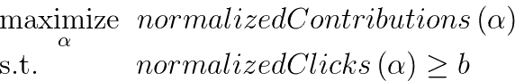,

其中*b*是等于基线模型的归一化点击数的常数，????是点击权重。我们根据 Feed 加载的次数以及相关的 alpha（即贡献/加载的 Feed）对贡献和点击进行了归一化。

我们解决这个问题的初步尝试是使用[探索-利用](https://en.wikipedia.org/wiki/Multi-armed_bandit)策略与 TALOS。探索阶段将成员分配到不同的点击权重桶中，并收集相关指标（即贡献，归一化点击）几天。在利用阶段，算法将聚焦于一个点击权重范围内，收集该范围内更接近解决方案的额外数据。

### 在线自动调优的实施：指标理解

在我们实施解决方案之前，首先集中精力理解我们的指标。这涉及确定探索的网格点和搜索范围。我们根据历史模型迭代中手动选择的点击权重 [0.0, 0.005] 选择了探索的搜索范围。选择网格点数存在权衡。增加点数可以为点击权重提供更多的细粒度，但也使每个点的流量减少，从而增加了指标中的噪声。当我们用 31 个网格点收集指标时，我们在归一化贡献指标中看到主要是噪声，而在归一化点击指标中看到上升趋势。这在图 2a 和 2b 中得到了说明，这些图显示了对桌面（非应用程序）用户的实验结果。

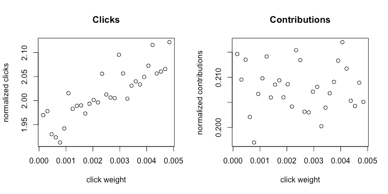

*图 2a, 2b: 小搜索范围，31 个点*

为了改善这种情况，我们做了两件事：

1.  将点数从 31 减少到 15，以在每个点击权重下收集更多数据。

1.  扩大了我们的搜索范围，以便更清楚地看到贡献与点击权重之间的关系。

从图 3a 和 3b 中可以看到，经过更改后，点击和贡献都有明显的趋势。

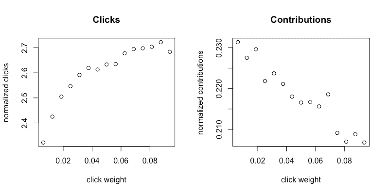

*图 3a, 3b: 大搜索范围，15 个点*

图 3a 和 3b 是减少点数并增加搜索范围的结果。

### 在线自动调优的实施：初步策略经验

一旦确定了可靠捕捉指标的正确参数，我们进行了利用阶段的实验，如下图所示。由于这一部分示例了不同平台（移动设备）上的不同模型，因此搜索范围不同。

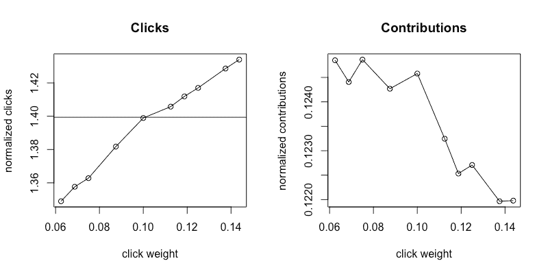

*图 4a, 4b: 探索结果*

图 4a 和 4b 显示了在探索阶段收集的指标。我们可以在归一化点击指标（4a）中看到明显的正向趋势，而在归一化贡献指标（4b）中看到下降但嘈杂的趋势。黑色水平线表示常数 b，即我们控制模型的归一化点击量。

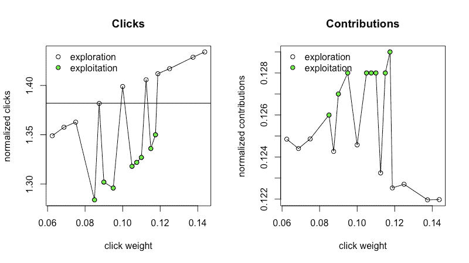

*图 5a, 5b: 探索和利用结果*

图 5a 和 5b 显示了在探索阶段之后和利用阶段的指标汇总。白色点来自探索阶段（数据与图 4a 和 4b 相同）。探索阶段之后，算法决定解决方案位于缩小的搜索范围内，并选择了新的点（绿色点）以收集利用阶段的指标。

绿色的利用点给我们的指标增加了过多的噪音，使得实际可行的点击权重变得不清晰。这很让人惊讶，因此我们更仔细地查看了我们的指标。我们首先查看了从前一天起标准化点击的变化。如图 6 所示，在某些日子中，变化幅度可以达到 12%。

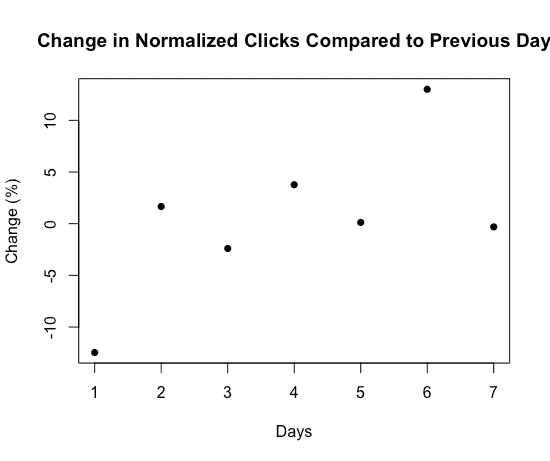

*图 6：标准化点击的日间变化*

这表明我们的指标存在显著的日间变化，并解释了为什么我们的利用点与探索相比具有如此不同的趋势，这扰乱了算法，因为我们的指标可能受到点击权重和一天中的时间的类似影响。

LinkedIn 应用的使用在每周的不同日期变化显著（例如，专业人士在星期五和星期三的使用模式不同），因此看到这种变异性并不完全令人惊讶。

这尤其具有挑战性，因为我们的工具期望探索和利用的数据趋势相似；然而，一旦我们将探索和利用数据放在一起（如工具要求的那样），趋势就丢失了。由于这些原因，我们决定跳过利用阶段，以在我们工作所限的时间和提升约束下保持合理的趋势。

### 在线自调节的实施：优化问题的修订

我们随后专注于仅对探索数据应用优化问题，如下所示。我们最初收集了我们在项目开始时设定的两倍在线流量需求的数据（即需求 2），以更好地理解我们的指标。图 7a 和 7b 总结了收集的数据。图 7b 中的蓝色点对应于图 7a 中的蓝色区域，即我们的约束定义的可行区域。

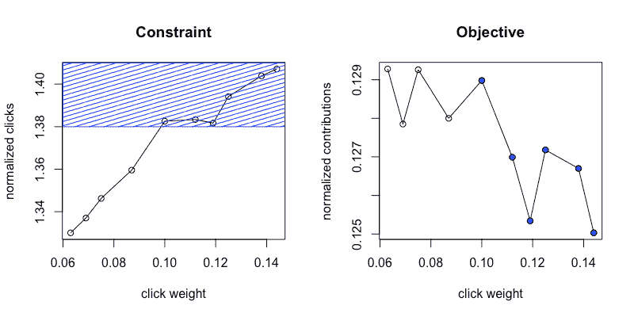

*图 7a，7b：带约束的可行区域*

我们最大的挑战是弄清楚如何处理贡献指标的噪音问题。正如我们从公共贡献的图表中看到的，即使在所需的提升百分比的两倍下，贡献指标仍然非常嘈杂。由于我们 A/B 实验的流量有限，我们无法信任贡献(????)指标。

为了应对这一挑战，我们更仔细地查看了我们指标的模式。由于贡献指标是????的递减函数，而我们的约束是????的递增函数，因此问题的解决方案在于活动约束集，即 normalizedClicks(????) = b。这是有用的，因为 normalizedClicks(????)是一个更稳定的指标。因此，我们可以将原始问题重新表述为基于原始约束的最小化问题，其中我们仅尝试保持标准化点击与基线相同，避免依赖 normalizedContribuons 指标。

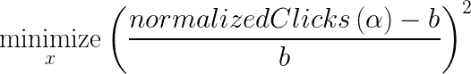

重新表述的问题涉及在没有约束的情况下最小化 normalizedClicksDelta。

### 在线自动调优的实施：最终策略和结果

在图 6a 中，我们观察了在 5%流量下，经过 2 天的点击权重范围内的新指标。图 6b 显示了点击权重 ????（在 x 轴上显示）成为优化问题中最优点的概率。这个概率是通过首先从后验高斯过程重复抽样函数，然后确定优化（最大化或最小化）这些抽样函数的点来计算的。获得的点的经验分布给出了图 6b。

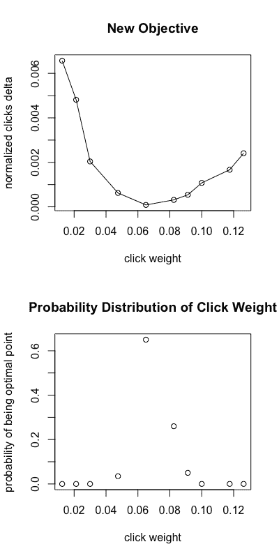

*图 8a, 8b：使用新目标的收敛情况*

以前，工程师会使用不同的点击权重来测试多个模型，以尝试找到一个调整得当的点击权重模型。如果第一组点击权重中没有理想的点击权重候选项，这可能涉及到几天后重新启动不同的点击权重。实际模型的一个示例时间表可能涉及在 5%流量下收集 4 种不同的点击权重，经过 2 天后选择一个“最优”点击权重。图 9 是引入点击自动调优之前的调试计划示例。图 10 是使用自动调优工具的新调试计划示例。

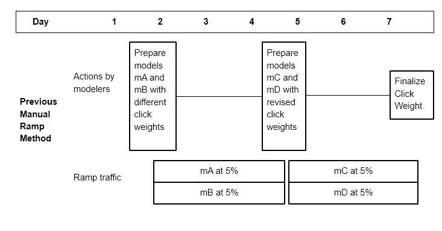

*图 9：自动调优工具之前的调试过程*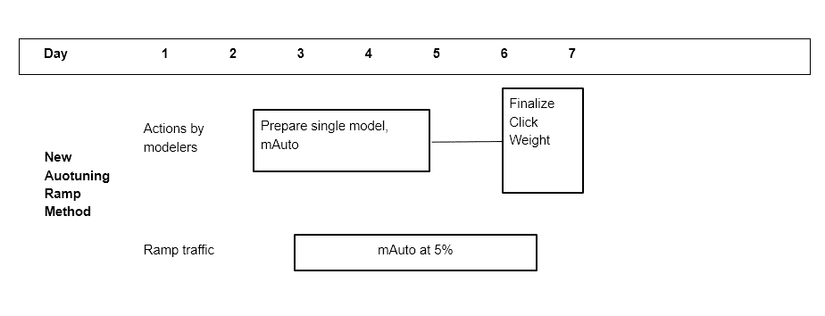

*图 10：自动调优工具后的调试过程*

旧的调试时间表可能需要在 5 天内完成 10%流量（4 天收集指标，1 天进行流量变化）。现在，通过自动选择参数 ???? 的过程，我们可以将这个部分的过程减少到在 5%流量下的 2 天。在模型调试到 5%后，工程师可以使用脚本启动点击自动调优，并在 2 天内提供一个单一的收敛点击权重。在这两天内，我们会考虑 10 种不同的点击权重，并选择一个可能位于这些点之间的解决方案。这种新工具通过以下三个方面的成本降低提高了我们的效率：

1.  调试时长

1.  调试量

1.  工程师的人工努力

此外，新工具通过在选择 ???? 时更加精准，帮助我们找到更优的点击权重，相比于以前的人工努力。

### 经验教训

在这段旅程中，我们学到了一些经验教训。首先，我们发现，在这个特定的优化问题中，将问题公式化为尽可能简单是有益的。在花时间理解我们想要目标的指标以及它们如何与我们特定的机器学习模型相关之后，我们意识到我们可以将问题定义从一个带约束的最大化问题转变为一个最小化问题。这使我们能够只处理在较低 ramp 百分比下更可靠的约束指标，同时仍然满足我们的总体目标，即在模型之间保持被动消费恒定，同时减少工程师所需的手动工作量和在线流量需求。

此外，重要的是要意识到解决方案需要解决的约束条件。在我们的案例中，我们只能允许工具使用有限的 ramp 体积，并在有限的时间内最大化同时进行的实验数量。一旦约束条件定义清晰，就更容易识别适合的解决方案。在我们的案例中，所处理的指标存在显著的日间波动，因此在我们的约束下，我们发现探索-开发算法并不适用，因为这些算法需要更长时间和更大的 ramp 来适应我们的难题。

感谢 Kinjal Basu、Viral Gupta、Yunbo Ouyang 构建参数调整库及提供建议，以及我们的经理 Ying Xuan 和 Zheng Li 的支持。

**[Marco Varela](https://www.linkedin.com/in/marcovarelaalvarado/)**是 Linkedin 的高级软件工程师，他是 Feed AI 团队的一员，专注于通过自动化和特征新鲜度提高 Feed 更新的排名。

**[Mavis Li](https://www.linkedin.com/in/mavis-li-67aab91a/)**是 Linkedin Feed AI 团队的一个软件工程师，负责 Feed 的个性化和排名。她参与了多个项目，包括将下游模型作为目标、将网络外的群组更新整合到 Feed 中，以及点击权重自动调整。

**相关：**

+   查看这份全面的模型优化技术指南。

+   自动化机器学习：免费的电子书

+   数据科学家的灭亡 – AutoML 会取代他们吗？

* * *

## 我们的前三大课程推荐

 1\. [谷歌网络安全证书](https://www.kdnuggets.com/google-cybersecurity) - 快速进入网络安全职业生涯。

 2\. [谷歌数据分析专业证书](https://www.kdnuggets.com/google-data-analytics) - 提升你的数据分析能力

 3\. [Google IT 支持专业证书](https://www.kdnuggets.com/google-itsupport) - 支持您的组织的 IT

* * *

### 更多相关内容

+   [LinkedIn 如何利用机器学习排名你的动态](https://www.kdnuggets.com/2022/11/linkedin-uses-machine-learning-rank-feed.html)

+   [使用 TPOT 优化机器学习管道](https://www.kdnuggets.com/2021/05/machine-learning-pipeline-optimization-tpot.html)

+   [使用 AIMET 优化神经网络](https://www.kdnuggets.com/2022/04/qualcomm-neural-network-optimization-aimet.html)

+   [SQL 查询优化技巧](https://www.kdnuggets.com/2023/03/sql-query-optimization-techniques.html)

+   [数据库优化：探索 SQL 中的索引](https://www.kdnuggets.com/2023/07/database-optimization-exploring-indexes-sql.html)

+   [梯度下降：优化的山地旅行者指南](https://www.kdnuggets.com/gradient-descent-the-mountain-trekker-guide-to-optimization-with-mathematics)
