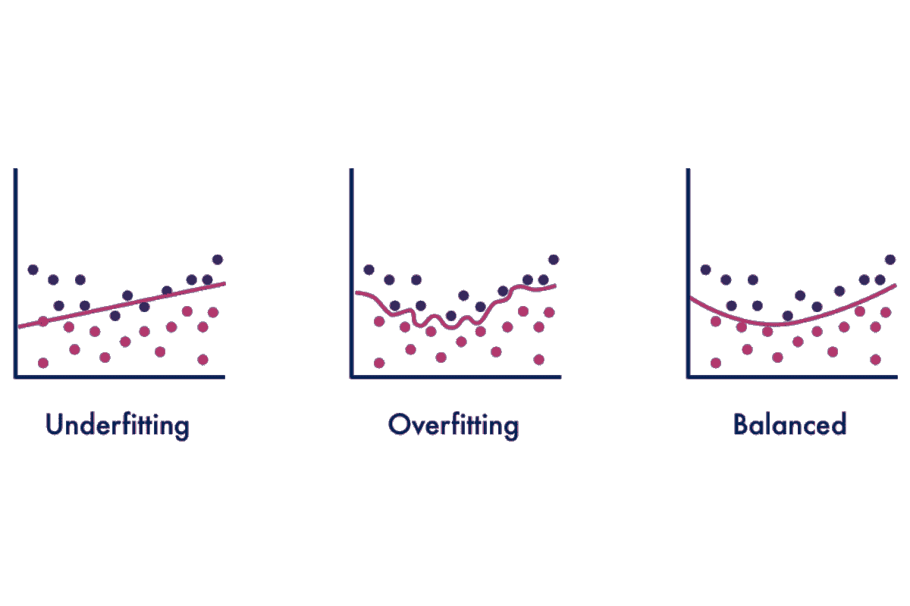

# 如何避免过拟合

> 原文：[`www.kdnuggets.com/2022/08/avoid-overfitting.html`](https://www.kdnuggets.com/2022/08/avoid-overfitting.html)

编辑器提供的图片

过拟合是许多数据科学家常犯的一个常规错误。它可能会使你数小时的编码工作付诸东流。你的模型可能会产生不准确的输出，并导致决策过程中的进一步问题。

* * *

## 我们的前三大课程推荐

 1\. [谷歌网络安全证书](https://www.kdnuggets.com/google-cybersecurity) - 快速进入网络安全职业生涯

 2\. [谷歌数据分析专业证书](https://www.kdnuggets.com/google-data-analytics) - 提升你的数据分析技能

 3\. [谷歌 IT 支持专业证书](https://www.kdnuggets.com/google-itsupport) - 支持你的组织的 IT 需求

* * *

在我们讨论如何避免过拟合之前，先来了解一下什么是过拟合。

# 什么是过拟合？

过拟合是指统计模型完全贴合其训练数据。这是一种建模错误，表明你的函数过于紧密地贴合有限的数据点。这是因为模型仅专注于它知道的变量，并自动假设这些预测将适用于测试或未见过的数据。这导致模型无法准确预测未来的观察值。

过拟合发生的原因之一是模型或数据集的复杂性。如果模型过于复杂，或者模型在一个非常大的样本数据集上进行训练——模型开始记住数据集中无关的信息。当信息被记住时，模型对训练集的拟合过于紧密，无法很好地对新数据进行泛化。

尽管在处理训练数据时，这种情况会产生低误差，但在处理测试数据时却变得非常无用，因为它会产生高误差。判断你的模型是否过拟合的一种方法是查看其是否具有低误差率但高方差。

# 什么是欠拟合？

过拟合的对立面是欠拟合。欠拟合是指模型无法准确识别输入和输出变量之间的关系。这可能是由于模型过于简单，可以通过增加更多输入特征或使用高方差模型如决策树来解决。

欠拟合最糟糕的地方在于它既不能建模训练数据，也不能对新数据进行泛化——在训练集和未见过的数据上都会产生高误差率。

# 信号和噪声

在我们了解如何避免过拟合之前，我们需要理解信号和噪声。

信号是帮助模型学习数据的真实潜在模式。例如，青少年年龄与身高之间的关系就是一个明确的关系。

噪声是数据集中随机且无关的数据。以信号的示例来说，如果我们采样一所以体育专业闻名的学校——这将导致离群值。由于身体特征，如篮球的身高，学校的学生人数会更高。这将导致模型中的随机性——显示噪声如何干扰信号。

如果你产生一个高效的机器学习模型，能够区分信号和噪声，它将表现良好。

拟合优度是一个统计术语，指的是模型预测值与观察值的匹配程度。当模型学习噪声而不是学习信号时，就会导致过拟合。模型过于复杂或过于简单会提高学习噪声的可能性。

# 防止过拟合的技术

## 训练更多数据

我将从你可以使用的最简单技术开始。在训练阶段增加数据量不仅可以提高模型的准确性，还能减少过拟合。这使得你的模型能够识别更多的信号，学习模式并减少错误。

这将帮助模型更好地推广到新数据，因为模型有更多机会理解输入与输出变量之间的关系。然而，你需要确保所使用的额外训练数据是干净的——否则，你可能会做反向操作，增加更多复杂性。

## 特征选择

减少过拟合的下一个简单技术是特征选择。这是通过仅选择相关特征来减少输入变量数量的过程，从而确保你的模型表现良好。

根据你的任务，有些特征与其他特征没有相关性或关联。因此，这些特征可以被移除，因为它们使你的模型学习不需要的东西。为了找出与任务直接相关的特征，你可以通过在单独的模型上训练不同的特征来测试它们。

你不仅会提高模型性能，还会减少建模的计算成本。

## 数据增强

数据增强是一组通过从现有数据生成新数据点来人工增加数据量的技术。

虽然增加更多干净数据是一种选择，但这也是一种非常昂贵的选择。数据增强通过使数据看起来更为多样化来降低成本，因为样本数据每次被模型处理时略有不同。每个数据集对模型来说都显得独特——提高了学习速率和性能。

噪声也可以在这个技术中使用，以提高模型的稳定性。向数据中添加噪声使数据更加多样化，而不会降低数据质量。然而，添加噪声的选择应该谨慎进行，以防止过拟合。

## 提前停止

在训练阶段通过每次迭代测量模型性能是一种有效的防止过拟合的技术。你可以通过在模型开始学习噪声之前暂停训练来实现这一点。然而，需要考虑的是，当使用“提前停止”技术时，有暂停训练过程过早的风险——这可能导致欠拟合。

## 正则化

正则化是强制你的模型变得更简单，以最小化损失函数并防止过拟合或欠拟合。它不鼓励模型学习非常复杂的东西。

这种技术旨在惩罚系数，这有助于减少过拟合，因为过拟合的模型通常具有膨胀的系数。如果系数膨胀，其效果是成本函数将增加。

正则化也是像交叉验证这样的技术的一个超参数——使得过程更简单。

## 交叉验证

交叉验证是用于衡量过拟合的最知名技术之一。它用于评估统计分析的结果对未见数据的泛化能力。

交叉验证的过程是从你的训练数据中生成多个训练-测试拆分——这些拆分用于调整你的模型。然后，参数将经历交叉验证，以选择最佳参数并将其反馈到模型中进行再训练。这将提高模型的整体性能和准确性，并帮助模型更好地泛化到未见数据。

交叉验证技术的示例包括 Hold-out、K-folds、Leave-one-out 和 Leave-p-out。

交叉验证的好处在于它简单易懂，易于实现，并且与其他方法相比，通常具有较低的偏差。

如果你想了解更多关于最常用的交叉验证技术 K-fold 的信息，可以阅读这篇文章：为什么使用 k-fold 交叉验证？

## 集成

我将要讲的最后一种技术是集成。集成方法创建多个模型，然后结合这些模型产生的预测以改善结果。最流行的集成方法包括提升和 Bagging。

### Bagging

Bagging 是“Bootstrap Aggregation”的缩写，是一种用于减少预测模型方差的集成方法。Bagging 旨在通过关注“强学习者”来减少过拟合复杂模型的可能性。

它并行训练大量强学习者，然后将这些强学习者组合在一起，以优化和产生准确的预测。决策树，例如分类和回归树（CART），通常以高方差而闻名。

### 提升算法

提升算法专注于通过提高简单模型的预测灵活性，将“弱学习者”转变为更强的学习者。它通过构建和改进简单模型为强预测模型，从而减少偏差错误。

弱学习者按顺序训练，以便它们能够专注于学习之前的错误。完成这些后，所有的弱学习者将合并成一个强学习者。

如果你想了解更多关于集成技术的信息，可以阅读这篇文章：集成技术何时是一个好的选择？

# 结论

你已经读到了最后。在这篇文章中，我们已经探讨了：

+   什么是过拟合？

+   什么是欠拟合？

+   信号与噪声

+   防止过拟合的技术

敬请关注更多深入探讨此主题的文章，例如《方差-偏差权衡》等。

**[Nisha Arya](https://www.linkedin.com/in/nisha-arya-ahmed/)** 是一位数据科学家和自由技术写作人。她特别关注提供数据科学职业建议或教程以及围绕数据科学的理论知识。她还希望探索人工智能在延长人类生命方面的不同方式。作为一个热衷学习者，她寻求拓宽自己的技术知识和写作技能，同时帮助指导他人。

### 更多相关话题

+   [KDnuggets 新闻，8 月 24 日：在 Python 中实现 DBSCAN • 如何……](https://www.kdnuggets.com/2022/n34.html)

+   [避免数据科学职业的前 5 个理由](https://www.kdnuggets.com/2022/04/top-5-reasons-avoid-data-science-career.html)

+   [新手数据科学家应避免的错误](https://www.kdnuggets.com/2022/06/mistakes-newbie-data-scientists-avoid.html)

+   [对话式人工智能开发中的 3 个关键挑战及如何避免](https://www.kdnuggets.com/3-crucial-challenges-in-conversational-ai-development-and-how-to-avoid-them)

+   [5 个常见的 Python 陷阱（以及如何避免它们）](https://www.kdnuggets.com/5-common-python-gotchas-and-how-to-avoid-them)

+   [避免这 5 个每个 AI 新手常犯的错误](https://www.kdnuggets.com/avoid-these-5-common-mistakes-every-novice-in-ai-makes)
