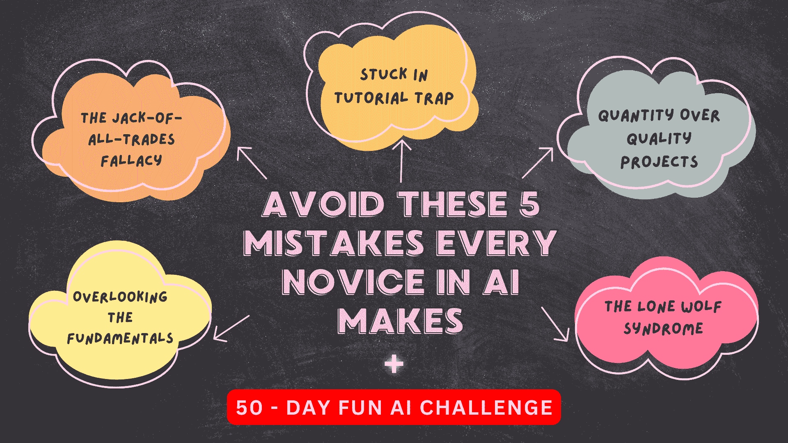

# 避免这 5 个人工智能新手常犯的错误

> 原文：[`www.kdnuggets.com/avoid-these-5-common-mistakes-every-novice-in-ai-makes`](https://www.kdnuggets.com/avoid-these-5-common-mistakes-every-novice-in-ai-makes)

图片由作者提供

* * *

## 我们的前三大课程推荐

 1\. [谷歌网络安全证书](https://www.kdnuggets.com/google-cybersecurity) - 快速迈入网络安全职业生涯。

 2\. [谷歌数据分析专业证书](https://www.kdnuggets.com/google-data-analytics) - 提升你的数据分析水平

 3\. [谷歌 IT 支持专业证书](https://www.kdnuggets.com/google-itsupport) - 支持你的组织进行 IT 管理

* * *

你听过爱因斯坦的以下名言吗？

> 疯狂就是一遍遍地做同样的事情却期待不同的结果。

对于那些刚开始人工智能之旅的人来说，这是一个完美的提醒。作为初学者，面对大量的信息和资源容易感到不知所措。你可能会发现自己犯了许多人之前犯过的相同错误。但为什么要浪费时间和精力重复这些错误，为什么不从他们的经验中学习呢？

作为一个曾与该领域经验丰富的从业者交谈的人，我一直好奇他们的人工智能之旅。我很快发现，他们中的许多人在早期遇到了类似的挑战和陷阱。这就是我写这篇文章的原因——分享新手在人工智能领域常犯的 5 个错误，以便你可以避免它们。

所以，让我们开始吧：

## 1\. 忽视基础知识

作为一个人工智能初学者，容易被炫目的算法和强大的框架所吸引。然而，就像一棵树需要强大的根基才能成长一样，你对人工智能的理解也需要坚实的基础。忽视这些构建块背后的数学可能会阻碍你。框架是为了帮助计算机进行计算，但学习基础概念比仅仅依赖黑箱库和框架更为重要。许多初学者开始使用像 scikit-learn 这样的工具，虽然他们可能会得到结果，但通常会在分析性能或解释发现时遇到困难。这通常是因为他们跳过了理论。要成为成功的人工智能开发者，学习这些核心概念是至关重要的。

确定区分优秀 AI 开发者与新手的技能组合并没有一个简单的“一刀切”答案。这是多个因素的结合。然而，为了讨论基础内容，强调解决问题、数据结构和算法的重要性是必要的。大多数机器学习公司在招聘过程中会评估这些技能，掌握它们将使你成为一个更强的候选人。

## 2\. 万能型人才谬论

你可能见过 LinkedIn 上的个人资料声称在 AI、机器学习、深度学习、计算机视觉、自然语言处理等方面有专长。这就像一长串技能，可能会让人感到头晕。也许是因为社交媒体或“全栈开发者”这一趋势，人们将 AI 与之进行比较。但现实是，生活在幻想世界里并没有帮助。AI 是一个非常广阔的领域。知道所有内容是不现实的，试图做到这一点可能会导致沮丧和倦怠。这样想吧：这就像尝试一口气吃下整个比萨饼——不太实际，对吧？相反，专注于某个特定领域，真正做到精通。通过缩小焦点并将时间投入到掌握 AI 的某个部分，你将能够产生有意义的影响，并在竞争激烈的 AI 领域中脱颖而出。因此，让我们避免分散精力，专注于一次成为一个领域的专家。

## 3\. 陷入教程陷阱

我认为初学者常犯的最大错误就是被大量的在线教程、课程、书籍和文章压倒。学习和参与这些课程并不是负面的事情。然而，我担心的是，他们可能无法在理论和实践之间找到正确的平衡。花太多时间在教程上而不实际应用所学内容，可能会导致被称为“教程地狱”的挫败感。为了避免这种情况，重要的是通过实际项目来检验你的知识，尝试不同的数据集，并不断提高你的结果。此外，你会发现课程中教的一些概念可能并不总是对特定数据集或问题最有效。例如，我最近观看了[DeepLearning.ai 的 LLM 对直接偏好优化的对齐](https://www.youtube.com/live/QXVCqtAZAn4?si=o1i3MistxdjLOI4Y)讲座，其中 Huggingface 的研究科学家[ED Beeching](https://www.linkedin.com/in/ed-beeching-3553b468/)提到，尽管原始的直接偏好优化论文使用了 RMSProp 作为优化器，但他们发现 Adam 在实验中更为有效。你只有通过实际操作和深入实践才能学到这些东西。

## 4\. 数量优于质量的项目

当初学者想展示他们的 AI 技能时，他们常常会被诱惑去创建大量项目以展示他们的专业知识。然而，优先考虑质量而不是数量至关重要。我观察到，在大型科技公司工作的人往往简历上有 2-3 个强有力的项目，而不是像许多人那样有 6-10 个小而平庸的项目。这种方法不仅对求职有利，而且对学习也有帮助。你可以更好地理解主题。与其跟随 YouTube 教程或做一堆普通项目，不如花费一个月左右的时间和精力投入到那些具有长期价值的项目中。这种方法会让你的学习曲线更陡峭，并真正突出你的理解。这也可以让你的简历从其他人中脱颖而出。即使在找到工作后，你也不会在过渡到实际工作时遇到太多困难。

## 5\. 孤狼综合症

我理解不同的人有不同的工作偏好。有些人可能喜欢独自工作，而其他人则寻求支持。对于机器学习的初学者来说，面对这些可能会感到不知所措，孤立工作可能会阻碍你的成长。我强烈推荐你参与 Reddit、Discord、Slack、LinkedIn 和 Facebook 等平台上的 AI 社区。如果你对社区不太舒服，可以考虑找一个 AI 导师进行指导和支持。与他们讨论你的项目，寻求建议，并学习更好的方法。这不仅使学习过程变得愉快，而且节省时间。虽然我不鼓励你在遇到问题时立即发布问题或联系导师，但你应该始终先尝试自己解决。但在某些时候，寻求帮助是可以的。这种方法可以避免倦怠，增强你的学习能力，最终，你会为自己尝试并获得对失败的了解而感到满意。

## 50 天挑战：敢于接受挑战，提升你的 AI 技能

在本文中，我们讨论了初学者应该避免的 5 个最常见的错误。

我为大家准备了一个**令人兴奋的挑战**。作为这个社区的负责任成员，我想鼓励你采取行动，将这些技巧应用到自己的 AI 旅程中。以下是“50 天挑战”：

1\. 在下方评论区写下“挑战接受”。（如果你无法看到评论区，请刷新页面——可能需要一些时间才能出现。）

2\. 在接下来的 50 天里，专注于这 5 个技巧，并将它们应用到你的 AI 学习中。

3\. 在 50 天后，返回本文并在评论中分享你的经验。告诉我们这些技巧给你的生活带来了哪些变化，以及它们如何帮助你成长为 AI 从业者。

我迫不及待想听听你的故事，并了解你的进展。此外，如果你有任何建议或额外的提示，可以分享给其他读者，请尽管说出来！让我们互相帮助，共同成长。

****[Kanwal Mehreen](https://www.linkedin.com/in/kanwal-mehreen1/)**** Kanwal 是一位机器学习工程师和技术作家，对数据科学以及人工智能与医学的交集充满了深厚的热情。她共同撰写了电子书《利用 ChatGPT 提高生产力》。作为 2022 年亚太地区 Google Generation Scholar，她倡导多样性和学术卓越。她还被认定为 Teradata 多样性科技奖学者、Mitacs Globalink 研究奖学者和哈佛 WeCode 学者。Kanwal 是变革的坚定倡导者，创立了 FEMCodes 以赋能 STEM 领域的女性。

### 更多相关话题

+   [5 个常见的数据科学错误及如何避免它们](https://www.kdnuggets.com/5-common-data-science-mistakes-and-how-to-avoid-them)

+   [新手数据科学家应该避免的错误](https://www.kdnuggets.com/2022/06/mistakes-newbie-data-scientists-avoid.html)

+   [5 个常见的 Python 陷阱（以及如何避免它们）](https://www.kdnuggets.com/5-common-python-gotchas-and-how-to-avoid-them)

+   [从这些 GitHub 仓库中学习数据科学](https://www.kdnuggets.com/2022/12/learn-data-science-github-repositories.html)

+   [从这些 GitHub 仓库中学习数据工程](https://www.kdnuggets.com/2023/02/learn-data-engineering-github-repositories.html)

+   [使用这些课程构建类似 ChatGPT 的聊天机器人](https://www.kdnuggets.com/2023/05/build-chatgptlike-chatbot-courses.html)
