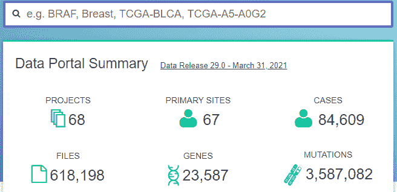
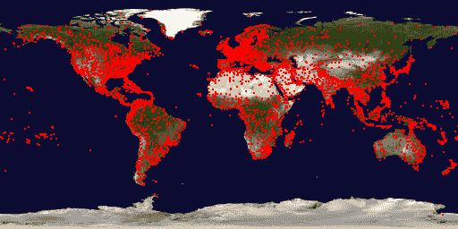

# 超棒的 100+ 类别的数据集列表

> 原文：[`www.kdnuggets.com/2021/05/awesome-list-datasets.html`](https://www.kdnuggets.com/2021/05/awesome-list-datasets.html)

评论

**由 [Etienne D. Noumen](https://www.linkedin.com/in/enoumen/)，高级软件工程师**。

* * *

## 我们的前三个课程推荐

 1\. [Google 网络安全证书](https://www.kdnuggets.com/google-cybersecurity) - 快速开启网络安全职业之路。

 2\. [Google 数据分析专业证书](https://www.kdnuggets.com/google-data-analytics) - 提升你的数据分析技能

 3\. [Google IT 支持专业证书](https://www.kdnuggets.com/google-itsupport) - 支持你所在组织的 IT 部门

* * *

数据科学是一个跨学科领域，它使用科学方法、过程、算法和系统从结构化和非结构化数据中提取知识和洞察，并将这些知识和可操作的洞察应用于广泛的应用领域。

在本博客中，我们提供了流行的开源和公共数据集、数据可视化、数据分析资源和数据湖的链接。

### 目录

1.  最新完整的 Netflix 电影数据集

1.  通用爬虫

1.  蛋白质价格数据集

1.  CPOST 数据集：四十年来的自杀攻击

1.  信用卡数据集 – 消费者金融调查 (SCF) 综合提取数据 1989-2019 综合提取数据 1989-2019")

1.  带注释的无人机图像用于小物体检测和跟踪数据集

1.  NOAA 高分辨率快速刷新 (HRRR) 模型 模型")

1.  AWS 上的开放数据注册表

1.  教科书问答 (TQA)")

1.  协调癌症数据集：基因组数据公共门户

1.  癌症基因组图谱

1.  治疗性应用研究以生成有效治疗方法 (TARGET)")

1.  基因组聚合数据库 (gnomAD)")

1.  SQuAD (斯坦福问答数据集)")

1.  PubMed 糖尿病数据集

1.  药物-靶标互动数据集

1.  药物基因组数据集

1.  胰腺癌类器官分析

1.  非洲土壤信息服务 (AfSIS) 土壤化学 Soil Chemistry")

1.  E 环境中的情感状态数据集

1.  NatureServe Explorer 数据集

1.  美国航班记录

1.  全球航班数据

1.  2019 年美国犯罪统计数据

1.  雅虎问答数据集

1.  美洲历史 1400-2021

1.  波斯语词汇发音数据集

1.  历史空气质量数据集

1.  Stack Exchange 数据集

1.  精彩公共数据集

1.  农业数据集

1.  生物数据集

1.  气候和天气数据集

1.  复杂网络数据集

1.  计算机网络数据集

1.  网络安全数据集

1.  数据挑战数据集

1.  地球科学数据集

1.  经济数据集

1.  教育数据集

1.  能源数据集

1.  娱乐数据集

1.  金融数据集

1.  地理信息系统数据集

1.  政府数据集

1.  医疗数据集

1.  图像处理数据集

1.  机器学习数据集

1.  博物馆数据集

1.  自然语言数据集

1.  神经科学数据集

1.  物理数据集

1.  前列腺癌数据集

1.  心理学和认知数据集

1.  公共领域数据集

1.  搜索引擎数据集

1.  社交网络数据集

1.  社会科学数据集

1.  软件数据集

1.  体育数据集

1.  时间序列数据集

1.  交通数据集

1.  电子竞技数据集

1.  补充集合

1.  分类公共数据集列表：Sindre Sorhus /awesome List

1.  平台

1.  编程语言

1.  前端开发

1.  后端开发

1.  计算机科学

1.  大数据

1.  理论

1.  书籍

1.  编辑器

1.  游戏

1.  开发环境

1.  娱乐

1.  数据库

1.  媒体

1.  学习

1.  安全

1.  内容管理系统

1.  硬件

1.  商业

1.  工作

1.  网络

1.  去中心化系统

1.  高等教育

1.  事件

1.  测试

1.  其他

1.  相关

1.  美国教育部 CRDC 数据集

1.  NASA 数据集：从细菌的空间前后测序数据

1.  2015 年至 2021 年所有特朗普的推特侮辱记录 CSV 格式

1.  数据是复数

1.  全球恐怖主义数据库

1.  海豚社交网络

1.  20 万笑话的数据集

1.  百万歌曲数据集

1.  康奈尔大学的 eBird 数据集

1.  UFO 报告数据集

1.  CDC 的趋势药物数据

1.  健康与退休研究：公众调查数据

这是一个庞大的列表，这里有[100+个更多的类别](https://enoumen.com/2021/04/23/data-sciences-datasets-data-visualization-data-analytics-big-data-data-lakes/)

### **最新完整的 Netflix 电影数据集**

从 4 个 API 创建。包含 11K+行和 30+属性的 Netflix 数据（评级、收入、演员、语言、可用性、电影预告片等等）

[Kaggle 上的数据集](https://www.kaggle.com/ashishgup/netflix-rotten-tomatoes-metacritic-imdb)

使用[FlixGem.com](https://flixgem.com/)探索这个数据集（这个数据集驱动了这个 web 应用）

[Google Sheets 上的数据集](https://docs.google.com/spreadsheets/u/2/d/1JZJ0Ur57nBI_eN08DZioJ3CK1u1_Qt9woBo_6vYnN-c/)

### [**Common Crawl**](https://commoncrawl.org/the-data/get-started/)

一个由超过 500 亿个网页组成的网络爬虫数据语料库。Common Crawl 语料库包含自 2008 年以来收集的 PB 级数据。它包含原始网页数据、提取的元数据和文本提取。

[AWS CLI](https://aws.amazon.com/cli/) 访问（无需 AWS 账户）

`aws s3 ls s3://commoncrawl/ --no-sign-request`

s3://commoncrawl/crawl-data/<wbr>CC-MAIN-2021-17 – [2021 年 4 月](https://commoncrawl.org/2021/04/april-2021-crawl-archive-now-available/)

### **蛋白质价格数据集**

关于主要商品价格的数据每月更新，基于 IMF 的主要商品价格系统。

[**Excel 数据库**](https://www.imf.org/-/media/Files/Research/CommodityPrices/Monthly/external-dataAPR.ashx)

### [**CPOST 数据集：四十年来的自杀攻击**](https://journals.sagepub.com/doi/abs/10.1177/0022343320978260?journalCode=jpra&)

芝加哥大学安全与威胁项目展示了更新和扩展后的自杀攻击数据库（DSAT），该数据库现在链接到乌普萨拉冲突数据计划的武装冲突数据，并包括一个新的数据集，用于衡量与自杀攻击组织相关的武装组织之间的联盟和对立关系。[**在这里访问**](https://journals.sagepub.com/doi/abs/10.1177/0022343320978260?journalCode=jpra)

### [**信用卡数据集 – 消费者金融调查（SCF）1989-2019 年合并提取数据**](https://sda.berkeley.edu/sdaweb/analysis/;jsessionid=3C4CA13FF65C522B2A7EDCB7AFC97F7C?dataset=scfcomb2019)

你可以在这里以非常简单的方式进行大量汇总分析。

### [**附带小物体检测和跟踪的无人机图像数据集**](https://www.aicrowd.com/challenges/airborne-object-tracking-challenge)

[11 TB 无人机图像数据集](https://www.reddit.com/r/datasets/comments/n1z013/11_tb_dataset_of_drone_imagery_with_annotations/)附带小物体检测和跟踪的注释

下载和更多信息请访问[**这里**](https://www.aicrowd.com/challenges/airborne-object-tracking-challenge)

数据集许可证：CDLA-Sharing-1.0

访问数据集的辅助脚本：[DATASET.md](https://gitlab.aicrowd.com/amazon-prime-air/airborne-detection-starter-kit/-/blob/master/docs/DATASET.md)

数据集探索：[Colab](https://colab.research.google.com/drive/1B5Gevpg6GIlfMRRfiG79V8Foz13_ncUr)

### [**NOAA 高分辨率快速更新（HRRR）模型**](https://registry.opendata.aws/noaa-hrrr-pds/)

HRRR 是 NOAA 的实时 3 公里分辨率、每小时更新、云解析、允许对流的气象模型，由 3 公里网格和 3 公里雷达同化初始化。雷达数据每 15 分钟同化到 HRRR 中，持续 1 小时，进一步增加了由 13 公里雷达增强的快速刷新每小时数据同化提供的细节。

### **[AWS 开放数据注册表](https://registry.opendata.aws/)**

本注册表旨在帮助人们发现和共享通过 AWS 资源提供的数据集。[了解更多关于在 AWS 上共享数据的信息](https://opendata.aws/)。

查看[该注册表中列出的数据集的所有使用示例](https://registry.opendata.aws/usage-examples)。

查看来自[数字地球非洲](https://registry.opendata.aws/collab/deafrica/)、[Facebook 数据公益](https://registry.opendata.aws/collab/facebook/)、[NASA 空间法案协议](https://registry.opendata.aws/collab/nasa/)、[NIH STRIDES](https://registry.opendata.aws/collab/nih/)、[NOAA 大数据计划](https://registry.opendata.aws/collab/noaa/)、[空间望远镜科学研究所](https://registry.opendata.aws/collab/stsci/)和[亚马逊可持续数据计划](https://registry.opendata.aws/collab/asdi/)的数据集。

### [**教科书问答（TQA）**](https://registry.opendata.aws/allenai-tqa/)

1,076 节教科书课文，26,260 个问题，6229 张图片

文档：[`allenai.org/data/tqa`](https://allenai.org/data/tqa)

[**下载**](https://allenai.org/data/tqa)

### [**协调癌症数据集：基因组数据公共门户**](https://portal.gdc.cancer.gov/)

GDC 数据门户是一个强大的数据驱动平台，允许癌症研究人员和生物信息学家搜索和下载癌症数据进行分析。

*基因组数据公共门户*

### [**癌症基因组图谱**](https://registry.opendata.aws/tcga/)

癌症基因组图谱（[**TCGA**](https://registry.opendata.aws/collab/nih)），是国家癌症研究所（NCI）和国家人类基因组研究所（NHGRI）之间的合作，旨在生成主要癌症类型和亚型中关键基因组变化的全面、多维度图谱。

[AWS CLI](https://aws.amazon.com/cli/) 访问（无需 AWS 账户）

`aws s3 ls s3://tcga-2-open/ --no-sign-request`

### [**临床应用研究以生成有效治疗（TARGET）**](https://ocg.cancer.gov/programs/target/using-target-data)

临床应用研究以生成有效治疗（TARGET）计划采用全面的基因组方法来确定驱动儿童癌症的分子变化。该计划的目标是利用数据指导开发有效且毒性较小的治疗方案。TARGET 组织为一个疾病特定项目团队的协作网络。TARGET 项目提供全面的分子表征，以确定驱动儿童癌症起始和进展的遗传变化。数据集包含来自基因组数据公共数据库（GDC）的开放临床补充、样本补充、RNA-Seq 基因表达定量、miRNA-Seq 亚型表达定量、miRNA-Seq miRNA 表达定量数据以及来自 GDC 遗留档案的开放数据。[**点击这里访问**](https://ocg.cancer.gov/programs/target/using-target-data)。

### [**基因组聚合数据库（gnomAD）**](https://registry.opendata.aws/broad-gnomad/)

基因组聚合数据库（gnomAD）是由国际研究人员联盟开发的资源，汇总和协调来自各种大规模人类测序项目的外显子组和基因组数据。这里提供的总结数据为科学界提供便利，无使用限制。[**下载**](https://gnomad.broadinstitute.org/downloads)

### [**SQuAD（斯坦福问题回答数据集）**](https://rajpurkar.github.io/SQuAD-explorer/)

**斯坦福问答数据集**（SQuAD）是一个阅读理解数据集，由众包工作者在一组维基百科文章上提出问题，每个问题的答案都是来自相应阅读段落的文本片段或*范围*，或者问题可能没有答案。[**在这里访问**](https://rajpurkar.github.io/SQuAD-explorer/explore/v2.0/dev/)

### [**PubMed 糖尿病数据集**](https://linqs-data.soe.ucsc.edu/public/Pubmed-Diabetes.tgz)

Pubmed 糖尿病数据集包含 19717 篇来自 PubMed 数据库的关于糖尿病的科学出版物，分类为三类之一。引用网络包含 44338 条链接。数据集中的每篇出版物由一个 TF/IDF 加权词向量描述，该词典由 500 个唯一单词组成。数据集中的 README 文件提供了更多细节。

[**下载链接**](https://linqs-data.soe.ucsc.edu/public/Pubmed-Diabetes.tgz)

### [**药物-靶标互动数据集**](https://github.com/shobeir/fakhraei_tcbb2014)

此数据集包含从 DrugBank、KEGG Drug、DCDB 和 Matador 收集的药物与靶标之间的互动。最初由[Perlman 等](http://online.liebertpub.com/doi/abs/10.1089/cmb.2010.0213)收集。数据集包含 315 种药物、250 个靶标、1306 个药物-靶标互动、5 种药物-药物相似性和 3 种靶标-靶标相似性。药物-药物相似性包括基于化学的、基于配体的、基于表达的、基于副作用的和基于注释的相似性。靶标-靶标相似性包括基于序列的、基于蛋白质-蛋白质相互作用网络的和基于基因本体论的相似性。数据集的原始任务是基于网络中的不同相似性预测药物和靶标之间的新互动。[**下载链接**](https://github.com/shobeir/fakhraei_tcbb2014)

### [**药物基因组学数据集**](https://www.pharmgkb.org/downloads)

PharmGKB 数据和知识可供下载。通常在使用这些数据进行大规模项目之前，检查与其策展人联系 feedback@pharmgkb.org 是至关重要的，以确保所提供的文件和数据被正确解释。PharmGKB 通常不需要成为这些分析的共同作者；他们只希望确保在投入大量资源之前对数据有正确的理解。

### **[胰腺癌类器官分析](https://registry.opendata.aws/organoid-pancreatic/)**

[**数据集**](https://registry.opendata.aws/organoid-pancreatic/)包含开放的 RNA-Seq 基因表达定量数据以及受控的 WGS/WXS/RNA-Seq 对齐读取、WXS 注释体突变、WXS 原始体突变和 RNA-Seq 剪接位点定量。[**文档**](https://www.ncbi.nlm.nih.gov/projects/gap/cgi-bin/study.cgi?study_id=phs001611.v1.p1)

[AWS CLI](https://aws.amazon.com/cli/) 访问（无需 AWS 账户）

`aws s3 ls s3://gdc-organoid-pancreatic-phs001611-2-open/ --no-sign-request`

### **[非洲土壤信息服务（AfSIS）土壤化学](https://registry.opendata.aws/afsis/)**

该数据集包含通过非洲土壤信息服务（AfSIS）项目收集的土壤红外光谱数据及配对的土壤性质参考测量，这些样本在 2009 年至 2018 年期间进行了地理参考。**文档**

[AWS CLI](https://aws.amazon.com/cli/) 访问（无需 AWS 账户）

`aws s3 ls s3://afsis/ --no-sign-request`

### [**情感状态数据集（E-Environments）**](https://iith.ac.in/~daisee-dataset/)

DAiSEE 是第一个多标签视频分类数据集，包含 9068 个视频片段，捕捉自 112 位用户，用于识别用户的无聊、困惑、参与和挫折等情感状态。数据集包含四个标签级别，即非常低、低、高和非常高，每种情感状态都由人群标注，并与使用专家心理学家团队创建的黄金标准标注相关。 [**在这里下载**](https://docs.google.com/forms/d/e/1FAIpQLSeRIjWnqBNqhFaIMnmUshkQJ6gH_HWuN425JRK_WYTPJ1pSHQ/viewform?usp=sf_link)

### [**NatureServe Explorer 数据集**](https://explorer.natureserve.org/AboutTheData)

NatureServe Explorer 提供了超过 95,000 种植物和动物在美国和加拿大的保护状态、分类学、分布和生活历史信息，以及西半球超过 10,000 种植被群落和生态系统的信息。

通过 NatureServe Explorer 提供的数据代表了在 NatureServe 中央数据库中管理的数据。这些数据库是动态的，通过数百名自然遗产项目科学家和其他合作伙伴的输入不断增强和完善。NatureServe Explorer 从这些中央数据库中更新，以反映新的实地调查、最新的分类处理、其他科学出版物以及新的保护状态评估。[**在这里探索数据**](https://explorer.natureserve.org/)

### [**美国航班记录**](https://catalog.data.gov/dataset/airline-on-time-performance-and-causes-of-flight-delays-on-time-data)

航空公司准时表现及航班延误原因 – On_Time 数据。

该数据库包含由认证的美国航空承运人报告的计划和实际出发及到达时间、延误原因，这些承运人占国内计划客运收入的至少 1%。[数据由运输统计局（BTS）航空信息办公室收集。](https://catalog.data.gov/dataset/airline-on-time-performance-and-causes-of-flight-delays-on-time-data)

[FlightAware.com](https://FlightAware.com) 有数据，但你需要付费才能获得完整的数据集。

[**`anyflights`**](https://github.com/simonpcouch/anyflights) 包提供了一组函数，用于生成类似于[`nycflights13`](https://github.com/hadley/nycflights13)的航空旅行数据（和数据包！）。通过用户定义的年份和机场，`anyflights`函数将抓取以下数据：

+   `flights`: 指某年某月从特定机场起飞的所有航班

+   `weather`: 某年某月特定机场的每小时气象数据

+   `airports`: 机场名称、FAA 代码和位置

+   `airlines`: 两字母航空公司代码与名称的转换

+   `planes`: 关于`flights`中每架飞机的建造信息

[**航空公司准时统计与延误原因**](https://www.transtats.bts.gov/OT_Delay/OT_DelayCause1.asp)

美国交通部（DOT）的运输统计局（BTS）跟踪大型航空公司运营的国内航班的准时表现。关于准时、延误、取消和改道航班数量的汇总信息会出现在 DOT 的每月[航空旅行消费者报告](http://www.dot.gov/individuals/air-consumer/air-travel-consumer-reports)中，该报告在每月结束后约 30 天发布，并在该网站上发布汇总表。BTS 从 2003 年 6 月开始收集航班延误原因的详细信息。汇总统计数据和原始数据在航空旅行消费者报告发布时公开。[**在此访问**](https://www.transtats.bts.gov/OT_Delay/OT_DelayCause1.asp)

### [**全球航班数据**](https://www.reddit.com/r/datasets/comments/jrmzz5/worldwide_flight_data/)

[**开放航班：截至 2017 年 1 月，OpenFlights 机场数据库包含**超过 10,000**个机场、火车站和渡轮码头，遍布全球**](https://openflights.org/data.html)

下载: [airports.dat](https://raw.githubusercontent.com/jpatokal/openflights/master/data/airports.dat)（仅机场，高质量）

下载: [airports-extended.dat](https://raw.githubusercontent.com/jpatokal/openflights/master/data/airports-extended.dat)（机场、火车站和渡轮码头，包括用户贡献）

[**交通部**](https://www.transtats.bts.gov/databases.asp?Mode_ID=1&Mode_Desc=Aviation&Subject_ID2=0)

[**Flightera.net**](https://www.flightera.net/en/) 似乎提供了大量免费的优质数据。它提供了深入的航班数据，并且似乎没有日期限制。不过，我无法评论数据的有效性。

**[flightradar24.com](https://flightradar24.com/)** 拥有大量数据，包括历史数据，他们可能会愿意帮助你以良好的格式获取这些数据。

### [**2019 年美国犯罪统计数据**](https://ucr.fbi.gov/crime-in-the-u.s/2019/crime-in-the-u.s.-2019/tables/table-69)

包含按种族和各州分开的美国逮捕数据集。[**在这里下载 Excel**](https://ucr.fbi.gov/crime-in-the-u.s/2019/crime-in-the-u.s.-2019/tables/table-69/table-69.xls/output.xls)

### **Yahoo Answers 数据集**

Yahoo 将于 2021 年关闭。这是来自 2015 年的 Yahoo Answers 数据集（300MB gzip），相当广泛，大约有 140 万行。这个数据集包含了最佳的问题答案，我指的是所有的答案，包括最荒谬糟糕的答案和最糟糕的问题。**[在这里下载。](https://drive.google.com/uc?export=download&id=0Bz8a_Dbh9Qhbd2JNdDBsQUdocVU)**

另一个选项**[在这里](https://wiki.archiveteam.org/index.php/Yahoo!_Answers)**：根据跟踪器，已完成 7700 万，还有 2000 万未完成（？），还有 4000 万待完成：

[`wiki.archiveteam.org/index.php/Yahoo!_Answers`](https://wiki.archiveteam.org/index.php/Yahoo!_Answers)

### [**美国历史 1400-2021**](https://www.reddit.com/r/dataisbeautiful/comments/n5cvjv/history_of_america_14002021_agario_style_oc/)

**来源：**

[`os-connect.com/pop/p2an.asp`](https://os-connect.com/pop/p2an.asp)

[`ourworldindata.org/`](https://ourworldindata.org/)

[`www.ggdc.net/maddison/oriindex.htm`](http://www.ggdc.net/maddison/oriindex.htm)

[`www.globalfirepower.com/countries-comparison.asp`](https://www.globalfirepower.com/countries-comparison.asp)

### [**波斯词汇发音数据集**](https://github.com/kiasar/Persian_phonetics)

这是一个包含约 55K 个波斯词汇及其发音的数据集。每个词汇占一行，并通过制表符与其发音分开。

### [**历史空气质量数据集**](https://www.kaggle.com/epa/epa-historical-air-quality)

美国户外监测器收集的空气质量数据。这是一个 BigQuery 数据集。没有下载文件，但可以通过 Kernels 使用 [BigQuery API](https://www.kaggle.com/sohier/beyond-queries-exploring-the-bigquery-api) 查询。AQS 数据库包含所有来自 AQS 的信息。它记录了 EPA 通过国家环境空气监测计划收集的每一个测量值，还包括 EPA 计算的相关汇总值（8 小时、每日、年度等）。AQS 数据库是每周制作一次的 AQS 副本，通过基于网络的应用程序向公众开放。数据集的预期用户是监管、学术和健康研究领域的空气质量数据分析师。它旨在为那些需要下载大量详细技术数据的人提供，而不提供任何互动分析工具。它作为几个机构互动工具的后端数据库，这些工具无法完全运作：AirData、AirCompare、The Remote Sensing Information Gateway、地图监测站点 KML 页面等。

### **Stack Exchange 数据集**

*[`data.stackexchange.com/`](https://data.stackexchange.com/)*

### **[精彩公共数据集](https://github.com/awesomedata/awesome-public-datasets)**

这个列表包含了高质量的以主题为中心的公共数据源。它们是从博客、回答和用户回应中收集和整理的。下面列出的多数数据集是免费的，但有些则不是。

### [**农业**](https://github.com/awesomedata/awesome-public-datasets#id66)

+   [主要作物 1981–2016 年的全球历史产量数据集 – 该[…]](https://doi.pangaea.de/10.1594/PANGAEA.909132)

+   [高光谱土壤湿度基准数据集 – 该数据集是[…]](https://doi.org/10.5281/zenodo.1227837)

+   [柠檬质量控制数据集 – 柠檬数据集已经准备好[…]](https://github.com/softwaremill/lemon-dataset)

+   [优化土壤调整植被指数 – IDB 是一个用于工作[…]](https://www.indexdatabase.de/db/i-single.php?id=63)

+   [美国农业部营养数据库](https://www.ars.usda.gov/northeast-area/beltsville-md/beltsville-human-nutrition-research-center/nutrient-data-laboratory/docs/sr28-download-files/)

+   [美国农业部植物数据库 – 完整的 PLANTS[…]](http://www.plants.usda.gov/dl_all.html)

### **生物学**

+   [1000 基因组计划 – 1000 基因组计划于 2008 年至 2015 年运行，[…]](http://www.1000genomes.org/data)

+   [美国肠道（微生物组项目） – 美国肠道项目是[…]](https://github.com/biocore/American-Gut)

+   [布罗德生物图像基准集合（BBBC） – 布罗德生物图像基准[…]](https://www.broadinstitute.org/bbbc)

+   [布罗德癌症细胞系百科全书（CCLE）](https://www.broadinstitute.org/ccle/home)

+   [细胞图像库 – 该库是一个公开且易于访问的[…]](http://www.cellimagelibrary.org/)

+   [完整基因组公共数据 – 一个多样化的人类全基因组数据集[…]](http://www.completegenomics.com/public-data/69-genomes/)

+   [EBI ArrayExpress – ArrayExpress 功能基因组数据档案[…]](http://www.ebi.ac.uk/arrayexpress/)

+   [欧洲 EBI 蛋白质数据银行 – 电子显微镜数据银行[…]](http://www.ebi.ac.uk/pdbe/emdb/index.html/)

+   [ENCODE 项目 – DNA 元素百科全书（ENCODE）联盟是[…]](https://www.encodeproject.org/)

+   [电子显微镜试点图像档案（EMPIAR） – EMPIAR，电子[…]](http://www.ebi.ac.uk/pdbe/emdb/empiar/)

+   [Ensembl 基因组](https://ensemblgenomes.org/)

+   [基因表达综合数据库（GEO） – GEO 是一个公共功能基因组数据[…]](http://www.ncbi.nlm.nih.gov/geo/)

+   [基因本体论（GO） – GO 注释文件](http://geneontology.org/docs/download-go-annotations/)

+   [全球生物互动（GloBI）](https://github.com/jhpoelen/eol-globi-data/wiki#accessing-species-interaction-data)

+   [哈佛医学院（HMS）LINCS 项目 – 哈佛医学院[…]](http://lincs.hms.harvard.edu/)

+   [人类基因组多样性项目 – 斯坦福大学的一组科学家[…]](http://www.hagsc.org/hgdp/files.html)

+   [人类微生物组项目（HMP） – HMP 测序了 2000 多个参考基因组 […]](http://www.hmpdacc.org/reference_genomes/reference_genomes.php)

+   [ICOS PSP 基准 – ICOS PSP 基准库包含一个 […]](http://ico2s.org/datasets/psp_benchmark.html)

+   [国际 HapMap 项目](http://hapmap.ncbi.nlm.nih.gov/downloads/index.html.en)

+   [细胞生物学杂志数据查看器](https://rupress.org/jcb/pages/jcb-dataviewer) [[修复](https://github.com/awesomedata/apd-core/tree/master/core//Biology/Journal-of-Cell-Biology-DataViewer.yml)]

+   [KEGG – KEGG 是一个用于理解高级功能的数据库资源 […]](http://www.genome.jp/kegg/)

+   [MIT 癌症基因组数据](https://www.broadinstitute.org/cgi-bin/cancer/datasets.cgi)

+   [NCBI 蛋白质](http://www.ncbi.nlm.nih.gov/guide/proteins/#databases)

+   [NCBI 分类法 – NCBI 分类法数据库是一个策划过的名称和分类集合 […]](http://www.ncbi.nlm.nih.gov/taxonomy)

+   [NCI 基因组数据公共平台 – GDC 数据门户是一个强大的数据驱动平台 […]](https://gdc.cancer.gov/access-data/gdc-data-portal)

+   [OpenSNP 基因型数据 – openSNP 允许直客客户的 […]](https://opensnp.org/)

+   [Palmer 企鹅 – Palmer 企鹅的目标是提供一个极好的 […]](https://allisonhorst.github.io/palmerpenguins/)

+   [Pathguide – 蛋白质-蛋白质相互作用目录](http://www.pathguide.org/)

+   [蛋白质数据银行 – 这个资源由蛋白质数据银行提供支持 […]](http://www.rcsb.org/)

+   [精神基因组联盟 – 精神基因组的目的 […]](https://www.med.unc.edu/pgc/downloads)

+   [PubChem 项目 – PubChem 是全球最大的自由访问化学物质数据库 […]](https://pubchem.ncbi.nlm.nih.gov/)

+   [PubGene（现为 Coremine Medical） – COREMINE™ 是一系列开发的工具 […]](https://www.coremine.com/)

+   [Sanger 癌症体细胞突变目录（COSMIC） – COSMIC，[…]](http://cancer.sanger.ac.uk/cosmic)

+   [Sanger 癌症药物敏感性基因组学项目（GDSC）](http://www.cancerrxgene.org/)

+   [序列读取档案（SRA） – 序列读取档案（SRA）存储原始数据 […]](http://www.ncbi.nlm.nih.gov/Traces/sra/)

+   [斯坦福微阵列数据](http://smd.stanford.edu/)

+   [Stowers 研究所原始数据存储库](http://www.stowers.org/research/publications/odr)

+   [生物动态学系统科学（SSBD）数据库 – 系统科学 […]](http://ssbd.qbic.riken.jp/)

+   [癌症基因组图谱（TCGA），通过 Broad GDAC 获取](https://gdac.broadinstitute.org/)

+   [生命目录 – 生命目录是一个经过质量保证的 […]](http://www.catalogueoflife.org/content/annual-checklist-archive)

+   [个人基因组项目 – 个人基因组项目，始于 […]](http://www.personalgenomes.org/)

+   [UCSC 公共数据](http://hgdownload.soe.ucsc.edu/downloads.html)

+   [UniGene](https://ftp.ncbi.nlm.nih.gov/repository/UniGene/)

+   [通用蛋白质资源（UnitProt） – 通用蛋白质资源 […]](http://www.uniprot.org/downloads)

+   [Rfam – Rfam 数据库是 RNA 家族的集合，每个[…]](https://docs.rfam.org/en/latest/database.html)

### [**气候和**](https://github.com/awesomedata/awesome-public-datasets#id68) **[气候和天气](https://github.com/awesomedata/awesome-public-datasets#id68)**

+   [精算气候指数](http://actuariesclimateindex.org/data/)

+   [澳大利亚天气](http://www.bom.gov.au/climate/dwo/)

+   [航空气象中心 – 一致、及时和准确的天气[…]](https://aviationweather.gov/adds/dataserver)

+   [巴西天气 – 历史数据（葡萄牙语）– 与[…]](http://sinda.crn.inpe.br/PCD/SITE/novo/site/historico/index.php)

+   [加拿大气象中心](http://weather.gc.ca/grib/index_e.html)

+   [UEA 气候数据（每月更新）](http://www.cru.uea.ac.uk/data/)

+   [荷兰天气 – KNMI 数据中心 (KDC) 门户提供对 KNMI[…]](https://data.knmi.nl/datasets)

+   [欧洲气候评估与数据集](https://www.ecad.eu/)

+   [德国气候数据中心](https://cdc.dwd.de/portal/)

+   [自 1929 年以来的全球气候数据](http://en.tutiempo.net/climate)

+   [绘制全球气候变化新闻叙事 2009-2020 – 这四个[…]](https://blog.gdeltproject.org/four-massive-datasets-charting-the-global-climate-change-news-narrative-2009-2020/)

+   [NASA 全球图像浏览服务](https://wiki.earthdata.nasa.gov/display/GIBS)

+   [NOAA 贝尔灵海气候](http://www.beringclimate.noaa.gov/) [[修复](https://github.com/awesomedata/apd-core/tree/master/core//Climate+Weather/NOAA-Bering-Sea-Climate.yml)]

+   [NOAA 气候数据集](http://www.ncdc.noaa.gov/data-access/quick-links)

+   [NOAA 实时天气模型](http://www.ncdc.noaa.gov/data-access/model-data/model-datasets/numerical-weather-prediction)

+   [NOAA SURFRAD 气象和辐射数据集](https://www.esrl.noaa.gov/gmd/grad/stardata.html)

+   [世界银行气候变化开放数据资源](http://data.worldbank.org/developers/climate-data-api)

+   [UEA 气候研究单位](http://www.cru.uea.ac.uk/data)

+   [WU 全球历史天气](https://www.wunderground.com/history/index.html)

+   [华盛顿邮报气候变化 – 分析温度升高的[…]](https://github.com/washingtonpost/data-2C-beyond-the-limit-usa)

+   [WorldClim – 全球气候数据](http://www.worldclim.org/)

### [**复杂**](https://github.com/awesomedata/awesome-public-datasets#id69) **[复杂网络](https://github.com/awesomedata/awesome-public-datasets#id69)**

+   [AMiner 引用网络数据集](http://aminer.org/citation)

+   [CrossRef DOI URL](https://archive.org/details/doi-urls)

+   [DBLP 引用数据集](https://kdl.cs.umass.edu/display/public/DBLP)

+   [DIMACS 道路网络集合](http://www.dis.uniroma1.it/challenge9/download.shtml)

+   [NBER 专利引用](http://nber.org/patents/)

+   [NIST 复杂网络数据集](http://math.nist.gov/~RPozo/complex_datasets.html)

+   [具有交互式探索分析工具的网络仓库](http://networkrepository.com/) [[fixme](https://github.com/awesomedata/apd-core/tree/master/core//ComplexNetworks/Network-Repository-with-Interactive-Exploratory-Analysis-Tools.yml)]

+   [蛋白质-蛋白质相互作用网络](http://vlado.fmf.uni-lj.si/pub/networks/data/bio/Yeast/Yeast.htm)

+   [PyPI 和 Maven 依赖网络](https://ogirardot.wordpress.com/2013/01/31/sharing-pypimaven-dependency-data/)

+   [Scopus 引文数据库](https://www.elsevier.com/solutions/scopus)

+   [小型网络数据](http://www-personal.umich.edu/~mejn/netdata/)

+   [斯坦福图基](http://www3.cs.stonybrook.edu/~algorith/implement/graphbase/implement.shtml)

+   [斯坦福大规模网络数据集集合](http://snap.stanford.edu/data/)

+   [斯坦福纵向网络数据源](http://stanford.edu/group/sonia/dataSources/index.html) [[fixme](https://github.com/awesomedata/apd-core/tree/master/core//ComplexNetworks/Stanford-Longitudinal-Network-Data-Sources.yml)]

+   [科布伦茨网络集合](http://konect.uni-koblenz.de/)

+   [网络算法实验室 (UNIMI)](http://law.di.unimi.it/datasets.php)

+   [UCI 网络数据仓库](https://networkdata.ics.uci.edu/resources.php)

+   [UFL 稀疏矩阵集合](http://www.cise.ufl.edu/research/sparse/matrices/)

+   [WSU 图数据库](http://www.eecs.wsu.edu/mgd/gdb.html) [[fixme](https://github.com/awesomedata/apd-core/tree/master/core//ComplexNetworks/WSU-Graph-Database.yml)]

+   [达特茅斯无线数据归档社区资源 – 包含[…]](https://www.crawdad.org/)

### **[计算机网络](https://github.com/awesomedata/awesome-public-datasets#id70)**

+   [3.5B 网页来自 CommonCrawl 2012](http://www.bigdatanews.com/profiles/blogs/big-data-set-3-5-billion-web-pages-made-available-for-all-of-us)

+   [53.5B 印第安纳大学 100K 用户的网页点击](http://cnets.indiana.edu/groups/nan/webtraffic/click-dataset/)

+   [CAIDA 互联网数据集](http://www.caida.org/data/overview/)

+   [CRAWDAD 达特茅斯大学无线数据集](https://crawdad.cs.dartmouth.edu/) [[fixme](https://github.com/awesomedata/apd-core/tree/master/core//ComputerNetworks/CRAWDAD-Wireless-datasets-from-Dartmouth-Univ..yml)]

+   [ClueWeb09 – 1B 网页](http://lemurproject.org/clueweb09/)

+   [ClueWeb12 – 733M 网页](http://lemurproject.org/clueweb12/)

+   [CommonCrawl 七年网络数据](http://commoncrawl.org/the-data/get-started/)

+   [Criteo 点击数据](http://labs.criteo.com/2015/03/criteo-releases-its-new-dataset/)

+   [互联网范围扫描数据仓库](https://scans.io/)

+   [MIRAGE-2019 – MIRAGE-2019 是一个用于移动流量的人为生成数据集[…]](http://traffic.comics.unina.it/mirage/)

+   [OONI: 网络干扰开放观察站 – 互联网审查数据](https://ooni.torproject.org/data/)

+   [MobiPerf 开放移动数据](https://console.developers.google.com/storage/openmobiledata_public/)

+   [对等网络追踪档案 – 真实世界测量在 […]](http://p2pta.ewi.tudelft.nl/)

+   [Rapid7 Sonar 互联网扫描](https://sonar.labs.rapid7.com/)

+   [UCSD 网络望远镜，IPv4 /8 网络](http://www.caida.org/projects/network_telescope/)

### **[网络安全](https://github.com/awesomedata/awesome-public-datasets#id71)**

+   [CCCS-CIC-AndMal-2020 – 数据集包含 200K 个良性样本和 200K 个恶意样本 […]](https://www.unb.ca/cic/datasets/andmal2020.html)

+   [网络防御演习期间捕获的流量和日志数据 – 这些 […]](https://zenodo.org/record/3746129)

### **[数据挑战](https://github.com/awesomedata/awesome-public-datasets#id72)**

+   [暴力破解数据库](https://github.com/duyetdev/bruteforce-database)

+   [机器学习挑战](http://www.chalearn.org/)

+   [CrowdANALYTIX dataX](http://data.crowdanalytix.com/) [[fixme](https://github.com/awesomedata/apd-core/tree/master/core//DataChallenges/CrowdANALYTIX-dataX.yml)]

+   [D4D Challenge of Orange](http://www.d4d.orange.com/en/home) [[fixme](https://github.com/awesomedata/apd-core/tree/master/core//DataChallenges/D4D-Challenge-of-Orange.yml)]

+   [DrivenData 社会公益竞赛](http://www.drivendata.org/)

+   [ICWSM 数据挑战（自 2009 年起）](https://www.icwsm.org/2018/datasets/datasets/#obtaining)

+   [腾讯 2012 KDD 杯](http://www.kddcup2012.org/)

+   [Kaggle 竞赛数据](https://www.kaggle.com/)

+   [Localytics 数据可视化挑战](https://github.com/localytics/data-viz-challenge)

+   [Netflix 奖](http://netflixprize.com/leaderboard.html)

+   [太空应用挑战](https://2015.spaceappschallenge.org/)

+   [意大利电信大数据挑战](https://dandelion.eu/datamine/open-big-data/) [[fixme](https://github.com/awesomedata/apd-core/tree/master/core//DataChallenges/Telecom-Italia-Big-Data-Challenge.yml)]

+   [TravisTorrent 数据集 – MSR’2017 矿业挑战](https://travistorrent.testroots.org/)

+   [TunedIT – 数据挖掘与机器学习数据集、算法、挑战](http://tunedit.org/challenges/) [[fixme](https://github.com/awesomedata/apd-core/tree/master/core//DataChallenges/TunedIT.yml)]

+   [Yelp 数据集挑战](https://www.yelp.com/dataset_challenge) [[fixme](https://github.com/awesomedata/apd-core/tree/master/core//DataChallenges/Yelp-Dataset-Challenge.yml)]

### **[地球科学数据集](https://github.com/awesomedata/awesome-public-datasets#id73)**

+   [38-Cloud (云检测) – 包含 38 张 Landsat 8 场景图像及其 […]](https://github.com/SorourMo/38-Cloud-A-Cloud-Segmentation-Dataset)

+   [AQUASTAT – 全球水资源与利用](http://www.fao.org/nr/water/aquastat/data/query/index.html?lang=en)

+   [BODC – 约 22K 变量的海洋数据](https://www.bodc.ac.uk/data/)

+   [EOSDIS – NASA 的地球观测系统数据](http://sedac.ciesin.columbia.edu/data/sets/browse)

+   [地球模型](https://earthmodels.org/) [[fixme](https://github.com/awesomedata/apd-core/tree/master/core//EarthScience/Earth-Models.yml)]

+   [全球风能图集 – 全球风能图集是一个免费的、基于网络的 […]](https://globalwindatlas.info/)

+   [综合海洋观测系统 (IMOS) – 大约 30TB 的海洋测量数据](https://imos.aodn.org.au/)

+   [Marinexplore – 开放海洋数据](http://marinexplore.org/)

+   [阿拉巴马州实时沿海观测系统](http://mymobilebay.com/)

+   [国家潮汐研究保护区系统监测计划 – […]](http://nerrsdata.org/)

+   [石油和天然气管理局开放数据 – 数据集涵盖了 12,500 个离岸 […]](https://data-ogauthority.opendata.arcgis.com/)

+   [史密森学会全球火山和喷发数据库](http://volcano.si.edu/)

+   [USGS 地震档案](http://earthquake.usgs.gov/earthquakes/search/)

### **[经济学数据集](https://github.com/awesomedata/awesome-public-datasets#id74)**

+   [美国经济协会 (AEA)](https://www.aeaweb.org/resources/data)

+   [UMD 的经济数据](http://inforumweb.umd.edu/econdata/econdata.html)

+   [世界经济自由数据](http://www.freetheworld.com/datasets_efw.html)

+   [历史宏观经济统计](http://www.historicalstatistics.org/)

+   [INFORUM – 马里兰大学的行业间预测](http://inforumweb.umd.edu/)

+   [DBnomics – 全球经济数据库 – 汇集了数百个 […]](https://db.nomics.world/)

+   [国际贸易统计](http://www.econostatistics.co.za/)

+   [互联网产品代码数据库](http://www.upcdatabase.com/)

+   [联合外债数据中心](http://www.jedh.org/)

+   [乔恩·哈夫曼国际贸易数据链接](http://www.macalester.edu/research/economics/PAGE/HAVEMAN/Trade.Resources/TradeData.html)

+   [长期生产力数据库 – 长期生产力数据库 […]](http://longtermproductivity.com/download.html)

+   [OpenCorporates 世界公司数据库](https://opencorporates.com/)

+   [我们的世界数据](https://ourworldindata.org/)

+   [SciencesPo 世界贸易重力数据集](http://econ.sciences-po.fr/thierry-mayer/data) [[fixme](https://github.com/awesomedata/apd-core/tree/master/core//Economics/SciencesPo-World-Trade-Gravity-Datasets.yml)]

+   [经济复杂性地图集](http://atlas.cid.harvard.edu/)

+   [国际数据中心](http://cid.econ.ucdavis.edu/)

+   [经济复杂性观察台](http://atlas.media.mit.edu/en/) [[fixme](https://github.com/awesomedata/apd-core/tree/master/core//Economics/The-Observatory-of-Economic-Complexity.yml)]

+   [联合国商品贸易统计](https://comtrade.un.org/data/)

+   [联合国人类发展报告](http://hdr.undp.org/en)

### **[教育数据集](https://github.com/awesomedata/awesome-public-datasets#id75)**

+   [大学评分卡数据](https://collegescorecard.ed.gov/data/)

+   [纽约州教育部门数据 – 纽约州教育 […]](https://data.nysed.gov/downloads.php)

+   [Free Code Camp 的学生数据](https://github.com/freeCodeCamp/open-data)

### **[能源数据集](https://github.com/awesomedata/awesome-public-datasets#id76)**

+   [AMPds – 分钟级电力数据年鉴](http://ampds.org/)

+   [BLUEd – 建筑级完全标记的电力分解数据集](https://energy.duke.edu/content/building-level-fully-labeled-electricity-disaggregation-blued)

+   [COMBED](http://combed.github.io/)

+   [DBFC – 直接硼氢化物燃料电池（DBFC）数据集](https://github.com/ECSIM/dbfc-dataset)

+   [DEL – 南非（1994 – 2014）的家庭电力负荷研究数据集](https://www.datafirst.uct.ac.za/dataportal/index.php/catalog/DELS)

+   [ECO – ECO 数据集是一个全面的非侵入式负荷[…]数据集](http://www.vs.inf.ethz.ch/res/show.html?what=eco-data)

+   [EIA](http://www.eia.gov/electricity/data/eia923/)

+   [全球电力厂数据库 – 全球电力厂数据库是一个[…]的数据集](http://datasets.wri.org/dataset/globalpowerplantdatabase)

+   [HES – 英国家庭电力研究](http://randd.defra.gov.uk/Default.aspx?Menu=Menu&Module=More&Location=None&ProjectID=17359&FromSearch=Y&Publisher=1&SearchText=EV0702&SortString=ProjectCode&SortOrder=Asc&Paging=10#Description)

+   [HFED](http://hfed.github.io/)

+   [PEM1 – 质子交换膜（PEM）燃料电池数据集](https://github.com/ECSIM/pem-dataset1)

+   [PLAID – 插头负载电器识别数据集](http://plaidplug.com/) [[修复](https://github.com/awesomedata/apd-core/tree/master/core//Energy/PLAID.yml)]

+   [公共设施数据解放项目（PUDL）– PUDL 使美国能源[…]的公开](https://github.com/catalyst-cooperative/pudl)

+   [REDD](http://redd.csail.mit.edu/)

+   [SYND – 用于非侵入式负荷监测的合成能源数据集[…]的](https://www.nature.com/articles/s41597-020-0434-6)

+   [智能电表数据门户 – 智能电表数据门户是[…]的一部分](https://smda.github.io/smart-meter-data-portal)

+   [Tracebase](https://github.com/areinhardt/tracebase)

+   [乌克兰能源中心数据集](https://ukrstat.org/en/operativ/menu/menu_e/energ.htm)

+   [UK-DALE – 英国家庭电器级电力](https://jack-kelly.com/data)

+   [WHITED](http://nilmworkshop.org/2016/proceedings/Poster_ID18.pdf)

+   [iAWE](http://iawe.github.io/)

### **[娱乐数据集](https://github.com/awesomedata/awesome-public-datasets#id77)**

+   [Twitch 上的顶级流媒体 – 包含前 1000 名流媒体的数据[…]的](https://www.kaggle.com/aayushmishra1512/twitchdata)

### **[金融数据集](https://github.com/awesomedata/awesome-public-datasets#id78)**

+   [BIS 统计 – 与中央[…]合作编制的 BIS 统计数据](https://www.bis.org/statistics/full_data_sets.htm)

+   [Blockmodo Coin Registry – 一个包含 JSON 格式信息文件的注册表[…]的注册表](https://github.com/Blockmodo/coin_registry)

+   [CBOE 期货交易所](http://cfe.cboe.com/market-data/)

+   [完整的 FAANG 股票数据 – 此数据集包含所有[…]的股票数据](https://www.kaggle.com/aayushmishra1512/faang-complete-stock-data)

+   [Google 财经](https://www.google.com/finance)

+   [Google 趋势](https://www.google.com/trends?q=google&ctab=0&geo=all&date=all&sort=0)

+   [NASDAQ](https://data.nasdaq.com/) [[fixme](https://github.com/awesomedata/apd-core/tree/master/core//Finance/NASDAQ.yml)]

+   [OANDA](http://www.oanda.com/)

+   [OSU 财务数据](http://fisher.osu.edu/fin/fdf/osudata.htm) [[fixme](https://github.com/awesomedata/apd-core/tree/master/core//Finance/OSU-Financial-data.yml)]

+   [Quandl](https://www.quandl.com/)

+   [圣路易斯联邦](https://research.stlouisfed.org/fred2/)

+   [雅虎财经](http://finance.yahoo.com/)

### **[GIS 数据集](https://github.com/awesomedata/awesome-public-datasets#id79)**

+   [了不起的 3D 语义城市模型 – 开放的 3D 语义城市和[…]](https://github.com/OloOcki/awesome-citygml)

+   [ArcGIS 开放数据门户](http://opendata.arcgis.com/)

+   [剑桥，MA，美国，GitHub 上的 GIS 数据](http://cambridgegis.github.io/gisdata.html)

+   [所有大洲、国家、州/省份的数据库和[…]](https://www.back4app.com/database/back4app/list-of-all-continents-countries-cities)

+   [Factual 全球位置数据](https://places.factual.com/data/t/places)

+   [IEEE 地球科学与遥感学会 DASE 网站](http://dase.grss-ieee.org/)

+   [地理地图 – 高质量的 GeoJSON 地图程序生成](https://github.com/simonepri/geo-maps)

+   [ASU 的地理空间数据](http://geodacenter.asu.edu/datalist/)

+   [地理维基项目 – 公民驱动的环境监测](http://geo-wiki.org/)

+   [GeoFabrik – OSM 数据提取到各种格式和区域](http://download.geofabrik.de/)

+   [GeoNames 全球](http://www.geonames.org/)

+   [全球行政区数据库 (GADM) – 组织的地理空间数据[…]](https://gadm.org/)

+   [国土基础设施基金会级别数据](https://hifld-geoplatform.opendata.arcgis.com/)

+   [Landsat 8 在 AWS 上](https://aws.amazon.com/public-data-sets/landsat/)

+   [所有语言的所有国家列表](https://github.com/umpirsky/country-list)

+   [国家气象局 GIS 数据门户](http://www.nws.noaa.gov/gis/)

+   [自然地球 – 世界的矢量和栅格数据](https://www.naturalearthdata.com/downloads/) [[fixme](https://github.com/awesomedata/apd-core/tree/master/core//GIS/Natural-Earth.yml)]

+   [开放地址](http://openaddresses.io/)

+   [OpenStreetMap (OSM)](https://wiki.openstreetmap.org/wiki/Downloading_data)

+   [Pleiades – 古代地点的地名和图谱](http://pleiades.stoa.org/)

+   [使用 OSM 数据的反向地理编码器](https://github.com/kno10/reversegeocode)

+   [Robin Wilson – 免费 GIS 数据集](http://freegisdata.rtwilson.com/)

+   [TIGER/Line – 美国边界和道路](https://www.census.gov/geo/maps-data/data/tiger-line.html)

+   [时区 shapefile](http://efele.net/maps/tz/world/)

+   [TwoFishes – Foursquare 的粗略地理编码器](https://github.com/foursquare/twofishes)

+   [联合国环境数据](http://geodata.grid.unep.ch/)

+   [美国国务院提供的世界边界](http://geonode.state.gov/layers/?limit=100&offset=0)

+   [全球国家多种格式](https://github.com/mledoze/countries)

### **[政府数据集](https://github.com/awesomedata/awesome-public-datasets#id80)**

+   [阿尔伯塔，加拿大省](http://open.alberta.ca/)

+   [安特卫普，比利时](http://opendata.antwerpen.be/datasets)

+   [阿根廷（非官方）](http://datar.noip.me/) [[修复](https://github.com/awesomedata/apd-core/tree/master/core//Government/Argentina-non-official.yml)]

+   [阿根廷数据 – 阿根廷共和国开放数据门户 […]](http://datos.gob.ar/)

+   [奥斯汀，TX，美国](https://data.austintexas.gov/)

+   [澳大利亚 (abs.gov.au)](http://www.abs.gov.au/AUSSTATS/abs@.nsf/DetailsPage/3301.02009?OpenDocument)

+   [澳大利亚 (data.gov.au)](https://data.gov.au/)

+   [奥地利 (data.gv.at)](https://www.data.gv.at/)

+   [巴吞鲁日，LA，美国](https://data.brla.gov/)

+   [比尔谢巴，以色列 – 开放数据门户 (Smart7 OpenData)](https://www.beer-sheva.muni.il/OpenData/Pages/default.aspx)

+   [比利时](http://data.gov.be/)

+   [伯克利市开放数据](https://data.cityofberkeley.info/)

+   [巴西](http://dados.gov.br/dataset)

+   [布宜诺斯艾利斯，阿根廷](http://data.buenosaires.gob.ar/)

+   [卡尔加里，AB，加拿大](https://data.calgary.ca/)

+   [剑桥，MA，美国](https://data.cambridgema.gov/)

+   [加拿大](http://open.canada.ca/)

+   [芝加哥](https://data.cityofchicago.org/)

+   [智利](http://datos.gob.cl/dataset)

+   [中国](https://data.stats.gov.cn/english/) [[修复](https://github.com/awesomedata/apd-core/tree/master/core//Government/China)]

+   [达拉斯开放数据](https://www.dallasopendata.com/)

+   [DataBC – 不列颠哥伦比亚省的数据](https://www.data.gov.bc.ca/)

+   [逐笔债务 – 逐笔债务数据集提供信息 […]](https://fiscaldata.treasury.gov/datasets/debt-to-the-penny/debt-to-the-penny)

+   [丹佛开放数据](http://data.denvergov.org//)

+   [达勒姆，NC 开放数据](https://live-durhamnc.opendata.arcgis.com/)

+   [埃德蒙顿，AB，加拿大](https://data.edmonton.ca/)

+   [英格兰 LGInform](http://lginform.local.gov.uk/)

+   [欧洲统计局](http://ec.europa.eu/eurostat/data/database)

+   [EveryPolitician – 持续项目，汇总和共享每个 […]](http://everypolitician.org/)

+   [联邦统计方法委员会 (FCSM)（前身为 FedStats)](https://nces.ed.gov/FCSM/index.asp)

+   [芬兰](https://www.opendata.fi/en)

+   [法国](https://www.data.gouv.fr/en/datasets/)

+   [弗雷德里克顿，NB，加拿大](http://www.fredericton.ca/en/citygovernment/Catalogue.asp)

+   [加蒂诺，QC，加拿大](http://www.gatineau.ca/donneesouvertes/default_fr.aspx)

+   [德国](https://www-genesis.destatis.de/genesis/online)

+   [根特，比利时](https://data.stad.gent/explore)

+   [格拉斯哥，苏格兰，英国](https://data.glasgow.gov.uk/) [[修复](https://github.com/awesomedata/apd-core/tree/master/core//Government/Glasgow-Scotland-UK.yml)]

+   [希腊](http://www.data.gov.gr/)

+   [卫报全球政府](http://www.guardian.co.uk/world-government-data)

+   [哈利法克斯，NS，加拿大](https://www.halifax.ca/home/open-data)

+   [赫尔辛基地区，芬兰](http://www.hri.fi/en/)

+   [中国香港](https://data.gov.hk/en/)

+   [休斯顿，德克萨斯州，美国](http://data.houstontx.gov/) [[修复项](https://github.com/awesomedata/apd-core/tree/master/core//Government/Houston-TX-US.yml)]

+   [印度政府数据](https://data.gov.in/)

+   [印尼数据门户](http://data.go.id/)

+   [爱荷华州 – 欢迎来到爱荷华州的数据门户。请探索数据[…]](https://data.iowa.gov/)

+   [爱尔兰开放数据门户](https://data.gov.ie/data)

+   [以色列开放数据门户](https://data.gov.il/)

+   [伊斯坦布尔市政府开放数据门户](https://data.ibb.gov.tr/)

+   [意大利 – Il Portale dati.gov.it 是国家元数据的目录[…]](https://www.dati.gov.it/)

+   [美国监狱死亡 – 美国政府未公布监狱中的[…]](https://www.reuters.com/investigates/special-report/usa-jails-graphic/)

+   [日本](http://www.e-stat.go.jp/SG1/estat/eStatTopPortalE.do)

+   [拉瓦尔，魁北克，加拿大](http://www.laval.ca/Pages/Fr/Citoyens/donnees.aspx)

+   [列克星敦，肯塔基州](http://data.lexingtonky.gov/)

+   [伦敦数据存储库，英国](http://data.london.gov.uk/dataset)

+   [伦敦，安大略，加拿大](http://www.london.ca/city-hall/open-data/Pages/default.aspx) [[修复项](https://github.com/awesomedata/apd-core/tree/master/core//Government/London-ON-Canada.yml)]

+   [洛杉矶开放数据](https://data.lacity.org/)

+   [卢森堡 – 卢森堡开放数据门户](https://data.public.lu/en/)

+   [MassGIS，马萨诸塞州，美国](http://www.mass.gov/anf/research-and-tech/it-serv-and-support/application-serv/office-of-geographic-information-massgis/)

+   [大都会交通委员会 (MTC)，加利福尼亚，美国](http://mtc.ca.gov/tools-resources/data-tools/open-data-library)

+   [墨西哥](https://datos.gob.mx/busca/dataset) [[修复项](https://github.com/awesomedata/apd-core/tree/master/core//Government/Mexico.yml)]

+   [密西沙加，安大略，加拿大](http://www.mississauga.ca/portal/residents/publicationsopendatacatalogue)

+   [摩尔多瓦](http://data.gov.md/)

+   [蒙克顿，纽布伦斯维克，加拿大](http://open.moncton.ca/)

+   [蒙特利尔，魁北克，加拿大](http://donnees.ville.montreal.qc.ca/)

+   [山景城，加利福尼亚，美国 (GIS)](http://data-mountainview.opendata.arcgis.com/)

+   [纽约市开放数据](https://opendata.cityofnewyork.us/) [[修复项](https://github.com/awesomedata/apd-core/tree/master/core//Government/NYC-Open-Data.yml)]

+   [纽约市 betanyc](http://betanyc.us/)

+   [荷兰](https://data.overheid.nl/)

+   [纽约市卫生局月度吨数 – DSNY 月度吨数[…]](https://data.cityofnewyork.us/City-Government/DSNY-Monthly-Tonnage-Data/ebb7-mvp5)

+   [新西兰](http://www.stats.govt.nz/browse_for_stats.aspx)

+   [经济合作与发展组织 (OECD)](https://data.oecd.org/)

+   [奥克兰，加利福尼亚，美国](https://data.oaklandnet.com/) [[修复项](https://github.com/awesomedata/apd-core/tree/master/core//Government/Oakland-California-US.yml)]

+   [俄克拉荷马州](https://data.ok.gov/)

+   [非洲开放数据](http://opendataforafrica.org/)

+   [印度开放政府数据 (OGD) 平台](https://data.gov.in/)

+   [OpenDataSoft 的 1,600 个开放数据门户列表](https://www.opendatasoft.com/blog/2015/11/02/how-we-put-together-a-list-of-1600-open-data-portals-around-the-world-to-help-open-data-community)

+   [俄勒冈州](https://data.oregon.gov/)

+   [加拿大安大略省渥太华](http://data.ottawa.ca/en/)

+   [加利福尼亚州帕洛阿尔托](http://data.cityofpaloalto.org/home)

+   [OpenDataPhilly – OpenDataPhilly 是一个开放数据的目录[…]](https://www.opendataphilly.org/)

+   [俄勒冈州波特兰](https://www.portlandoregon.gov/28130)

+   [葡萄牙 – Pordata 组织](http://www.pordata.pt/en/Home)

+   [波多黎各政府](https://data.pr.gov//)

+   [加拿大魁北克市](http://donnees.ville.quebec.qc.ca/) [[修复](https://github.com/awesomedata/apd-core/tree/master/core//Government/Quebec-City-QC-Canada.yml)]

+   [加拿大魁北克省](https://www.donneesquebec.ca/en/)

+   [加拿大里贾纳](http://open.regina.ca/)

+   [巴西里约热内卢](http://www.data.rio/)

+   [罗马尼亚](http://data.gov.ro/)

+   [俄罗斯](http://data.gov.ru/) [[修复](https://github.com/awesomedata/apd-core/tree/master/core//Government/Russia.yml)]

+   [加利福尼亚州圣地亚哥](https://data.sandiego.gov/)

+   [德克萨斯州圣安东尼奥 – 社区信息现在 – CI:Now 是一个非营利组织[…]](http://cinow.info/) [[修复](https://github.com/awesomedata/apd-core/tree/master/core//Government/San-Antonio-TX-US-Community-Information-Now.yml)]

+   [旧金山数据集](http://datasf.org/)

+   [加利福尼亚州圣荷西](http://data.sanjoseca.gov/)

+   [加利福尼亚州圣马特奥县，美国](https://data.smcgov.org/)

+   [加拿大萨斯喀彻温省](http://opendatask.ca/data/)

+   [西雅图](https://data.seattle.gov/)

+   [新加坡政府数据](https://data.gov.sg/)

+   [南非贸易统计数据](http://www.econostatistics.co.za/)

+   [南非](http://www.statssa.gov.za/)

+   [美国犹他州](https://opendata.utah.gov/)

+   [瑞士](http://www.opendata.admin.ch/)

+   [台湾政府](https://data.gov.tw/)

+   [台湾](http://data.gov.tw/)

+   [特拉维夫开放数据](https://opendata.tel-aviv.gov.il/en/Pages/home.aspx)

+   [德克萨斯州开放数据](https://data.texas.gov/)

+   [世界银行](https://openknowledge.worldbank.org/handle/10986/2124) [[修复](https://github.com/awesomedata/apd-core/tree/master/core//Government/The-World-Bank.yml)]

+   [加拿大安大略省多伦多](https://portal0.cf.opendata.inter.sandbox-toronto.ca/) [[修复](https://github.com/awesomedata/apd-core/tree/master/core//Government/Toronto-ON-Canada.yml)]

+   [突尼斯](http://www.data.gov.tn/) [[修复](https://github.com/awesomedata/apd-core/tree/master/core//Government/Tunisia.yml)]

+   [英国政府数据](https://data.gov.uk/)

+   [美国社区调查](https://www.census.gov/programs-surveys/acs/)

+   [美国疾病控制与预防中心公共卫生数据集](https://www.cdc.gov/nchs/data_access/ftp_data.htm)

+   [美国人口普查局](http://www.census.gov/data.html)

+   [美国住房和城市发展部 (HUD)](https://www.huduser.gov/portal/datasets/pdrdatas.html)

+   [美国联邦政府机构](https://www.data.gov/metrics)

+   [美国联邦政府数据目录](https://catalog.data.gov/dataset)

+   [美国食品药品监督管理局（FDA）](https://open.fda.gov/index.html)

+   [美国国家教育统计中心（NCES）](http://nces.ed.gov/)

+   [美国开放政府](https://www.data.gov/open-gov/)

+   [英国 2011 年人口普查开放地图项目](https://data.cdrc.ac.uk/product/cdrc-2011-census-open-atlas)

+   [美国县 – 这是一个各种数据的存储库，按美国[…]](https://github.com/evangambit/JsonOfCounties)

+   [美国专利商标局（USPTO）大数据产品](https://www.uspto.gov/learning-and-resources/bulk-data-products)

+   [乌干达统计局](http://www.ubos.org/unda/index.php/catalog) [[fixme](https://github.com/awesomedata/apd-core/tree/master/core//Government/Uganda-Bureau-of-Statistics.yml)]

+   [乌克兰](https://data.gov.ua/)

+   [联合国](http://data.un.org/)

+   [乌拉圭](https://catalogodatos.gub.uy/)

+   [加利福尼亚州谷运输管理局（VTA），美国](https://data.vta.org/)

+   [加拿大不列颠哥伦比亚省温哥华开放数据目录](http://data.vancouver.ca/datacatalogue/) [[fixme](https://github.com/awesomedata/apd-core/tree/master/core//Government/Vancouver-BC-Open-Data-Catalog.yml)]

+   [加拿大不列颠哥伦比亚省维多利亚](http://opendata.victoria.ca/)

+   [奥地利维也纳](https://open.wien.gv.at/site/open-data/)

+   [越南总统计局统计数据 – 数据在[…]](https://www.gso.gov.vn/Default_en.aspx?tabid=491) [[fixme](https://github.com/awesomedata/apd-core/tree/master/core//Government/Vietnam.yml)]

+   [美国国会研究服务局（CRS）报告](https://www.everycrsreport.com/)

### **[医疗数据集](https://github.com/awesomedata/awesome-public-datasets#id81)**

+   [AWS COVID-19 数据集 – 我们与组织合作，他们提供[…]](https://dj2taa9i652rf.cloudfront.net/)

+   [COVID-19 病例监测公开使用数据 – COVID-19 病例[…]](https://data.cdc.gov/Case-Surveillance/COVID-19-Case-Surveillance-Public-Use-Data/vbim-akqf)

+   [约翰斯·霍普金斯大学 CSSE 2019 新型冠状病毒 COVID-19 数据存储库 – […]](https://github.com/CSSEGISandData/COVID-19)

+   [美国的冠状病毒（Covid-19）数据 – 《纽约时报》[…]](https://github.com/nytimes/covid-19-data)

+   [COVID-19 报告的患者影响和医院能力按设施划分 – […]](https://healthdata.gov/dataset/covid-19-reported-patient-impact-and-hospital-capacity-facility?SorourMo/38-Cloud-A-Cloud-Segmentation-Dataset)

+   [食品成分原料、加工、准备 USDA 国家营养数据库标准[…]](https://data.nal.usda.gov/dataset/composition-foods-raw-processed-prepared-usda-national-nutrient-database-standard-reference-release-27)

+   [COVID 追踪项目 – COVID 追踪项目收集了[…]](https://covidtracking.com/data)

+   [EHDP 大型健康数据集](http://www.ehdp.com/vitalnet/datasets.htm)

+   [GDC – GDC 支持 CCG、TCGA、TARGET 等多个癌症基因组项目](https://gdc.cancer.gov/)

+   [Gapminder 世界人口统计数据库](http://www.gapminder.org/data/)

+   [MeSH，PubMed 文章索引使用的词汇词典](https://www.nlm.nih.gov/mesh/filelist.html)

+   [MeDAL – 大型医学文本数据集，专门为缩写 […]](https://github.com/BruceWen120/medal)

+   [Medicare 覆盖数据库 (MCD)，美国](https://www.cms.gov/medicare-coverage-database/)

+   [Medicare 数据引擎的 medicare.gov 数据](https://data.medicare.gov/)

+   [Medicare 数据文件](http://go.cms.gov/19xxPN4)

+   [埃博拉病例和死亡人数统计 (2014)](https://data.humdata.org/dataset/ebola-cases-2014)

+   [Open-ODS（英国 NHS 结构）](http://www.openods.co.uk/)

+   [OpenPaymentsData，医疗财务关系数据](https://openpaymentsdata.cms.gov/)

+   [PhysioBank 数据库 – 大型且不断增长的生理数据档案。](https://www.physionet.org/physiobank/database/)

+   [癌症影像档案 (TCIA)](https://www.cancerimagingarchive.net/)

+   [癌症基因组图谱项目 (TCGA)](https://portal.gdc.cancer.gov/)

+   [世界卫生组织全球健康观察](http://www.who.int/gho/en/)

+   [Yahoo 知识图谱 COVID-19 数据集 – Yahoo 知识图谱团队 […]](https://github.com/yahoo/covid-19-data)

+   [整合生物学与床边医学的信息学](https://www.i2b2.org/NLP/DataSets/Main.php) [[修复](https://github.com/awesomedata/apd-core/tree/master/core//Healthcare/i2b2.yml)]

### **[图像处理数据集](https://github.com/awesomedata/awesome-public-datasets#id82)**

+   [10k 美国成人面孔数据库](http://wilmabainbridge.com/facememorability2.html)

+   [2GB 猫咪照片](https://www.kaggle.com/crawford/cat-dataset/version/2)

+   [Audience 未筛选面孔用于性别和年龄分类](http://www.openu.ac.il/home/hassner/Adience/data.html)

+   [情感图像分类](http://www.imageemotion.org/)

+   [具有属性的动物](http://attributes.kyb.tuebingen.mpg.de/)

+   [CADDY 水下立体视觉数据集，包括潜水员手势 – […]](http://caddy-underwater-datasets.ge.issia.cnr.it/)

+   [细胞学数据集 – CCAgT: 带有 AgNOR 染色的宫颈细胞图像 […]](https://arquivos.ufsc.br/d/373be2177a33426a9e6c/)

+   [Caltech 行人检测基准](http://www.vision.caltech.edu/Image_Datasets/CaltechPedestrians/)

+   [Chars74K 数据集 – 自然图像中的字符识别（包括英文 […]](http://www.ee.surrey.ac.uk/CVSSP/demos/chars74k/)

+   [Cube++ – 4890 张原始 18 兆像素图像，每张包含一个 SpyderCube 色彩 […]](https://github.com/Visillect/CubePlusPlus)

+   [Danbooru 标记的动漫插图数据集 – 大规模动漫图像 […]](https://www.gwern.net/Danbooru)

+   [DukeMTMC 数据集 – DukeMTMC 旨在加速多目标 […] 的进展](http://vision.cs.duke.edu/DukeMTMC/) [[修复](https://github.com/awesomedata/apd-core/tree/master/core//ImageProcessing/DukeMTMC-Data-Set.yml)]

+   [ETH 昆虫标本馆 (ETHEC) 细粒度蝴蝶 (鳞翅目) 图像](https://doi.org/10.3929/ethz-b-000365379)

+   [人脸识别基准](http://www.face-rec.org/databases/)

+   [Flickr: 32 类品牌标志](http://www.multimedia-computing.de/flickrlogos/) [[修复](https://github.com/awesomedata/apd-core/tree/master/core//ImageProcessing/Flickr-32-Class-Brand-Logos.yml)]

+   [GDXray – 用于 X 射线测试和计算机视觉的 X 射线图像](http://dmery.ing.puc.cl/index.php/material/gdxray/)

+   [HumanEva 数据集 – HumanEva-I 数据集包含 7 个校准视频 […]](http://humaneva.is.tue.mpg.de/)

+   [ImageNet（在 WordNet 层级中）](http://www.image-net.org/)

+   [室内场景识别](http://web.mit.edu/torralba/www/indoor.html)

+   [国际情感图像系统，UFL](http://csea.phhp.ufl.edu/media/iapsmessage.html)

+   [KITTI 视觉基准套件](http://www.cvlibs.net/datasets/kitti/)

+   [亚历山大图书馆标记信息库 – 生物学和保护 – […]](http://lila.science/)

+   [MNIST 手写数字数据库，近 100 万个样本](http://yann.lecun.com/exdb/mnist/) [[修复](https://github.com/awesomedata/apd-core/tree/master/core//ImageProcessing/MNIST-database-of-handwritten-digits-near-1-million-examples.yml)]

+   [多视角兴趣区域预测数据集用于自动驾驶 – […]](https://mediatum.ub.tum.de/1548761)

+   [大规模视觉记忆刺激，MIT](http://olivalab.mit.edu/MM/stimuli.html)

+   [报纸导航器 – 该数据集包含提取的视觉内容 […]](https://news-navigator.labs.loc.gov/)

+   [谷歌开放图像 – 带有分割掩模的图片，共 2.8 […]](https://storage.googleapis.com/openimages/web/download.html)

+   [RuFa – 包含用两种阿拉伯字体（Ruqaa […]）书写的文本图像](https://github.com/mhmoodlan/arabic-font-classification/releases/tag/v0.1.0)

+   [SUN 数据库，MIT](http://groups.csail.mit.edu/vision/SUN/hierarchy.html)

+   [SVIRO 合成车辆内部后座占用 – 25,000 个合成 […]](https://sviro.kl.dfki.de/)

+   [多个轮廓形状数据集](http://kaiwolf.no-ip.org/3d-model-repository.html) [[修复](https://github.com/awesomedata/apd-core/tree/master/core//ImageProcessing/Several-Shape-from-Silhouette-Datasets.yml)]

+   [斯坦福犬数据集](http://vision.stanford.edu/aditya86/ImageNetDogs/)

+   [动作相似性标记（ASLAN）挑战](http://www.openu.ac.il/home/hassner/data/ASLAN/ASLAN.html)

+   [牛津-印度理工学院宠物数据集](http://www.robots.ox.ac.uk/~vgg/data/pets/)

+   [Violent-Flows – 人群暴力/非暴力数据库及基准](http://www.openu.ac.il/home/hassner/data/violentflows/)

+   [视觉基因组](http://visualgenome.org/api/v0/api_home.html)

+   [YouTube 人脸数据库](http://www.cs.tau.ac.il/~wolf/ytfaces/)

### **[机器学习数据集](https://github.com/awesomedata/awesome-public-datasets#id83)**

+   [All-Age-Faces 数据集 – 包含 13,322 张分布的亚洲人脸图像 […]](https://github.com/JingchunCheng/All-Age-Faces-Dataset)

+   [奥迪自动驾驶数据集 – 我们已发布奥迪自动驾驶 […]](https://www.a2d2.audi/a2d2/en.html)

+   [来自五个领域的上下文感知数据集](https://github.com/irecsys/CARSKit/tree/master/context-aware_data_sets)

+   [Delve 数据集用于分类和回归](http://www.cs.toronto.edu/~delve/data/datasets.html)

+   [Discogs 每月数据](http://data.discogs.com/)

+   [自由音乐档案](https://github.com/mdeff/fma)

+   [IMDb 数据库](https://www.imdb.com/interfaces)

+   [Iranis – 大规模波斯语/阿拉伯语车牌字符数据集](https://alitourani.github.io/Iranis-dataset/)

+   [Keel 分类、回归和时间序列数据集库](http://sci2s.ugr.es/keel/datasets.php)

+   [野外标记面孔数据集（LFW）](http://vis-www.cs.umass.edu/lfw/)

+   [借贷俱乐部贷款数据](https://www.lendingclub.com/info/download-data.action)

+   [机器学习数据集库](http://mldata.org/) [[fixme](https://github.com/awesomedata/apd-core/tree/master/core//MachineLearning/Machine-Learning-Data-Set-Repository.yml)]

+   [百万首歌曲数据集](http://labrosa.ee.columbia.edu/millionsong/)

+   [更多歌曲数据集](http://labrosa.ee.columbia.edu/millionsong/pages/additional-datasets)

+   [电影 Lens 数据集](http://grouplens.org/datasets/movielens/)

+   [《纽约客》字幕竞赛评分数据](https://github.com/nextml/caption-contest-data)

+   [RDataMining – “R 与数据挖掘”电子书数据](http://www.rdatamining.com/data)

+   [地球上已登记的陨石](http://publichealthintelligence.org/content/registered-meteorites-has-impacted-earth-visualized) [[fixme](https://github.com/awesomedata/apd-core/tree/master/core//MachineLearning/Registered-Meteorites-on-Earth.yml)]

+   [旧金山餐馆健康评分数据](https://data.sfgov.org/Health-and-Social-Services/Restaurant-Scores-LIVES-Standard/pyih-qa8i?row_index=0)

+   [TikTok 数据集 – 包含 300 多个舞蹈视频，捕捉单个人的[…]](https://www.yasamin.page/hdnet_tiktok)

+   [UCI 机器学习库](http://archive.ics.uci.edu/ml/)

+   [Yahoo!评分与分类数据](http://webscope.sandbox.yahoo.com/catalog.php?datatype=r)

+   [YouTube 边界框](https://research.google.com/youtube-bb/)

+   [YouTube 8m](https://research.google.com/youtube8m/download.html)

+   [eBay 在线拍卖（2012）](http://www.modelingonlineauctions.com/datasets)

### **[博物馆数据集](https://github.com/awesomedata/awesome-public-datasets#id84)**

+   [加拿大科学与技术博物馆公司的开放数据](http://techno-science.ca/en/data.php)

+   [库珀-休伊特收藏数据库](https://github.com/cooperhewitt/collection)

+   [大都会艺术博物馆收藏 API](https://metmuseum.github.io/)

+   [明尼阿波利斯艺术学院元数据](https://github.com/artsmia/collection)

+   [自然历史博物馆（伦敦）数据门户](http://data.nhm.ac.uk/)

+   [荷兰国家博物馆历史艺术收藏](https://www.rijksmuseum.nl/en/api)

+   [泰特收藏元数据](https://github.com/tategallery/collection)

+   [盖蒂词汇表](http://vocab.getty.edu/)

### **[自然语言数据集](https://github.com/awesomedata/awesome-public-datasets#id85)**

+   [自动关键词提取](https://github.com/snkim/AutomaticKeyphraseExtraction/)

+   [大坏 NLP 数据库](https://datasets.quantumstat.com/)

+   [暴风雪挑战演讲 – 演讲 + 文本数据来自 […]](https://www.synsig.org/index.php/Blizzard_Challenge_2018)

+   [博客语料库](http://u.cs.biu.ac.il/~koppel/BlogCorpus.htm)

+   [CLiPS 风格测量调查语料库](http://www.clips.uantwerpen.be/datasets/csi-corpus) [[fixme](https://github.com/awesomedata/apd-core/tree/master/core//NaturalLanguage/CLiPS-Stylometry-Investigation-Corpus.yml)]

+   [ClueWeb09 FACC](http://lemurproject.org/clueweb09/FACC1/)

+   [ClueWeb12 FACC](http://lemurproject.org/clueweb12/FACC1/)

+   [DBpedia – 458 万个事物和 5.83 亿个事实](http://wiki.dbpedia.org/Datasets)

+   [脏词 – 我们的库中有数百万张图片和数十亿个 […]](https://github.com/LDNOOBW/List-of-Dirty-Naughty-Obscene-and-Otherwise-Bad-Words)

+   [Flickr 个人分类法](http://www.isi.edu/~lerman/downloads/flickr/flickr_taxonomies.html)

+   [Freebase 里的人物、地点和事物](http://www.freebase.com/) [[fixme](https://github.com/awesomedata/apd-core/tree/master/core//NaturalLanguage/Freebase-of-people-places-and-things.yml)]

+   [德国政治演讲语料库 – 来自 […]](http://adrien.barbaresi.eu/corpora/speeches/)

+   [Google 图书 Ngrams（2.2TB）](https://aws.amazon.com/datasets/google-books-ngrams/)

+   [Google MC-AFP – 基于公开的 Gigaword 数据集生成的 […]](https://github.com/google/mcafp)

+   [Google Web 5gram（1TB，2006）](https://catalog.ldc.upenn.edu/LDC2006T13)

+   [古腾堡电子书列表](http://www.gutenberg.org/wiki/Gutenberg:Offline_Catalogs) [[fixme](https://github.com/awesomedata/apd-core/tree/master/core//NaturalLanguage/Gutenberg-eBooks-List.yml)]

+   [加拿大议会 Hansards 文本块](http://www.isi.edu/natural-language/download/hansard/)

+   [LJ 语音 – 包含 13,100 段短音频片段的语音数据集 […]](https://keithito.com/LJ-Speech-Dataset)

+   [M-AILabs 语音 – M-AILABS 语音数据集是第一个大规模的数据集 […]](http://www.m-ailabs.bayern/en/the-mailabs-speech-dataset/) [[fixme](https://github.com/awesomedata/apd-core/tree/master/core//NaturalLanguage/M-AILABS-Speech.yml)]

+   [微软机器阅读理解数据集（或 MS MARCO）](http://www.msmarco.org/dataset.aspx)

+   [微软研究院的机器理解测试（MCTest）](http://mattr1.github.io/mctest/)

+   [欧洲语言的机器翻译](http://statmt.org/wmt11/translation-task.html#download)

+   [理解微帖子 2013 – 概念提取](http://oak.dcs.shef.ac.uk/msm2013/challenge.html) [[fixme](https://github.com/awesomedata/apd-core/tree/master/core//NaturalLanguage/Making-Sense-of-Microposts-2013.yml)]

+   [理解微帖子 2016 – 命名实体识别与链接](http://microposts2016.seas.upenn.edu/challenge.html)

+   [多领域情感数据集（版本 2.0）](http://www.cs.jhu.edu/~mdredze/datasets/sentiment/)

+   [用于训练语音增强算法和 TTS 的嘈杂语音数据库 […]](https://datashare.is.ed.ac.uk/handle/10283/2791) [[修复](https://github.com/awesomedata/apd-core/tree/master/core//NaturalLanguage/Noisy-Speech.yml)]

+   [开放多语言 Wordnet](http://compling.hss.ntu.edu.sg/omw/)

+   [POS/NER/Chunk 注释数据](https://github.com/aritter/twitter_nlp/tree/master/data/annotated)

+   [Personae 语料库](http://www.clips.uantwerpen.be/datasets/personae-corpus) [[修复](https://github.com/awesomedata/apd-core/tree/master/core//NaturalLanguage/Personae-Corpus.yml)]

+   [英语短信垃圾邮件集合](http://www.dt.fee.unicamp.br/~tiago/smsspamcollection/)

+   [SaudiNewsNet 沙特新闻文章合集（阿拉伯语，30K 篇文章）](https://github.com/ParallelMazen/SaudiNewsNet)

+   [斯坦福问答数据集 (SQuAD)](https://rajpurkar.github.io/SQuAD-explorer/)

+   [2005~2011 年 USENET 帖子语料库](http://www.psych.ualberta.ca/~westburylab/downloads/usenetcorpus.download.html)

+   [通用依存关系](http://universaldependencies.org/)

+   [Webhose – 多语言新闻/博客](https://webhose.io/datasets)

+   [Wikidata – 维基百科数据库](https://www.wikidata.org/wiki/Wikidata:Database_download)

+   [维基百科链接数据 – 40 百万实体上下文](https://code.google.com/p/wiki-links/downloads/list)

+   [WordNet 数据库和工具](http://wordnet.princeton.edu/download/)

+   [WorldTree 初等科学问题解释图语料库 – […]](http://www.cognitiveai.org/explanationbank)

### **[神经科学数据集](https://github.com/awesomedata/awesome-public-datasets#id86)**

+   [艾伦脑科学研究所数据集](http://www.brain-map.org/)

+   [脑图谱](http://braincatalogue.org/)

+   [Brainomics](http://brainomics.cea.fr/localizer)

+   [CodeNeuro 数据集](http://datasets.codeneuro.org/) [[修复](https://github.com/awesomedata/apd-core/tree/master/core//Neuroscience/CodeNeuro-Datasets.yml)]

+   [计算神经科学合作研究 (CRCNS)](http://crcns.org/data-sets)

+   [FCP-INDI](http://fcon_1000.projects.nitrc.org/index.html)

+   [人类连接组计划](http://www.humanconnectome.org/data/)

+   [NDAR](https://ndar.nih.gov/)

+   [NIMH 数据档案](http://data-archive.nimh.nih.gov/)

+   [NeuroData](http://neurodata.io/)

+   [NeuroMorpho – NeuroMorpho.Org 是一个集中管理的神经形态学数据目录 […]](http://neuromorpho.org/)

+   [Neuroelectro](http://neuroelectro.org/)

+   [OASIS](http://www.oasis-brains.org/)

+   [OpenNEURO](https://openneuro.org/public/datasets)

+   [OpenfMRI](https://openfmri.org/)

+   [Study Forrest](http://studyforrest.org/)

### **[物理学数据集](https://github.com/awesomedata/awesome-public-datasets#id87)**

+   [CERN 开放数据门户](http://opendata.cern.ch/)

+   [晶体学开放数据库](http://www.crystallography.net/)

+   [IceCube – 南极洲中微子观测站](http://icecube.wisc.edu/science/data)

+   [Ligo 开放科学中心 (LOSC) – LIGO 的引力波数据 […]](https://losc.ligo.org/)

+   [NASA 系外行星档案](http://exoplanetarchive.ipac.caltech.edu/)

+   [NSSDC (NASA) 550 个太空航天器的数据](http://nssdc.gsfc.nasa.gov/nssdc/obtaining_data.html)

+   [斯隆数字天空调查 (SDSS) – 宇宙映射](http://www.sdss.org/)

### **[前列腺癌数据集](https://github.com/awesomedata/awesome-public-datasets#id88)**

+   [EOPC-DE-早发性前列腺癌-德国 – 早发性前列腺癌 […]](https://dcc.icgc.org/projects/EOPC-DE)

+   [GENIE – 基因组证据肿瘤信息交换的数据 […]](https://www.synapse.org/genie)

+   [基因组标志前列腺腺癌-CPC-GENE – 综合分析 […]](http://www.cbioportal.org/study?id=prad_cpcg_2017)

+   [MSK-IMPACT-临床测序队列-MSKCC-前列腺癌 – 靶向 […]](http://www.cbioportal.org/study?id=prad_mskcc_2017)

+   [转移性前列腺腺癌-MCTP – 对 61 个样本的综合分析 […]](http://www.cbioportal.org/study?id=prad_mich)

+   [转移性前列腺癌-SU2CPCF-梦想团队 – 对 […]](http://www.cbioportal.org/study?id=prad_su2c_2015)

+   [NPCR-2001-2015 – CDC 国家癌症计划的数据库 […]](https://www.cdc.gov/cancer/uscs/public-use)

+   [NPCR-2005-2015 – CDC 国家癌症计划的数据库 […]](https://www.cdc.gov/cancer/uscs/public-use)

+   [NaF-前列腺 – NaF 前列腺是 F-18 NaF 正电子发射 […]](https://wiki.cancerimagingarchive.net/display/Public/NaF+Prostate)

+   [神经内分泌前列腺癌 – 全外显子组和 RNA 测序数据 […]](http://www.cbioportal.org/study?id=nepc_wcm_2016)

+   [PLCO-前列腺-诊断程序 – 前列腺诊断程序数据集 […]](https://biometry.nci.nih.gov/cdas/plco/)

+   [PLCO-前列腺-医疗并发症 – 前列腺医疗并发症数据集 […]](https://biometry.nci.nih.gov/cdas/plco/)

+   [PLCO-前列腺-筛查异常 – 前列腺筛查 […]](https://biometry.nci.nih.gov/cdas/plco/)

+   [PLCO-前列腺筛查 – 前列腺筛查数据集 (177,315 […]](https://biometry.nci.nih.gov/cdas/plco/)

+   [PLCO-前列腺-治疗 – 前列腺治疗数据集 (13,409 […]](https://biometry.nci.nih.gov/cdas/plco/)

+   [PLCO-前列腺 – 前列腺数据集是一个全面的数据集 […]](https://biometry.nci.nih.gov/cdas/plco/)

+   [PRAD-CA-前列腺腺癌-加拿大 – 前列腺腺癌 – […]](https://dcc.icgc.org/projects/PRAD-CA)

+   [PRAD-FR-前列腺腺癌-法国 – 前列腺腺癌 – […]](https://dcc.icgc.org/projects/PRAD-FR)

+   [PRAD-UK-前列腺腺癌-英国 – 前列腺腺癌 […]](https://dcc.icgc.org/projects/PRAD-UK)

+   [PROSTATEx-挑战 – 回顾性前列腺 MR 研究集。所有 […]](https://wiki.cancerimagingarchive.net/display/Public/SPIE-AAPM-NCI+PROSTATEx+Challenges)

+   [前列腺-3T – 前列腺-3T 项目向 TCIA 提供了成像数据 […]](https://wiki.cancerimagingarchive.net/display/Public/PROSTATE-3T)

+   [前列腺-腺癌-布罗德-康奈尔-2012 – 综合分析……](http://www.cbioportal.org/study?id=prad_broad)

+   [前列腺-腺癌-布罗德-康奈尔-2013 – 综合分析……](http://www.cbioportal.org/study?id=prad_broad_2013)

+   [前列腺-腺癌-CNA 研究-MSKCC – 103 例的拷贝数分析……](http://www.cbioportal.org/study?id=prad_mskcc_2014)

+   [前列腺-腺癌-弗雷德-哈钦森-CRC – 综合分析……](http://www.cbioportal.org/study?id=prad_fhcrc)

+   [前列腺腺癌（MSKCC/DFCI） – 1013 例的全外显子组测序……](http://www.cbioportal.org/study?id=prad_p1000)

+   [前列腺-腺癌-MSKCC – MSKCC 前列腺癌基因组计划。181 例……](http://www.cbioportal.org/study?id=prad_mskcc)

+   [前列腺-腺癌-类器官-MSKCC – 前列腺的外显子组分析……](http://www.cbioportal.org/study?id=prad_mskcc_cheny1_organoids_2014)

+   [前列腺-腺癌-Sun-实验室 – 全基因组和转录组……](http://www.cbioportal.org/study?id=prad_eururol_2017)

+   [前列腺-腺癌-TCGA-PanCancer-Atlas – 综合 TCGA……](http://www.cbioportal.org/study?id=prad_tcga_pan_can_atlas_2018)

+   [前列腺-腺癌-TCGA – 333 例原发性……](http://www.cbioportal.org/study?id=prad_tcga_pub)

+   [前列腺-诊断 – PCa T1 和 T2 加权磁共振图像……](https://wiki.cancerimagingarchive.net/display/Public/PROSTATE-DIAGNOSIS)

+   [前列腺-融合-MRI-病理 – 前列腺融合-MRI-病理……](https://wiki.cancerimagingarchive.net/display/Public/Prostate+Fused-MRI-Pathology)

+   [前列腺-MRI – 前列腺-MRI 的磁共振影像……](https://wiki.cancerimagingarchive.net/display/Public/Prostate-MRI)

+   [前列腺-R – R 包‘ElemStatLearn’包含前列腺癌的数据……](https://web.stanford.edu/~hastie/ElemStatLearn/datasets/prostate.data)

+   [QIN-前列腺-重复性 – QIN-前列腺-重复性数据集是……](https://wiki.cancerimagingarchive.net/display/Public/QIN-PROSTATE-Repeatability)

+   [QIN-前列腺 – QIN 前列腺的定量影像……](https://wiki.cancerimagingarchive.net/display/Public/QIN+PROSTATE)

+   [SEER-YR1973_2015.SEER9 – SEER 2017 年 11 月研究数据文件……](https://seer.cancer.gov/data/seerstat/nov2017/)

+   [SEER-YR1992_2015.SJ_LA_RG_AK – SEER 2017 年 11 月研究数据文件……](https://seer.cancer.gov/data/seerstat/nov2017/)

+   [SEER-YR2000_2015.CA_KY_LO_NJ_GA – SEER 2017 年 11 月研究数据……](https://seer.cancer.gov/data/seerstat/nov2017/)

+   [SEER-YR2000_2015.CA_KY_LO_NJ_GA – 2005 年 7 月至 12 月的诊断……](https://seer.cancer.gov/data/seerstat/nov2017/)

+   [TCGA-PRAD-US – TCGA 前列腺腺癌（499 个样本）。](http://www.cbioportal.org/study?id=prad_tcga)

### **[心理学与认知数据集](https://github.com/awesomedata/awesome-public-datasets#id89)**

+   [OSU 认知建模库数据集](http://www.cmr.osu.edu/browse/datasets) [[修正](https://github.com/awesomedata/apd-core/tree/master/core//Psychology+Cognition/OSU-Cognitive-Modeling-Repository-Datasets.yml)]

### **[公共领域数据集](https://github.com/awesomedata/awesome-public-datasets#id90)**

+   [Ably 实时开放数据](https://www.ably.io/hub/)

+   [亚马逊](http://aws.amazon.com/datasets/)

+   [Archive.org 数据集](https://archive.org/details/datasets)

+   [Internet Archive 的 Archive-it](https://www.archive-it.org/explore?show=Collections)

+   [CMU JASA 数据档案](http://lib.stat.cmu.edu/jasadata/)

+   [CMU StatLab 收藏](http://lib.stat.cmu.edu/datasets/)

+   [Data.World](https://data.world/)

+   [Data360](http://www.data360.org/index.aspx) [[修正](https://github.com/awesomedata/apd-core/tree/master/core//PublicDomains/Data360.yml)]

+   [Enigma Public](https://public.enigma.com/)

+   [谷歌](https://www.google.com/publicdata/directory)

+   [大漫画数据库 – 大漫画数据库 (GCD) 是一个非营利组织，[…]](https://www.comics.org/)

+   [Infochimps](http://www.infochimps.com/) [[修正](https://github.com/awesomedata/apd-core/tree/master/core//PublicDomains/Infochimps.yml)]

+   KDNuggets 数据集合

+   [微软 Azure 数据市场免费数据集](https://azuremarketplace.microsoft.com/en-us/marketplace/apps?source=datamarket&filters=pricing-free&page=1) [[修正](https://github.com/awesomedata/apd-core/tree/master/core//PublicDomains/Microsoft-Azure-Data-Market-Free-DataSets.yml)]

+   [微软研究数据科学](https://aka.ms/Data-Science)

+   [微软研究开放数据](https://msropendata.com/)

+   [开放图书馆数据转储](https://openlibrary.org/developers/dumps)

+   [Reddit 数据集](https://www.reddit.com/r/datasets)

+   [RevolutionAnalytics 收藏](https://packages.revolutionanalytics.com/datasets/) [[修正](https://github.com/awesomedata/apd-core/tree/master/core//PublicDomains/RevolutionAnalytics-Collection.yml)]

+   [样本 R 数据集](http://stat.ethz.ch/R-manual/R-patched/library/datasets/html/00Index.html)

+   [StatSci.org](http://www.statsci.org/datasets.html)

+   [Stats4Stem R 数据集（归档）](https://web.archive.org/web/20151024082129/http://www.stats4stem.org:80/data-sets.html)

+   [华盛顿邮报列表](http://www.washingtonpost.com/wp-srv/metro/data/datapost.html)

+   [UCLA SOCR 数据集合](http://wiki.stat.ucla.edu/socr/index.php/SOCR_Data)

+   [UFO 报告](http://www.nuforc.org/webreports.html)

+   [维基解密 911 对讲机截获](https://911.wikileaks.org/files/index.html)

+   [雅虎 Webscope](http://webscope.sandbox.yahoo.com/catalog.php)

### **[搜索引擎数据集](https://github.com/awesomedata/awesome-public-datasets#id91)**

+   [UMB 的学术数据分享](http://academictorrents.com/)

+   [Datahub.io](https://datahub.io/dataset)

+   [域名项目 – 排序的互联网域名列表](https://github.com/tb0hdan/domains)

+   [哈佛数据网络](https://dataverse.harvard.edu/)

+   [ICPSR（UMICH）](https://www.icpsr.umich.edu/web/pages/ICPSR/index.html)

+   [教育科学研究所](http://eric.ed.gov/)

+   [国家技术报告图书馆](https://ntrl.ntis.gov/NTRL/)

+   [开放数据证书（测试版）](https://certificates.theodi.org/en/datasets)

+   [OpenDataNetwork – 所有 Socrata 驱动的数据门户的搜索引擎](http://www.opendatanetwork.com/)

+   [Statista.com – 统计和研究](http://www.statista.com/)

+   [Zenodo – 科学长尾的开放可靠之家](https://zenodo.org/collection/datasets)

### **[社交网络数据集](https://github.com/awesomedata/awesome-public-datasets#id92)**

+   [2021 葡萄牙选举 Twitter 数据集 – 57M+ 推文，1M+ 用户 – 本[…]](https://github.com/msramalho/election-watch/blob/master/datasets/01_portuguese_presidential_elections_2021_01_24.md)

+   [72 小时 #gamergate Twitter 抓取](http://waxy.org/random/misc/gamergate_tweets.csv)

+   [CMU Enron 150 用户的电子邮件](http://www.cs.cmu.edu/~enron/)

+   [Cheng-Caverlee-Lee 2009 年 9 月 – 2010 年 1 月 Twitter 抓取](https://archive.org/details/twitter_cikm_2010)

+   [中国传记数据库 – 中国传记数据库是一个免费的[…]](https://projects.iq.harvard.edu/cbdb)

+   [40+百万 COVID-19 相关 Twitter 数据集 – 由于[…]](https://zenodo.org/record/3723940)

+   [43k+ 唐纳德·特朗普 Twitter 截图 – 本档案包含截图[…]](https://pikaso.me/blog/trump-twitter-archive)

+   [EDRM Enron 151 用户的电子邮件，托管在 S3](https://aws.amazon.com/datasets/enron-email-data/)

+   [Facebook 数据抓取（2005）](https://archive.org/details/oxford-2005-facebook-matrix)

+   [Facebook 社交连通指数 – 我们使用了[…]](https://data.humdata.org/dataset/social-connectedness-index)

+   [LAW 提供的 Facebook 社交网络（自 2007 年起）](http://law.di.unimi.it/datasets.php)

+   [UMN/Sarwat 的 Foursquare（2013）](https://archive.org/details/201309_foursquare_dataset_umn)

+   [GitHub 协作档案](https://www.gharchive.org/)

+   [Google Scholar 引用关系](https://web.archive.org/web/20190522043016/http://www3.cs.stonybrook.edu/~leman/data/gscholar.db)

+   [来自可穿戴传感器的高分辨率联系网络](http://www.sociopatterns.org/datasets/)

+   [独立地图：社交图谱及顶级 IndieWeb 网站的爬取](http://www.indiemap.org/)

+   [UMASS 的移动社交网络](https://kdl.cs.umass.edu/display/public/Mobile+Social+Networks)

+   [网络 Twitter 数据](http://snap.stanford.edu/data/higgs-twitter.html)

+   [Reddit 评论](http://files.pushshift.io/reddit/comments/)

+   [Skytrax 的航空旅行评论数据集](https://github.com/quankiquanki/skytrax-reviews-dataset)

+   [社交 Twitter 数据](http://snap.stanford.edu/data/egonets-Twitter.html)

+   [SourceForge.net 研究数据](http://www3.nd.edu/~oss/Data/data.html)

+   [Twitch 顶级主播数据](https://www.kaggle.com/aayushmishra1512/twitchdata)

+   [用于在线声誉管理的 Twitter 数据](http://nlp.uned.es/replab2013/)

+   [用于情感分析的 Twitter 数据](http://help.sentiment140.com/for-students/)

+   [整个 Twitter 网站的图谱](http://an.kaist.ac.kr/traces/WWW2010.html)

+   [Twitter 抓取 Calufa 2011 年 5 月](http://archive.org/details/2011-05-calufa-twitter-sql) [[fixme](https://github.com/awesomedata/apd-core/tree/master/core//SocialNetworks/Twitter-Scrape-Calufa-May-2011.yml)]

+   [UNIMI/LAW 社会网络数据集](http://law.di.unimi.it/datasets.php)

+   [美国国会 Twitter 数据 – 包含 1100 多条推文的每日数据集[…]](https://github.com/alexlitel/congresstweets)

+   [雅虎图谱和社会数据](http://webscope.sandbox.yahoo.com/catalog.php?datatype=g)

+   [2007 年、2008 年 YouTube 视频社会图谱](http://netsg.cs.sfu.ca/youtubedata/)

### **[社会科学数据集](https://github.com/awesomedata/awesome-public-datasets#id93)**

+   [ACLED（武装冲突地点与事件数据项目）](http://www.acleddata.com/)

+   [威权统治精英数据库 – 威权统治精英[…]](https://dataverse.harvard.edu/dataset.xhtml?persistentId=doi:10.7910/DVN/QZ9BSA)

+   [加拿大法律信息研究所](https://www.canlii.org/en/index.php)

+   [系统性和平数据集 – 冲突趋势、政治体制、国家脆弱性等](http://www.systemicpeace.org/) [[fixme](https://github.com/awesomedata/apd-core/tree/master/core//SocialSciences/Center-for-Systemic-Peace-Datasets.yml)]

+   [战争相关项目](http://www.correlatesofwar.org/)

+   [Cryptome 阴谋论项目](http://cryptome.org/)

+   [数据卡片](https://www.datacards.org/login/) [[fixme](https://github.com/awesomedata/apd-core/tree/master/core//SocialSciences/Datacards.yml)]

+   [欧洲社会调查](http://www.europeansocialsurvey.org/data/)

+   [FBI 仇恨犯罪 2013 – 聚合数据](https://github.com/emorisse/FBI-Hate-Crime-Statistics/tree/master/2013)

+   [脆弱国家指数](http://fundforpeace.org/fsi/) [[fixme](https://github.com/awesomedata/apd-core/tree/master/core//SocialSciences/Fragile-States-Index.yml)]

+   [GDELT 全球事件数据库](http://gdeltproject.org/data.html)

+   [自 1972 年以来的综合社会调查（GSS）](http://gss.norc.org/)

+   [德国社会调查](http://www.gesis.org/en/home/)

+   [全球宗教未来项目](http://www.globalreligiousfutures.org/)

+   [枪支暴力数据 – 一个全面、易于访问的数据库，包含[…]](https://github.com/jamesqo/gun-violence-data)

+   [人道主义数据交换](https://data.humdata.org/)

+   [INFORM 风险管理指数](http://www.inform-index.org/Results/Global)

+   [人口研究所](http://www.ined.fr/en/)

+   [国际网络档案](http://www.princeton.edu/~ina/)

+   [国际社会调查计划 ISSP](http://www.issp.org/)

+   [国际研究汇编项目](http://www.isacompendium.com/public/)

+   [詹姆斯·麦奎尔跨国数据](http://jmcguire.faculty.wesleyan.edu/welcome/cross-national-data/)

+   [麻省理工学院现实挖掘数据集](http://realitycommons.media.mit.edu/realitymining.html)

+   [Norsk samfunnsvitenskapelig datatjeneste 宏观数据指南](http://nsd.uib.no/)

+   [大规模动员数据项目 – 大规模动员（MM）数据是[…]](https://dataverse.harvard.edu/dataverse/MMdata)

+   [微软学术知识图谱 – 微软学术知识图谱[…]](http://ma-graph.org/)

+   [明尼苏达人口中心](https://www.ipums.org/)

+   [圣母大学全球适应指数（ND-GAIN）](https://gain.nd.edu/our-work/country-index/download-data/)

+   [英格兰、威尔士和北爱尔兰的犯罪与警务开放数据](https://data.police.uk/data/)

+   [OpenSanctions – 政治、经济制裁相关人员和公司的全球数据库[…]](http://www.opensanctions.org/#downloads)

+   [保罗·亨塞尔国际数据页面](http://www.paulhensel.org/dataintl.html)

+   [皮尤互联网调查项目](http://www.pewinternet.org/?post_type=dataset)

+   [皮尤研究中心社会数据收集](https://www.pewresearch.org/data/download-datasets/)

+   [政治极性数据](http://www3.cs.stonybrook.edu/~leman/data/14-icwsm-political-polarity-data.zip) [[修复](https://github.com/awesomedata/apd-core/tree/master/core//SocialSciences/Political-Polarity-Data.yml)]

+   [StackExchange 数据探索器](http://data.stackexchange.com/help)

+   [恐怖主义研究与分析联盟](http://www.trackingterrorism.org/)

+   [自 1984 年起德克萨斯州死刑囚执行情况](http://www.tdcj.state.tx.us/death_row/dr_executed_offenders.html)

+   [泰坦尼克号生还数据集](https://www.kaggle.com/c/titanic/data)

+   [加州大学伯克利分校社会科学数据档案馆（D-Lab）](http://ucdata.berkeley.edu/) [[修复](https://github.com/awesomedata/apd-core/tree/master/core//SocialSciences/UCBs-Archive-of-Social-Science-Data-D-Lab.yml)]

+   [UCLA 社会科学数据档案馆](https://dataverse.harvard.edu/dataverse/ssda_ucla)

+   [联合国民间社会数据库](http://esango.un.org/civilsociety/)

+   [UPJOHN 劳动就业研究](http://www.upjohn.org/services/resources/employment-research-data-center)

+   [全球大学](http://univ.cc/)

+   [乌普萨拉冲突数据计划](http://ucdp.uu.se/)

+   [世界银行开放数据](http://data.worldbank.org/)

+   [世界不平等数据库 – 世界不平等数据库（WID.world）[…]](https://wid.world/)

+   [WorldPop 项目 – 全球人类人口分布](http://www.worldpop.org.uk/data/get_data/)

### **[软件数据集](https://github.com/awesomedata/awesome-public-datasets#id94)**

+   [FLOSSmole 关于自由、开源软件开发的数据](http://flossdata.syr.edu/data/)

+   [GHTorrent – 可扩展的、可查询的、离线镜像数据，提供[…]](https://ghtorrent.org/)

+   [Libraries.io 开源库及依赖元数据](https://doi.org/10.5281/zenodo.1068916)

+   [公共 Git 存档 – 面向所有的大型代码数据集 – 包含 182,014 个顶级[…]](https://github.com/src-d/datasets/tree/master/PublicGitArchive)

+   [代码重复 – 2k Java 文件和 600 对 Java 函数对标记为[…]](https://github.com/src-d/datasets/tree/master/Duplicates)

+   [提交消息 – 截至 2019 年 3 月的 13 亿条 GitHub 提交消息](https://github.com/src-d/datasets/blob/master/CommitMessages)

+   [拉取请求审查评论 – 2530 万条 GitHub PR 审查评论 […]](https://github.com/src-d/datasets/blob/master/ReviewComments)

+   [源代码标识符 – 4170 万条可拆分标识符 […]](https://github.com/src-d/datasets/tree/master/Identifiers)

### **[体育数据集](https://github.com/awesomedata/awesome-public-datasets#id95)**

+   [美国忍者战士障碍物 – 包含历史上所有障碍物 […]](https://data.world/ninja/anw-obstacle-history)

+   [Betfair 历史交易数据](http://data.betfair.com/)

+   [Cricsheet 比赛 (板球)](http://cricsheet.org/)

+   [体育公平性 – 体育公平性数据分析工具 […]](https://ope.ed.gov/athletics)

+   [Ergast Formula 1，从 1950 年至今 (API)](http://ergast.com/mrd/db)

+   [足球/足球资源 (数据和 API)](http://www.jokecamp.com/blog/guide-to-football-and-soccer-data-and-apis/)

+   [Lahman 的棒球数据库](http://www.seanlahman.com/baseball-archive/statistics/)

+   [NFL 逐场数据 – NFL 逐场数据来源于: […]](https://www.dolthub.com/repositories/Liquidata/nfl-play-by-play)

+   [Pinhooker: 纯种马血统销售数据](https://github.com/phillc73/pinhooker)

+   [职业 Kabadi 第 1 到第 7 季 – 职业 Kabadi 联赛是一个专业级别的 […]](https://github.com/ranganadhkodali/Pro-Kabadi-season-1-7-Stats)

+   [Retrosheet 棒球统计数据](http://www.retrosheet.org/game.htm)

+   [ATP 的网球排名、结果和统计数据数据库](https://github.com/JeffSackmann/tennis_atp)

+   [WTA 的网球排名、结果和统计数据数据库](https://github.com/JeffSackmann/tennis_wta)

+   [美国足球队及地点 – 美国足球队及地点。MLS， […]](https://github.com/gavinr/usa-soccer)

### **[时间序列](https://github.com/awesomedata/awesome-public-datasets#id96) [D](https://github.com/awesomedata/awesome-public-datasets#id96)****[a](https://github.com/awesomedata/awesome-public-datasets#id96)****[t](https://github.com/awesomedata/awesome-public-datasets#id96)****[a](https://github.com/awesomedata/awesome-public-datasets#id96)****[s](https://github.com/awesomedata/awesome-public-datasets#id96)****[e](https://github.com/awesomedata/awesome-public-datasets#id96)**[**ts**](https://github.com/awesomedata/awesome-public-datasets#id96)

+   [3W 数据集 – 根据作者的最佳知识，这是第一个 […]](https://github.com/ricardovvargas/3w_dataset)

+   [Databanks 国际跨国时间序列数据档案](http://www.cntsdata.com/)

+   [硬盘故障率](https://www.backblaze.com/hard-drive-test-data.html)

+   [MIT 的心率时间序列](http://ecg.mit.edu/time-series/)

+   [MU 的时间序列数据库 (TSDL)](https://pkg.yangzhuoranyang.com/tsdl/)

+   [图灵变点数据集 – 包含 42 个注释时间序列收集的 […]](https://github.com/alan-turing-institute/TCPD)

+   [UC Riverside 时间序列数据集](http://www.cs.ucr.edu/~eamonn/time_series_data/)

### **[交通运输](https://github.com/awesomedata/awesome-public-datasets#id97)**

+   [1987-2008 年航空公司 OD 数据](http://stat-computing.org/dataexpo/2009/the-data.html)

+   [Ford GoBike 数据（前身为湾区共享单车数据）](https://www.fordgobike.com/system-data) [[fixme](https://github.com/awesomedata/apd-core/tree/master/core//Transportation/Bay-Area-Bike-Share-Data.yml)]

+   [共享单车系统 (BSS) 数据集合](https://github.com/BetaNYC/Bike-Share-Data-Best-Practices/wiki/Bike-Share-Data-Systems)

+   [荷兰交通信息](https://www.ndw.nu/en/)

+   [微软研究院的 GeoLife GPS 轨迹数据](http://research.microsoft.com/en-us/downloads/b16d359d-d164-469e-9fd4-daa38f2b2e13/)

+   [德国铁路系统数据（德铁）](http://data.deutschebahn.com/datasets/)

+   [Hubway 马萨诸塞州百万骑行数据](http://hubwaydatachallenge.org/trip-history-data/) [[fixme](https://github.com/awesomedata/apd-core/tree/master/core//Transportation/Hubway-Million-Rides-in-MA.yml)]

+   [蒙特利尔 BIXI 共享单车](https://montreal.bixi.com/en/open-data)

+   [2009 年及以后的纽约市出租车行程数据](https://www1.nyc.gov/site/tlc/about/tlc-trip-record-data.page)

+   [2013 年纽约市出租车行程数据 (FOIA/FOILed)](https://archive.org/details/nycTaxiTripData2013)

+   [2014 年 4 月至 2014 年 9 月的纽约市 Uber 行程数据](https://github.com/fivethirtyeight/uber-tlc-foil-response)

+   [开放交通数据集合](https://github.com/graphhopper/open-traffic-collection)

+   [OpenFlights – 机场、航空公司和航线数据](http://openflights.org/data.html)

+   [费城共享单车站点 (JSON)](https://www.rideindego.com/stations/json/)

+   [自 1920 年以来的飞机坠毁数据库](http://www.planecrashinfo.com/database.htm)

+   [RITA 航空公司准时表现数据](http://www.transtats.bts.gov/Tables.asp?DB_ID=120) [[fixme](https://github.com/awesomedata/apd-core/tree/master/core//Transportation/RITA-Airline-On.yml)]

+   [RITA/BTS 交通数据集合 (TranStat)](http://www.transtats.bts.gov/DataIndex.asp) [[fixme](https://github.com/awesomedata/apd-core/tree/master/core//Transportation/RITA-BTS-transport-data-collection-TranStat.yml)]

+   [Renfe（西班牙国家铁路网）数据集](https://data.renfe.com/)

+   [多伦多共享单车站点 (JSON 和 GBFS 文件)](https://www.toronto.ca/city-government/data-research-maps/open-data/open-data-catalogue/#84045f23-7465-0892-8889-7b6f91049b29)

+   [伦敦交通局 (TFL)](https://tfl.gov.uk/info-for/open-data-users/our-open-data)

+   [芝加哥旅行追踪调查 (TTS)](http://www.cmap.illinois.gov/data/transportation/travel-tracker-survey) [[fixme](https://github.com/awesomedata/apd-core/tree/master/core//Transportation/Travel-Tracker-Survey-TTS-for-Chicago.yml)]

+   [美国交通统计局 (BTS)](https://www.bts.gov/browse-statistical-products-and-data)

+   [1990 至 2009 年美国国内航班数据](http://academictorrents.com/details/a2ccf94bbb4af222bf8e69dad60a68a29f310d9a)

+   [自 2007 年以来的美国货运分析框架](http://ops.fhwa.dot.gov/freight/freight_analysis/faf/index.htm)

### **[电子竞技数据集](https://github.com/awesomedata/awesome-public-datasets#id98)**

+   [CS:GO 竞争匹配数据 – 在这个数据集中，我们有关于 […]](https://www.kaggle.com/skihikingkevin/csgo-matchmaking-damage)

+   [FIFA-2021 完整球员数据集](https://www.kaggle.com/aayushmishra1512/fifa-2021-complete-player-data)

+   [OpenDota 数据转储](https://blog.opendota.com/2017/03/24/datadump2/)

### [**补充集合**](https://github.com/awesomedata/awesome-public-datasets#id99)

+   [数据打包核心数据集](https://github.com/datasets/)

+   [科学代码贡献数据库](https://mozillascience.org/collaborate)

+   一个不断增长的公共数据集集合: [CoolDatasets.](http://cooldatasets.com/)

+   DataWrangling: [网上可用的一些数据集](http://www.datawrangling.com/some-datasets-available-on-the-web)

+   Inside-r: [在互联网上寻找数据](http://www.inside-r.org/howto/finding-data-internet)

+   OpenDataMonitor: [欧洲可用开放数据资源概览](http://opendatamonitor.eu/)

+   Quora: [我可以在哪里找到公开的大型数据集？](https://www.quora.com/Where-can-I-find-large-datasets-open-to-the-public)

+   RS.io: [100+ 有趣的统计数据集](http://rs.io/100-interesting-data-sets-for-statistics/)

+   StaTrek: [利用开放数据理解城市生活](http://caesar0301.github.io/posts/2014/10/23/leveraging-open-data-to-understand-urban-lives/)

+   CV Papers: [网络上的计算机视觉数据集](http://www.cvpapers.com/datasets.html/)

+   CVonline: [图像数据库](http://homepages.inf.ed.ac.uk/rbf/CVonline/Imagedbase.htm/)

### **[分类的公共数据集列表](https://github.com/sindresorhus/awesome)**: **[Sindre Sorhus /awesome 列表](https://github.com/sindresorhus/awesome)**

### **平台**

+   [Node.js](https://github.com/sindresorhus/awesome-nodejs#readme) – 基于 Chrome 的 V8 JavaScript 引擎构建的异步非阻塞事件驱动 JavaScript 运行时。

    +   [跨平台](https://github.com/bcoe/awesome-cross-platform-nodejs#readme) – 在 Node.js 上编写跨平台代码。

+   [前端开发](https://github.com/dypsilon/frontend-dev-bookmarks#readme)

+   [iOS](https://github.com/vsouza/awesome-ios#readme) – 适用于苹果手机和平板的移动操作系统。

+   [Android](https://github.com/JStumpp/awesome-android#readme) – 由 Google 开发的移动操作系统。

+   [物联网与混合应用](https://github.com/weblancaster/awesome-IoT-hybrid#readme)

+   [Electron](https://github.com/sindresorhus/awesome-electron#readme) – 使用 JavaScript/HTML/CSS 的跨平台原生桌面应用。

+   [Cordova](https://github.com/busterc/awesome-cordova#readme) – 用于混合应用的 JavaScript API。

+   [React Native](https://github.com/jondot/awesome-react-native#readme) – 用于编写 iOS 和 Android 原生渲染移动应用的 JavaScript 框架。

+   [Xamarin](https://github.com/XamSome/awesome-xamarin#readme) – 移动应用程序开发集成开发环境（IDE）、测试和分发。

+   [Linux](https://github.com/inputsh/awesome-linux#readme)

    +   [容器](https://github.com/Friz-zy/awesome-linux-containers#readme)

    +   [eBPF](https://github.com/zoidbergwill/awesome-ebpf#readme) – 一个虚拟机，使您能够编写更高效和强大的 Linux 系统跟踪和监控代码。

    +   [基于 Arch 的项目](https://github.com/PandaFoss/Awesome-Arch#readme) – 基于 Arch Linux 的 Linux 发行版和项目。

+   [macOS](https://github.com/iCHAIT/awesome-macOS#readme) – 苹果 Mac 计算机的操作系统。

    +   [命令行](https://github.com/herrbischoff/awesome-macos-command-line#readme)

    +   [屏幕保护程序](https://github.com/agarrharr/awesome-macos-screensavers#readme)

    +   [应用程序](https://github.com/jaywcjlove/awesome-mac#readme)

    +   [开源应用程序](https://github.com/serhii-londar/open-source-mac-os-apps#readme)

+   [watchOS](https://github.com/yenchenlin/awesome-watchos#readme) – 苹果手表的操作系统。

+   [JVM](https://github.com/deephacks/awesome-jvm#readme)

+   [Salesforce](https://github.com/mailtoharshit/awesome-salesforce#readme)

+   [Amazon Web Services](https://github.com/donnemartin/awesome-aws#readme)

+   [Windows](https://github.com/Awesome-Windows/Awesome#readme)

+   [IPFS](https://github.com/ipfs/awesome-ipfs#readme) – 点对点超媒体协议。

+   [Fuse](https://github.com/fuse-compound/awesome-fuse#readme) – 移动开发工具。

+   [Heroku](https://github.com/ianstormtaylor/awesome-heroku#readme) – 云平台即服务。

+   [树莓派](https://github.com/thibmaek/awesome-raspberry-pi#readme) – 一种信用卡大小的计算机，旨在教授孩子们编程，但能做更多事情。

+   [Qt](https://github.com/JesseTG/awesome-qt#readme) – 跨平台图形用户界面应用程序框架。

+   [WebExtensions](https://github.com/fregante/Awesome-WebExtensions#readme) – 跨浏览器扩展系统。

+   [RubyMotion](https://github.com/motion-open-source/awesome-rubymotion#readme) – 使用 Ruby 为 iOS、Android、macOS、tvOS 和 watchOS 编写跨平台原生应用。

+   [智能电视](https://github.com/vitalets/awesome-smart-tv#readme) – 为不同的电视平台创建应用。

+   [GNOME](https://github.com/Kazhnuz/awesome-gnome#readme) – 适用于 Linux 的简洁且无干扰的桌面环境。

+   [KDE](https://github.com/francoism90/awesome-kde#readme) – 一个致力于创建开放且用户友好的计算体验的自由软件社区。

+   [.NET](https://github.com/quozd/awesome-dotnet#readme)

    +   [Core](https://github.com/thangchung/awesome-dotnet-core#readme)

    +   [Roslyn](https://github.com/ironcev/awesome-roslyn#readme) – 用于 C# 和 VB.NET 语言的开源编译器和代码分析 API。

+   [Amazon Alexa](https://github.com/miguelmota/awesome-amazon-alexa#readme) – 虚拟家庭助理。

+   [DigitalOcean](https://github.com/jonleibowitz/awesome-digitalocean#readme) – 专为开发人员设计的云计算平台。

+   [Flutter](https://github.com/Solido/awesome-flutter#readme) – Google 的移动 SDK，用于从一个用 Dart 编写的代码库构建原生 iOS 和 Android 应用。

+   [Home Assistant](https://github.com/frenck/awesome-home-assistant#readme) – 开源家居自动化系统，优先考虑本地控制和隐私。

+   [IBM 云](https://github.com/victorshinya/awesome-ibmcloud#readme) – 面向开发者和公司的云平台。

+   [Firebase](https://github.com/jthegedus/awesome-firebase#readme) – 基于 Google Cloud Platform 的应用开发平台。

+   [机器人操作系统 2.0](https://github.com/fkromer/awesome-ros2#readme) – 一套帮助你构建机器人应用的软件库和工具。

+   [Adafruit IO](https://github.com/adafruit/awesome-adafruitio#readme) – 可视化和存储来自任何设备的数据。

+   [Cloudflare](https://github.com/irazasyed/awesome-cloudflare#readme) – 为你的站点提供 CDN、DNS、DDoS 保护和安全性。

+   [Google Actions](https://github.com/ravirupareliya/awesome-actions-on-google#readme) – Google Assistant 的开发平台。

+   [ESP](https://github.com/agucova/awesome-esp#readme) – 低成本的微控制器，具备 WiFi 和广泛的物联网应用。

+   [Deno](https://github.com/denolib/awesome-deno#readme) – 一种安全的 JavaScript 和 TypeScript 运行时，使用 V8，构建于 Rust 上。

+   [DOS](https://github.com/balintkissdev/awesome-dos#readme) – 一种用于 x86 个人计算机的操作系统，曾在 1980 年代和 1990 年代初期流行。

+   [Nix](https://github.com/nix-community/awesome-nix#readme) – 用于 Linux 和其他 Unix 系统的包管理器，使包管理可靠且可重现。

### **编程语言**

+   [JavaScript](https://github.com/sorrycc/awesome-javascript#readme)

    +   [Promises](https://github.com/wbinnssmith/awesome-promises#readme)

    +   [标准风格](https://github.com/standard/awesome-standard#readme) – 风格指南和代码检查工具。

    +   [必看演讲](https://github.com/bolshchikov/js-must-watch#readme)

    +   [提示](https://github.com/loverajoel/jstips#readme)

    +   [网络层](https://github.com/Kikobeats/awesome-network-js#readme)

    +   [微型 npm 包](https://github.com/parro-it/awesome-micro-npm-packages#readme)

    +   [疯狂科学 npm 包](https://github.com/feross/awesome-mad-science#readme) – 看似不可能的项目。

    +   [维护模块](https://github.com/maxogden/maintenance-modules#readme) – 适用于 npm 包。

    +   [npm](https://github.com/sindresorhus/awesome-npm#readme) – 包管理器。

    +   [AVA](https://github.com/avajs/awesome-ava#readme) – 测试运行器。

    +   [ESLint](https://github.com/dustinspecker/awesome-eslint#readme) – 代码检查工具。

    +   [函数式编程](https://github.com/stoeffel/awesome-fp-js#readme)

    +   [可观察对象](https://github.com/sindresorhus/awesome-observables#readme)

    +   [npm 脚本](https://github.com/RyanZim/awesome-npm-scripts#readme) – 任务运行器。

    +   [30 秒代码](https://github.com/30-seconds/30-seconds-of-code#readme) – 你可以在 30 秒内理解的代码片段。

    +   [Ponyfills](https://github.com/Richienb/awesome-ponyfills#readme) – 类似于 polyfills，但不覆盖原生 API。

+   [Swift](https://github.com/matteocrippa/awesome-swift#readme) – 苹果的编译编程语言，安全、现代、对程序员友好且快速。

    +   [教育](https://github.com/hsavit1/Awesome-Swift-Education#readme)

    +   [游乐场](https://github.com/uraimo/Awesome-Swift-Playgrounds#readme)

+   [Python](https://github.com/vinta/awesome-python#readme) – 旨在提高可读性的通用编程语言。

    +   [Asyncio](https://github.com/timofurrer/awesome-asyncio#readme) – Python 3 的异步 I/O。

    +   [科学音频](https://github.com/faroit/awesome-python-scientific-audio#readme) – 音频/音乐方面的科学研究。

    +   [CircuitPython](https://github.com/adafruit/awesome-circuitpython#readme) – 为微控制器提供的 Python 版本。

    +   [数据科学](https://github.com/krzjoa/awesome-python-data-science#readme) – 数据分析和机器学习。

    +   [类型检查](https://github.com/typeddjango/awesome-python-typing#readme) – Python 的可选静态类型检查。

    +   [MicroPython](https://github.com/mcauser/awesome-micropython#readme) – 为微控制器提供的精简高效的 Python 3 实现。

+   [Rust](https://github.com/rust-unofficial/awesome-rust#readme)

+   [Haskell](https://github.com/krispo/awesome-haskell#readme)

+   [PureScript](https://github.com/passy/awesome-purescript#readme)

+   [Go](https://github.com/avelino/awesome-go#readme)

+   [Scala](https://github.com/lauris/awesome-scala#readme)

    +   [Scala Native](https://github.com/tindzk/awesome-scala-native#readme) – 基于 LLVM 的 Scala 提前优化编译器。

+   [Ruby](https://github.com/markets/awesome-ruby#readme)

+   [Clojure](https://github.com/razum2um/awesome-clojure#readme)

+   [ClojureScript](https://github.com/hantuzun/awesome-clojurescript#readme)

+   [Elixir](https://github.com/h4cc/awesome-elixir#readme)

+   [Elm](https://github.com/sporto/awesome-elm#readme)

+   [Erlang](https://github.com/drobakowski/awesome-erlang#readme)

+   [Julia](https://github.com/svaksha/Julia.jl#readme) – 高级动态编程语言，旨在满足高性能数值分析和计算科学的需求。

+   [Lua](https://github.com/LewisJEllis/awesome-lua#readme)

+   [C](https://github.com/inputsh/awesome-c#readme)

+   [C/C++](https://github.com/fffaraz/awesome-cpp#readme) – 通用语言，偏向系统编程和嵌入式、资源受限的软件。

+   [R](https://github.com/qinwf/awesome-R#readme) – 用于统计计算和图形的函数式编程语言和环境。

    +   [学习资源](https://github.com/iamericfletcher/awesome-r-learning-resources#readme)

+   [D](https://github.com/dlang-community/awesome-d#readme)

+   [Common Lisp](https://github.com/CodyReichert/awesome-cl#readme) – 强大的动态多范式语言，便于迭代和互动开发。

    +   [学习](https://github.com/GustavBertram/awesome-common-lisp-learning#readme)

+   [Perl](https://github.com/hachiojipm/awesome-perl#readme)

+   [Groovy](https://github.com/kdabir/awesome-groovy#readme)

+   [Dart](https://github.com/yissachar/awesome-dart#readme)

+   [Java](https://github.com/akullpp/awesome-java#readme) – 设计为灵活的流行安全面向对象语言，实现“一次编写，到处运行”。

    +   [RxJava](https://github.com/eleventigers/awesome-rxjava#readme)

+   [Kotlin](https://github.com/KotlinBy/awesome-kotlin#readme)

+   [OCaml](https://github.com/ocaml-community/awesome-ocaml#readme)

+   [ColdFusion](https://github.com/seancoyne/awesome-coldfusion#readme)

+   [Fortran](https://github.com/rabbiabram/awesome-fortran#readme)

+   [PHP](https://github.com/ziadoz/awesome-php#readme) – 服务器端脚本语言。

    +   [Composer](https://github.com/jakoch/awesome-composer#readme) – 包管理器。

+   [Pascal](https://github.com/Fr0sT-Brutal/awesome-pascal#readme)

+   [AutoHotkey](https://github.com/ahkscript/awesome-AutoHotkey#readme)

+   [AutoIt](https://github.com/J2TeaM/awesome-AutoIt#readme)

+   [Crystal](https://github.com/veelenga/awesome-crystal#readme)

+   [Frege](https://github.com/sfischer13/awesome-frege#readme) – 用于 JVM 的 Haskell。

+   [CMake](https://github.com/onqtam/awesome-cmake#readme) – 构建、测试和打包软件。

+   [ActionScript 3](https://github.com/robinrodricks/awesome-actionscript3#readme) – 面向 Adobe AIR 的面向对象语言。

+   [Eta](https://github.com/sfischer13/awesome-eta#readme) – JVM 的函数式编程语言。

+   [Idris](https://github.com/joaomilho/awesome-idris#readme) – 一种通用的纯函数式编程语言，具有受 Haskell 和 ML 影响的依赖类型。

+   [Ada/SPARK](https://github.com/ohenley/awesome-ada#readme) – 现代编程语言，适用于需要可靠性和效率的大型、长期运行的应用程序。

+   [Q#](https://github.com/ebraminio/awesome-qsharp#readme) – 用于表达量子算法的领域特定编程语言。

+   [Imba](https://github.com/koolamusic/awesome-imba#readme) – 受 Ruby 和 Python 启发的编程语言，编译为高效的 JavaScript。

+   [Vala](https://github.com/desiderantes/awesome-vala#readme) – 设计用来充分利用 GLib 和 GNOME 生态系统的编程语言，同时保留 C 代码的速度。

+   [Coq](https://github.com/coq-community/awesome-coq#readme) – 用于编程和规范的形式化语言和环境，支持交互式机器检查证明的开发。

+   [V](https://github.com/vlang/awesome-v#readme) – 简单、快速、安全的编译语言，用于开发可维护的软件。

### **前端开发**

+   [ES6 工具](https://github.com/addyosmani/es6-tools#readme)

+   [Web 性能优化](https://github.com/davidsonfellipe/awesome-wpo#readme)

+   [Web 工具](https://github.com/lvwzhen/tools#readme)

+   [CSS](https://github.com/awesome-css-group/awesome-css#readme) – 用于指定 HTML 元素在屏幕上显示方式的样式表语言。

    +   [关键路径工具](https://github.com/addyosmani/critical-path-css-tools#readme)

    +   [可扩展性](https://github.com/davidtheclark/scalable-css-reading-list#readme)

    +   [必看讲座](https://github.com/AllThingsSmitty/must-watch-css#readme)

    +   [专业提示](https://github.com/AllThingsSmitty/css-protips#readme)

    +   [框架](https://github.com/troxler/awesome-css-frameworks#readme)

+   [React](https://github.com/enaqx/awesome-react#readme) – 应用框架。

    +   [Relay](https://github.com/expede/awesome-relay#readme) – 用于构建数据驱动的 React 应用的框架。

    +   [React Hooks](https://github.com/glauberfc/awesome-react-hooks#readme) – 一项新特性，让你在不编写类的情况下使用状态和其他 React 特性。

+   [Web 组件](https://github.com/mateusortiz/webcomponents-the-right-way#readme)

+   [Polymer](https://github.com/Granze/awesome-polymer#readme) – 用于开发 Web 组件的 JavaScript 库。

+   [Angular](https://github.com/PatrickJS/awesome-angular#readme) – 应用框架。

+   [Backbone](https://github.com/sadcitizen/awesome-backbone#readme) – 应用框架。

+   [HTML5](https://github.com/diegocard/awesome-html5#readme) – 用于网站和 Web 应用的标记语言。

+   [SVG](https://github.com/willianjusten/awesome-svg#readme) – 基于 XML 的矢量图像格式。

+   [Canvas](https://github.com/raphamorim/awesome-canvas#readme)

+   [KnockoutJS](https://github.com/dnbard/awesome-knockout#readme) – JavaScript 库。

+   [Dojo Toolkit](https://github.com/petk/awesome-dojo#readme) – JavaScript 工具包。

+   [灵感](https://github.com/NoahBuscher/Inspire#readme)

+   [Ember](https://github.com/ember-community-russia/awesome-ember#readme) – 应用框架。

+   [Android UI](https://github.com/wasabeef/awesome-android-ui#readme)

+   [iOS UI](https://github.com/cjwirth/awesome-ios-ui#readme)

+   [Meteor](https://github.com/Urigo/awesome-meteor#readme)

+   [BEM](https://github.com/sturobson/BEM-resources#readme)

+   [Flexbox](https://github.com/afonsopacifer/awesome-flexbox#readme)

+   [Web 排版](https://github.com/deanhume/typography#readme)

+   [Web 可访问性](https://github.com/brunopulis/awesome-a11y#readme)

+   [Material Design](https://github.com/sachin1092/awesome-material#readme)

+   [D3](https://github.com/wbkd/awesome-d3#readme) – 用于制作动态、交互式数据可视化的库。

+   [邮件](https://github.com/jonathandion/awesome-emails#readme)

+   [jQuery](https://github.com/petk/awesome-jquery#readme) – 易于使用的 JavaScript 库，用于 DOM 操作。

    +   [提示](https://github.com/AllThingsSmitty/jquery-tips-everyone-should-know#readme)

+   [Web 音频](https://github.com/notthetup/awesome-webaudio#readme)

+   [离线优先](https://github.com/pazguille/offline-first#readme)

+   [静态网站服务](https://github.com/agarrharr/awesome-static-website-services#readme)

+   [Cycle.js](https://github.com/cyclejs-community/awesome-cyclejs#readme) – 函数式和响应式 JavaScript 框架。

+   [Text Editing](https://github.com/dok/awesome-text-editing#readme)

+   [Motion UI Design](https://github.com/fliptheweb/motion-ui-design#readme)

+   [Vue.js](https://github.com/vuejs/awesome-vue#readme) – 应用框架。

+   [Marionette.js](https://github.com/sadcitizen/awesome-marionette#readme) – 应用框架。

+   [Aurelia](https://github.com/aurelia-contrib/awesome-aurelia#readme) – 应用框架。

+   [Charting](https://github.com/zingchart/awesome-charting#readme)

+   [Ionic Framework 2](https://github.com/candelibas/awesome-ionic#readme)

+   [Chrome DevTools](https://github.com/ChromeDevTools/awesome-chrome-devtools#readme)

+   [PostCSS](https://github.com/jdrgomes/awesome-postcss#readme) – CSS 工具。

+   [Draft.js](https://github.com/nikgraf/awesome-draft-js#readme) – React 的富文本编辑器框架。

+   [Service Workers](https://github.com/TalAter/awesome-service-workers#readme)

+   [Progressive Web Apps](https://github.com/TalAter/awesome-progressive-web-apps#readme)

+   [choo](https://github.com/choojs/awesome-choo#readme) – 应用框架。

+   [Redux](https://github.com/brillout/awesome-redux#readme) – JavaScript 应用的状态容器。

+   [webpack](https://github.com/webpack-contrib/awesome-webpack#readme) – 模块打包器。

+   [Browserify](https://github.com/browserify/awesome-browserify#readme) – 模块打包器。

+   [Sass](https://github.com/Famolus/awesome-sass#readme) – CSS 预处理器。

+   [Ant Design](https://github.com/websemantics/awesome-ant-design#readme) – 企业级 UI 设计语言。

+   [Less](https://github.com/LucasBassetti/awesome-less#readme) – CSS 预处理器。

+   [WebGL](https://github.com/sjfricke/awesome-webgl#readme) – 用于渲染 3D 图形的 JavaScript API。

+   [Preact](https://github.com/preactjs/awesome-preact#readme) – 应用框架。

+   [Progressive Enhancement](https://github.com/jbmoelker/progressive-enhancement-resources#readme)

+   [Next.js](https://github.com/unicodeveloper/awesome-nextjs#readme) – 用于服务器渲染的 React 应用的框架。

+   [lit-html](https://github.com/web-padawan/awesome-lit-html#readme) – 用于 JavaScript 的 HTML 模板库。

+   [JAMstack](https://github.com/automata/awesome-jamstack#readme) – 基于客户端 JavaScript、可重用的 API 和预构建标记的现代 Web 开发架构。

+   [WordPress-Gatsby](https://github.com/henrikwirth/awesome-wordpress-gatsby#readme) – 以 WordPress 为后端，Gatsby 为前端的 Web 开发技术栈。

+   [Mobile Web Development](https://github.com/myshov/awesome-mobile-web-development#readme) – 创建出色的移动 Web 体验。

+   [Storybook](https://github.com/lauthieb/awesome-storybook#readme) – UI 组件的开发环境。

+   [Blazor](https://github.com/AdrienTorris/awesome-blazor#readme) – 使用 C#/Razor 和 HTML 的 .NET 网络框架，通过 WebAssembly 在浏览器中运行。

+   [PageSpeed 指标](https://github.com/csabapalfi/awesome-pagespeed-metrics#readme) – 帮助理解页面速度和用户体验的指标。

+   [Tailwind CSS](https://github.com/aniftyco/awesome-tailwindcss#readme) – 以实用程序为先的 CSS 框架，用于快速 UI 开发。

+   [Seed](https://github.com/seed-rs/awesome-seed-rs#readme) – 用于创建运行在 WebAssembly 中的网页应用的 Rust 框架。

+   [网页性能预算](https://github.com/pajaydev/awesome-web-performance-budget#readme) – 确保网站性能指标的技术。

+   [网页动画](https://github.com/sergey-pimenov/awesome-web-animation#readme) – 浏览器中的动画，使用 JavaScript、CSS、SVG 等。

+   [Yew](https://github.com/jetli/awesome-yew#readme) – 受 Elm 和 React 启发的 Rust 框架，用于创建多线程前端网页应用与 WebAssembly。

+   [Material-UI](https://github.com/nadunindunil/awesome-material-ui#readme) – 用于更快更容易网页开发的 Material Design React 组件。

+   [构建网页应用的模块](https://github.com/componently-com/awesome-building-blocks-for-web-apps#readme) – 独立功能模块，可集成到网页应用中。

+   [Svelte](https://github.com/TheComputerM/awesome-svelte#readme) – 应用框架。

+   [设计系统](https://github.com/klaufel/awesome-design-systems#readme) – 可重用组件的集合，由规则指导，确保一致性和速度。

### **后端开发**

+   [Flask](https://github.com/mjhea0/awesome-flask#readme) – Python 框架。

+   [Docker](https://github.com/veggiemonk/awesome-docker#readme)

+   [Vagrant](https://github.com/iJackUA/awesome-vagrant#readme) – 自动化虚拟机环境。

+   [Pyramid](https://github.com/uralbash/awesome-pyramid#readme) – Python 框架。

+   [Play1 框架](https://github.com/PerfectCarl/awesome-play1#readme)

+   [CakePHP](https://github.com/friendsofcake/awesome-cakephp#readme) – PHP 框架。

+   [Symfony](https://github.com/sitepoint-editors/awesome-symfony#readme) – PHP 框架。

    +   [教育](https://github.com/pehapkari/awesome-symfony-education#readme)

+   [Laravel](https://github.com/chiraggude/awesome-laravel#readme) – PHP 框架。

    +   [教育](https://github.com/fukuball/Awesome-Laravel-Education#readme)

    +   [TALL Stack](https://github.com/blade-ui-kit/awesome-tall-stack#readme) – 全栈开发解决方案，包含 Laravel 社区构建的库。

+   [Rails](https://github.com/gramantin/awesome-rails#readme) – Ruby 的网页应用框架。

    +   [Gems](https://github.com/hothero/awesome-rails-gem#readme) – 软件包。

+   [Phalcon](https://github.com/phalcon/awesome-phalcon#readme) – PHP 框架。

+   [有用的 `.htaccess` 代码片段](https://github.com/phanan/htaccess#readme)

+   [nginx](https://github.com/fcambus/nginx-resources#readme) – 网络服务器。

+   [Dropwizard](https://github.com/stve/awesome-dropwizard#readme) – Java 框架。

+   [Kubernetes](https://github.com/ramitsurana/awesome-kubernetes#readme) – 自动化 Linux 容器操作的开源平台。

+   [Lumen](https://github.com/unicodeveloper/awesome-lumen#readme) – PHP 微框架。

+   [Serverless Framework](https://github.com/pmuens/awesome-serverless#readme) – 无服务器计算和无服务器架构。

+   [Apache Wicket](https://github.com/PhantomYdn/awesome-wicket#readme) – Java web 应用框架。

+   [Vert.x](https://github.com/vert-x3/vertx-awesome#readme) – 用于在 JVM 上构建响应式应用的工具包。

+   [Terraform](https://github.com/shuaibiyy/awesome-terraform#readme) – 用于构建、修改和版本化基础设施的工具。

+   [Vapor](https://github.com/Cellane/awesome-vapor#readme) – Swift 中的服务器端开发。

+   [Dash](https://github.com/ucg8j/awesome-dash#readme) – Python web 应用框架。

+   [FastAPI](https://github.com/mjhea0/awesome-fastapi#readme) – Python web 应用框架。

+   [CDK](https://github.com/kolomied/awesome-cdk#readme) – 用于在代码中定义云基础设施的开源软件开发框架。

+   [IAM](https://github.com/kdeldycke/awesome-iam#readme) – 用户帐户、身份验证和授权。

+   [Chalice](https://github.com/chalice-dev/awesome-chalice#readme) – 用于在 AWS Lambda 上开发无服务器应用的 Python 框架。

### **计算机科学**

+   [University Courses](https://github.com/prakhar1989/awesome-courses#readme)

+   [Data Science](https://github.com/academic/awesome-datascience#readme)

    +   [Tutorials](https://github.com/siboehm/awesome-learn-datascience#readme)

+   [Machine Learning](https://github.com/josephmisiti/awesome-machine-learning#readme)

    +   [Tutorials](https://github.com/ujjwalkarn/Machine-Learning-Tutorials#readme)

    +   [ML with Ruby](https://github.com/arbox/machine-learning-with-ruby#readme) – 使用 Ruby 学习、实施和应用机器学习。

    +   [Core ML Models](https://github.com/likedan/Awesome-CoreML-Models#readme) – Apple 机器学习框架的模型。

    +   [H3O](https://github.com/h3oai/awesome-h3o#readme) – 用 Java 编写的开源分布式机器学习平台，提供 R、Python 和 Scala 的 API。

    +   [Software Engineering for Machine Learning](https://github.com/SE-ML/awesome-seml#readme) – 从实验到生产级机器学习。

    +   [AI in Finance](https://github.com/georgezouq/awesome-ai-in-finance#readme) – 使用机器学习解决金融中的问题。

    +   [JAX](https://github.com/n2cholas/awesome-jax#readme) – 自动微分和 XLA 编译结合用于高性能机器学习研究。

+   [Speech and Natural Language Processing](https://github.com/edobashira/speech-language-processing#readme)

    +   [Spanish](https://github.com/dav009/awesome-spanish-nlp#readme)

    +   [NLP with Ruby](https://github.com/arbox/nlp-with-ruby#readme)

    +   [Question Answering](https://github.com/seriousran/awesome-qa#readme) – 用机器进行自然语言问答的科学。

    +   [自然语言生成](https://github.com/tokenmill/awesome-nlg#readme) – 用于数据到文本、对话代理和叙事生成应用的文本生成。

+   [语言学](https://github.com/theimpossibleastronaut/awesome-linguistics#readme)

+   [密码学](https://github.com/sobolevn/awesome-cryptography#readme)

    +   [论文](https://github.com/pFarb/awesome-crypto-papers#readme) – 非密码学家使用密码学的理论基础。

+   [计算机视觉](https://github.com/jbhuang0604/awesome-computer-vision#readme)

+   [深度学习](https://github.com/ChristosChristofidis/awesome-deep-learning#readme) – 神经网络。

    +   [TensorFlow](https://github.com/jtoy/awesome-tensorflow#readme) – 机器智能库。

    +   [TensorFlow.js](https://github.com/aaronhma/awesome-tensorflow-js#readme) – 用于训练和部署模型的 WebGL 加速机器学习 JavaScript 库。

    +   [TensorFlow Lite](https://github.com/margaretmz/awesome-tensorflow-lite#readme) – 优化 TensorFlow 模型以便在设备上进行机器学习的框架。

    +   [论文](https://github.com/terryum/awesome-deep-learning-papers#readme) – 被引用最多的深度学习论文。

    +   [教育](https://github.com/guillaume-chevalier/awesome-deep-learning-resources#readme)

+   [深度视觉](https://github.com/kjw0612/awesome-deep-vision#readme)

+   [开源社会大学](https://github.com/ossu/computer-science#readme)

+   [函数式编程](https://github.com/lucasviola/awesome-functional-programming#readme)

+   [经验软件工程](https://github.com/dspinellis/awesome-msr#readme) – 基于证据的软件系统研究。

+   [静态分析与代码质量](https://github.com/analysis-tools-dev/static-analysis#readme)

+   [信息检索](https://github.com/harpribot/awesome-information-retrieval#readme) – 学习开发你自己的搜索引擎。

+   [量子计算](https://github.com/desireevl/awesome-quantum-computing#readme) – 利用量子力学和量子计算机上的量子比特进行计算。

### **大数据**

+   [大数据](https://github.com/onurakpolat/awesome-bigdata#readme)

+   [公共数据集](https://github.com/awesomedata/awesome-public-datasets#readme)

+   [Hadoop](https://github.com/youngwookim/awesome-hadoop#readme) – 用于分布式存储和处理超大数据集的框架。

+   [数据工程](https://github.com/igorbarinov/awesome-data-engineering#readme)

+   [流媒体](https://github.com/manuzhang/awesome-streaming#readme)

+   [Apache Spark](https://github.com/awesome-spark/awesome-spark#readme) – 大规模数据处理的统一引擎。

+   [Qlik](https://github.com/ambster-public/awesome-qlik#readme) – 用于数据可视化、分析和报告应用的商业智能平台。

+   [Splunk](https://github.com/sduff/awesome-splunk#readme) – 用于实时搜索、监控和分析结构化和非结构化机器生成大数据的平台。

### **理论**

+   [我们喜爱的论文](https://github.com/papers-we-love/papers-we-love#readme)

+   [演讲](https://github.com/JanVanRyswyck/awesome-talks#readme)

+   [算法](https://github.com/tayllan/awesome-algorithms#readme)

    +   [教育](https://github.com/gaerae/awesome-algorithms-education#readme) – 学习和实践。

+   [算法可视化](https://github.com/enjalot/algovis#readme)

+   [人工智能](https://github.com/owainlewis/awesome-artificial-intelligence#readme)

+   [搜索引擎优化](https://github.com/marcobiedermann/search-engine-optimization#readme)

+   [竞赛编程](https://github.com/lnishan/awesome-competitive-programming#readme)

+   [数学](https://github.com/rossant/awesome-math#readme)

+   [递归方案](https://github.com/passy/awesome-recursion-schemes#readme) – 遍历嵌套数据结构。

### **书籍**

+   [免费编程书籍](https://github.com/EbookFoundation/free-programming-books#readme)

+   [Go 书籍](https://github.com/dariubs/GoBooks#readme)

+   [R 书籍](https://github.com/RomanTsegelskyi/rbooks#readme)

+   [开阔思维的书籍](https://github.com/hackerkid/Mind-Expanding-Books#readme)

+   [图书编写](https://github.com/TalAter/awesome-book-authoring#readme)

+   [Elixir 书籍](https://github.com/sger/ElixirBooks#readme)

### **编辑器**

+   [Sublime Text](https://github.com/dreikanter/sublime-bookmarks#readme)

+   [Vim](https://github.com/mhinz/vim-galore#readme)

+   [Emacs](https://github.com/emacs-tw/awesome-emacs#readme)

+   [Atom](https://github.com/mehcode/awesome-atom#readme) – 开源且可黑客化的文本编辑器。

+   [Visual Studio Code](https://github.com/viatsko/awesome-vscode#readme) – 跨平台开源文本编辑器。

### **游戏**

+   [游戏开发](https://github.com/ellisonleao/magictools#readme)

+   [游戏演讲](https://github.com/hzoo/awesome-gametalks#readme)

+   [Godot](https://github.com/Calinou/awesome-godot#readme) – 游戏引擎。

+   [开源游戏](https://github.com/leereilly/games#readme)

+   [Unity](https://github.com/RyanNielson/awesome-unity#readme) – 游戏引擎。

+   [国际象棋](https://github.com/hkirat/awesome-chess#readme)

+   [LÖVE](https://github.com/love2d-community/awesome-love2d#readme) – 游戏引擎。

+   [PICO-8](https://github.com/pico-8/awesome-PICO-8#readme) – 幻想控制台。

+   [Game Boy 开发](https://github.com/gbdev/awesome-gbdev#readme)

+   [Construct 2](https://github.com/WebCreationClub/awesome-construct#readme) – 游戏引擎。

+   [Gideros](https://github.com/stetso/awesome-gideros#readme) – 游戏引擎。

+   [Minecraft](https://github.com/bs-community/awesome-minecraft#readme) – 沙盒视频游戏。

+   [游戏数据集](https://github.com/leomaurodesenv/game-datasets#readme) – 用于游戏中人工智能的材料和数据集。

+   [Haxe 游戏开发](https://github.com/Dvergar/awesome-haxe-gamedev#readme) – 一种高层次的强类型编程语言，用于生成跨平台的本地代码。

+   [libGDX](https://github.com/rafaskb/awesome-libgdx#readme) – Java 游戏框架。

+   [PlayCanvas](https://github.com/playcanvas/awesome-playcanvas#readme) – 游戏引擎。

+   [游戏重制](https://github.com/radek-sprta/awesome-game-remakes#readme) – 积极维护的开源游戏重制版。

+   [Flame](https://github.com/flame-engine/awesome-flame#readme) – 用于 Flutter 的游戏引擎。

+   [Discord 社区](https://github.com/mhxion/awesome-discord-communities#readme) – 与朋友和社区聊天。

+   [CHIP-8](https://github.com/tobiasvl/awesome-chip-8#readme) – 70 年代的虚拟计算机游戏机。

+   [编程游戏](https://github.com/michelpereira/awesome-games-of-coding#readme) – 通过制作游戏来学习编程语言。

### **开发环境**

+   [快速查看插件](https://github.com/sindresorhus/quick-look-plugins#readme) – 适用于 macOS。

+   [开发环境](https://github.com/jondot/awesome-devenv#readme)

+   [Dotfiles](https://github.com/webpro/awesome-dotfiles#readme)

+   [Shell](https://github.com/alebcay/awesome-shell#readme)

+   [Fish](https://github.com/jorgebucaran/awsm.fish#readme) – 用户友好的 shell。

+   [命令行应用](https://github.com/agarrharr/awesome-cli-apps#readme)

+   [ZSH 插件](https://github.com/unixorn/awesome-zsh-plugins#readme)

+   [GitHub](https://github.com/phillipadsmith/awesome-github#readme) – Git 仓库的托管服务。

    +   [浏览器扩展](https://github.com/stefanbuck/awesome-browser-extensions-for-github#readme)

    +   [备忘单](https://github.com/tiimgreen/github-cheat-sheet#readme)

    +   [固定 Gists](https://github.com/matchai/awesome-pinned-gists#readme) – 动态固定的 gists，用于你的 GitHub 个人资料。

+   [Git 备忘单和 Git 流程](https://github.com/arslanbilal/git-cheat-sheet#readme)

+   [Git 小贴士](https://github.com/git-tips/tips#readme)

+   [Git 插件](https://github.com/stevemao/awesome-git-addons#readme) – 增强 `git` CLI。

+   [Git 钩子](https://github.com/compscilauren/awesome-git-hooks#readme) – 用于 `git` 工作流中的任务自动化脚本。

+   [SSH](https://github.com/moul/awesome-ssh#readme)

+   [面向开发者的自由开源软件](https://github.com/tvvocold/FOSS-for-Dev#readme)

+   [Hyper](https://github.com/bnb/awesome-hyper#readme) – 基于 Web 技术的跨平台终端应用。

+   [PowerShell](https://github.com/janikvonrotz/awesome-powershell#readme) – 跨平台面向对象的 shell。

+   [Alfred 工作流](https://github.com/alfred-workflows/awesome-alfred-workflows#readme) – 适用于 macOS 的生产力应用。

+   [终端是性感的](https://github.com/k4m4/terminals-are-sexy#readme)

+   [GitHub Actions](https://github.com/sdras/awesome-actions#readme) – 创建任务来自动化工作流，并与 GitHub 上的其他人共享。

### **娱乐**

+   [科幻](https://github.com/sindresorhus/awesome-scifi#readme) – 科幻作品。

+   [奇幻](https://github.com/RichardLitt/awesome-fantasy#readme)

+   [播客](https://github.com/ayr-ton/awesome-geek-podcasts#readme)

+   [电子邮件通讯](https://github.com/zudochkin/awesome-newsletters#readme)

+   [IT 名言](https://github.com/victorlaerte/awesome-it-quotes#readme)

### **数据库**

+   [Database](https://github.com/numetriclabz/awesome-db#readme)

+   [MySQL](https://github.com/shlomi-noach/awesome-mysql#readme)

+   [SQLAlchemy](https://github.com/dahlia/awesome-sqlalchemy#readme)

+   [InfluxDB](https://github.com/mark-rushakoff/awesome-influxdb#readme)

+   [Neo4j](https://github.com/neueda/awesome-neo4j#readme)

+   [MongoDB](https://github.com/ramnes/awesome-mongodb#readme) – NoSQL 数据库。

+   [RethinkDB](https://github.com/d3viant0ne/awesome-rethinkdb#readme)

+   [TinkerPop](https://github.com/mohataher/awesome-tinkerpop#readme) – 图计算框架。

+   [PostgreSQL](https://github.com/dhamaniasad/awesome-postgres#readme) – 对象关系型数据库。

+   [CouchDB](https://github.com/quangv/awesome-couchdb#readme) – 面向文档的 NoSQL 数据库。

+   [HBase](https://github.com/rayokota/awesome-hbase#readme) – 分布式、可扩展的大数据存储。

+   [NoSQL Guides](https://github.com/erictleung/awesome-nosql-guides#readme) – 使用非关系型、分布式、开源和水平可扩展数据库的帮助。

+   [Contexture](https://github.com/chrislatorres/awesome-contexture#readme) – 从不同的数据存储如 ElasticSearch 和 MongoDB 中抽象查询/过滤器和结果/聚合。

+   [Database Tools](https://github.com/mgramin/awesome-db-tools#readme) – 使数据库操作更简便的工具。

+   [Grakn](https://github.com/graknlabs/awesome#readme) – 逻辑数据库，用于组织大型复杂的数据网络作为一个知识体系。

### **媒体**

+   [Creative Commons Media](https://github.com/shime/creative-commons-media#readme)

+   [Fonts](https://github.com/brabadu/awesome-fonts#readme)

+   [Codeface](https://github.com/chrissimpkins/codeface#readme) – 文本编辑器字体。

+   [Stock Resources](https://github.com/neutraltone/awesome-stock-resources#readme)

+   [GIF](https://github.com/davisonio/awesome-gif#readme) – 以动画图像著称的图像格式。

+   [Music](https://github.com/ciconia/awesome-music#readme)

+   [Open Source Documents](https://github.com/44bits/awesome-opensource-documents#readme)

+   [Audio Visualization](https://github.com/willianjusten/awesome-audio-visualization#readme)

+   [Broadcasting](https://github.com/ebu/awesome-broadcasting#readme)

+   [Pixel Art](https://github.com/Siilwyn/awesome-pixel-art#readme) – 像素级数字艺术。

+   [FFmpeg](https://github.com/transitive-bullshit/awesome-ffmpeg#readme) – 跨平台的音视频录制、转换和流媒体解决方案。

+   [Icons](https://github.com/notlmn/awesome-icons#readme) – 可下载的 SVG/PNG/字体图标项目。

+   [Audiovisual](https://github.com/stingalleman/awesome-audiovisual#readme) – 专业环境中的灯光、音频和视频。

### **学习**

+   [CLI Workshoppers](https://github.com/therebelrobot/awesome-workshopper#readme) – 互动教程。

+   [Learn to Program](https://github.com/karlhorky/learn-to-program#readme)

+   [Speaking](https://github.com/matteofigus/awesome-speaking#readme)

+   [Tech Videos](https://github.com/lucasviola/awesome-tech-videos#readme)

+   [深入机器学习](https://github.com/hangtwenty/dive-into-machine-learning#readme)

+   [计算机历史](https://github.com/watson/awesome-computer-history#readme)

+   [儿童编程](https://github.com/HollyAdele/awesome-programming-for-kids#readme)

+   [教育游戏](https://github.com/yrgo/awesome-educational-games#readme) – 在游戏中学习。

+   [JavaScript 学习](https://github.com/micromata/awesome-javascript-learning#readme)

+   [CSS 学习](https://github.com/micromata/awesome-css-learning#readme) – 主要关于 CSS——语言和模块。

+   [产品管理](https://github.com/dend/awesome-product-management#readme) – 学习如何成为更好的产品经理。

+   [路线图](https://github.com/liuchong/awesome-roadmaps#readme) – 为提高你的知识和技能提供清晰的路线图。

+   [YouTuber](https://github.com/JoseDeFreitas/awesome-youtubers#readme) – 观看 YouTuber 教授技术的视频教程。

### **安全**

+   [应用安全](https://github.com/paragonie/awesome-appsec#readme)

+   [安全](https://github.com/sbilly/awesome-security#readme)

+   [CTF](https://github.com/apsdehal/awesome-ctf#readme) – Capture The Flag（夺旗赛）。

+   [恶意软件分析](https://github.com/rshipp/awesome-malware-analysis#readme)

+   [Android 安全](https://github.com/ashishb/android-security-awesome#readme)

+   [黑客](https://github.com/carpedm20/awesome-hacking#readme)

+   [蜜罐](https://github.com/paralax/awesome-honeypots#readme) – 诱捕攻击者尝试入侵组织信息系统的陷阱。

+   [事件响应](https://github.com/meirwah/awesome-incident-response#readme)

+   [车辆安全和汽车黑客](https://github.com/jaredthecoder/awesome-vehicle-security#readme)

+   [网络安全](https://github.com/qazbnm456/awesome-web-security#readme) – 网络应用和服务的安全。

+   [开锁](https://github.com/fabacab/awesome-lockpicking#readme) – 不使用钥匙而通过操控锁的组件来解锁的艺术。

+   [网络安全蓝队](https://github.com/fabacab/awesome-cybersecurity-blueteam#readme) – 识别信息技术系统安全漏洞的团队。

+   [模糊测试](https://github.com/cpuu/awesome-fuzzing#readme) – 一种自动化的软件测试技术，涉及输入伪随机生成的数据。

+   [嵌入式和物联网安全](https://github.com/fkie-cad/awesome-embedded-and-iot-security#readme)

+   [GDPR](https://github.com/bakke92/awesome-gdpr#readme) – 欧盟内所有个人的数据保护和隐私条例。

+   [DevSecOps](https://github.com/TaptuIT/awesome-devsecops#readme) – 将安全实践整合到[DevOps](https://en.wikipedia.org/wiki/DevOps)中。

### **内容管理系统**

+   [Umbraco](https://github.com/umbraco-community/awesome-umbraco#readme)

+   [Refinery CMS](https://github.com/refinerycms-contrib/awesome-refinerycms#readme) – Ruby on Rails 的内容管理系统。

+   [Wagtail](https://github.com/springload/awesome-wagtail#readme) – 以灵活性和用户体验为重点的 Django CMS。

+   [Textpattern](https://github.com/drmonkeyninja/awesome-textpattern#readme) – 轻量级 PHP 基础的 CMS。

+   [Drupal](https://github.com/nirgn975/awesome-drupal#readme) – 可扩展的 PHP 基础 CMS。

+   [Craft CMS](https://github.com/craftcms/awesome#readme) – 内容优先的 CMS。

+   [Sitecore](https://github.com/MartinMiles/Awesome-Sitecore#readme) – .NET 数字营销平台，将 CMS 与管理多个网站的工具结合起来。

+   [Silverstripe CMS](https://github.com/wernerkrauss/awesome-silverstripe-cms#readme) – PHP MVC 框架，可作为经典或无头 CMS。

### **硬件**

+   [机器人学](https://github.com/Kiloreux/awesome-robotics#readme)

+   [物联网](https://github.com/HQarroum/awesome-iot#readme)

+   [电子学](https://github.com/kitspace/awesome-electronics#readme) – 面向电子工程师和爱好者。

+   [蓝牙信标](https://github.com/rabschi/awesome-beacon#readme)

+   [电吉他规格](https://github.com/gitfrage/guitarspecs#readme) – 自制电吉他的检查清单。

+   [绘图仪](https://github.com/beardicus/awesome-plotters#readme) – 计算机控制的绘图机和其他视觉艺术机器人。

+   [机器人工具](https://github.com/protontypes/awesome-robotic-tooling#readme) – 面向专业机器人开发的免费和开源工具。

+   [LIDAR](https://github.com/szenergy/awesome-lidar#readme) – 通过激光光照射目标来测量距离的传感器。

### **商业**

+   [开放公司](https://github.com/opencompany/awesome-open-company#readme)

+   [发布初创公司的地方](https://github.com/mmccaff/PlacesToPostYourStartup#readme)

+   [OKR 方法论](https://github.com/domenicosolazzo/awesome-okr#readme) – 目标设定与沟通最佳实践。

+   [领导与管理](https://github.com/LappleApple/awesome-leading-and-managing#readme) – 在科技公司/环境中领导和管理。

+   [独立](https://github.com/mezod/awesome-indie#readme) – 独立开发者业务。

+   [交易工具](https://github.com/cjbarber/ToolsOfTheTrade#readme) – Hacker News 上公司使用的工具。

+   [清洁技术](https://github.com/nglgzz/awesome-clean-tech#readme) – 利用技术应对气候变化。

+   [Wardley 图](https://github.com/wardley-maps-community/awesome-wardley-maps#readme) – 提供高情境感知，帮助改进战略规划和决策。

+   [社会企业](https://github.com/RayBB/awesome-social-enterprise#readme) – 建立一个主要关注社会影响的组织，该组织至少部分自筹资金。

+   [工程团队管理](https://github.com/kdeldycke/awesome-engineering-team-management#readme) – 如何从软件开发过渡到工程管理。

+   [开发者优先产品](https://github.com/agamm/awesome-developer-first#readme) – 针对开发者作为用户的产品。

### **工作**

+   [Slack](https://github.com/matiassingers/awesome-slack#readme) – 团队协作。

    +   [社区](https://github.com/filipelinhares/awesome-slack#readme)

+   [远程工作](https://github.com/lukasz-madon/awesome-remote-job#readme)

+   [生产力](https://github.com/jyguyomarch/awesome-productivity#readme)

+   [小众招聘网站](https://github.com/tramcar/awesome-job-boards#readme)

+   [编程面试](https://github.com/DopplerHQ/awesome-interview-questions#readme)

+   [代码审查](https://github.com/joho/awesome-code-review#readme) – 代码审查。

+   [创意技术](https://github.com/j0hnm4r5/awesome-creative-technology#readme) – 专注于计算、设计、艺术和用户体验结合的企业和团队。

### **网络**

+   [软件定义网络](https://github.com/sdnds-tw/awesome-sdn#readme)

+   [网络分析](https://github.com/briatte/awesome-network-analysis#readme)

+   [PCAP 工具](https://github.com/caesar0301/awesome-pcaptools#readme)

+   [实时通信](https://github.com/rtckit/awesome-rtc#readme) – 实时交换媒体和数据的网络协议。

### **去中心化系统**

+   [比特币](https://github.com/igorbarinov/awesome-bitcoin#readme) – 为软件开发者提供的比特币服务和工具。

+   [瑞波](https://github.com/vhpoet/awesome-ripple#readme) – 开源分布式结算网络。

+   [非金融区块链](https://github.com/machinomy/awesome-non-financial-blockchain#readme) – 非金融区块链应用。

+   [Mastodon](https://github.com/tleb/awesome-mastodon#readme) – 开源去中心化微博网络。

+   [以太坊](https://github.com/ttumiel/Awesome-Ethereum#readme) – 用于智能合约开发的分布式计算平台。

+   [区块链人工智能](https://github.com/steven2358/awesome-blockchain-ai#readme) – 面向人工智能和机器学习的区块链项目。

+   [EOSIO](https://github.com/DanailMinchev/awesome-eosio#readme) – 支持工业规模应用的去中心化操作系统。

+   [Corda](https://github.com/chainstack/awesome-corda#readme) – 面向商业的开源区块链平台。

+   [Waves](https://github.com/msmolyakov/awesome-waves#readme) – 开源区块链平台和用于 Web 3.0 应用及去中心化解决方案的开发工具包。

+   [Substrate](https://github.com/substrate-developer-hub/awesome-substrate#readme) – 用于用 Rust 编写可扩展、可升级区块链的框架。

### **高等教育**

+   [计算神经科学](https://github.com/eselkin/awesome-computational-neuroscience#readme) – 一门使用计算方法研究神经系统的跨学科科学。

+   [数字历史](https://github.com/maehr/awesome-digital-history#readme) – 计算机辅助的历史科学研究。

+   [科学写作](https://github.com/writing-resources/awesome-scientific-writing#readme) – 使用 Markdown、reStructuredText 和 Jupyter notebooks 进行无干扰的科学写作。

### **事件**

+   [创意技术活动](https://github.com/danvoyce/awesome-creative-tech-events#readme) – 全球范围内的创意编码、技术、设计、音乐、艺术和酷炫事物的活动。

+   [意大利的活动](https://github.com/ildoc/awesome-italy-events#readme) – 意大利的技术相关活动。

+   [荷兰的活动](https://github.com/awkward/awesome-netherlands-events#readme) – 荷兰的技术相关活动。

### **测试**

+   [测试](https://github.com/TheJambo/awesome-testing#readme) – 软件测试。

+   [视觉回归测试](https://github.com/mojoaxel/awesome-regression-testing#readme) – 确保更改未破坏功能或样式。

+   [Selenium](https://github.com/christian-bromann/awesome-selenium#readme) – 开源浏览器自动化框架和生态系统。

+   [Appium](https://github.com/SrinivasanTarget/awesome-appium#readme) – 应用程序测试自动化工具。

+   [TAP](https://github.com/sindresorhus/awesome-tap#readme) – 测试任何协议。

+   [JMeter](https://github.com/aliesbelik/awesome-jmeter#readme) – 负载测试和性能测量工具。

+   [k6](https://github.com/k6io/awesome-k6#readme) – 开源、面向开发者的性能监控和负载测试解决方案。

+   [Playwright](https://github.com/mxschmitt/awesome-playwright#readme) – 一个 Node.js 库，用于通过单一 API 自动化 Chromium、Firefox 和 WebKit。

+   [质量保证路线图](https://github.com/fityanos/awesome-quality-assurance-roadmap#readme) – 如何开始并建立软件测试职业。

### **杂项**

+   [JSON](https://github.com/burningtree/awesome-json#readme) – 基于文本的数据交换格式。

    +   [GeoJSON](https://github.com/tmcw/awesome-geojson#readme)

    +   [数据集](https://github.com/jdorfman/awesome-json-datasets#readme)

+   [CSV](https://github.com/secretGeek/awesomeCSV#readme) – 一种文本文件格式，用于存储表格数据，并使用逗号分隔值。

+   [学生开发者折扣](https://github.com/AchoArnold/discount-for-student-dev#readme)

+   [无线电](https://github.com/kyleterry/awesome-radio#readme)

+   [Awesome](https://github.com/sindresorhus/awesome#readme) – 递归示意图。

+   [分析](https://github.com/onurakpolat/awesome-analytics#readme)

+   [REST](https://github.com/marmelab/awesome-rest#readme)

+   [持续集成与持续交付](https://github.com/cicdops/awesome-ciandcd#readme)

+   [服务工程](https://github.com/mmcgrana/services-engineering#readme)

+   [免费资源](https://github.com/ripienaar/free-for-dev#readme)

+   [回答](https://github.com/cyberglot/awesome-answers#readme) – Stack Overflow、Quora 等。

+   [Sketch](https://github.com/diessica/awesome-sketch#readme) – macOS 的设计应用程序。

+   [模板项目](https://github.com/melvin0008/awesome-projects-boilerplates#readme)

+   [Readme](https://github.com/matiassingers/awesome-readme#readme)

+   [设计与开发指南](https://github.com/NARKOZ/guides#readme)

+   [软件工程博客](https://github.com/kilimchoi/engineering-blogs#readme)

+   [自托管](https://github.com/awesome-selfhosted/awesome-selfhosted#readme)

+   [FOSS 生产应用](https://github.com/DataDaoDe/awesome-foss-apps#readme)

+   [Gulp](https://github.com/alferov/awesome-gulp#readme) – 任务运行器。

+   [AMA](https://github.com/sindresorhus/amas#readme) – 随便问我什么。

    +   [回答](https://github.com/stoeffel/awesome-ama-answers#readme)

+   [开源摄影](https://github.com/ibaaj/awesome-OpenSourcePhotography#readme)

+   [OpenGL](https://github.com/eug/awesome-opengl#readme) – 跨平台的 2D 和 3D 图形渲染 API。

+   [GraphQL](https://github.com/chentsulin/awesome-graphql#readme)

+   [交通](https://github.com/CUTR-at-USF/awesome-transit#readme)

+   [研究工具](https://github.com/emptymalei/awesome-research#readme)

+   [数据可视化](https://github.com/fasouto/awesome-dataviz#readme)

+   [社交媒体分享链接](https://github.com/vinkla/shareable-links#readme)

+   [微服务](https://github.com/mfornos/awesome-microservices#readme)

+   [Unicode](https://github.com/jagracey/Awesome-Unicode#readme) – Unicode 标准、特性、软件包和资源。

    +   [代码点](https://github.com/Codepoints/awesome-codepoints#readme)

+   [适合初学者的项目](https://github.com/MunGell/awesome-for-beginners#readme)

+   [Katas](https://github.com/gamontal/awesome-katas#readme)

+   [激进主义工具](https://github.com/drewrwilson/toolsforactivism#readme)

+   [公民科学](https://github.com/dylanrees/citizen-science#readme) – 面向社区基础和非机构科学家的资源。

+   [MQTT](https://github.com/hobbyquaker/awesome-mqtt#readme) – “物联网”连接协议。

+   [黑客地点](https://github.com/daviddias/awesome-hacking-locations#readme)

+   [女生专用](https://github.com/cristianoliveira/awesome4girls#readme)

+   [Vorpal](https://github.com/vorpaljs/awesome-vorpal#readme) – Node.js CLI 框架。

+   [Vulkan](https://github.com/vinjn/awesome-vulkan#readme) – 低开销的跨平台 3D 图形和计算 API。

+   [LaTeX](https://github.com/egeerardyn/awesome-LaTeX#readme) – 排版语言。

+   [经济学](https://github.com/antontarasenko/awesome-economics#readme) – 经济学家的入门工具包。

+   [有趣的马尔科夫链](https://github.com/sublimino/awesome-funny-markov#readme)

+   [生物信息学](https://github.com/danielecook/Awesome-Bioinformatics#readme)

+   [化学信息学](https://github.com/hsiaoyi0504/awesome-cheminformatics#readme) – 应用于化学问题的信息学技术。

+   [Colorful](https://github.com/Siddharth11/Colorful#readme) – 选择你的下一个配色方案。

+   [Steam](https://github.com/scholtzm/awesome-steam#readme) – 数字分发平台。

+   [机器人](https://github.com/hackerkid/bots#readme) – 构建机器人。

+   [站点可靠性工程](https://github.com/dastergon/awesome-sre#readme)

+   [工程中的同理心](https://github.com/KimberlyMunoz/empathy-in-engineering#readme) – 构建和推广更具同情心的工程文化。

+   [DTrace](https://github.com/xen0l/awesome-dtrace#readme) – 动态追踪框架。

+   [用户脚本](https://github.com/bvolpato/awesome-userscripts#readme) – 提升浏览体验。

+   [宝可梦](https://github.com/tobiasbueschel/awesome-pokemon#readme) – 宝可梦及宝可梦 GO。

+   [ChatOps](https://github.com/exAspArk/awesome-chatops#readme) – 通过聊天管理技术和业务操作。

+   [虚假信息](https://github.com/kdeldycke/awesome-falsehood#readme) – 程序员信奉的虚假信息。

+   [领域驱动设计](https://github.com/heynickc/awesome-ddd#readme) – 通过将实施与不断发展的模型连接的复杂需求的软件开发方法。

+   [量化自我](https://github.com/woop/awesome-quantified-self#readme) – 通过技术进行自我追踪。

+   [SaltStack](https://github.com/hbokh/awesome-saltstack#readme) – 基于 Python 的配置管理系统。

+   [网页设计](https://github.com/nicolesaidy/awesome-web-design#readme) – 针对数字设计师。

+   [创意编码](https://github.com/terkelg/awesome-creative-coding#readme) – 编写有表现力的代码而非功能性代码。

+   [无登录网页应用](https://github.com/aviaryan/awesome-no-login-web-apps#readme) – 无需登录即可使用的网页应用。

+   [自由软件](https://github.com/johnjago/awesome-free-software#readme) – 自由如同自由。

+   [Framer](https://github.com/podo/awesome-framer#readme) – 原型设计交互式用户界面。

+   [Markdown](https://github.com/BubuAnabelas/awesome-markdown#readme) – 标记语言。

+   [开发乐趣](https://github.com/mislavcimpersak/awesome-dev-fun#readme) – 有趣的开发者项目。

+   [医疗保健](https://github.com/kakoni/awesome-healthcare#readme) – 面向设施、提供者、开发者、政策专家和研究人员的开源医疗软件。

+   [Magento 2](https://github.com/DavidLambauer/awesome-magento2#readme) – 基于 PHP 的开源电子商务。

+   [TikZ](https://github.com/xiaohanyu/awesome-tikz#readme) – TeX/LaTeX/ConTeXt 图形绘制包。

+   [神经科学](https://github.com/analyticalmonk/awesome-neuroscience#readme) – 研究神经系统和大脑。

+   [无广告](https://github.com/johnjago/awesome-ad-free#readme) – 无广告的替代方案。

+   [Esolangs](https://github.com/angrykoala/awesome-esolangs#readme) – 设计用于实验或作为笑话的编程语言，而非实际使用。

+   [普罗米修斯](https://github.com/roaldnefs/awesome-prometheus#readme) – 开源监控系统。

+   [Homematic](https://github.com/homematic-community/awesome-homematic#readme) – 智能家居设备。

+   [账本](https://github.com/sfischer13/awesome-ledger#readme) – 命令行下的复式记账。

+   [网页货币化](https://github.com/thomasbnt/awesome-web-monetization#readme) – 一种免费的开放网页标准服务，允许你直接在浏览器中发送资金。

+   [非版权作品](https://github.com/johnjago/awesome-uncopyright#readme) – 公有领域的作品。

+   [加密货币工具与算法](https://github.com/Zheaoli/awesome-coins#readme) – 使用加密技术调节单位生成和验证交易的数字货币。

+   [多样性](https://github.com/folkswhocode/awesome-diversity#readme) – 创建一个更加包容和多样化的技术社区。

+   [开源支持者](https://github.com/zachflower/awesome-open-source-supporters#readme) – 为开源项目提供免费工具和服务的公司。

+   [设计原则](https://github.com/robinstickel/awesome-design-principles#readme) – 创造更好、更一致的设计和体验。

+   [上座部佛教](https://github.com/johnjago/awesome-theravada#readme) – 上座部佛教传统的教义。

+   [inspectIT](https://github.com/inspectit-labs/awesome-inspectit#readme) – 开源的 Java 应用性能管理工具。

+   [开源维护者](https://github.com/nayafia/awesome-maintainers#readme) – 成为开源维护者的经验。

+   [计算器](https://github.com/xxczaki/awesome-calculators#readme) – 适用于各种平台的计算器。

+   [验证码](https://github.com/ZYSzys/awesome-captcha#readme) – 一种计算机测试，判断用户是否为人类。

+   [Jupyter](https://github.com/markusschanta/awesome-jupyter#readme) – 创建和分享包含代码、方程、可视化和叙述文本的文档。

+   [FIRST 机器人竞赛](https://github.com/andrewda/awesome-frc#readme) – 国际高中机器人锦标赛。

+   [人文科技](https://github.com/humanetech-community/awesome-humane-tech#readme) – 改善社会的开源项目。

+   [演讲者](https://github.com/karlhorky/awesome-speakers#readme) – 编程和设计社区的会议和聚会演讲者。

+   [桌面游戏](https://github.com/edm00se/awesome-board-games#readme) – 适合所有人的桌面游戏乐趣。

+   [软件 Patreon](https://github.com/uraimo/awesome-software-patreons#readme) – 资助个人程序员或开源项目的开发。

+   [寄生虫](https://github.com/ecohealthalliance/awesome-parasite#readme) – 寄生虫及宿主-病原体相互作用。

+   [食品](https://github.com/jzarca01/awesome-food#readme) – GitHub 上与食品相关的项目。

+   [心理健康](https://github.com/dreamingechoes/awesome-mental-health#readme) – 软件行业中的心理健康意识和自我关怀。

+   [比特币支付处理器](https://github.com/alexk111/awesome-bitcoin-payment-processors#readme) – 开始接受比特币。

+   [科学计算](https://github.com/nschloe/awesome-scientific-computing#readme) – 利用计算机解决复杂的科学问题。

+   [亚马逊卖家](https://github.com/ScaleLeap/awesome-amazon-seller#readme)

+   [农业](https://github.com/brycejohnston/awesome-agriculture#readme) – 农业和园艺的开源技术。

+   [产品设计](https://github.com/matttga/awesome-product-design#readme) – 从初步概念到生产设计一个产品。

+   [Prisma](https://github.com/catalinmiron/awesome-prisma#readme) – 将数据库转换为 GraphQL API。

+   [软件架构](https://github.com/simskij/awesome-software-architecture#readme) – 设计和构建软件的学科。

+   [连接数据与报告](https://github.com/stevesong/awesome-connectivity-info#readme) – 更好地理解谁有权访问电信和互联网基础设施，以及这些访问的条款。

+   [技术栈](https://github.com/stackshareio/awesome-stacks#readme) – 用于构建不同应用和功能的技术栈。

+   [细胞数据](https://github.com/cytodata/awesome-cytodata#readme) – 针对计算生物学家的基于图像的生物学表型分析。

+   [IRC](https://github.com/davisonio/awesome-irc#readme) – 开源消息传递协议。

+   [广告](https://github.com/cenoura/awesome-ads#readme) – 针对网站的广告和程序化媒体。

+   [地球](https://github.com/philsturgeon/awesome-earth#readme) – 寻找解决气候危机的方法。

+   [命名](https://github.com/gruhn/awesome-naming#readme) – 计算机科学中的正确命名方式。

+   [生物医学信息提取](https://github.com/caufieldjh/awesome-bioie#readme) – 从非结构化生物医学数据和文本中提取信息。

+   [网页归档](https://github.com/iipc/awesome-web-archiving#readme) – 为了未来的世代而努力保存网络。

+   [WP-CLI](https://github.com/schlessera/awesome-wp-cli#readme) – WordPress 的命令行界面。

+   [信用建模](https://github.com/mourarthur/awesome-credit-modeling#readme) – 将信用申请人分类为风险等级的方法。

+   [Ansible](https://github.com/KeyboardInterrupt/awesome-ansible#readme) – 基于 Python 的开源 IT 配置管理和自动化平台。

+   [生物学可视化](https://github.com/keller-mark/awesome-biological-visualizations#readme) – 在网络上交互式地可视化生物数据。

+   [二维码](https://github.com/aureooms/awesome-qr-code#readme) – 一种矩阵条形码，用于存储和分享少量信息。

+   [素食主义](https://github.com/sdassow/awesome-veganism#readme) – 让植物性生活方式变得简单和可及。

+   [翻译](https://github.com/mbiesiad/awesome-translations#readme) – 将文本的含义从一种语言转移到另一种语言。

### **相关**

+   [所有精彩列表](https://github.com/topics/awesome) – GitHub 上的所有精彩列表。

+   [精彩索引](https://awesome-indexed.mathew-davies.co.uk/) – 搜索精彩数据集。

+   [精彩搜索](https://awesomelists.top/) – 快速搜索精彩列表。

+   [StumbleUponAwesome](https://github.com/basharovV/StumbleUponAwesome) – 使用浏览器扩展从 Awesome 数据集中发现随机页面。

+   [超棒 CLI 工具](https://github.com/umutphp/awesome-cli) – 一个简单的命令行工具，用于深入了解 Awesome 列表。

+   [超棒查看器](https://awesome.digitalbunker.dev/) – 用于可视化上述所有 Awesome 列表的工具。

### **美国教育部 CRDC 数据集**

美国教育部有一个叫做 CRDC 的数据集，收集了所有美国公立学校的数据，包括人口统计、学术、财务和各种其他有趣的数据点。他们还有使用相同标识符的附属数据集——可以视作扩展包。每 2-3 年更新一次。**[点击这里访问](https://www2.ed.gov/about/offices/list/ocr/data.html?src=rt).**

### **NASA 数据集：细菌在被送入太空前后的测序数据**

NASA 拥有一些细菌的测序数据，这些细菌在被送入太空前后被采样，用于观察由于缺乏重力、辐射等因素造成的基因差异。如果你想尝试一些生物数据科学，这非常有趣。**[点击这里访问](https://genelab.nasa.gov/)**。

### **[特朗普 2015 至 2021 年的所有推特侮辱记录（CSV 格式）](https://srv-store2.gofile.io/download/YQ2g4j/f6aa50ef55ea70558a44f09eb034d03f/trump_insult_tweets_2014_to_2021.csv)**

从 NYT 故事中提取：[这里](https://www.nytimes.com/interactive/2021/01/19/upshot/trump-complete-insult-list.html)

### **数据是复数**

Data is Plural 是由 Jeremy Singer-Vine 出版的一个非常好的通讯。数据集非常随机，但非常有趣。[点击这里访问](https://docs.google.com/spreadsheets/d/1wZhPLMCHKJvwOkP4juclhjFgqIY8fQFMemwKL2c64vk/edit?usp=drivesdk)。

### **全球恐怖主义数据库**

大量来自美国及其他国家的恐怖事件列表。每个条目包含事件的日期和地点、动机、是否有人或财产损失、袭击规模、袭击类型等信息。**[点击这里访问](https://www.kaggle.com/START-UMD/gtd).**

[恐怖袭击数据集](https://linqs-data.soe.ucsc.edu/public/lbc/TerrorAttack.tgz)：该数据集包含 1293 起恐怖袭击，每起袭击被分配一个 6 种标签中的一种，指示袭击类型。每次袭击通过一个 0/1 值的属性向量描述，该向量的条目表示特征的缺失/存在。共有 106 个不同的特征。数据集中的文件可用于创建两个不同的图表。数据集中的 README 文件提供了更多细节。**[下载链接](https://linqs-data.soe.ucsc.edu/public/lbc/TerrorAttack.tgz)**

**恐怖分子**： 该数据集包含有关恐怖分子及其关系的信息。此数据集旨在进行分类实验，目的是分类恐怖分子之间的关系。数据集包含 851 个关系，每个关系由一个 0/1 值向量描述，其中每个条目表示一个特征的缺失/存在。共有 1224 个不同的特征。每个关系可以被分配一个或多个标签，最多可达四个标签，使得该数据集适用于多标签分类任务。README 文件提供了更多详细信息。**[下载链接](https://linqs-data.soe.ucsc.edu/public/lbc/TerroristRel.tgz)**

### **海豚社交网络**

该网络数据集属于社交网络类别。瓶鼻海豚的社交网络。数据集包含所有链接的列表，其中一个链接代表海豚之间的频繁关联。**[点击这里访问](http://networkrepository.com/soc-dolphins.php)**

### **200,000 条笑话数据集**

该数据库中大约有 208,000 条笑话，来自三个来源。

**[点击这里访问](https://github.com/taivop/joke-dataset/find/master)**

### **百万首歌曲数据集**

[**百万首歌曲数据集**](http://millionsongdataset.com/)是一个免费提供的现代流行音乐轨迹的音频特征和元数据集合。

其目的如下：

+   鼓励研究适用于商业规模的算法

+   提供一个参考数据集以评估研究

+   作为创建大型数据集的快捷替代方案（例如 Echo Nest 的）

+   帮助新研究人员入门 MIR 领域

### **康奈尔大学的[ eBird](https://ebird.org/science/use-ebird-data)数据集**

通过对全球鸟类的几十年观察，真正是利用公民科学的一种令人印象深刻的方式。**[点击这里访问](https://ebird.org/science/use-ebird-data)**。

### **UFO 报告数据集**

NUFORC 的地理定位和时间标准化的 UFO 报告，数据覆盖近一个世纪。超过 80,000 份报告。**[点击这里访问](https://github.com/planetsig/ufo-reports)**

### **CDC 的趋势药物数据**

CDC 拥有一个名为 NAMCS/NHAMCS 的公共数据库，允许你跟踪药物数据。它还有很多其他的数据点，因此可以用于各种其他用途。**[点击这里访问。](https://www.cdc.gov/nchs/ahcd/trend_analysis.htm)**

### **健康与退休研究：[公共调查数据](https://hrsdata.isr.umich.edu/data-products/public-survey-data?_ga=2.81209943.1526520306.1619201209-909413776.1619201209)**

一份列出了公开可用的双年度、非年度和跨年度数据产品的清单。

**示例：** **COVID-19 数据**

| 年份 | 产品 |
| --- | --- |
| 2020 | **[2020 HRS COVID-19 项目](https://hrsdata.isr.umich.edu/data-products/2020-hrs-covid-19-project)** |

[原始内容](https://enoumen.com/2021/04/23/data-sciences-datasets-data-visualization-data-analytics-big-data-data-lakes/#Economics_Dataset)。经许可转载。

**相关：**

+   [介绍 NLP 索引](https://www.kdnuggets.com/2021/04/nlp-index.html)

+   [数据专业人士寻找数据集的 8 个地方](https://www.kdnuggets.com/2020/12/8-places-data-professionals-find-datasets.html)

+   [寻找数据科学项目数据集的 3 个最佳网站](https://www.kdnuggets.com/2020/04/best-sites-datasets-data-science.html)

### 更多相关内容

+   [如何快速上手 SQL - 免费学习资源列表](https://www.kdnuggets.com/2022/10/get-running-sql-list-free-learning-resources.html)

+   [最全面的 Kaggle 解决方案和创意列表](https://www.kdnuggets.com/2022/11/comprehensive-list-kaggle-solutions-ideas.html)

+   [2023 年 7 款最佳数据建模工具列表](https://www.kdnuggets.com/2023/03/list-7-best-data-modeling-tools-2023.html)

+   [掌握大型语言模型的全面资源列表](https://www.kdnuggets.com/a-comprehensive-list-of-resources-to-master-large-language-models)

+   [为何你不应过度使用 Python 的列表推导式](https://www.kdnuggets.com/why-you-should-not-overuse-list-comprehensions-in-python)

+   [2024 年阅读清单：5 本关于人工智能的必读书籍](https://www.kdnuggets.com/2024-reading-list-5-essential-reads-on-artificial-intelligence)
