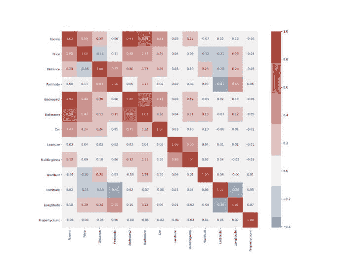
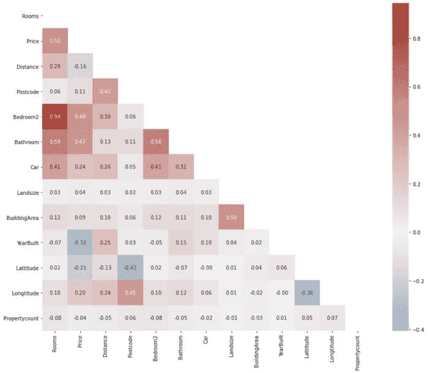
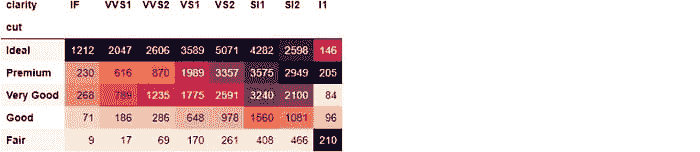
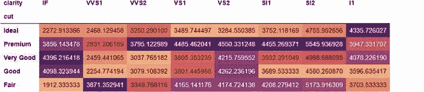
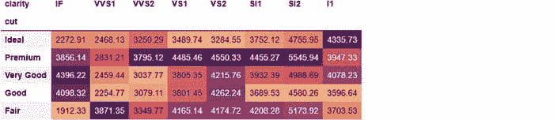
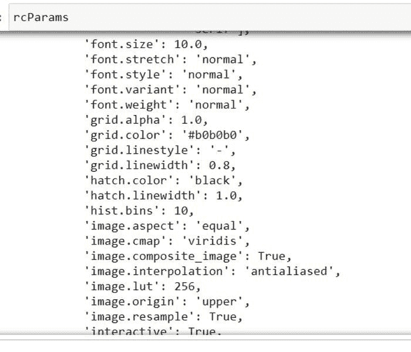
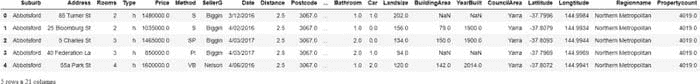
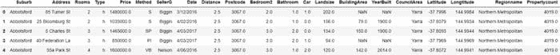
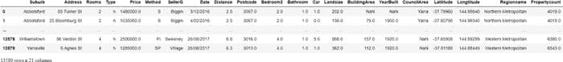

# 来自 Kaggle 的精彩技巧和最佳实践

> 原文：[`www.kdnuggets.com/2021/04/awesome-tricks-best-practices-kaggle.html`](https://www.kdnuggets.com/2021/04/awesome-tricks-best-practices-kaggle.html)

评论

**由 [Bex T.](https://ibexorigin.medium.com/)，AI 顶级写手**


*每周精彩技巧和来自 Kaggle 的最佳实践*

### 关于此项目

Kaggle 是一个很棒的地方。它是数据科学家和机器学习工程师的知识宝库。没有很多平台能在同一个地方找到由领域专家提供的高质量、高效、可重复的优秀代码。

* * *

## 我们的前三大课程推荐

 1\. [谷歌网络安全证书](https://www.kdnuggets.com/google-cybersecurity) - 快速进入网络安全职业生涯。

 2\. [谷歌数据分析专业证书](https://www.kdnuggets.com/google-data-analytics) - 提升你的数据分析技能

 3\. [谷歌 IT 支持专业证书](https://www.kdnuggets.com/google-itsupport) - 支持你组织的 IT

* * *

自推出以来，它已经举办了超过 164 场比赛。这些比赛吸引了来自世界各地的专家和专业人士。结果，每个比赛和 Kaggle 提供的大量开源数据集上都有许多高质量的笔记本和脚本。

在我数据科学旅程的开始，我会去 Kaggle 寻找数据集来练习我的技能。每当我查看其他的 kernels 时，我都会被代码的复杂性所压倒，并立即退缩。

但现在，我发现自己花了大量时间阅读他人的笔记本并参加比赛。有时，有些内容值得你整个周末投入其中。有时，我会发现简单却极其有效的代码技巧和最佳实践，这些只能通过观察其他专家来学习。

剩下的很简单，我的强迫症几乎迫使我把每一条数据科学知识都倾囊相授。所以，我在这里，写下我的“每周精彩技巧和来自 Kaggle 的最佳实践”第一版。在这个系列中，你会发现我写的任何在典型数据科学工作流程中有用的东西，包括与常见库相关的代码快捷方式、Kaggle 上顶级行业专家遵循的最佳实践等等，都是我在过去一周里学到的。请享用！

### 1\. 绘制相关矩阵的下半部分

一个好的相关矩阵可以提供大量有关数据集的信息。通常会绘制它以查看特征与目标变量之间的成对相关性。根据你的需求，你可以决定保留哪些特征并将其输入到你的机器学习算法中。

但今天，数据集包含了如此多的特征，以至于查看这样的相关矩阵可能会让人感到不知所措：



*每周 Kaggle 的绝妙技巧和最佳实践*

尽管很好，但信息量太大，难以消化。相关矩阵通常沿主对角线对称，因此包含重复数据。此外，对角线本身没有用处。让我们看看如何仅绘制有用的一半：



结果图表更容易解读，没有干扰。首先，我们使用 DataFrame 的 .corr 方法构建相关矩阵。然后，我们使用`np.ones_like`函数，并将`dtype`设置为`bool`，创建一个与 DataFrame 形状相同的 True 值矩阵：

然后，我们将其传递给 Numpy 的`.triu`函数，该函数返回一个包含矩阵下三角部分 False 值的 2D 布尔掩码。然后，我们可以将其传递给 Seaborn 的热图函数，以根据此掩码对子集矩阵：

我还做了一些调整，让图表更美观，比如添加自定义颜色调色板。

### 2\. 在 value_counts 中包含缺失值

使用 value_counts 的一个实用技巧是，你可以通过将`dropna`设置为 False 来查看任何列中缺失值的比例：

通过确定缺失值的比例，你可以决定是删除还是填补它们。然而，如果你想查看所有列中缺失值的比例，`value_counts`并不是最佳选择。相反，你可以这样做：

首先，通过将缺失值的数量除以 DataFrame 的长度来找出比例。然后，你可以过滤掉 0% 的列，即仅选择有缺失值的列。

### 3\. 使用 Pandas DataFrame Styler

我们中的许多人从未意识到 pandas 的巨大未开发潜力。pandas 的一个被低估且经常被忽视的功能是其 DataFrame 的样式化。使用 pandas DataFrames 的`.style`属性，你可以为它们应用条件设计和样式。作为第一个示例，让我们看看如何根据每个单元格的值更改背景颜色：



这几乎是一个没有使用 Seaborn 的热图函数的热图。在这里，我们使用`pd.crosstab`计算每个钻石切割和净度的组合。使用`.style.background_gradient`和颜色调色板，你可以轻松找出最常见的组合。从上述 DataFrame 中，我们可以看到大多数钻石为理想切割，最大组合为‘VS2’类型的净度。

我们甚至可以进一步，通过在交叉表中查找每个钻石切割和净度组合的平均价格：



这一次，我们对每个切割和清晰度组合的钻石价格进行汇总。从样式化的 DataFrame 中，我们可以看到最贵的钻石具有 ‘VS2’ 清晰度或高级切割。但如果我们能够通过四舍五入显示汇总价格，那会更好。我们也可以通过 `.style` 来更改这一点：



通过将 `.format` 方法与格式字符串 `{:.2f}` 链接，我们指定了 2 位小数的精度。

使用 `.style`，你的想象力就是限制。只需了解一点 CSS，你就可以为你的需求构建自定义样式函数。有关更多信息，请查看官方 pandas [指南](https://pandas.pydata.org/pandas-docs/stable/user_guide/style.html)。

### 4. 使用 Matplotlib 配置全局绘图设置

在进行 EDA 时，你会发现自己会对所有图形保持一些 Matplotlib 设置不变。例如，你可能想为所有图形应用自定义调色板，使用更大的字体进行刻度标签，改变图例的位置，使用固定的图形大小等。

指定每个自定义图形更改可能是一项相当枯燥、重复且耗时的任务。幸运的是，你可以使用 Matplotlib 的 `rcParams` 来为你的图形设置全局配置：

```py
from matplotlib import rcParams
```

`rcParams` 只是一个包含 Matplotlib 默认设置的普通 Python 字典：



你可以调整每个图形的几乎所有方面。我通常做的事情也是我看到其他人做的事情是设置固定的图形大小、刻度标签字体大小以及其他一些：

你可以在导入 Matplotlib 后立即设置这些选项来避免大量重复。通过调用 rcParams.keys() 查看所有其他可用的设置。

### 5. 配置 pandas 的全局设置

就像 Matplotlib 一样，pandas 也有可以调整的全局设置。当然，它们大多与显示选项有关。官方用户指南指出，pandas 的整个选项系统可以通过 pandas 命名空间直接访问的 5 个函数来控制：

+   get_option() / set_option() — 获取/设置单个选项的值。

+   reset_option() — 将一个或多个选项重置为默认值。

+   describe_option() — 打印一个或多个选项的描述。

+   option_context() — 使用一组选项执行代码块，执行后还原为先前设置。

所有选项的名称都是不区分大小写的，并且在底层通过正则表达式查找。你可以使用 `pd.get_option` 来查看默认行为，并使用 set_option 根据自己的喜好进行更改：

```py
>>> pd.get_option(‘display.max_columns’)
20
```

例如，上述选项控制当 DataFrame 中有很多列时显示的列数。如今，大多数数据集包含超过 20 个变量，每当你调用 `.head` 或其他显示函数时，pandas 会烦人地添加省略号以截断结果：

```py
>>> houses.head()
```



我宁愿通过滚动查看所有列。让我们改变这种行为：

```py
>>> pd.set_option(‘display.max_columns’, None)
```

上述，我完全移除了限制：

```py
>>> houses.head()
```



你可以使用以下命令恢复到默认设置：

```py
pd.reset_option(‘display.max_columns’)
```

就像列一样，你可以调整显示的默认行数。如果将 display.max_rows 设置为 5，你就不必总是调用`.head()`：

```py
>>> pd.set_option(‘display.max_rows’, 5)>>> houses
```



如今，plotly 正变得非常流行，因此将其设置为 pandas 的默认绘图后端是不错的选择。这样，每当你在 pandas DataFrames 上调用.plot 时，你将获得交互式的 plotly 图表：

```py
pd.set_option(‘plotting.backend’, ‘plotly’)
```

***请注意，你需要安装 plotly 才能进行此操作。***

如果你不想更改默认行为或者只是想暂时更改某些设置，你可以使用`pd.option_context`作为上下文管理器。临时行为更改只会应用于紧随其后的代码块。例如，如果数据量很大，pandas 有一个烦人的习惯，会将它们转换为标准记数法。你可以暂时避免这个问题，方法是：


你可以在官方 pandas [用户指南](https://pandas.pydata.org/pandas-docs/stable/user_guide/options.html#available-options)中查看可用选项的列表。

**简介：[Bex T.](https://ibexorigin.medium.com/)** 是 AI 领域的顶级作者，撰写有关数据科学和机器学习的“我希望我早一点找到这些”帖子。

[原文](https://towardsdev.com/tricks-and-best-practices-from-kaggle-794a5914480f)。转载已获许可。

**相关：**

+   数据专业人士寻找数据集的 8 个地方

+   数据科学自学的 10 个资源

+   初学者的 10 个 Python 技能

### 更多相关话题

+   [2021 年最佳 ETL 工具](https://www.kdnuggets.com/2021/12/mozart-best-etl-tools-2021.html)

+   [成为伟大的数据科学家所需的 5 项关键技能](https://www.kdnuggets.com/2021/12/5-key-skills-needed-become-great-data-scientist.html)

+   [每个初学者数据科学家应该掌握的 6 种预测模型](https://www.kdnuggets.com/2021/12/6-predictive-models-every-beginner-data-scientist-master.html)

+   [在 Kaggle 上竞争的 4 个技巧及为何你应该开始](https://www.kdnuggets.com/2022/05/packt-top-4-tricks-competing-kaggle-start.html)

+   [停止学习数据科学以寻找目标，并找到目标...] (https://www.kdnuggets.com/2021/12/stop-learning-data-science-find-purpose.html)

+   [一个 90 亿美元的 AI 失败案例分析](https://www.kdnuggets.com/2021/12/9b-ai-failure-examined.html)
