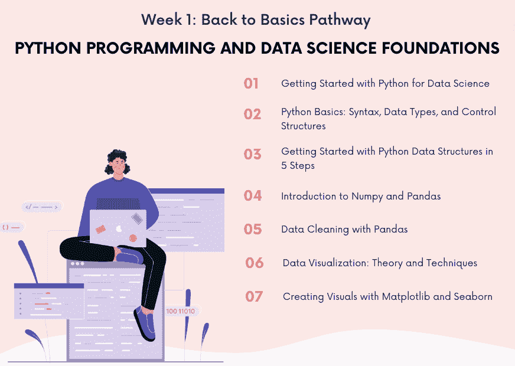

# 回到基础 第 1 周：Python 编程与数据科学基础

> 原文：[`www.kdnuggets.com/back-to-basics-week-1-python-programming-data-science-foundations`](https://www.kdnuggets.com/back-to-basics-week-1-python-programming-data-science-foundations)

图片由作者提供

加入 KDnuggets 的回到基础路径，帮助你启动新职业或刷新数据科学技能。回到基础路径分为 4 周加 1 周附加内容。希望你能将这些博客作为课程指南。

在第一周，我们将学习 Python、数据处理和可视化的所有内容。

+   **第 1 到 3 天**：有志数据科学家的 Python 必备知识

    +   介绍 Python 在数据科学中的角色。

    +   适合初学者的 Python 语法、数据类型和控制结构指南。

    +   互动编码练习以巩固你的理解。

+   **第 4 天**：Python 数据结构揭秘

    +   通过我们的逐步指南了解 Python 的核心数据结构。你将学习列表、元组、字典和集合——每种结构都有实际示例以及它们在数据处理中的重要性。

+   **第 5 到 6 天**：使用 NumPy 和 Pandas 进行实际数值计算

    +   探索 NumPy 和 Pandas 在数值分析和数据处理中的强大功能，包括实际应用和动手练习。

+   **第 7 天**：使用 Pandas 进行数据清洗技术

    +   使用 Pandas 掌握必备的数据清洗技能。

让我们开始吧。

# 从数据科学入门 Python

**第 1 周 - 第一部分**：从数据科学入门 Python

初学者指南：设置 Python 并理解其在数据科学中的作用。

生成式 AI、ChatGPT、Google Bard——这些可能是你过去几个月听到的很多术语。随着这种轰动效应，许多人正在考虑进入技术领域，比如数据科学。

不同角色的人希望保住他们的工作，因此他们将致力于提升技能以适应当前的市场。这是一个竞争激烈的市场，我们看到越来越多的人对数据科学产生兴趣，那里有成千上万的在线课程、训练营和硕士（MSc）课程可供选择。

# Python 基础：语法、数据类型和控制结构

**第 1 周 - 第二部分**：Python 基础：语法、数据类型和控制结构

想学 Python 吗？今天就开始学习 Python 的语法、支持的数据类型和控制结构。

你是一个想要学习 Python 编程的初学者吗？如果是的话，这个适合初学者的教程将帮助你熟悉语言的基础。这个教程将介绍 Python 的—相对友好的—语法。你还将学习如何使用不同的数据类型、条件语句和循环。

如果你已经在开发环境中安装了 Python，可以启动 Python REPL 并开始编码。或者，如果你想跳过安装—直接开始编码—我建议你前往[Google Colab](https://colab.google/)并开始编程。

# 从 5 个步骤开始学习 Python 数据结构

**第 1 周 - 第三部分：** 从 5 个步骤开始学习 Python 数据结构

本教程涵盖了 Python 的基础数据结构——列表、元组、字典和集合。了解它们的特征、使用案例和实际示例，全部在 5 个步骤中完成。

如果你想通过将一系列命令拼凑成算法步骤来实现问题的解决方案，在某些时候，数据需要被处理，数据结构将变得至关重要。

这样的数据结构提供了一种有效组织和存储数据的方法，对于创建快速、模块化的代码，能够执行有用的功能并良好扩展至关重要。Python 作为一种特定编程语言，拥有一系列内置的数据结构。

# Numpy 和 Pandas 简介

**第 1 周 - 第四部分：** Numpy 和 Pandas 简介

使用 Numpy 和 Pandas 进行数值计算和数据处理的入门。

如果你正在进行数据科学项目，Python 包将使你的生活更轻松，因为你只需几行代码即可完成复杂操作，比如数据处理和应用机器学习/深度学习模型。

当你开始数据科学之旅时，建议首先学习两个最有用的 Python 包：NumPy 和 Pandas。在这篇文章中，我们将介绍这两个库。让我们开始吧！

# 使用 Pandas 进行数据清理

**第 1 周 - 第五部分：** 使用 Pandas 进行数据清理

这个逐步教程适合初学者，旨在指导他们通过强大的 Pandas 库进行数据清理和预处理。

我们的数据通常来自多个资源，并且不干净。它可能包含缺失值、重复项、错误或不期望的格式等。在这些混乱的数据上运行实验会导致不正确的结果。

因此，在将数据输入模型之前，有必要准备好数据。这种通过识别和解决潜在错误、不准确和不一致性来准备数据的过程称为数据清理。

# 数据可视化：理论与技术

**第 1 周 - 第六部分：** 数据可视化：理论与技术

解锁观察我们数据驱动世界的秘密。

在一个由大数据和复杂算法主导的数字化环境中，人们会认为普通人在数据和数字的海洋中迷失了方向。不是吗？

然而，原始数据与可理解洞察之间的桥梁在于数据可视化的艺术。它是指引我们的指南针，是引导我们的地图，也是解码我们每天遇到的大量数据的翻译器。

但一个好的可视化背后的魔力是什么？为什么一个可视化会让人豁然开朗，而另一个却让人困惑？

# 使用 Matplotlib 和 Seaborn 创建可视化

**第 1 周 - 第七部分：** 使用 Matplotlib 和 Seaborn 创建可视化

学习用于工作中的基础 Python 包可视化。

数据可视化在数据工作中至关重要，因为它帮助人们理解我们数据的动态。直接以原始形式摄取数据很难，但可视化会激发人们的兴趣和参与度。这就是为什么学习数据可视化对成功从事数据领域至关重要。

Matplotlib 是 Python 中最受欢迎的数据可视化库之一，因为它非常灵活，你可以从头开始可视化几乎所有内容。你可以使用这个包控制你可视化的许多方面。

另一方面，[Seaborn](https://seaborn.pydata.org/) 是一个建立在 Matplotlib 之上的 Python 数据可视化包。它提供了更简单的高级代码和各种内置主题。这个包非常适合你想要快速得到外观良好的数据可视化时使用。

# 总结

恭喜你完成了第 1 周的课程！ ??

KDnuggets 团队希望《基础回顾》路径为读者提供了一个全面且结构化的方式来掌握数据科学的基础知识。

第 2 周的内容将在下周一发布，请继续关注！

****[Nisha Arya](https://www.linkedin.com/in/nisha-arya-ahmed/)**** 是一位数据科学家、自由技术作家，同时也是 KDnuggets 的编辑和社区经理。她特别感兴趣于提供数据科学职业建议或教程，以及围绕数据科学的理论知识。Nisha 涵盖了广泛的话题，并希望探索人工智能如何有利于人类寿命的不同方式。作为一名热衷学习者，Nisha 希望拓宽她的技术知识和写作技能，同时帮助引导他人。

* * *

## 我们的前三大课程推荐

 1\. [Google 网络安全证书](https://www.kdnuggets.com/google-cybersecurity) - 快速进入网络安全职业生涯。

 2\. [Google 数据分析专业证书](https://www.kdnuggets.com/google-data-analytics) - 提升你的数据分析水平

 3\. [Google IT 支持专业证书](https://www.kdnuggets.com/google-itsupport) - 支持组织中的 IT 需求

* * *

### 更多相关主题

+   [基础回顾第 2 周：数据库、SQL、数据管理及…](https://www.kdnuggets.com/back-to-basics-week-2-database-sql-data-management-and-statistical-concepts)

+   [基础回顾第 3 周：机器学习简介](https://www.kdnuggets.com/back-to-basics-week-3-introduction-to-machine-learning)

+   [基础回顾第 4 周：高级主题与部署](https://www.kdnuggets.com/back-to-basics-week-4-advanced-topics-and-deployment)

+   [基础回顾额外周：部署到云端](https://www.kdnuggets.com/back-to-basics-bonus-week-deploying-to-the-cloud)

+   [基础回顾，第二部分：梯度下降](https://www.kdnuggets.com/2023/03/back-basics-part-dos-gradient-descent.html)

+   [基础回顾路径](https://www.kdnuggets.com/back-to-basics-pathway)
