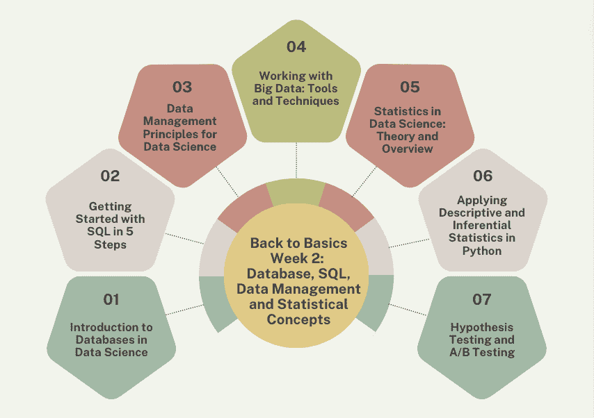

# 回到基础第 2 周：数据库、SQL、数据管理和统计概念

> 原文：[`www.kdnuggets.com/back-to-basics-week-2-database-sql-data-management-and-statistical-concepts`](https://www.kdnuggets.com/back-to-basics-week-2-database-sql-data-management-and-statistical-concepts)

作者提供的图片

加入 KDnuggets，通过我们的回到基础路径来启动你的新职业或刷新你的数据科学技能。回到基础路径分为 4 周加 1 周的额外周。我们希望你可以将这些博客作为课程指南。

* * *

## 我们的三大课程推荐

 1\. [谷歌网络安全证书](https://www.kdnuggets.com/google-cybersecurity) - 快速进入网络安全职业生涯。

 2\. [谷歌数据分析专业证书](https://www.kdnuggets.com/google-data-analytics) - 提升你的数据分析水平

 3\. [谷歌 IT 支持专业证书](https://www.kdnuggets.com/google-itsupport) - 支持你的组织在 IT 方面

* * *

如果你还没有，看看第 1 周：回到基础第 1 周：Python 编程与数据科学基础

进入第二周，我们将学习数据库、SQL、数据管理和统计概念。

+   第 1 天：数据科学中的数据库介绍

+   第 2 天：通过 5 个步骤开始 SQL 学习

+   第 3 天：数据科学的数据管理原则

+   第 4 天：处理大数据：工具和技术

+   第 5 天：数据科学中的统计学：理论与概述

+   第 6 天：在 Python 中应用描述性统计和推断统计

+   第 7 天：假设检验和 A/B 测试

# 数据科学中的数据库介绍

第 2 周 - 第一部分：数据科学中的数据库介绍

理解数据库在数据科学中的相关性。同时学习关系数据库的基本知识、NoSQL 数据库类别等。

数据科学涉及从大量数据中提取价值和洞察以驱动业务决策。它还涉及使用历史数据建立预测模型。数据库促进了大量数据的有效存储、管理、检索和分析。

因此，作为数据科学家，你应该理解数据库的基本知识。因为它们能够存储和管理大量复杂的数据集，从而允许高效的数据探索、建模和洞察分析。

# 开始 SQL 学习的 5 个步骤

第 2 周 - 第二部分：通过 5 个步骤开始 SQL 学习

在处理和操作关系型数据库中的数据时，结构化查询语言（SQL）是最重要的名字。SQL 是一个主要的领域特定语言，是数据库管理的基石，提供了与数据库交互的标准化方式。

随着数据成为决策和创新的驱动力，SQL 仍然是一项关键技术，要求数据分析师、开发者和数据科学家给予高度关注。

本综合 SQL 教程涵盖了从设置 SQL 环境到掌握高级概念如联接、子查询和优化查询性能的一切内容。通过逐步示例，这个指南非常适合希望提升数据管理技能的初学者。

# 数据科学的数据管理原则

第 2 周 - 第三部分: 数据科学的数据管理原则

理解数据科学家应了解的关键数据管理原则。

在你作为数据科学家的旅程中，你会遇到挫折，并克服它们。你将学习如何选择不同的过程来处理不同的任务。

这些过程将相辅相成，以确保你的数据科学项目尽可能高效，并在决策过程中发挥关键作用。

# 处理大数据: 工具和技术

第 2 周 - 第四部分: 处理大数据: 工具和技术

在如此广阔的大数据领域，你从哪里开始？使用哪些工具和技术？我们探讨了这一点，并讨论了大数据中最常用的工具。

商业领域早已不再是所有所需数据都在你的“黑色小本子”里。在数字革命的时代，连传统数据库也不再足够。

处理大数据已成为企业以及数据科学家的关键技能。大数据的特点是其体量、速度和多样性，提供了对模式和趋势的前所未有的洞察。

要有效处理这些数据，需要使用专门的工具和技术。

# 数据科学中的统计学: 理论与概述

第 2 周 - 第五部分: 数据科学中的统计学: 理论与概述

对统计学在数据科学中作用的高层次探索。

你是否有兴趣掌握统计学，以在数据科学面试中脱颖而出？如果是，你不应该仅仅为了面试而学习。理解统计学可以帮助你从数据中获得更深入、更细致的洞察。

在这篇文章中，我将展示需要掌握的最关键的统计学概念，以便更好地解决数据科学问题。

# 在 Python 中应用描述性和推断性统计

第 2 周 - 第六部分: 在 Python 中应用描述性和推断性统计

在你的数据科学之旅中，以下是你应该了解的基本统计学知识。

统计学是一个涵盖从数据收集、数据分析到数据解释的领域。它是一个帮助相关方在面对不确定性时做出决策的学科。

统计学领域的两个主要分支是描述统计学和推断统计学。描述统计学是一个涉及使用各种方式总结数据的分支，例如总结统计、可视化和表格。而推断统计学则更多地基于数据样本对总体进行概括。

# 假设检验和 A/B 测试

第 2 周 - 第七部分：假设检验和 A/B 测试

数据驱动决策的支柱。

在数据主导的时代，企业和组织不断寻找利用数据力量的方法。

从你在 Amazon 上收到的推荐产品到你在社交媒体上看到的内容，背后都有一套精细的方法。

这些决策的核心是什么？A/B 测试和假设检验。

但它们是什么，为什么在我们的数据中心化世界中如此关键？让我们一起发现吧！

# 总结

恭喜你完成了第 2 周的课程！！

KDnuggets 团队希望“回到基础”路径为读者提供了全面而结构化的方式来掌握数据科学的基础。

第 3 周的内容将于下周一发布 - 敬请关注！

****[Nisha Arya](https://www.linkedin.com/in/nisha-arya-ahmed/)****是一名数据科学家、自由技术写作人员，同时也是 KDnuggets 的编辑和社区经理。她特别关注提供数据科学职业建议或教程以及围绕数据科学的理论知识。Nisha 涵盖了广泛的话题，并希望探索人工智能如何有助于人类生命的持久性。作为一个热衷学习者，Nisha 寻求拓宽她的技术知识和写作技能，同时帮助指导他人。

### 更多相关话题

+   [回到基础第 4 周：高级话题和部署](https://www.kdnuggets.com/back-to-basics-week-4-advanced-topics-and-deployment)

+   [回到基础第 1 周：Python 编程与数据科学基础](https://www.kdnuggets.com/back-to-basics-week-1-python-programming-data-science-foundations)

+   [回到基础第 3 周：机器学习简介](https://www.kdnuggets.com/back-to-basics-week-3-introduction-to-machine-learning)

+   [基础回顾额外周：部署到云端](https://www.kdnuggets.com/back-to-basics-bonus-week-deploying-to-the-cloud)

+   [免费 4 周数据科学课程：AI 质量管理](https://www.kdnuggets.com/2022/02/truera-free-4-week-data-science-course-ai-quality-management.html)

+   [回到基础，第二部分：梯度下降](https://www.kdnuggets.com/2023/03/back-basics-part-dos-gradient-descent.html)
