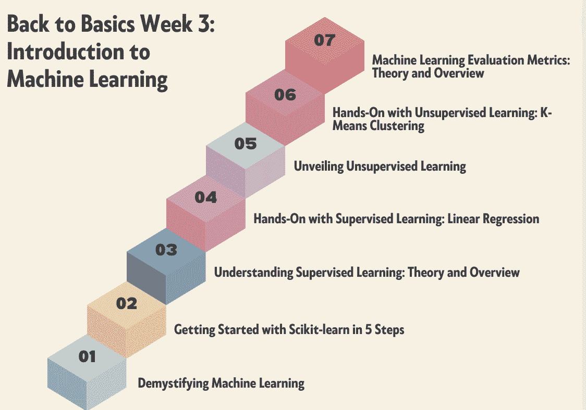

# 基础回顾 第 3 周: 机器学习介绍

> 原文：[`www.kdnuggets.com/back-to-basics-week-3-introduction-to-machine-learning`](https://www.kdnuggets.com/back-to-basics-week-3-introduction-to-machine-learning)

图片由作者提供

加入 KDnuggets 的基础回顾课程，帮助你启动新职业或巩固数据科学技能。基础回顾课程分为 4 周，还有一周的额外内容。希望你能将这些博客作为课程指南使用。

* * *

## 我们的三大课程推荐

 1\. [Google 网络安全证书](https://www.kdnuggets.com/google-cybersecurity) - 快速进入网络安全职业轨道。

 2\. [Google 数据分析专业证书](https://www.kdnuggets.com/google-data-analytics) - 提升你的数据分析技能

 3\. [Google IT 支持专业证书](https://www.kdnuggets.com/google-itsupport) - 支持你的组织进行 IT 工作

* * *

如果你还没有看过，请查看：

+   第 1 周: Python 编程与数据科学基础

+   第 2 周: 数据库、SQL、数据管理和统计概念

进入第三周，我们将深入探讨机器学习。

+   第 1 天: 揭开机器学习的面纱

+   第 2 天: 5 步入门 Scikit-learn

+   第 3 天: 理解监督学习：理论与概述

+   第 4 天: 实操监督学习：线性回归

+   第 5 天: 揭示无监督学习

+   第 6 天: 实操无监督学习：K 均值聚类

+   第 7 天: 机器学习评估指标：理论与概述

# 揭开机器学习的面纱

第 3 周 - 第一部分: 揭开机器学习的面纱

传统上，计算机会遵循一套明确的指令。例如，如果你希望计算机执行一个简单的加法任务，你必须逐步列出每一步。然而，随着数据变得越来越复杂，这种逐步指令的手动方法变得不够用。

这是机器学习作为游戏规则改变者的起点。我们希望计算机能够从示例中学习，就像我们从经验中学习一样。想象一下教孩子骑自行车，先让他看几次，然后让他摔倒、摸索并自学。这就是机器学习背后的想法。这项创新不仅改变了行业，而且在今天的世界中成为了不可或缺的需求。

# 5 步入门 Scikit-learn

第 3 周 - 第二部分: 5 步入门 Scikit-learn

本教程提供了一个全面的机器学习 Scikit-learn 实操 walkthrough。读者将学习包括数据预处理、模型训练和评估、超参数调整以及编译集成模型以增强性能的关键概念和技术。

在学习如何使用[Scikit-learn](https://scikit-learn.org/stable/)时，我们显然需要对机器学习的基本概念有一定的理解，因为 Scikit-learn 只是实现机器学习原理和相关任务的实际工具。机器学习是人工智能的一个子集，使计算机能够通过经验学习和改进，而无需明确编程。算法使用训练数据通过揭示模式和洞察来做出预测或决策。

# 理解监督学习：理论与概述

第三周 - 第三部分：理解监督学习：理论与概述

监督学习是机器学习的一个子类别，其中计算机从包含输入和正确输出的标记数据集中学习。它试图找到将输入 (x) 与输出 (y) 相关联的映射函数。你可以将其看作是教你的弟弟或妹妹如何识别不同的动物。你会给他们看一些图片 (x) 并告诉他们每种动物的名称 (y)。

经过一段时间，他们将学习到差异，并能够正确识别新的图片。这是监督学习的基本直觉。

# 监督学习实操：线性回归

第三周 - 第四部分：监督学习实操：线性回归

如果你在寻找一个详细且适合初学者的关于使用 Scikit-learn 实现线性回归的实操教程，你将迎来一段引人入胜的旅程。

线性回归是预测连续目标变量的基础监督机器学习算法，基于输入特征。顾名思义，它假设因变量和自变量之间的关系是线性的。

所以如果我们尝试将因变量 Y 与自变量 X 绘制在一起，我们会得到一条直线。

# 揭示无监督学习

第三周 - 第五部分：揭示无监督学习

探索无监督学习范式。熟悉关键概念、技术和流行的无监督学习算法。

在机器学习中，无监督学习是一种涉及在未标记数据集上训练算法的范式。因此，没有监督或标记输出。

在无监督学习中，目标是发现数据自身的模式、结构或关系，而不是基于标记的示例进行预测或分类。它涉及探索数据的内在结构，以获得见解并理解复杂信息。

# 无监督学习实操：K-Means 聚类

第三周 - 第六部分：无监督学习实操：K-Means 聚类

本教程提供了对 K-Means 聚类这一流行的无监督学习算法的关键概念和实现的实践经验，适用于客户细分和目标广告应用。

K-means 聚类是数据科学中最常用的无监督学习算法之一。它用于根据数据点之间的相似性将数据集自动划分为多个簇或组。

在这个简短的教程中，我们将学习 K-Means 聚类算法的工作原理，并使用 scikit-learn 将其应用于真实数据。此外，我们将可视化结果，以理解数据分布。

# 机器学习评估指标：理论与概述

第三周 - 第七部分：机器学习评估指标：理论与概述

对机器学习中评估指标的高级探索及其重要性。

构建一个对新数据具有良好泛化能力的机器学习模型非常具有挑战性。需要进行评估以了解模型是否足够好，或是否需要进行一些修改以提升性能。

如果模型没有从训练集中学习到足够的模式，它将在训练集和测试集上表现不佳。这就是所谓的欠拟合问题。

过多地学习训练数据的模式，甚至是噪声，将导致模型在训练集上表现非常好，但在测试集上表现较差。这种情况称为过拟合。如果在训练集和测试集上的性能相似，则可以获得模型的泛化能力。

# 总结

恭喜你完成了第三周！！

KDnuggets 团队希望“回到基础”路径能为读者提供一种全面且有结构的方法，以掌握数据科学的基础知识。

第四周将于下周一发布 - 敬请关注！

****[Nisha Arya](https://www.linkedin.com/in/nisha-arya-ahmed/)**** 是一位数据科学家、自由技术写作人，同时也是 KDnuggets 的编辑和社区经理。她特别关注提供数据科学职业建议或教程，以及基于理论的数据科学知识。Nisha 涵盖了广泛的话题，并希望探索人工智能如何有利于人类寿命的不同方式。作为一个热衷学习者，Nisha 希望拓宽她的技术知识和写作技能，同时帮助指导他人。

### 更多相关话题

+   [回到基础 第一周：Python 编程与数据科学基础](https://www.kdnuggets.com/back-to-basics-week-1-python-programming-data-science-foundations)

+   [回到基础 第四周：高级主题与部署](https://www.kdnuggets.com/back-to-basics-week-4-advanced-topics-and-deployment)

+   [回到基础 奖励周：部署到云端](https://www.kdnuggets.com/back-to-basics-bonus-week-deploying-to-the-cloud)

+   [回到基础 第二周：数据库、SQL、数据管理及…](https://www.kdnuggets.com/back-to-basics-week-2-database-sql-data-management-and-statistical-concepts)

+   [回到基础，第二部分：梯度下降](https://www.kdnuggets.com/2023/03/back-basics-part-dos-gradient-descent.html)

+   [回到基础路径](https://www.kdnuggets.com/back-to-basics-pathway)
