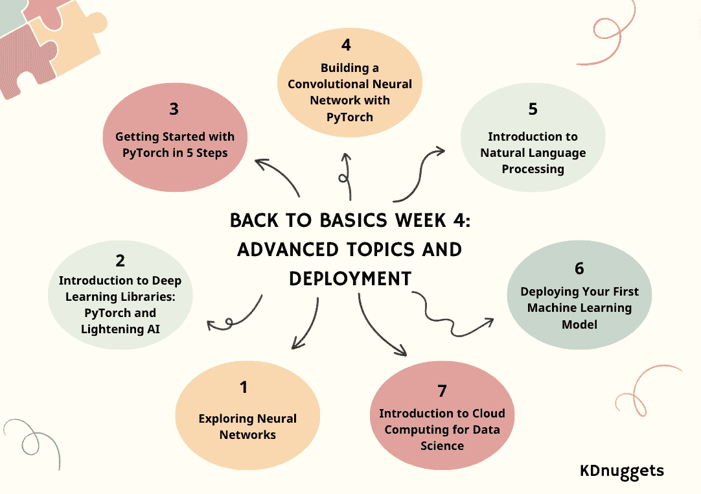

# 回到基础 第四周：高级主题与部署

> 原文：[`www.kdnuggets.com/back-to-basics-week-4-advanced-topics-and-deployment`](https://www.kdnuggets.com/back-to-basics-week-4-advanced-topics-and-deployment)

作者提供的图片

加入 KDnuggets，通过我们的回到基础路径，帮助您启动新职业或提升数据科学技能。回到基础路径分为 4 周，加上一周额外的内容。我们希望您能将这些博客作为课程指南。

* * *

## 我们的前三大课程推荐

 1\. [Google 网络安全证书](https://www.kdnuggets.com/google-cybersecurity) - 快速入门网络安全职业。

 2\. [Google 数据分析专业证书](https://www.kdnuggets.com/google-data-analytics) - 提升您的数据分析技能

 3\. [Google IT 支持专业证书](https://www.kdnuggets.com/google-itsupport) - 支持您的组织的 IT

* * *

如果您还没有，看看：

+   第一周：Python 编程与数据科学基础

+   第二周：数据库、SQL、数据管理和统计概念

+   第三周：回到基础 第三周：机器学习介绍

进入第三周，我们将深入探讨高级主题和部署。

+   第一天：探索神经网络

+   第二天：深度学习库介绍：PyTorch 和 Lightening AI

+   第三天：通过 5 个步骤开始使用 PyTorch

+   第四天：使用 PyTorch 构建卷积神经网络

+   第五天：自然语言处理介绍

+   第六天：部署您的第一个机器学习模型

+   第七天：数据科学中的云计算介绍

# 探索神经网络

第四周 - 第一部分：探索神经网络

解锁 AI 的力量：神经网络及其应用指南。

想象一下，一台机器像人脑一样思考、学习和适应，并发现数据中的隐藏模式。

这项技术，即神经网络（NN），其算法模仿认知。我们稍后将探讨 NN 是什么以及它们如何运作。

在这篇文章中，我将向您解释神经网络（NN）的基本方面——结构、类型、实际应用和定义操作的关键术语。

# 深度学习库介绍：PyTorch 和 Lightening AI

第四周 - 第二部分：深度学习库介绍：PyTorch 和 Lightning AI

对 PyTorch 和 Lightning AI 的简单解释。

深度学习是基于 [神经网络](https://en.wikipedia.org/wiki/Neural_network) 的机器学习模型的一部分。在其他机器模型中，数据处理以寻找有意义的特征通常是手动完成的或依赖于领域专长；然而，深度学习可以模仿人脑发现重要特征，从而提高模型性能。

深度学习模型有许多应用，包括面部识别、欺诈检测、语音转文本、文本生成等。深度学习已成为许多高级机器学习应用的标准方法，我们学习这些内容不会有什么损失。

为了开发这个深度学习模型，我们可以依靠各种库框架，而不是从头开始。在本文中，我们将讨论两个可以用来开发深度学习模型的不同库：PyTorch 和 Lighting AI。

# 开始使用 PyTorch 的 5 个步骤

第 4 周 - 第三部分: 5 步骤开始使用 PyTorch

本教程提供了一个关于使用 PyTorch 及其高级封装 PyTorch Lightning 的机器学习深度介绍。文章涵盖了从安装到高级主题的基本步骤，提供了构建和训练神经网络的实践方法，并强调了使用 Lightning 的好处。

[PyTorch](https://pytorch.org/) 是一个流行的开源机器学习框架，基于 Python 并针对 GPU 加速计算进行了优化。最初由 Meta AI 于 2016 年开发，并且现在是 Linux 基金会的一部分，PyTorch 已迅速成为深度学习研究和应用中最广泛使用的框架之一。

[PyTorch Lightning](https://lightning.ai/docs/pytorch/stable/) 是一个建立在 PyTorch 之上的轻量级封装，它进一步简化了研究人员的工作流程和模型开发过程。使用 Lightning，数据科学家可以更多地专注于设计模型，而不是处理样板代码。

# 使用 PyTorch 构建卷积神经网络

第 4 周 - 第四部分: 使用 PyTorch 构建卷积神经网络

本博客文章提供了一个关于在 PyTorch 中构建用于图像分类的卷积神经网络的教程，利用卷积层和池化层进行特征提取，以及全连接层进行预测。

卷积神经网络 (CNN 或 ConvNet) 是一种深度学习算法，专门设计用于对象识别至关重要的任务——如图像分类、检测和分割。CNN 能够在复杂的视觉任务中实现最先进的准确度，推动了许多现实生活中的应用，如监控系统、仓库管理等。

作为人类，我们可以通过分析模式、形状和颜色轻松识别图像中的物体。卷积神经网络（CNN）也可以通过学习哪些模式对区分很重要来执行这种识别。例如，当试图区分猫和狗的照片时，我们的大脑会关注独特的形状、纹理和面部特征。CNN 学会捕捉这些相同的区分特征。即使是非常细粒度的分类任务，CNN 也能直接从像素中学习复杂的特征表示。

# 自然语言处理简介

第四周 - 第五部分：自然语言处理简介

自然语言处理（NLP）及其应用的概述。

我们正在学习有关 ChatGPT 和大型语言模型（LLMs）的大量内容。自然语言处理是一个有趣的话题，目前在人工智能和科技界引起了轰动。是的，像 ChatGPT 这样的 LLMs 促进了它们的发展，但了解一切的起源不是很好吗？所以让我们回到基础 - NLP。

自然语言处理（NLP）是人工智能的一个子领域，它是计算机检测和理解人类语言的能力，通过语音和文本就像我们人类一样。NLP 帮助模型处理、理解和输出人类语言。

NLP 的目标是弥合人类和计算机之间的沟通鸿沟。NLP 模型通常在下一个单词预测等任务上进行训练，这使得它们能够建立上下文依赖关系，并生成相关的输出。

# 部署你的第一个机器学习模型

第四周 - 第六部分：部署你的第一个机器学习模型

只需 3 个简单步骤，你就能比说“玻璃分类模型”还快地构建和部署一个玻璃分类模型！

在本教程中，我们将学习如何使用 [玻璃分类](https://www.kaggle.com/datasets/uciml/glass) 数据集构建一个简单的多分类模型。我们的目标是开发和部署一个可以预测各种类型玻璃的网页应用程序，例如：

1.  玻璃窗户浮动处理

1.  玻璃窗户非浮动处理

1.  车辆窗户浮动处理

1.  车辆窗户非浮动处理（数据集中缺失）

1.  容器

1.  餐具

1.  头灯

此外，我们还将学习：

+   Skops：分享你的基于 scikit-learn 的模型并将其投入生产。

+   Gradio：机器学习网页应用程序框架。

+   HuggingFace Spaces：免费机器学习模型和应用程序托管平台。

到本教程结束时，你将获得构建、训练和部署一个基本机器学习模型作为网页应用程序的实际经验。

# 数据科学的云计算介绍

第四周 - 第七部分：数据科学的云计算介绍

现代科技的强大组合。

在今天的世界中，两个主要力量已经成为改变游戏规则的因素：数据科学和云计算。

想象一个每秒生成巨大数据量的世界。其实，你不必想象……这就是我们的世界！

从社交媒体互动到金融交易，从医疗记录到电子商务偏好，数据无处不在。

但如果我们无法获得价值，这些数据有什么用呢？这正是数据科学的作用所在。

那么我们在哪里存储、处理和分析这些数据呢？这正是云计算的强项所在。

让我们开始探索这两种技术奇迹之间错综复杂的关系吧。让我们（尝试）一起发现一切！

# 总结一下

恭喜你完成了第 4 周！！

KDnuggets 团队希望“基础回顾”路径为读者提供了一个全面且结构化的方法，以掌握数据科学的基础。

奖励周将在下周一发布——敬请期待！

****[Nisha Arya](https://www.linkedin.com/in/nisha-arya-ahmed/)**** 是一名数据科学家、自由技术作家，以及 KDnuggets 的编辑和社区经理。她特别关注提供数据科学职业建议、教程和基于理论的知识。Nisha 涉及广泛的话题，并希望探索人工智能如何有利于人类生命的持久性。作为一个热衷学习者，Nisha 致力于拓宽她的技术知识和写作技能，同时帮助他人。

### 相关主题

+   [基础回顾 第 2 周：数据库、SQL、数据管理及……](https://www.kdnuggets.com/back-to-basics-week-2-database-sql-data-management-and-statistical-concepts)

+   [基础回顾 第 1 周：Python 编程与数据科学基础](https://www.kdnuggets.com/back-to-basics-week-1-python-programming-data-science-foundations)

+   [基础回顾 第 3 周：机器学习简介](https://www.kdnuggets.com/back-to-basics-week-3-introduction-to-machine-learning)

+   [基础回顾 奖励周：云端部署](https://www.kdnuggets.com/back-to-basics-bonus-week-deploying-to-the-cloud)

+   [基础回顾，第 Dos 部分：梯度下降](https://www.kdnuggets.com/2023/03/back-basics-part-dos-gradient-descent.html)

+   [基础回顾路径](https://www.kdnuggets.com/back-to-basics-pathway)
