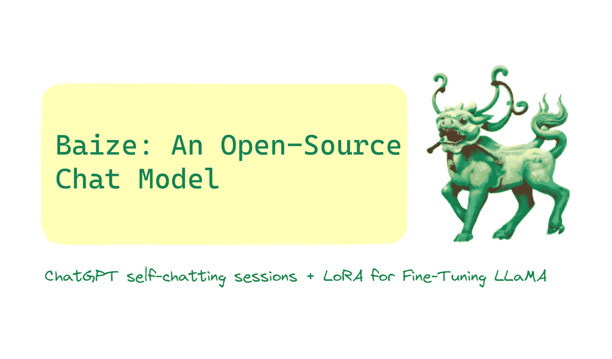
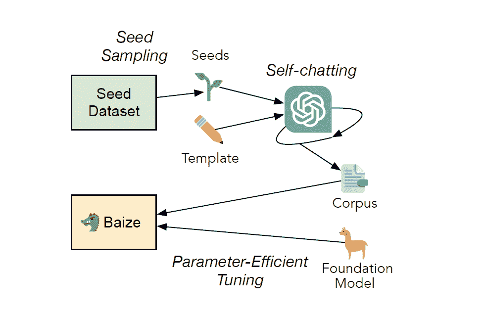

# Baize: 一个开源聊天模型（但有所不同？）

> 原文：[`www.kdnuggets.com/2023/04/baize-opensource-chat-model-different.html`](https://www.kdnuggets.com/2023/04/baize-opensource-chat-model-different.html)

图片由作者提供

我认为可以说 2023 年是大型语言模型（LLMs）的年份。从基于 GPT-3 家族的 ChatGPT 的广泛应用，到具备增强推理能力的 GPT-4 的发布，这一年在生成式 AI 领域取得了许多里程碑。而我们每天醒来时都会看到新应用的发布，这些应用利用 ChatGPT 的能力来解决新问题。

在这篇文章中，我们将了解**Baize**，一个最近发布的开源聊天模型。

# 什么是 Baize？

**Baize 是一个开源聊天模型。很酷。但为什么还需要另一个聊天模型？**

好吧，在与聊天机器人进行的典型会话中，你并不是只提出一个问题来寻求答案。相反，你会问一系列问题，聊天机器人会逐一回答。这种对话链会持续——直到你获得答案或问题的可接受解决方案——在这种多轮对话中。

所以，如果你想开始构建自己的聊天模型，这种**多轮对话语料库**并不常见。Baize 旨在利用 ChatGPT 生成这样的语料库，并用它来微调 LLaMA 模型。这有助于你构建更好的聊天机器人，并减少训练时间。

[Project Baize](https://github.com/project-baize)由 UC San Diego 的 McAuley 实验室资助，并且是 UC San Diego、孙中山大学和微软亚洲研究院研究人员合作的结果。

Baize 的名字来源于中国神话中的白泽，白泽能够理解人类语言[1]。理解人类语言是我们都希望聊天模型具备的能力，对吧？Baize 的研究论文首次上传至 arxiv 是在 2023 年 4 月 3 日。该模型的权重和代码已全部在 GitHub 上公开，仅供研究使用。所以现在是探索这个新开源聊天模型的好时机。

是的，让我们更多地了解 Baize。

# Baize 是如何工作的？

Baize 的工作可以（几乎）总结为两个关键点：

+   通过利用 ChatGPT 生成大量的多轮对话数据

+   使用生成的语料库来微调 LLaMA

训练 Baize 的流程 | [图片来源](https://arxiv.org/abs/2304.01196v2)

## 使用 ChatGPT 自我对话进行数据收集

我们提到过，Baize 使用 ChatGPT 来构建聊天语料库。它使用一种叫做**自我对话**的过程，其中*ChatGPT 与自己对话*。

一个典型的聊天会话需要一个人类和一个 AI。数据收集管道中的**自聊天**过程设计为 ChatGPT 与自己对话——以提供对话的双方。对于自聊天过程，提供了一个模板以及相关要求。

ChatGPT 生成的对话质量非常高（我们在社交媒体上看到的更多，而不是在我们自己的 ChatGPT 会话中）。因此，我们获得了高质量的对话语料库。

让我们来看看 Baize 使用的数据：

+   有一个**种子**，*设置话题*以进行聊天会话。它可以是一个问题或一个提供对话中心思想的短语。在 Baize 的训练中，来自 StackOverflow 和 Quora 的问题被用作种子。

+   在 Baize 的训练中，ChatGPT（gpt-turbo-3.5）模型用于自聊天数据收集管道。生成的语料库大约有**115K**个对话——其中约 55K 个对话来自上述每个来源。

+   此外，还使用了来自斯坦福 Alpaca 的数据。

+   目前已经发布了三个版本的模型：Baize-7B、Baize-13B 和 Baize-30B。（在 Baize-XB 中，XB 表示 X 十亿参数。）

+   种子也可以从特定领域进行抽样。这意味着我们可以运行数据收集过程以构建特定领域的聊天语料库。在这个方向上，Baize-Healthcare 模型已经发布，基于公开的[MedQuAD 数据集](https://paperswithcode.com/dataset/medquad)进行训练，创建了大约 47K 个对话的语料库。

## 低资源设置中的微调

下一部分是对生成语料库的 LLaMA 模型进行微调。模型微调通常是一个资源密集型的任务。由于在资源限制下调整大型语言模型的所有参数不可行，**Baize**使用[低秩适应（LoRA）](https://arxiv.org/abs/2106.09685)来微调 LLaMA 模型。

此外，在推理时，有一个提示指示 Baize 不要进行不道德和敏感的对话。这减少了对人工干预审查的需求。

[功能应用](https://huggingface.co/spaces/project-baize/Baize-7B)从 HuggingFace 中心获取 LLaMA 模型和 LoRA 权重。

# Baize 的优点和局限性

接下来，让我们回顾一下 Baize 的一些优点和局限性。

## 优点

让我们开始列举一些 Baize 的优点：

+   **高可用性**：你可以尝试[Baize-7B on HuggingFaces spaces](https://huggingface.co/spaces/project-baize/Baize-7B)或[本地运行](https://github.com/project-baize/baize-chatbot#how-to-run-locally)。Baize 不受 API 调用次数的限制，缓解了高需求时期的可用性问题。

+   **内置的审核支持**：在推理时的提示可以防止对敏感和不道德话题的讨论，这有利于减少需要审查对话的工作量。

+   **聊天语料库生成**：如前所述，Baize 可以帮助构建大规模的多轮对话语料库。这在大规模训练聊天模型时非常有用。

+   **低资源环境中的可访问性**：正如[1]中提到的，我们可以在单个 GPU 机器上运行 Baize，这使得在计算资源有限的低资源环境中也能使用它。

+   **领域特定的应用**：通过精心从特定领域采样种子，我们可以拥有用于领域特定应用（如医疗、农业、金融等）的聊天机器人。

+   **可重复性和定制化**：代码是公开的，数据收集和训练流程是可重复的。如果你想从各种特定来源收集数据以构建自定义语料库，你可以修改项目代码库中的 <code>collection.py</code> 脚本。

## 局限性

与所有 LLM 驱动的聊天应用一样，Baize 存在以下局限性：

+   **不准确的信息**：正如 ChatGPT 的回答有时可能因过时的训练数据和语境差异而出现不准确的情况，Baize 的回答也可能在某些时候技术上不准确。

+   **实时信息的挑战**：LLaMA 模型没有在最新数据上进行训练。这使得需要实时信息以提供准确且有用回答的任务变得具有挑战性。

+   **偏见和毒性**：通过改变推理提示，可以操控模型拒绝参与敏感、不道德的对话。

# 总结

今天就到这里！要了解更多关于 Baize 的信息，请务必在 HuggingFace spaces 上尝试演示版或在本地运行。ChatGPT 和 GPT-4 启发了自然语言处理领域的广泛应用。

随着新颖的 OpenAI 包装几乎每天都出现在开发者领域，跟上这些快速的进展和发布可能会让人感到不知所措。与此同时，我们很兴奋地期待生成式 AI 的未来会带来什么。

# 参考文献和进一步学习的资源

[1] C Xu, D Guo, N Duan, J McAuley, [Baize: 一种在自聊天数据上进行参数高效调整的开源模型](https://arxiv.org/abs/2304.01196v2), arXiv, 2023.

[2] [GitHub 上的 Project Baize](https://github.com/project-baize/baize-chatbot)

[3] [HuggingFace Spaces 上的演示](https://huggingface.co/spaces/project-baize/Baize-7B)

**[Bala Priya C](https://www.linkedin.com/in/bala-priya/)** 是一位技术作家，她喜欢创作长篇内容。她的兴趣领域包括数学、编程和数据科学。她通过撰写教程、操作指南等，向开发者社区分享她的学习经验。

* * *

## 我们的前三大课程推荐

 1\. [Google 网络安全证书](https://www.kdnuggets.com/google-cybersecurity) - 快速进入网络安全职业生涯。

 2\. [谷歌数据分析专业证书](https://www.kdnuggets.com/google-data-analytics) - 提升你的数据分析技能

 3\. [谷歌 IT 支持专业证书](https://www.kdnuggets.com/google-itsupport) - 支持你的组织 IT

* * *

### 相关话题

+   [认识 Gorilla：加州大学伯克利分校和微软的 API 增强型 LLM…](https://www.kdnuggets.com/2023/06/meet-gorilla-uc-berkeley-microsoft-apiaugmented-llm-outperforms-gpt4-chatgpt-claude.html)

+   [你终极的 Chat GPT 和其他缩写指南](https://www.kdnuggets.com/2023/06/ultimate-guide-chat-gpt-abbreviations.html)

+   [构建用于多聊天后端的微服务，使用 Llama 和 ChatGPT](https://www.kdnuggets.com/building-microservice-for-multichat-backends-using-llama-and-chatgpt)

+   [介绍 DataCamp 的 AI 驱动聊天界面：DataLab](https://www.kdnuggets.com/introducing-datacamps-ai-powered-chat-interface-datalab)

+   [5 种不同的 Python 数据加载方法](https://www.kdnuggets.com/2020/08/5-different-ways-load-data-python.html)

+   [终极指南：NLP 中不同的词嵌入技术](https://www.kdnuggets.com/2021/11/guide-word-embedding-techniques-nlp.html)
