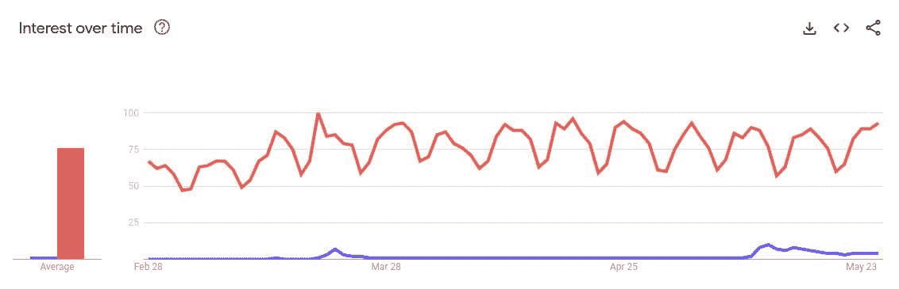

# Bard 数据科学备忘单

> 原文：[`www.kdnuggets.com/2023/05/bard-data-science-cheat-sheet.html`](https://www.kdnuggets.com/2023/05/bard-data-science-cheat-sheet.html)

# 全部都是 A-Bard！

* * *

## 我们的前三名课程推荐

 1\. [Google 网络安全证书](https://www.kdnuggets.com/google-cybersecurity) - 快速进入网络安全职业轨道。

 2\. [Google 数据分析专业证书](https://www.kdnuggets.com/google-data-analytics) - 提升你的数据分析技能

 3\. [Google IT 支持专业证书](https://www.kdnuggets.com/google-itsupport) - 支持你的组织 IT

* * *

OpenAI 可能是第一个推出 ChatGPT 的，但不要完全排除 Google 的可能性。Bard [在今年 2 月推出](https://blog.google/technology/ai/bard-google-ai-search-updates/)，并通过渐进式的推广，已在全球范围内向越来越多的用户和各种场景开放。

Bard 具有与 ChatGPT 和过去 6 个月出现的其他知名 LLM 相似的能力。

> Bard 是由 Google AI 开发的大型语言模型（LLM）聊天机器人。它在大量文本和代码数据集上进行了训练，能够生成文本、翻译语言、编写不同类型的创意内容，并以信息丰富的方式回答你的问题。新版 Bard 正在运行 PaLM 2 模型。它在编码、推理和创意写作问题上远胜于 LaMDA。

KDnuggets 的 Bard 数据科学备忘单（点击图片下载 PDF）

说实话：Bard 在 LLM 革命的使用领域中，确实是在赶超 ChatGPT……但又怎么样呢？OpenAI 是最早出现的，并享受了早期进入的优势。这种优势会持续吗？而且，相对的背书分布并不等同于质量（Beta 与 VHS，大家还记得吗？）。

Bard 与 ChatGPT 的全球 Google 趋势搜索对比，数据截取于 2023 年 5 月 29 日

（Bard 以蓝色表示，ChatGPT 以红色表示）

所以，如果你正在使用 ChatGPT，你可能会觉得有必要查看一下其他选项，即使只是为了确保自己决定继续使用它是合适的。为了帮助你做到这一点，[查看我们的最新备忘单](https://www.kdnuggets.com/publications/sheets/Bard_for_Data_Science_Cheat_Sheet_KDnuggets.pdf)，以便了解最新信息，并为使用 Google 的 LLM 聊天工具提供一个实用的参考。

使用这份备忘单，你将深入了解以下与 Bard 在数据科学中的使用相关的方面：

+   头脑风暴

+   编程

+   SQL

+   电子表格

+   数据分析

+   机器学习

+   以及更多！

想了解更多关于 Bard 的信息以及如何将其用于数据科学，[请查看我们最新的备忘单](https://www.kdnuggets.com/publications/sheets/Bard_for_Data_Science_Cheat_Sheet_KDnuggets.pdf)。

### 更多相关话题

+   [为什么数据科学家对 Google Bard 期望有缺陷的建议](https://www.kdnuggets.com/2023/02/data-scientists-expect-flawed-advice-google-bard.html)

+   [检测 ChatGPT、GPT-4、Bard 和 Claude 的十大工具](https://www.kdnuggets.com/2023/05/top-10-tools-detecting-chatgpt-gpt4-bard-llms.html)

+   [什么是 Google AI Bard？](https://www.kdnuggets.com/2023/03/google-ai-bard.html)

+   [ChatGPT 与 Google Bard：技术差异对比](https://www.kdnuggets.com/2023/03/chatgpt-google-bard-comparison-technical-differences.html)

+   [8 个 ChatGPT 和 Bard 的开源替代品](https://www.kdnuggets.com/2023/04/8-opensource-alternative-chatgpt-bard.html)

+   [超级 Bard：能做一切且更出色的 AI](https://www.kdnuggets.com/2023/05/super-bard-ai-better.html)
