# 使用 Numpy 和 OpenCV 的基础图像数据分析 – 第一部分

> 原文：[`www.kdnuggets.com/2018/07/basic-image-data-analysis-numpy-opencv-p1.html`](https://www.kdnuggets.com/2018/07/basic-image-data-analysis-numpy-opencv-p1.html)

 评论

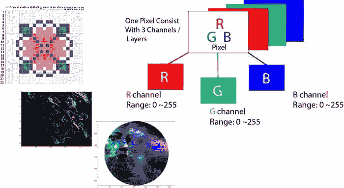

**简介：关于像素的一点点信息**

计算机将图像存储为微小方块的马赛克。这类似于古老的马赛克艺术形式，或今天孩子们玩耍的熔化珠子套件。如果这些方块瓷砖太大，就很难制作平滑的边缘和曲线。我们使用的方块越多且越小，图像就会越平滑，或者说像素化程度越低。这有时被称为图像的分辨率。

* * *

## 我们的前三大课程推荐

 1\. [谷歌网络安全证书](https://www.kdnuggets.com/google-cybersecurity) - 快速进入网络安全职业道路。

 2\. [谷歌数据分析专业证书](https://www.kdnuggets.com/google-data-analytics) - 提升你的数据分析技能

 3\. [谷歌 IT 支持专业证书](https://www.kdnuggets.com/google-itsupport) - 支持你的组织 IT

* * *

矢量图形是一种不同的图像存储方法，旨在避免像素相关问题。但即便是矢量图像，最终也是作为像素的马赛克显示。像素这个词意味着**图像元素**。描述每个像素的一种简单方法是使用三种颜色，即**红色、绿色、蓝色**。这就是我们所称的**RGB**图像。

在 RGB 图像中，每个像素由三个**8 位**数字表示，分别对应**红色、绿色、蓝色**的值。最终，通过放大镜查看，如果我们放大一张图片，我们会看到这张图片由微小的光点组成，或者更具体地说，就是这些像素，而更有趣的是看到这些微小的光点实际上是不同颜色的小光点，这些颜色无非就是**红色、绿色、蓝色**通道。

像素从远处来看，组成一幅图像，而近看它们只是**开和关**的小光点。这些光点的组合创建了图像，基本上就是我们每天在屏幕上看到的。

每一张数字照片都由像素组成。它们是构成图像的最小信息单元。通常是圆形或方形，通常排列在二维网格中。

现在，如果所有三个值都是最大强度，即 255，它们显示为白色；如果所有三个颜色都被抑制，或值为 0，颜色则显示为黑色。这三者的组合将产生特定的像素颜色的阴影。由于每个数字是一个**8 位**数字，其值范围从 0 到 255。

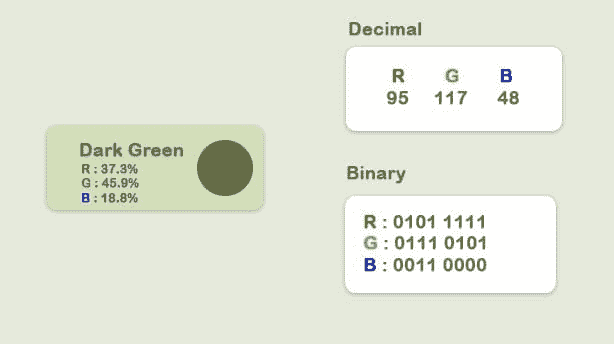

这三种颜色的组合将趋向于它们之间的最高值。由于每个值可以有 256 种不同的强度或亮度值，因此总共形成了**1680**万种色调。

在这里，我们将观察一些基本的图像数据分析内容，使用 Numpy 和一些相关的 Python 包，如`imageio`、`matplotlib`等。

+   **导入图像并观察其属性**

+   **分离层**

+   **灰度图**

+   **对像素值使用逻辑运算符**

+   **使用逻辑运算符进行掩膜处理**

+   **卫星图像数据分析**

**导入图像**

现在让我们加载一张图像，并观察其各种属性。

```py

if__name__=='__main__':
import imageio
import matplotlib.pyplotasplt
%matplotlibinline

pic=imageio.imread('F:/demo_2.jpg')
plt.figure(figsize=(15,15))

plt.imshow(pic)

```

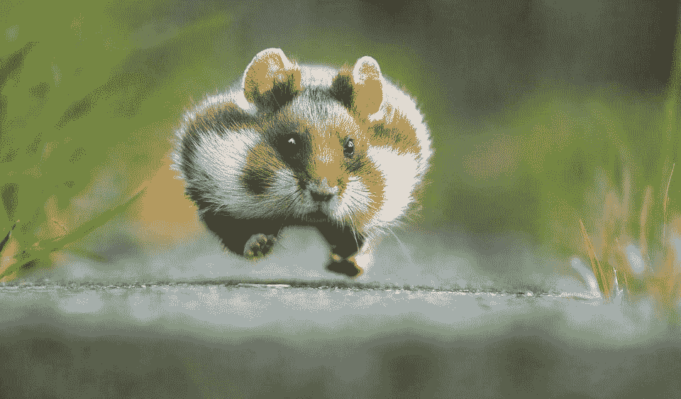

**观察图像的基本属性**

```py
print('Type of the image : ',type(pic))
print()
print('Shape of the image : {}'.format(pic.shape))
print('Image Hight {}'.format(pic.shape[0]))
print('Image Width {}'.format(pic.shape[1]))
print('Dimension of Image {}'.format(pic.ndim))

-Output:

Type of the image :<class 'imageio.core.util.Image'>

Shape of the image : (562, 960, 3)
Image Height 562
Image Width 960
Dimension of Image 3

```

ndarray 的形状是一个三层矩阵。这里的前两个数字是长度和宽度，第三个数字（即 3）代表三层：**红色、绿色、蓝色**。因此，如果我们计算 RGB 图像的大小，总大小将被计算为**高度 x 宽度 x 3**

```py

print('Image size {}'.format(pic.size))

print('Maximum RGB value in this image {}'.format(pic.max()))

print('Minimum RGB value in this image {}'.format(pic.min()))

Image size 1618560

Maximum RGB value in this image 255

Minimum RGB value in this image 0

```

这些值很重要，因为八位色彩强度不能超出 0 到 255 的范围。

现在，使用分配给图片的变量，我们还可以访问图像中的任何特定像素值，并进一步分别访问每个**RGB**通道。

```py

'''

Let's pick a specific pixel located at 100 th Rows and 50 th Column. 

And view the RGB value gradually. 

'''

pic[100, 50 ]

Image([109, 143,  46], dtype=uint8)

```

在这些情况下：R = 109；G = 143；B = 46，我们可以看出这个特定的像素中有很多绿色。现在，我们也可以通过提供这三个通道的索引值来专门选择其中一个。现在我们知道了

+   **0**索引值对应于**红色**通道

+   **1**索引值对应于**绿色**通道

+   **2**索引值对应于**蓝色**通道

但值得注意的是，在 OpenCV 中，图像采用的是 BGR 而不是 RGB。**imageio.imread**加载图像为 RGB（或 RGBA），但 OpenCV 假设图像为[BGR 或 BGRA](https://docs.opencv.org/trunk/d4/da8/group__imgcodecs.html#gabbc7ef1aa2edfaa87772f1202d67e0ce)（BGR 是 OpenCV 的默认颜色格式）。

```py

*# A specific pixel located at Row : 100 ; Column : 50* 

*# Each channel's value of it, gradually R , G , B*

print('Value of only R channel {}'.format(pic[ 100, 50, 0]))

print('Value of only G channel {}'.format(pic[ 100, 50, 1]))

print('Value of only B channel {}'.format(pic[ 100, 50, 2]))

Value of only R channel 109

Value of only G channel 143

Value of only B channel 46

```

好的，现在让我们快速查看整张图像中的每个通道。

```py

plt.title('R channel')

plt.ylabel('Height {}'.format(pic.shape[0]))

plt.xlabel('Width {}'.format(pic.shape[1]))

plt.imshow(pic[ : , : , 0])

plt.show()

```

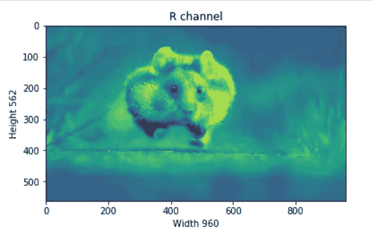

```py

plt.title('G channel')

plt.ylabel('Height {}'.format(pic.shape[0]))

plt.xlabel('Width {}'.format(pic.shape[1]))

plt.imshow(pic[ : , : , 1])

plt.show()

```

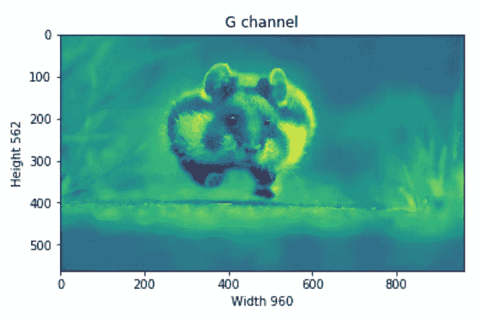

```py

plt.title('B channel')

plt.ylabel('Height {}'.format(pic.shape[0]))

plt.xlabel('Width {}'.format(pic.shape[1]))

plt.imshow(pic[ : , : , 2])

plt.show()

```

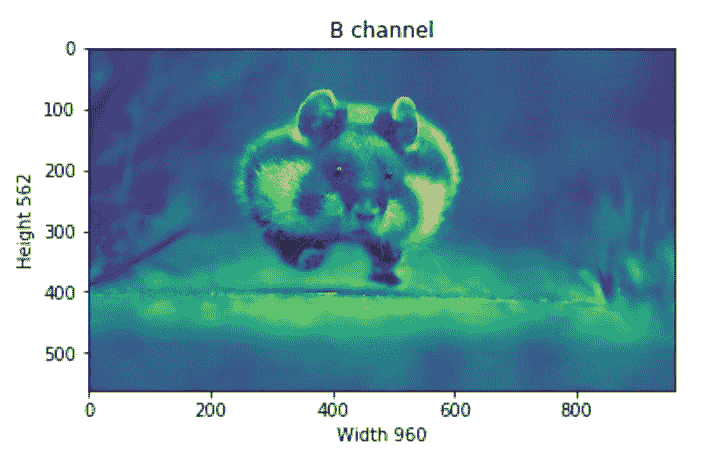

现在，我们还可以更改 RGB 值的数量。例如，让我们将以下行的红色、绿色、蓝色层设置为完全强度。

+   R 通道：行- 100 到 110

+   G 通道：行- 200 到 210

+   B 通道：行- 300 到 310

我们将加载图像一次，以便我们可以同时可视化每个变化。

```py

pic =imageio.imread('F:/demo_2.jpg')

pic[50:150 , : , 0] =255*# full intensity to those pixel's R channel*

plt.figure( figsize= (10,10))

plt.imshow(pic)

plt.show()

```

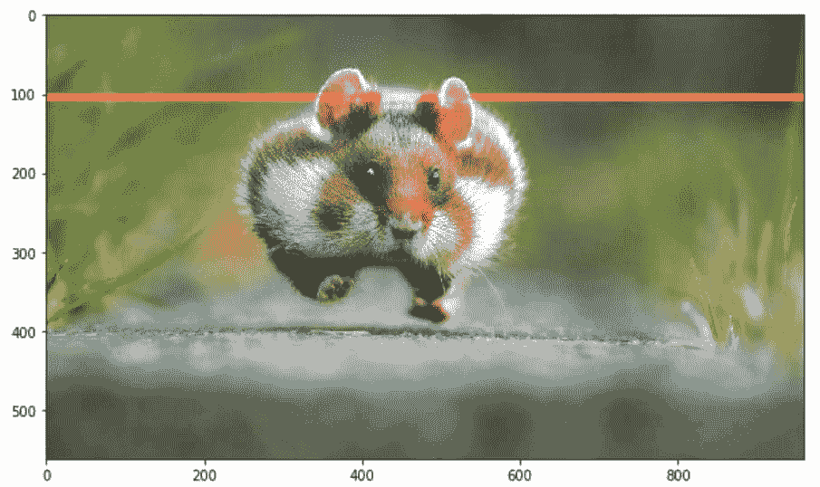

```py

pic[200:300 , : , 1] =255*# full intensity to those pixel's G channel*

plt.figure( figsize= (10,10))

plt.imshow(pic)

plt.show()

```

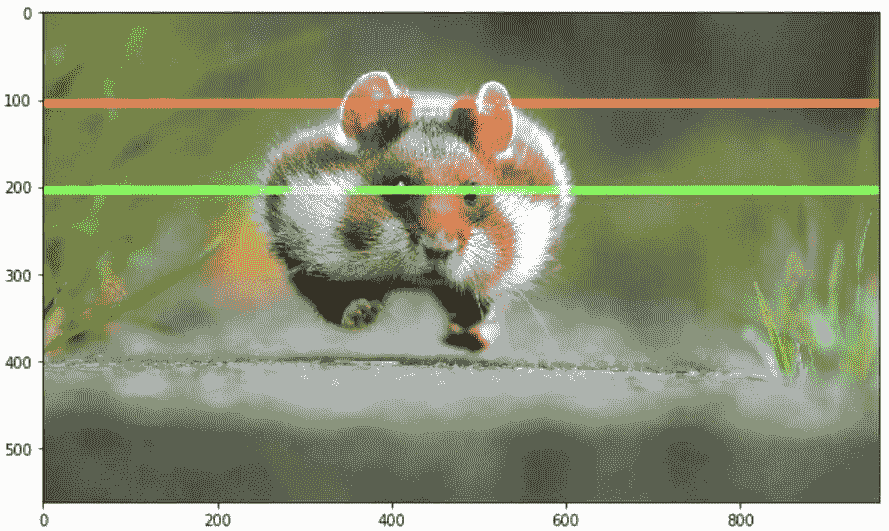

```py

pic[350:450 , : , 2] =255*# full intensity to those pixel's B channel*

plt.figure( figsize= (10,10))

plt.imshow(pic)

plt.show()

```

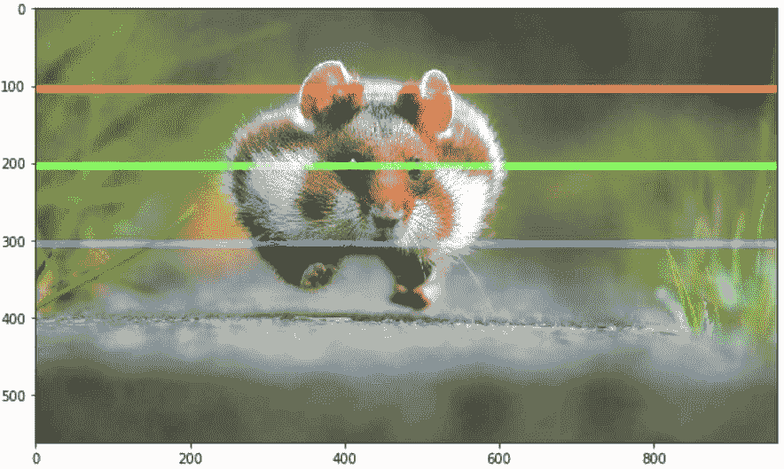

为了更清楚，我们还会更改列部分，这次我们将同时更改 RGB 通道。

```py
*# set value 200 of all channels to those pixels which turns them to white*

pic[50:450 , 400:600 , [0,1,2] ] =200

plt.figure( figsize= (10,10))

plt.imshow(pic)

plt.show() 
```


**分离层**

现在，我们知道每个像素由三个整数表示。将图像分成单独的颜色组件只是提取图像数组中正确切片的问题。

```py
importnumpyasnp

pic=imageio.imread('F:/demo_2.jpg') 

fig,ax=plt.subplots(nrows=1,ncols=3,figsize=(15,5)) 

forc,axinzip(range(3),ax): 

*# create zero matrix*

split_img=np.zeros(pic.shape,dtype="uint8")*# 'dtype' by default: 'numpy.float64'* 

*# assing each channel* split_img[:,:,c]=pic[:,:,c]

*# display each channel*ax.imshow(split_img)
```

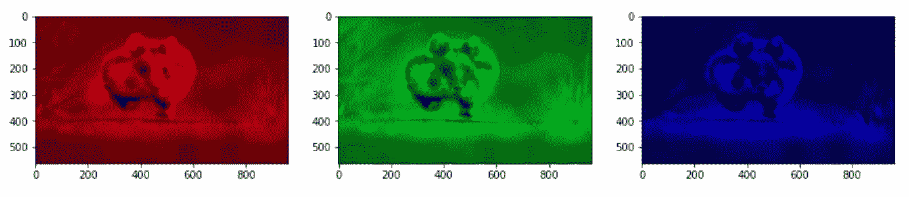

**灰度**

黑白图像存储在二维数组中。黑白图像有两种类型：

+   **灰度**：灰度范围：**0**~ **255**

+   **二值化**：像素要么是黑色，要么是白色：**0** 或 **255**

现在，灰度化是将图像从全色彩转换为灰度阴影的过程。在图像处理工具中，例如：在 OpenCV 中，许多函数在处理之前使用灰度图像，这是因为它简化了图像，几乎起到噪声减少的作用，并且由于图像中的信息较少而增加了处理时间。

有几种方法可以在 Python 中 [将图像转换为灰度](https://stackoverflow.com/a/45338831/9215780)。但使用 matplotlib 的直接方法是使用 [这个](https://en.wikipedia.org/wiki/Grayscale#Converting_color_to_grayscale) 公式计算原始图像的 RGB 值的加权平均值。

```py
Y' = 0.299 R + 0.587 G + 0.114 B
pic=imageio.imread('F:/demo_2.jpg') 
gray=lambdargb:np.dot(rgb[...,:3],[0.299,0.587,0.114])
gray=gray(pic) 
plt.figure(figsize=(10,10))
plt.imshow(gray,cmap=plt.get_cmap(name='gray'))
plt.show()
```

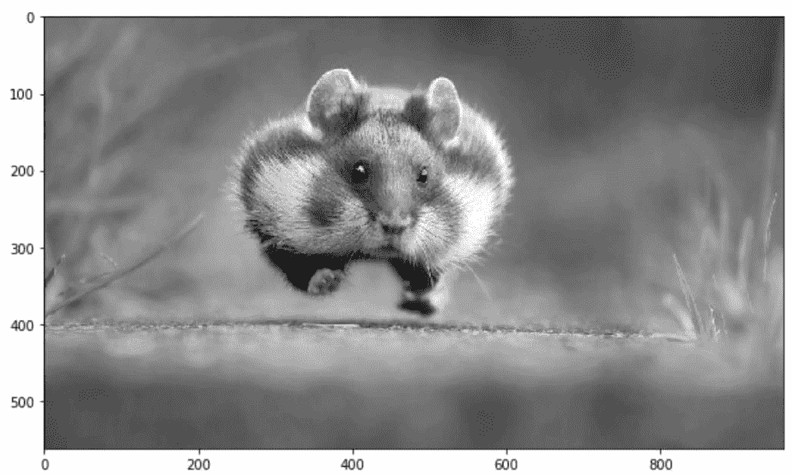

不过，[GIMP](https://docs.gimp.org/2.6/en/gimp-tool-desaturate.html) 将颜色转换为灰度图像的软件有三种算法来完成这个任务。

**明度** 灰度将被计算为

```py
Lightness = ½ × (max(R,G,B) + min(R,G,B)) 
```

**亮度** 灰度将被计算为

```py
Luminosity = 0.21 × R + 0.72 × G + 0.07 × B
```

**平均值** 灰度将被计算为

```py
Average Brightness = (R + G + B) ÷ 3
```

让我们尝试一下他们的一个算法，比如亮度。

```py
pic=imageio.imread('F:/demo_2.jpg') 

gray=lambdargb:np.dot(rgb[...,:3],[0.21,0.72,0.07])

gray=gray(pic) 

plt.figure(figsize=(10,10))

plt.imshow(gray,cmap=plt.get_cmap(name='gray'))

plt.show() 

'''Let's take a quick overview some the changed properties now the color image.
Like we observe some properties of color image, 
same statements are applying now for gray scaled image.''' 

print('Type of the image : ',type(gray))

print() 

print('Shape of the image : {}'.format(gray.shape))

print('Image Hight {}'.format(gray.shape[0]))

print('Image Width {}'.format(gray.shape[1]))

print('Dimension of Image {}'.format(gray.ndim))

print() 

print('Image size {}'.format(gray.size))

print('Maximum RGB value in this image {}'.format(gray.max()))

print('Minimum RGB value in this image {}'.format(gray.min()))

print('Random indexes [X,Y] : {}'.format(gray[100,50]))
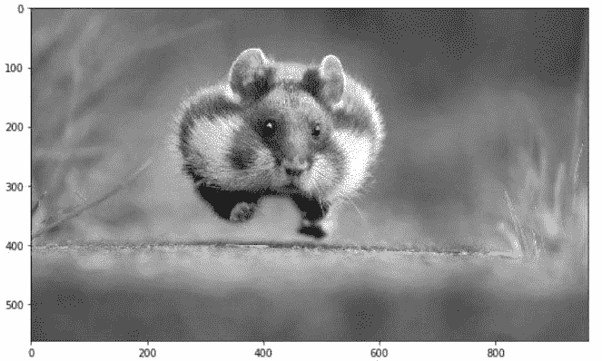
Type of the image :<class 'imageio.core.util.Image'> 
Shape of the image : (562,960)
Image Height 562
Image Width 960
Dimension of Image 2 
Image size 539520
Maximum RGB value in this image 254.9999999997
Minimum RGB value in this image 0.0
Random indexes [X,Y] : 129.07 
```

这里是 [第二部分](https://www.kdnuggets.com/2018/07/image-data-analysis-numpy-opencv-p2.html)。

**简介：[Mohammed Innat](https://twitter.com/innat_2k14)** 目前是电子与通信专业的四年级本科生。他热衷于将自己的机器学习和数据科学知识应用于医疗保健和犯罪预测领域，以便在医疗行业和安全部门工程更好的解决方案。

**相关内容：**

+   [DIY 深度学习项目](https://www.kdnuggets.com/2018/06/diy-deep-learning-projects.html)

+   [在您的数据上释放更快的 Python。](https://www.kdnuggets.com/2018/05/intel-unleash-faster-python.html)

+   [2018 年数据科学的 20 大 Python 库](https://www.kdnuggets.com/2018/06/top-20-python-libraries-data-science-2018.html)

### 更多相关内容

+   [发现计算机视觉的世界：介绍 MLM 的最新…](https://www.kdnuggets.com/2024/01/mlm-discover-the-world-of-computer-vision-ebook)

+   [KDnuggets 新闻，6 月 29 日：数据科学的 20 个基本 Linux 命令…](https://www.kdnuggets.com/2022/n26.html)

+   [用于图像处理的 NumPy](https://www.kdnuggets.com/numpy-for-image-processing)

+   [使用 Tensorflow 训练图像分类模型指南](https://www.kdnuggets.com/2022/12/guide-train-image-classification-model-tensorflow.html)

+   [我如何使用 Grounding DINO 实现自动图像标注](https://www.kdnuggets.com/2023/05/automatic-image-labeling-grounding-dino.html)

+   [它活过来了！使用 Python 和一些便宜的基础组件构建你的第一个机器人](https://www.kdnuggets.com/2023/06/manning-build-first-robots-python-cheap-basic-components.html)
