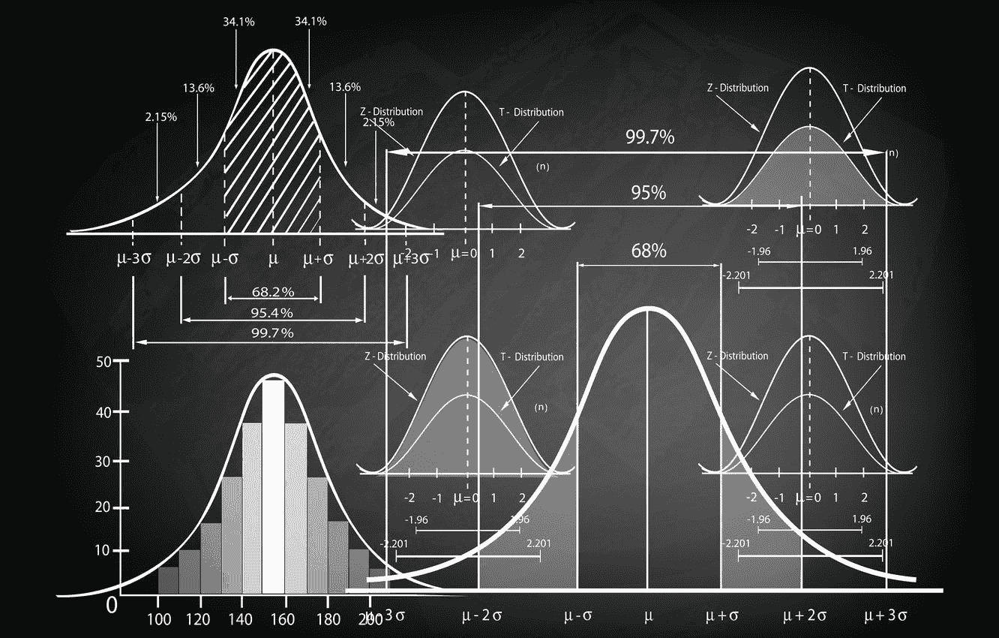
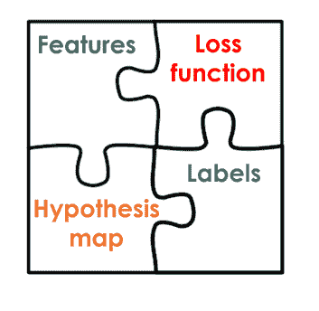
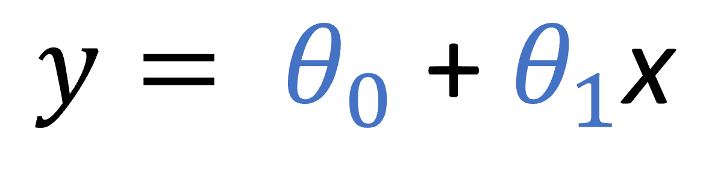
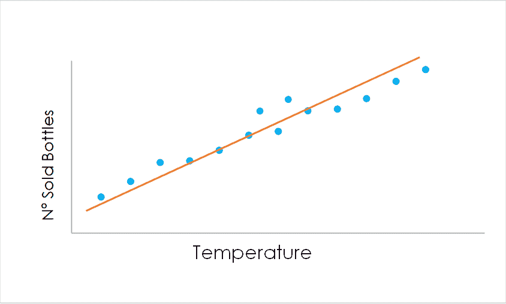
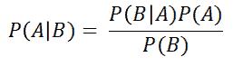
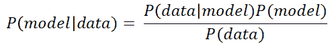
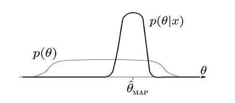
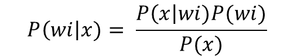
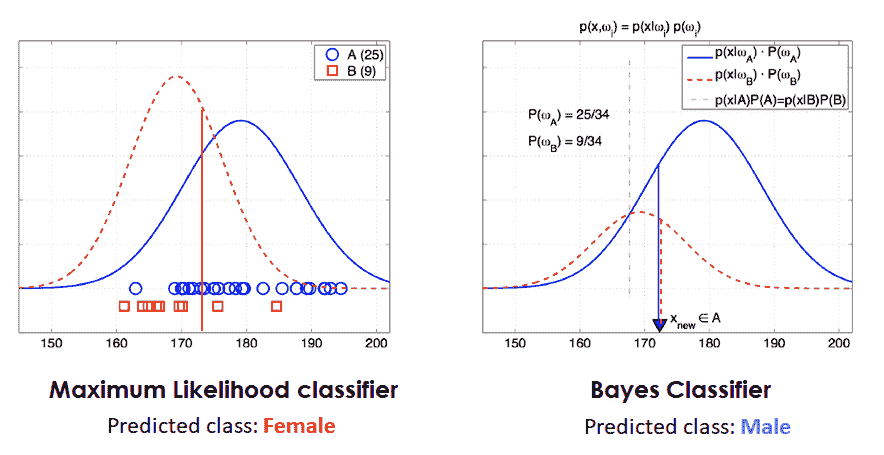
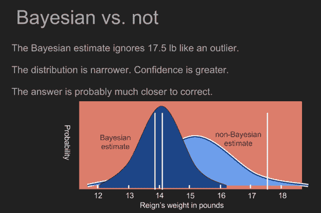

# 《贝叶斯定理在机器学习中的应用》

> 原文：[`www.kdnuggets.com/2019/10/bayes-theorem-applied-machine-learning.html`](https://www.kdnuggets.com/2019/10/bayes-theorem-applied-machine-learning.html)

评论

**由[Jaime Zornoza](https://www.linkedin.com/in/jaime-zornoza/)提供，马德里理工大学**

在上一篇文章中，我们了解了**贝叶斯定理是什么**，并通过一个简单直观的例子讲解了它的工作原理。你可以在[**这里**](https://towardsdatascience.com/probability-learning-i-bayes-theorem-708a4c02909a?source=friends_link&sk=29a5c9c9301a1204f16460781eaba113)**找到这篇文章**。如果你还不知道贝叶斯定理是什么，且尚未阅读过，我建议你阅读它，这将使你更容易理解本文。

在这篇文章中，我们将探讨**该定理在*机器学习*中的用途**。

***准备好了吗？那我们开始吧！***

### 机器学习中的贝叶斯定理

正如上一篇文章所提到的，贝叶斯定理告诉我们如何**逐渐更新我们的知识**，随着我们获得更多关于*某事*的证据。

一般来说，在**监督机器学习**中，当我们想要训练一个模型时，**主要构建块**是包含**特征**（定义数据点的属性）、**标签**（我们想要在新数据点上预测的数值或分类标签）和一个**假设函数**或模型（将这些特征与对应标签关联起来）。我们还需要一个**损失函数**，它是模型预测值与实际标签之间的差异，我们希望将其减少，以获得最佳结果。

监督学习问题的主要元素

这些监督机器学习问题可以分为**两大类：回归**，其中我们希望计算一个与数据相关的**数值**（例如房价），和**分类**，其中我们希望将数据点分配到**某个类别**（例如判断图像中是狗还是猫）。

**贝叶斯定理可以用于回归和分类。**

我们来看看吧！

### **回归中的贝叶斯定理**

假设我们有一组**非常简单的数据**，表示某个小镇地区每一天的**气温**（数据点的**特征**），以及该地区每一天**售出的水瓶数量**（数据点的**标签**）。

通过建立一个**非常简单的模型**，我们可以**查看这两者是否相关**，如果相关，就可以使用该模型**进行预测**，以便根据温度储备水瓶，避免库存短缺或过剩。

我们可以尝试一个非常简单的**线性回归模型**来查看这些变量之间的关系。在描述这个线性模型的以下公式中，y 是目标标签（在我们的例子中是水瓶的数量），**每个θs 都是模型的参数**（斜率和与 y 轴的截距），x 是我们的特征（在我们的例子中是温度）。

描述线性模型的方程

这次训练的目标是**减少提到的损失函数**，使模型对已知数据点的预测接近这些数据点的实际标签值。

在用可用数据训练模型后，我们将得到两个**θs**的值。这种训练可以通过使用**迭代过程**（如梯度下降）或其他**概率方法**（如最大似然法）来完成。无论如何，我们只会为每个参数得到**一个单一的值**。

这样，当我们获得**没有标签的新数据**（新的温度预测）时，由于我们知道**θs 的值**，我们可以仅使用这个简单的方程来获得所需的 ***Ys***（每天所需的水瓶数量）。

单变量线性回归的图示。使用最初的蓝色数据点，我们计算出最佳拟合这些点的直线，然后当我们获得新的温度时，我们可以轻松计算出当天销售的瓶数。

当我们使用贝叶斯定理进行回归时，我们不是**将模型的参数**（θs）视为唯一的单一值，而是将其表示为**具有某种分布的参数**：参数的先验分布。以下图示展示了通用贝叶斯公式，以及如何将其应用于机器学习模型。

贝叶斯公式 

贝叶斯公式应用于机器学习模型

这个想法的基础是，在我们拥有实际数据之前，**我们对模型参数有一些先验知识**：***P(model)*** 就是这个先验概率。然后，**当我们获得一些新数据时，我们会更新模型参数的分布**，使其成为后验概率 ***P(model|data)***。

这意味着**我们的参数集**（模型的θs）不是恒定的，而是**有其自己的分布**。基于先前的知识（例如来自专家或其他研究）**我们对模型参数的分布做出初步假设**。然后随着我们用**更多的数据**训练模型，**这个分布会更新**并变得更加精确（实际上，方差变小）。

关于先验和后验参数分布的图。θMap 是最大后验估计，我们将其用于我们的模型中。

这个图展示了**模型参数的初始分布*p(θ)***，以及随着我们添加更多数据，这个分布如何**被更新**，使其变得更准确地接近***p(θ|x)***，其中 x 表示这些新数据。这里的θ相当于上述公式中的*模型*，而这里的***x***相当于该公式中的*数据*。

贝叶斯公式，如往常一样，告诉我们**如何从先验概率转换为后验概率**。我们在迭代过程中进行此操作，随着数据的不断增加，**后验概率成为下一次迭代的先验概率**。一旦我们用足够的数据训练了模型，为了选择最终的参数集，我们会寻找**最大后验（MAP）估计，以使用一组具体的模型参数值**。

这种分析的**优势来自于初始的先验分布**：如果我们没有任何先前的信息，且无法对其做出任何假设，其他概率方法如最大似然估计可能更合适。

然而，**如果我们对参数的分布有一些先验信息，贝叶斯方法证明非常强大**，特别是在面对**不可靠的训练数据**的情况下。在这种情况下，由于我们不是从头开始构建模型并计算其参数，而是使用某种先前的知识来推断这些参数的初始分布，**这种先验分布使得参数更为稳健，并且不容易受到不准确数据的影响**。

我不想在这一部分过于技术化，但这一推理背后的数学是非常美妙的；如果你想了解更多，随时发邮件至 jaimezorno@gmail.com 或在 [LinkedIn](https://www.linkedin.com/in/jaime-zornoza/) 上**联系我**。

### **贝叶斯定理在分类中的应用**

我们已经看到贝叶斯定理如何用于回归，通过估计线性模型的参数。相同的推理也可以应用于其他类型的回归算法。

现在我们将了解如何使用贝叶斯定理进行分类。这被称为**贝叶斯最优分类器**。现在的推理与之前的非常相似。

想象一下我们有一个分类问题，具有** *i* 个不同的类别**。我们关注的是**每个类别的概率** **w*i***。如同之前的回归情况，我们也区分先验概率和后验概率，但现在我们有**先验类别概率** ***p(wi)*** 以及在使用数据或观测后得到的**后验类别概率** ***p(wi|x)***。

贝叶斯公式用于贝叶斯最优分类器

在这里，***P(x)*** 是与**所有数据点**共同的**密度函数**，***P(x|wi)*** 是属于类别*wi*的数据点的**密度函数**，而***P(wi)*** 是类别***wi***的先验分布。***P(x|wi)*** 是从训练数据中计算的，假设某种分布，并计算**每个类别的均值向量**以及属于该类别的数据点的**特征协方差**。先验类别分布***P(wi)*** 是基于**领域知识**、专家建议或以前的工作来估计的，如回归示例中所示。

让我们看一个例子来说明这是如何工作的：假设我们测量了 34 个人的身高：**25 名男性（蓝色）**和**9 名女性（红色）**，然后我们得到一个**新的**身高**观测值**172 厘米，我们想将其分类为男性或女性。下图表示了使用**最大似然分类器和贝叶斯最优分类器**获得的预测结果。

左侧是两个类别的训练数据及其估计的正态分布。右侧是贝叶斯最优分类器，其中男性的先验类别概率 p(wA)为 25/34，女性的 p(wB)为 9/34。

在这种情况下，我们使用了**训练数据中的样本数量**作为**类别分布的先验知识**，但例如，如果我们在特定国家对身高和性别进行相同的区分，并且知道那里女性特别高，同时也知道男性的平均身高，我们可以利用这些**信息来构建我们的先验类别分布**。

从这个例子中可以看出，使用这些**先验知识会导致不同的结果**，而不是不使用它们。假设这些先验知识的质量很高（否则我们不会使用它），这些预测应该比不包含这些信息的类似试验**更准确**。

在这种情况下，随着我们获得**更多数据**，这些**分布会被更新**以反映从这些数据中获得的知识。

和之前的情况一样，我不想过于技术化，或过多延伸文章，所以我不会深入数学细节，但**如果你对这些细节感到好奇，欢迎随时联系我**。

### 结论

我们已经看到**贝叶斯定理在机器学习中的应用**；无论是在**回归**还是**分类**中，都是将先前的知识纳入我们的模型并加以改进。

在接下来的文章中，我们将看到**贝叶斯定理的简化**是**自然语言处理**中最常用的技术之一，以及它们如何应用于许多实际用例，如垃圾邮件过滤器或情感分析工具。要了解更多，**请关注我的 Medium**](https://medium.com/@jaimezornoza)，敬请期待！

贝叶斯分类的另一个示例

以上就是所有内容，希望你喜欢这篇文章。随时可以在 [LinkedIn](https://www.linkedin.com/in/jaime-zornoza/) 上联系我，或者在 Twitter 上关注我 **@jaimezorno**。你也可以查看我在数据科学和机器学习方面的其他文章 [**这里**](https://medium.com/@jaimezornoza)。阅读愉快！

### 额外资源

如果你想深入了解贝叶斯和机器学习，请查看以下资源：

+   [贝叶斯推断如何工作](https://brohrer.github.io/how_bayesian_inference_works.html)

+   [贝叶斯统计 YouTube 系列](https://www.youtube.com/watch?v=YsJ4W1k0hUg)

+   [机器学习贝叶斯学习幻灯片](https://slideplayer.com/slide/4940573/)

+   [贝叶斯推断](https://www.umass.edu/landeco/teaching/ecodata/schedule/bayesian.pdf)

如往常一样，有任何问题请随时联系我。祝你有个美好的一天，继续学习。

**个人简介：[Jaime Zornoza](https://www.linkedin.com/in/jaime-zornoza/)** 是一位工业工程师，拥有电子学学士学位和计算机科学硕士学位。

[原文](https://towardsdatascience.com/probability-learning-ii-how-bayes-theorem-is-applied-in-machine-learning-bd747a960962)。经许可转载。

**相关：**

+   概率学习 I：贝叶斯定理

+   贝叶斯推断如何工作

+   深度学习 NLP：ANNs、RNNs 和 LSTMs 解析！

* * *

## 我们的三大课程推荐

 1\. [谷歌网络安全证书](https://www.kdnuggets.com/google-cybersecurity) - 快速进入网络安全职业生涯。

 2\. [谷歌数据分析专业证书](https://www.kdnuggets.com/google-data-analytics) - 提升你的数据分析技能

 3\. [谷歌 IT 支持专业证书](https://www.kdnuggets.com/google-itsupport) - 支持你的组织的 IT

* * *

### 更多相关主题

+   [理解贝叶斯定理的 3 种方法将提升你的数据科学技能](https://www.kdnuggets.com/2022/06/3-ways-understanding-bayes-theorem-improve-data-science.html)

+   [切比雪夫定理是什么，它如何应用于数据科学？](https://www.kdnuggets.com/2022/11/chebychev-theorem-apply-data-science.html)

+   [KDnuggets 新闻，11 月 30 日：切比雪夫定理是什么及其如何应用…](https://www.kdnuggets.com/2022/n46.html)

+   [高斯朴素贝叶斯，解析](https://www.kdnuggets.com/2023/03/gaussian-naive-bayes-explained.html)

+   [朴素贝叶斯算法：你需要知道的一切](https://www.kdnuggets.com/2020/06/naive-bayes-algorithm-everything.html)

+   [KDnuggets 新闻，4 月 13 日：数据科学家应该了解的 Python 库…](https://www.kdnuggets.com/2022/n15.html)
