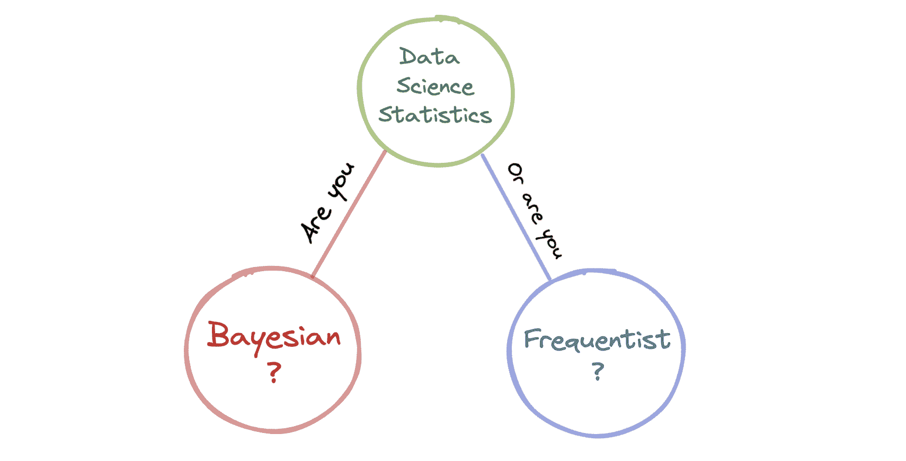
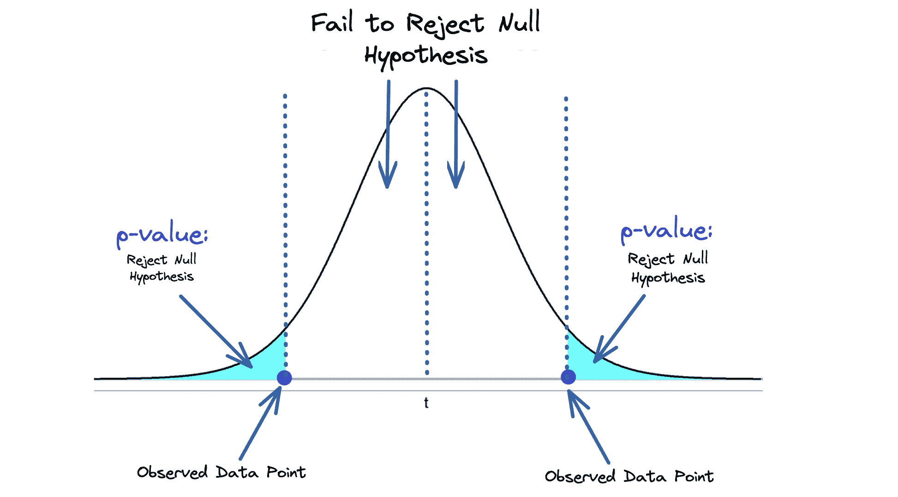
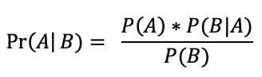

# 贝叶斯与频率统计学在数据科学中的对比

> 原文：[`www.kdnuggets.com/2023/05/bayesian-frequentist-statistics-data-science.html`](https://www.kdnuggets.com/2023/05/bayesian-frequentist-statistics-data-science.html)

作者提供的图片

在深入探讨贝叶斯统计和频率统计的区别之前，让我们先从它们的定义开始。

* * *

## 我们的前 3 个课程推荐

 1\. [谷歌网络安全证书](https://www.kdnuggets.com/google-cybersecurity) - 快速进入网络安全职业生涯。

 2\. [谷歌数据分析专业证书](https://www.kdnuggets.com/google-data-analytics) - 提升你的数据分析技能

 3\. [谷歌 IT 支持专业证书](https://www.kdnuggets.com/google-itsupport) - 支持你的组织进行 IT 管理

* * *

# 什么是贝叶斯方法？

使用统计推断时，你是在根据数据对总体参数做出判断。

**贝叶斯推断**考虑了先验知识，并且参数被视为随机变量。这意味着事件发生的概率是存在的。例如，如果我们掷一枚硬币，贝叶斯推断将会说明没有对错之分，硬币落在正面或反面的概率取决于他们的观点。

贝叶斯观点基于贝叶斯定理，这是一种基于先验知识计算事件概率的公式。公式如下：

+   P(A)：事件 A 发生的概率

+   P(B)：事件 B 发生的概率

+   P(A|B)：在事件 B 发生的情况下 A 的概率

+   P(B|A)：在事件 A 发生的情况下 B 的概率

+   Pr(A|B)：后验概率，即在给定数据的情况下参数的概率。

图片来源：[维基百科](https://en.wikipedia.org/wiki/Bayes%27_theorem)

拥有贝叶斯思维的人会使用概率来衡量事件发生的可能性。这是他们的信念。假设的概率是通过先验意见和知识计算得出的，并且在新数据随时可用的情况下被认为是正确的。这称为先验概率，在项目开始之前得出。

这个先验概率随后转化为后验概率，即项目开始后所持的信念。

**先验 + 可能性 = 后验**

# 什么是频率主义方法？

**频率主义推断**有所不同。它假设事件基于频率，参数不是随机变量——意味着没有概率。使用上述相同的例子，如果你抛硬币，频率主义推断将表明根据频率有一个正确答案。如果你抛硬币并且一半时间都是反面，那么得到反面的概率是 50%。

设有停止标准。停止规则决定了样本空间，因此对它的了解对频率主义推断至关重要。例如，对于抛硬币，频率主义方法可能会重复测试 2000 次，或者直到出现 300 次反面。研究人员通常不会重复测试这么多次。

拥有频率主义思维的人将概率视为频率。他们的概率取决于某个事件在无限次重复中发生的情况。

从频率主义者的角度来看，你用来估计总体的参数被认为是固定的。你将估计一个单一的真实参数，而不是将其建模为概率分布。当有新数据可用时，你将使用它来进行统计测试，并对数据进行概率预测。

在频率主义统计中，最常见的计算是 p 值，这是用来验证假设的统计测量。它描述了如果原假设（即没有统计关系）是正确的，你找到特定观察结果的可能性有多大。

下图中的阴影蓝色区域表示 p 值，即观察结果因随机性发生的概率。

图片由作者提供

# 它如何应用于数据科学？

统计学是数据科学的重要组成部分，如果你是这个领域的一部分，你一定遇到过贝叶斯定理、p 值和其他统计测试。作为数据科学家或数据工作者，了解统计分析和现有工具对你是有益的。你可能会在某个时候需要这些知识。

在你的团队中，当你讨论项目和下一步计划时，你会开始看到谁拥有贝叶斯思维，谁拥有频率主义思维。数据科学家将从事概率预测，这结合了残差方差和估计的不确定性。这是一个专门的贝叶斯框架。然而，这并不排除一些专家希望使用频率主义方法。

你采取的方法会反映在你选择的统计方法上。数据科学的许多基础是建立在贝叶斯统计上的，有些人甚至将频率主义的方法视为贝叶斯理论的一个子集。

然而，当涉及到数据科学时，你的重点是当前的问题。许多数据科学家根据他们要解决的问题选择模型。贝叶斯方法的优势在于，在数据科学领域，拥有关于问题的具体知识始终是一个优势。

贝叶斯方法被认为更快、可解释、以用户为中心，并且具有更直观的分析方法。

我将在下面进一步探讨这些以及它们之间的区别。

## 更快的学习

贝叶斯方法从最初的信念开始，这一信念通过收集证据得到支持。这导致更快的学习，因为你有证据来支持你的观点。

频率学方法基于从数据中获得的事实。尽管他们已经查看了数据，但没有进行分析以确保这是证据。没有计算概率来支持假设。

## 可解释的

贝叶斯方法拥有多种灵活的模型，使其能够应用于复杂的统计问题。这使得贝叶斯方法更易于解释。

不幸的是，频率学方法并不那么灵活，通常会失败。

## 以用户为中心

这两种方法有不同的途径。贝叶斯方法允许在项目讨论中纳入不同的研究和问题。重点关注可能的效应大小。

而频率学方法限制了这种可能性，因为它专注于不确定的显著性。

# 贝叶斯与频率学总结

| **属性：** | **贝叶斯：** | **频率学：** |
| --- | --- | --- |
| **是什么？** | 参数周围的概率分布 | 参数是固定的且为单点 |
| **质疑什么？** | 给定数据，假设的概率是多少？ | 假设是真的还是假的？ |
| **需要什么？** | 先验知识/信息和任何数据集。 | 停止标准 |
| **输出什么？** | 关于假设的支持或反对概率。 | 点估计（p 值） |
| **主要优点** | 有证据支持，并且可以应用新信息 | 简单易用，不需要先验知识 |
| **主要缺点** | 需要高级统计学 | 高度依赖样本大小，仅给出“是”或“否”的结果 |
| **何时使用？** | 有先验知识时限制数据，使用更多计算资源 | 大量数据时 |

# 结论

我希望这篇博客能让你更好地理解贝叶斯方法和频率学方法之间的区别。两者之间的争论颇多，甚至是否存在彼此。我的建议是坚持让你感到舒适的方式，以及你如何通过个人逻辑解析问题。

如果你想深入了解，应用你的技能和知识，我推荐：[初学者统计学速成课程：使用 Python 的频率学派和贝叶斯统计的理论与应用](https://www.amazon.co.uk/Statistics-Crash-Course-Beginners-Applications/dp/1734790164)

**[尼莎·阿雅](https://www.linkedin.com/in/nisha-arya-ahmed/)** 是一位数据科学家、自由技术作家和 KDnuggets 的社区经理。她特别关注提供数据科学职业建议或教程，以及围绕数据科学的理论知识。她还希望探索人工智能如何有助于延长人类寿命。作为一个热衷于学习的人，她寻求拓宽自己的技术知识和写作技能，同时帮助指导他人。

### 更多相关话题

+   [超越猜测：利用贝叶斯统计进行有效的…](https://www.kdnuggets.com/beyond-guesswork-leveraging-bayesian-statistics-for-effective-article-title-selection)

+   [现代数据科学中的贝叶斯思维](https://www.kdnuggets.com/bayesian-thinking-in-modern-data-science)

+   [KDnuggets 新闻，7 月 6 日：12 个必备的数据科学 VSCode…](https://www.kdnuggets.com/2022/n27.html)

+   [数据科学的 8 个基本统计概念](https://www.kdnuggets.com/2020/06/8-basic-statistics-concepts.html)

+   [学习数据科学统计学的顶级资源](https://www.kdnuggets.com/2021/12/springboard-top-resources-learn-data-science-statistics.html)

+   [数据科学、统计学和机器学习词典](https://www.kdnuggets.com/2022/05/data-science-statistics-machine-learning-dictionary.html)
