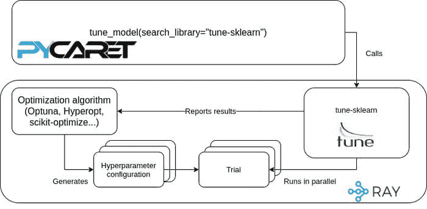

# 使用 PyCaret 中的 tune-sklearn 进行贝叶斯超参数优化

> 原文：[`www.kdnuggets.com/2021/03/bayesian-hyperparameter-optimization-tune-sklearn-pycaret.html`](https://www.kdnuggets.com/2021/03/bayesian-hyperparameter-optimization-tune-sklearn-pycaret.html)

评论

**由[Antoni Baum](https://www.linkedin.com/in/yard1/)，PyCaret 的核心贡献者及 Ray Tune 的贡献者**


* * *

## 我们的前三个课程推荐

 1\. [谷歌网络安全证书](https://www.kdnuggets.com/google-cybersecurity) - 快速进入网络安全职业生涯。

 2\. [谷歌数据分析专业证书](https://www.kdnuggets.com/google-data-analytics) - 提升您的数据分析技能

 3\. [谷歌 IT 支持专业证书](https://www.kdnuggets.com/google-itsupport) - 支持您的组织 IT 需求

* * *

这里有一个每个[PyCaret](https://github.com/pycaret/pycaret)用户都熟悉的情况：在从`compare_models()`中选择了一个或两个有前景的模型后，是时候使用`tune_model()`调整其超参数，以充分发挥模型的潜力了。

```py
from pycaret.datasets import get_data
from pycaret.classification import *

data = get_data("juice")

exp = setup(
    data,
    target = "Purchase",
)
best_model = compare_models()
tuned_best_model = tune_model(best_model)
```

(如果你想了解更多关于 PyCaret 的信息——这是一个开源的低代码 Python 机器学习库，[这个指南](https://pycaret.org/guide/)是一个很好的起点。)

默认情况下，`tune_model()`使用的是经过验证的`RandomizedSearchCV`，来自 scikit-learn。然而，并非所有人都知道`tune_model()`提供的各种高级选项。

在这篇文章中，我将向你展示如何利用[tune-sklearn](https://github.com/ray-project/tune-sklearn/)，这是一个用于 scikit-learn 模型选择模块的替代品，提供了前沿的超参数调优技术，来轻松使用其他最先进的算法。我还将报告一系列基准测试结果，展示 tune-sklearn 如何轻松提升分类模型的性能。

### 随机搜索与贝叶斯优化

超参数优化算法的效率差异可能很大。

随机搜索一直是机器学习的主流方法，这有充分的理由：它易于实现和理解，并且在合理的时间内能给出良好的结果。然而，正如名称所示，它是完全随机的——大量时间可能花在评估不良配置上。考虑到迭代次数是有限的，优化算法专注于它认为有前景的配置，并考虑到已评估的配置，似乎更有意义。

本质上，这就是贝叶斯优化（BO）的核心思想。BO 算法跟踪所有评估，并利用数据构建一个“替代概率模型”，该模型的评估速度比 ML 模型快得多。评估的配置越多，算法的知识越丰富，替代模型就越接近实际的目标函数。这样，算法可以做出明智的选择，决定接下来评估哪些配置，而不仅仅是随机采样。如果你想了解更多关于贝叶斯优化的知识，可以查看[Will Koehrsen 的这篇精彩文章](https://towardsdatascience.com/a-conceptual-explanation-of-bayesian-model-based-hyperparameter-optimization-for-machine-learning-b8172278050f)。

幸运的是，PyCaret 内置了多个优化库的[封装器](https://pycaret.readthedocs.io/en/latest/api/regression.html#pycaret.regression.tune_model)，在本文中，我们将重点关注[tune-sklearn](https://github.com/ray-project/tune-sklearn)。

### **PyCaret 中的 tune-sklearn**

[tune-sklearn](https://docs.ray.io/en/master/tune/api_docs/sklearn.html)是 scikit-learn 模型选择模块的替代品。tune-sklearn 提供了一个基于 scikit-learn 的统一 API，让你可以访问各种流行的先进优化算法和库，包括 Optuna 和 scikit-optimize。这个统一的 API 允许你通过一个参数在多种超参数优化库之间切换。

tune-sklearn 由[Ray Tune](https://docs.ray.io/en/latest/tune/index.html)驱动，它是一个用于实验执行和超参数调优的 Python 库，支持任何规模的调优。这意味着你可以在多台机器上扩展调优，而无需更改代码。

为了更简单，从版本 2.2.0 开始，tune-sklearn 已集成到 PyCaret 中。你只需执行`pip install "pycaret[full]"`，所有可选依赖项将自动处理。



如何协同工作

```py
!pip install "pycaret[full]"

from pycaret.datasets import get_data
from pycaret.classification import *

data = get_data("juice")

exp = setup(
    data,
    target = "Purchase",
)
best_model = compare_models()
tuned_best_model_hyperopt = tune_model(
    best_model,
    search_library="tune-sklearn",
    search_algorithm="hyperopt",
    n_iter=20
)
tuned_best_model_optuna = tune_model(
    best_model,
    search_library="tune-sklearn",
    search_algorithm="optuna",
    n_iter=20
)
```

只需向`tune_model()`添加两个参数，你就可以通过[Hyperopt](http://hyperopt.github.io/hyperopt/)或[Optuna](https://optuna.org/)将随机搜索切换为 tune-sklearn 驱动的贝叶斯优化。请记住，PyCaret 内置了所有包含模型的搜索空间，但你始终可以传递自己的搜索空间（如果你愿意的话）。

但是，它们与随机搜索相比效果如何呢？

### **一个简单的实验**

为了比较贝叶斯优化与随机搜索的效果，我进行了一个非常简单的实验。使用 [Kaggle 房价数据集](https://www.kaggle.com/c/house-prices-advanced-regression-techniques/datasets)，我创建了两个流行的回归模型，分别是 [随机森林](https://scikit-learn.org/stable/modules/generated/sklearn.ensemble.RandomForestRegressor.html) 和 [弹性网络](https://scikit-learn.org/stable/modules/generated/sklearn.linear_model.ElasticNet.html?highlight=elasticnet#sklearn.linear_model.ElasticNet)。然后，我使用 scikit-learn 的随机搜索以及 tune-sklearn 的 Hyperopt 和 Optuna 搜索器对它们进行了调优（所有方法进行 20 次迭代，最小化 RMSLE）。该过程重复三次，使用不同的种子，并对结果进行了平均。下面是代码的简化版本——你可以在 [这里](https://gist.github.com/Yard1/97dd054f0a5b154ffdc08df7899ba893) 找到完整代码。

```py
from pycaret.datasets import get_data
from pycaret.regression import *

data = get_data("house")
exp = setup(
    data,
    target = "SalePrice",
    test_data=data, # so that the entire dataset is used for cross validation - do not normally do this!
    session_id=42,
    fold=5
)
rf = create_model("rf")
en = create_model("en")

tune_model(rf, search_library = "scikit-learn", optimize="RMSLE", n_iter=20)
tune_model(rf, search_library = "tune-sklearn", search_algorithm="hyperopt", n_iter=20)
tune_model(rf, search_library = "tune-sklearn", search_algorithm="optuna", optimize="RMSLE", n_iter=20)

tune_model(en, search_library = "scikit-learn", optimize="RMSLE", n_iter=20)
tune_model(en, search_library = "tune-sklearn", search_algorithm="hyperopt", n_iter=20)
tune_model(en, search_library = "tune-sklearn", search_algorithm="optuna", optimize="RMSLE", n_iter=20)
```

PyCaret 让事情变得如此简单，难道不是很棒吗？无论如何，这里是我在我的机器上获得的 RMSLE 分数：

实验的 RMSLE 分数

为了更好地理解，下面是相较于随机搜索的百分比改进：

相较于随机搜索的百分比改进

所有这些操作都使用了相同的迭代次数，在相近的时间内完成。请记住，由于过程的随机性，你的效果可能会有所不同。如果你的改进不明显，可以尝试将迭代次数（`n_iter`）从默认的 10 增加到 20–30，这通常是一个明智的选择。

Ray 的优点在于你可以轻松地将计算从单台机器扩展到由数十、数百或更多节点组成的集群。虽然 PyCaret 目前尚不完全支持 Ray 集成，但可以在调整之前初始化一个 [Ray 集群](https://docs.ray.io/en/master/cluster/index.html)——并且 tune-sklearn 将自动使用它。

```py
exp = setup(
    data,
    target = "SalePrice",
    session_id=42,
    fold=5
)

rf = create_model("rf")

tune_model(rf, search_library = "tune-sklearn", search_algorithm="optuna", optimize="RMSLE", n_iter=20) # Will run on Ray cluster!
```

只要所有必要的配置就位（`RAY_ADDRESS` 环境变量），就无需其他操作即可利用 Ray 的分布式计算进行超参数调整。由于超参数优化通常是创建 ML 模型中性能最密集的部分，使用 Ray 进行分布式调整可以为你节省大量时间。

### 结论

为了加快 PyCaret 中的超参数优化，你只需安装所需的库并更改 `tune_model()` 中的两个参数——多亏了内置的 tune-sklearn 支持，你可以轻松利用 Ray 的分布式计算，超越本地机器的限制。

请务必查看[PyCaret](https://pycaret.readthedocs.io/)、[Ray Tune](https://docs.ray.io/en/latest/tune/index.html)和[tune-sklearn](https://docs.ray.io/en/latest/tune/api_docs/sklearn.html)的文档，以及[PyCaret](https://github.com/pycaret/pycaret)和[tune-sklearn](https://github.com/ray-project/tune-sklearn)的 GitHub 仓库。最后，如果你有任何问题或想与社区联系，请加入[PyCaret 的 Slack](https://pycaret.slack.com/)和[Ray 的 Discourse](https://discuss.ray.io/)。

*感谢 Richard Liaw 和 Moez Ali 的校对和建议。*

**个人简介: [Antoni Baum](https://www.linkedin.com/in/yard1/)** 是计算机科学与计量经济学硕士生，同时也是 PyCaret 的核心贡献者和 Ray Tune 的贡献者。

[原文](https://medium.com/distributed-computing-with-ray/bayesian-hyperparameter-optimization-with-tune-sklearn-in-pycaret-a33b1592662f)。经许可转载。

**相关:**

+   高级超参数优化/调优算法

+   轻松的数据科学的 5 种工具

+   你在 PyCaret 中做错的 5 件事

### 更多相关内容

+   [超参数优化：10 个顶级 Python 库](https://www.kdnuggets.com/2023/01/hyperparameter-optimization-10-top-python-libraries.html)

+   [使用 PyCaret 进行二分类简介](https://www.kdnuggets.com/2021/12/introduction-binary-classification-pycaret.html)

+   [使用 PyCaret 进行 Python 聚类简介](https://www.kdnuggets.com/2021/12/introduction-clustering-python-pycaret.html)

+   [宣布 PyCaret 3.0：Python 中的开源、低代码机器学习](https://www.kdnuggets.com/2023/03/announcing-pycaret-30-opensource-lowcode-machine-learning-python.html)

+   [开始使用 PyCaret](https://www.kdnuggets.com/2022/11/getting-started-pycaret.html)

+   [使用网格搜索和随机搜索进行 Python 中的超参数调优](https://www.kdnuggets.com/2022/10/hyperparameter-tuning-grid-search-random-search-python.html)
