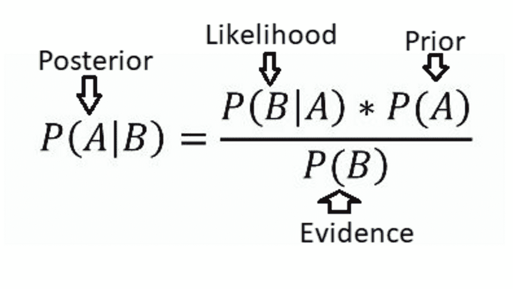

# 现代数据科学中的贝叶斯思维

> 原文：[`www.kdnuggets.com/bayesian-thinking-in-modern-data-science`](https://www.kdnuggets.com/bayesian-thinking-in-modern-data-science)


编辑图片 | Midjourney

贝叶斯思维是一种利用概率做决策的方法。它从初始信念（先验）开始，当新的证据出现时进行调整（后验）。这有助于根据数据做出更好的预测和决策。它在人工智能和统计学等领域至关重要，其中准确推理非常重要。

* * *

## 我们的前三个课程推荐

 1\. [Google 网络安全证书](https://www.kdnuggets.com/google-cybersecurity) - 快速进入网络安全职业

 2\. [Google 数据分析专业证书](https://www.kdnuggets.com/google-data-analytics) - 提升您的数据分析技能

 3\. [Google IT 支持专业证书](https://www.kdnuggets.com/google-itsupport) - 支持您的组织的 IT 工作

* * *

## 贝叶斯理论基础

### 关键术语

+   **先验概率（Prior）**：表示对假设的初始信念。

+   **似然性**：衡量假设对证据的解释程度。

+   **后验概率（Posterior）**：将先验概率和似然性结合起来。

+   **证据**：更新假设的概率。

### 贝叶斯定理

该定理描述了如何根据新信息更新假设的概率。它的数学表达式为：

 贝叶斯定理（来源：[Eric Castellanos 博客](https://ericcastellanos.me/post/a_gentle_introduction_to_bayesian_statistics/)) 其中：

**P(A|B)** 是假设的后验概率。

**P(B|A)** 是给定假设的证据的可能性。

**P(A)** 是假设的先验概率。

**P(B)** 是证据的总概率。

## 贝叶斯方法在数据科学中的应用

### 贝叶斯推断

贝叶斯推断在不确定时更新信念。它使用贝叶斯定理根据新信息调整初始信念。这种方法有效地将已知信息与新数据结合起来。这种方法量化了不确定性，并相应地调整概率。通过这种方式，它随着更多证据的收集不断改进预测和理解。在需要有效管理不确定性的决策过程中非常有用。

例子：在临床试验中，贝叶斯方法估计新治疗的有效性。它们将过去研究或当前数据中的先验信念结合起来。这更新了治疗效果的概率。研究人员可以利用旧信息和新信息做出更好的决策。

### 预测建模和不确定性量化

预测建模和不确定性量化涉及做出预测并了解我们对这些预测的信心。它使用如贝叶斯方法等技术来考虑不确定性并提供概率性预测。贝叶斯建模在预测方面有效，因为它管理不确定性。它不仅预测结果，还指示我们对这些预测的信心。这是通过后验分布来实现的，后验分布量化了不确定性。

示例：贝叶斯回归通过提供一系列可能的价格来预测股票价格，而不是单一预测。交易者利用这个价格范围来规避风险并做出投资决策。

### 贝叶斯神经网络

贝叶斯神经网络（BNNs）是提供概率性输出的神经网络。它们提供预测结果以及不确定性度量。与固定参数不同，BNNs 使用权重和偏置的概率分布。这使得 BNNs 能够捕捉并在网络中传播不确定性。它们对需要不确定性测量和决策的任务非常有用。它们被用于分类和回归任务。

示例：在欺诈检测中，贝叶斯网络分析诸如交易历史和用户行为等变量之间的关系，以发现与欺诈相关的异常模式。与传统方法相比，它们提高了欺诈检测系统的准确性。

## 贝叶斯分析的工具和库

有多种工具和库可以有效地实现贝叶斯方法。让我们了解一些流行的工具。

### PyMC4

这是一个用于 Python 的概率编程库。它有助于贝叶斯建模和推断。它建立在其前身 PyMC3 的优势基础上，通过与 JAX 的集成引入了显著改进。JAX 提供了自动微分和 GPU 加速。这使得贝叶斯模型更快且更具可扩展性。

### Stan

一种用 C++ 实现的概率编程语言，通过各种接口（RStan、PyStan、CmdStan 等）提供。Stan 擅长高效地执行 HMC 和 NUTS 采样，并以其速度和准确性著称。它还包括广泛的诊断工具和模型检查工具。

### TensorFlow Probability

这是一个用于在 TensorFlow 中进行概率推理和统计分析的库。TFP 提供了多种分布、双射函数和 MCMC 算法。与 TensorFlow 的集成确保了在各种硬件上高效执行。它允许用户将概率模型与深度学习架构无缝结合。本文有助于进行稳健且基于数据的决策。

让我们看一个使用 PyMC4 的贝叶斯统计示例。我们将看到如何实现贝叶斯线性回归。

```py
import pymc as pm
import numpy as np

# Generate synthetic data
np.random.seed(42)
X = np.linspace(0, 1, 100)
true_intercept = 1
true_slope = 2
y = true_intercept + true_slope * X + np.random.normal(scale=0.5, size=len(X))

# Define the model
with pm.Model() as model:
    # Priors for unknown model parameters
    intercept = pm.Normal("intercept", mu=0, sigma=10)
    slope = pm.Normal("slope", mu=0, sigma=10)
    sigma = pm.HalfNormal("sigma", sigma=1)

    # Likelihood (sampling distribution) of observations
    mu = intercept + slope * X
    likelihood = pm.Normal("y", mu=mu, sigma=sigma, observed=y)

    # Inference
    trace = pm.sample(2000, return_inferencedata=True)

# Summarize the results
print(pm.summary(trace)) 
```

现在，让我们逐步理解上面的代码。

+   它为截距、斜率和噪声设置初始信念（先验）。

+   它根据这些先验和观测数据定义了一个似然函数。

+   该代码使用马尔科夫链蒙特卡洛（MCMC）采样从后验分布中生成样本。

+   最后，它总结了结果，以展示估计的参数值和不确定性。

## 总结

贝叶斯方法将先验信念与新证据结合，以进行信息化决策。它们在多个领域提高预测准确性并管理不确定性。工具如 PyMC4、Stan 和 TensorFlow Probability 提供了强大的贝叶斯分析支持。这些工具帮助从复杂数据中做出概率预测。

**[Jayita Gulati](https://www.linkedin.com/in/jayitagulati1998/)** 是一位机器学习爱好者和技术作者，因对构建机器学习模型的热情而驱动。她拥有利物浦大学计算机科学硕士学位。

### 更多相关主题

+   [KDnuggets 新闻，7 月 13 日：数据科学的线性代数；10 种现代…](https://www.kdnuggets.com/2022/n28.html)

+   [使用基础和现代算法处理计算机科学问题…](https://www.kdnuggets.com/2023/11/packt-tackle-computer-science-problems-fundamental-modern-algorithms-machine-learning)

+   [10 种现代数据工程工具](https://www.kdnuggets.com/2022/07/10-modern-data-engineering-tools.html)

+   [学习现代预测技术，帮助预测未来商业结果…](https://www.kdnuggets.com/2022/12/sphere-learn-modern-forecasting-techniques-help-predict-future-business-outcomes.html)

+   [2024 年必须了解的 7 种现代 SQL 数据库](https://www.kdnuggets.com/7-modern-sql-database-you-must-know-in-2024)

+   [数据科学中的贝叶斯与频率学派统计](https://www.kdnuggets.com/2023/05/bayesian-frequentist-statistics-data-science.html)
