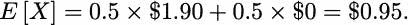
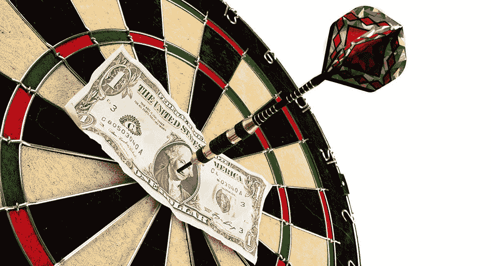
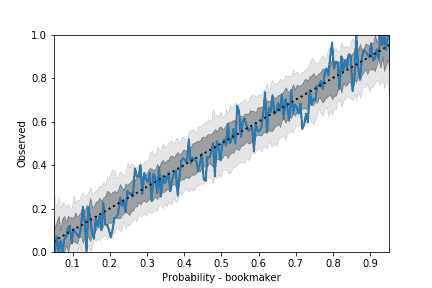
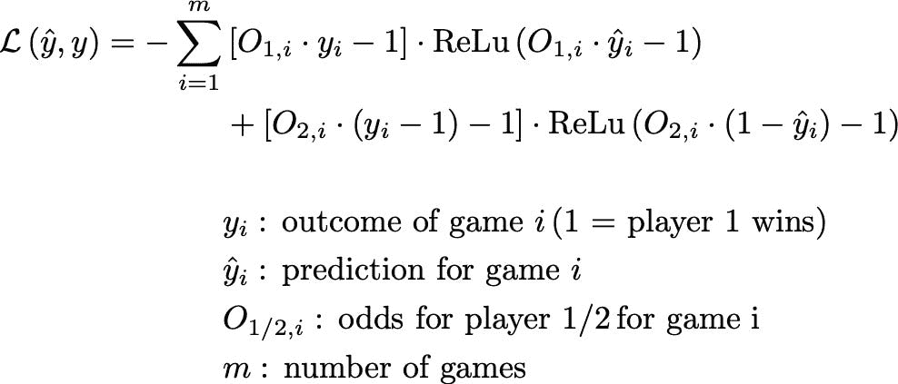
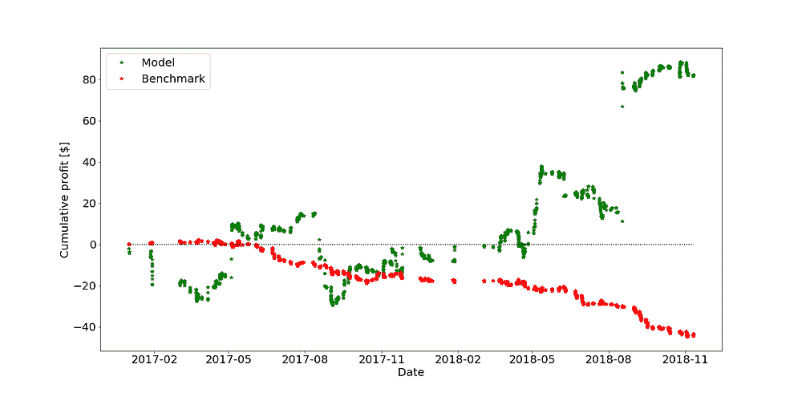

# 使用机器学习战胜博彩公司

> 原文：[`www.kdnuggets.com/2019/03/beating-bookies-machine-learning.html`](https://www.kdnuggets.com/2019/03/beating-bookies-machine-learning.html)

 评论

**作者: [Richard Bartels](https://www.linkedin.com/in/richard-bartels-827a7b27), Vantage AI 的数据科学家**。

“庄家总是赢”是赌博中的一句俗语。它反映了在大多数运气游戏中，赌场（例如赌场或博彩公司）具有统计上的优势。换句话说，假设下注金额为 1，赌场的预期回报高于 1，而赌徒的预期回报低于 1。因此，如果你去赌场，长期来看，你很可能会遭遇净亏损。

体育博彩也不例外。投注者和博彩公司都可以在预测比赛结果上具备同等的技能，但博彩公司设定了投注规则，从而确保长期获利。他们这样做的方式是控制所谓的支付率。

这里有一个简单的例子。假设有两个水平相当的飞镖运动员，因此在一场对决中他们都有 50%的获胜机会。博彩公司可以设定赔率，我们将其定义为 O₁和 O₂分别对应于运动员 1 和 2。在这个特定的比赛中，O₁ = O₂ = 1.90 是合理的赔率。这意味着每下注 1 美元，如果你赢了，就能得到 1.90 美元的回报。那么你的预期回报 X 是什么呢？如果你对运动员 1 下注 1 美元，你的预期回报为（记住每个运动员的获胜概率是 50%）：

所以从长远来看，每花费 1 美元会得到 95 美分的回报，你将会亏损！也就是说，博彩公司为这个游戏设置的“支付率”是 95%，这意味着博彩公司预计会从所有投注中获得 5%的利润，前提是他们准确评估了获胜概率。所以我们看到，博彩公司设定的赔率是不公平的，公平的赔率应该是 O₁ = O₂ = 2.0。注意，这些赔率也对应于每个运动员的相等获胜概率，即 P₁ = O₂/(O₁ + O₂)=0.5 和 P₂ = O₁/(O₁ + O₂)=0.5。

在本博客的其余部分，我们将专注于飞镖这种特定的游戏，其中比赛是对决的，结果在很大程度上取决于运动员的技能。然而，这个讨论也可以推广到其他体育运动。

**图片来源: [`www.1zoom.me/en/wallpaper/517285/z7641.3/`](http://www.1zoom.me/en/wallpaper/517285/z7641.3/).**

### 如何战胜博彩公司

我们上面看到的情况是，博彩公司通过控制赔付来获利。为了做到这一点，他们必须相应地设置赔率。为此，他们需要知道概率。一个能准确获取所有概率的全知博彩公司在长期内是无法被击败的。但博彩公司并非全知，因此有两种方法可以在纯粹基于概率估算上击败他们。

1.  如果你 consistently 评估概率比博彩公司更准确，并且这个差距足以弥补他们在赔付中预留的余地。

1.  如果你只投注那些你知道博彩公司犯了错误且赔率“公平”的比赛。

实际上，策略 1 只是策略 2 的一个特定版本。尽管如此，即使你能够比博彩公司更准确地预测每场比赛，也不太可能获利，因为博彩公司对概率的估算非常接近正确。从图 1 可以看出，博彩公司在准确估算飞镖赔率方面做得相当好。

**图 1：从博彩公司赔率得出的胜率与观察到的胜率（蓝线）对比，涵盖了将近 3700 场飞镖比赛。虚线黑线对应于能够在无限场比赛中完美预测概率。深灰（浅灰）带是由于有限样本量的固有噪声所产生的 68%（95%）区间。由于蓝线在灰色带内保持得相当好，似乎博彩公司知道他们在做什么。**

图 1 说明博彩公司在大量比赛中正确评估了概率。但他们在一些个别比赛中仍可能出错。上述提到的策略 2 依赖于识别博彩公司对实际概率的误判。例如，在博彩公司提供相等赔率的非现实事件中，例如 O₁ = O₂ = 1.90，在现任世界冠军迈克尔·范·格尔文与世界第 94 名对手的比赛中，我们的直觉已经告诉我们通过投注范·格尔文可能会获利。目标是识别所有这样的比赛。然而，由于大多数时候很难判断博彩公司何时出错，我们可以尝试让机器学习（ML）算法为我们完成这项工作。

### 利用 ML 进行飞镖投注

为了这个项目，我们使用了飞镖统计数据，包括平均值、结算百分比、180 分（用 3 支飞镖的最高分）和交锋统计等特征。此外，我们使用了历史赔率来评估这个模型是否能够获利。

首先，为了进一步激励我们仅在一部分比赛中下注的策略，我们来看一下基准准确率。如果我们总是根据博彩公司给出的最高获胜概率的选手下注，我们能达到 70%的准确率。仅基于比赛结果构建的[技能评级](https://trueskill.org/)在相同数据上也能达到 69%的准确率。当训练一个机器学习模型，如随机森林、提升树或经过精心构建特征优化的全连接神经网络，并使用二元交叉熵损失函数进行优化时，我们也达到了 70%的准确率。显然，我们没有超越博彩公司，因此获利的机会很小。

#### 自定义损失函数

二元交叉熵损失函数优化了我们正确预测比赛结果的能力，即优化了我们预测比赛的准确性。然而，这并不是我们的最终目标。我们想要的是识别博彩公司误判真实概率的比赛，从而提供有利的赔率。即，我们想要优化投资回报率。以下是一个精确实现这一点的损失函数。

自定义损失函数包含两个元素，方括号中的项是我们分别在玩家 1 或 2 上下注$1 的回报。请注意，这取决于比赛结果（yᵢ），如果我们预测错误，我们会损失资金。 [ReLu 函数](https://ml-cheatsheet.readthedocs.io/en/latest/activation_functions.html#relu)包含了我们的下注策略。它的特性是当 x ≤ 0 时，Relu(x) = 0，否则 Relu(x) = x。参数是我们的预期回报：赔率乘以我们估计的获胜概率减去 1。鉴于 ReLu 函数的特性，这意味着只有在我们认为赔率对我们有利时，它才会大于 0。换句话说，如果我们的模型认为赔率不公平，它不会下注任何资金。另一方面，赔率越有利，模型下注的金额就会越高。

这个损失函数确保我们优化的不是预测比赛结果的准确性，而是我们的赢利。注意，由于我们的自定义损失函数，预测的概率并不代表真实的概率，因为当模型认为博彩公司给出的赔率不准确时，它会将概率推向极端（0 或 1），以便下注更多。

### 那么它的表现如何？

为了测试我们的模型性能，我们构建了一个具有两个隐藏层的密集连接神经网络。最终层是一个 sigmoid 层，用于预测玩家 1 获胜的概率。然后，我们使用博彩公司赔率和比赛结果来计算使用上述自定义损失函数的损失。所有这些都在[PyTorch](https://cs230-stanford.github.io/pytorch-getting-started.html#loss-function)中实现。

由于这是一个时间序列模型，该模型在给定时间点之前的历史数据上进行训练，然后应用于接下来的 50 场比赛。这个过程会对接下来的 50 场比赛重复进行，依此类推。结果如图 2 所示。

图 2：两种不同投注策略的累计收益随时间的变化。红点表示我们始终对博彩公司赔率中获胜概率最高的玩家下注的策略。从长远来看，这导致了约 5%的损失，对应于博彩公司支付方案。绿点是由我们的机器学习模型进行的投注。它只在预计会获得利润时才下注。总体收益波动在 0 附近。然而，也有一些重大收益，能够弥补较大的损失。在这种情况下，我们的利润约为~10%。

我们的模型成功地实现了盈利，尽管随着时间的推移波动较大。它经历了一些重大损失，但也取得了一些主要的收益来弥补这些损失。最终的投资回报率约为 10%。作为基准，我们采用了一种策略，即始终对博彩公司认为最有可能获胜的玩家进行投注（这与我们使用二元交叉熵优化预测赢家的模型不会有太大不同）。由于赔率不公平，我们在长期内会损失约 5%。

### 总结

+   博彩公司通过控制支付金额来获得利润。

+   对于飞镖比赛，它们通常能够很好地评估获胜概率。这使得仅仅通过预测飞镖比赛结果来获利变得困难。

+   一种具有自定义损失函数的机器学习模型——其目标是识别博彩公司赔率中的不足并获取利润，而不是优化正确预测赢家的准确性——可以提供一种有利可图的投注策略。

+   在任何给定时间点的投资回报率会受到较大波动的影响，只有在较长的时间段内才能期望获得利润。

+   所提出的模型绝不是一个保证盈利的机器。相反，它作为一个概念验证，描述了如何设置你的机器学习模型以击败博彩公司。

#### 致谢

感谢[Guido Tournois](https://medium.com/@guido.tournois)与我在这个项目中的合作。

**个人简介**：[Richard Bartels](https://www.linkedin.com/in/richard-bartels-827a7b27)是荷兰数据科学咨询公司 Vantage AI 的数据科学家。如果你需要帮助创建适用于数据的机器学习模型，请随时通过**info@vantage-ai.com**与我们联系。

[原文](https://medium.com/vantageai/beating-the-bookies-with-machine-learning-7b429a0b5980)。转载时经许可。

**资源：**

+   [在线和基于网络的：分析、数据挖掘、数据科学、机器学习教育](https://www.kdnuggets.com/education/online.html)

+   [分析、数据科学、数据挖掘和机器学习的软件](https://www.kdnuggets.com/software/index.html)

**相关:**

+   [你的机器学习代码可能很糟糕的 4 个原因](https://www.kdnuggets.com/2019/02/4-reasons-machine-learning-code-probably-bad.html)

+   [利用基于代理的模型 (ABM) 和数字双胞胎来防止伤害](https://www.kdnuggets.com/2018/08/leveraging-agent-based-models-digital-twins-prevent-injuries.html)

+   [为什么德国在决赛中没有战胜巴西，或来自世界杯的数据科学课程](https://www.kdnuggets.com/2018/07/worldcup-data-science-lessons.html)

* * *

## 我们的 3 个课程推荐

 1\. [谷歌网络安全证书](https://www.kdnuggets.com/google-cybersecurity) - 快速进入网络安全职业生涯

 2\. [谷歌数据分析专业证书](https://www.kdnuggets.com/google-data-analytics) - 提升你的数据分析能力

 3\. [谷歌 IT 支持专业证书](https://www.kdnuggets.com/google-itsupport) - 支持组织的 IT 工作

* * *

### 了解更多内容

+   [KDnuggets 新闻，12 月 14 日：3 个免费的机器学习课程…](https://www.kdnuggets.com/2022/n48.html)

+   [每位机器学习工程师都应该掌握的 5 项机器学习技能…](https://www.kdnuggets.com/2023/03/5-machine-learning-skills-every-machine-learning-engineer-know-2023.html)

+   [学习数据科学、机器学习和深度学习的稳固计划](https://www.kdnuggets.com/2023/01/mwiti-solid-plan-learning-data-science-machine-learning-deep-learning.html)

+   [人工智能、分析、机器学习、数据科学、深度学习…](https://www.kdnuggets.com/2021/12/developments-predictions-ai-machine-learning-data-science-research.html)

+   [打破数据障碍：零样本、单样本和少样本学习如何转变机器学习](https://www.kdnuggets.com/2023/08/breaking-data-barrier-zeroshot-oneshot-fewshot-learning-transforming-machine-learning.html)

+   [联邦学习：协作机器学习教程…](https://www.kdnuggets.com/2021/12/federated-learning-collaborative-machine-learning-tutorial-get-started.html)
