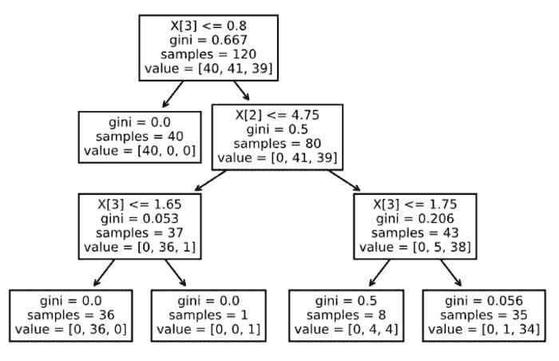
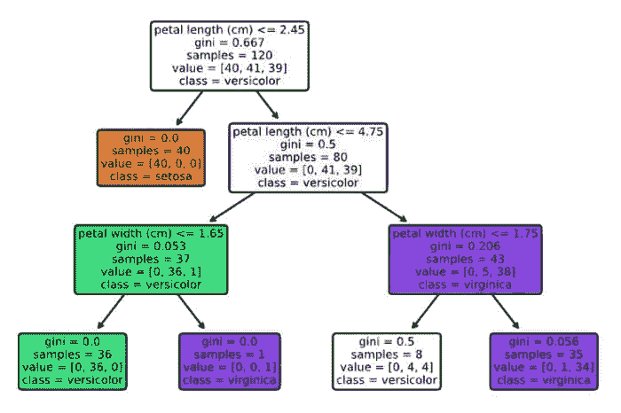
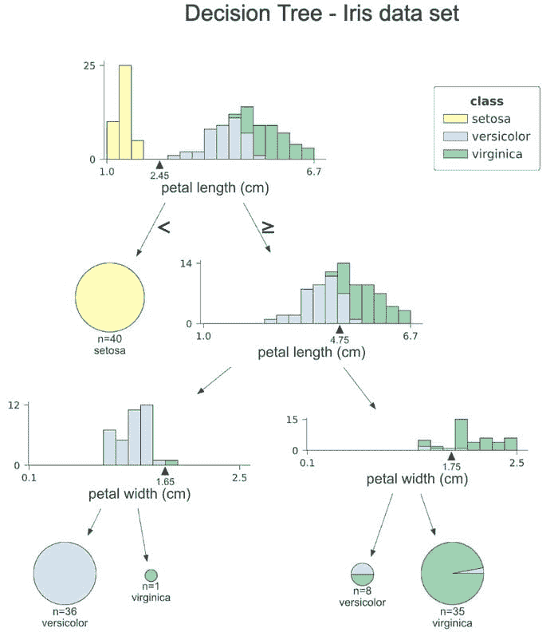
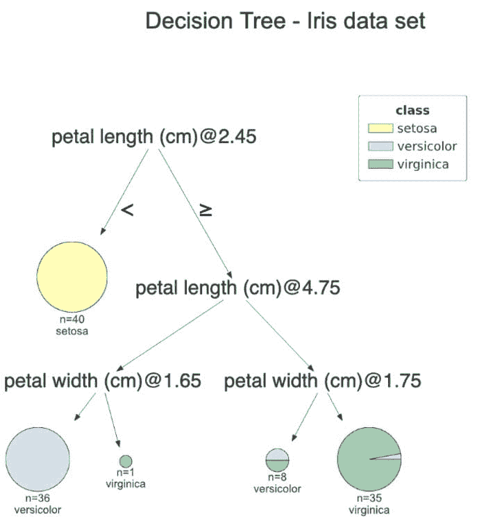
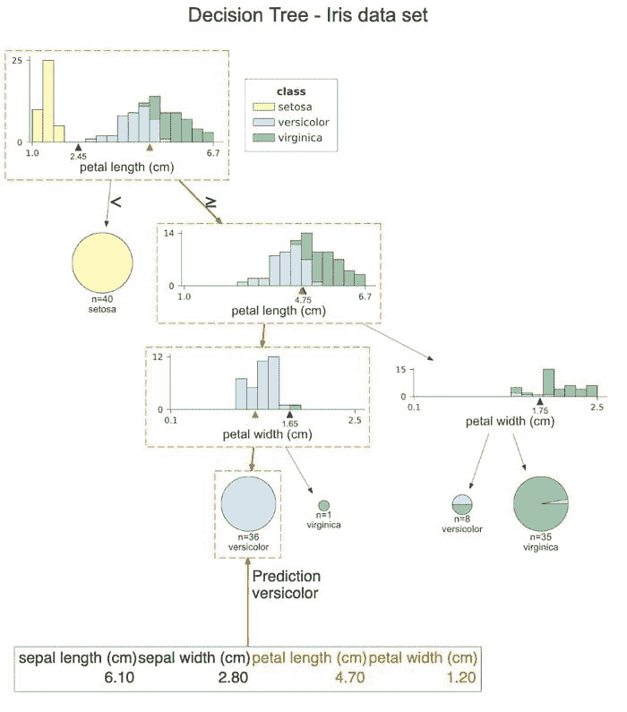
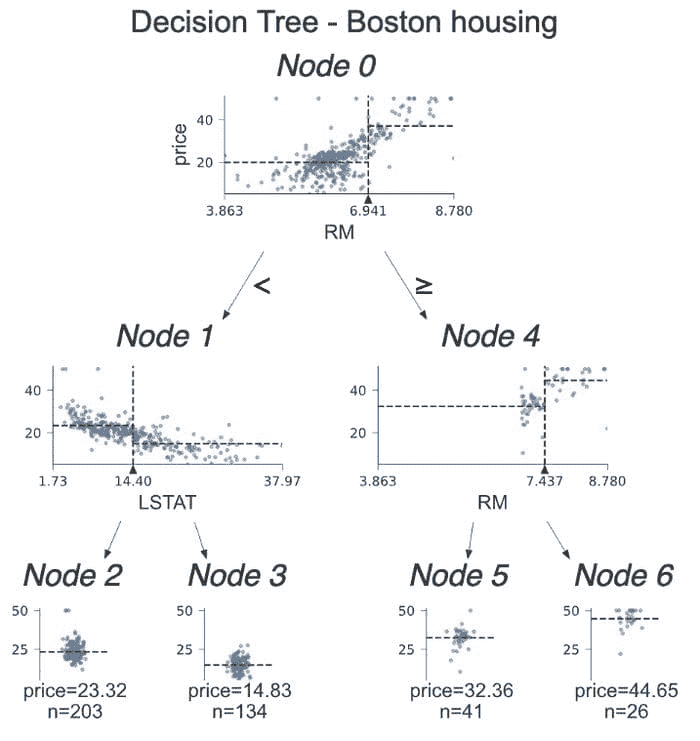
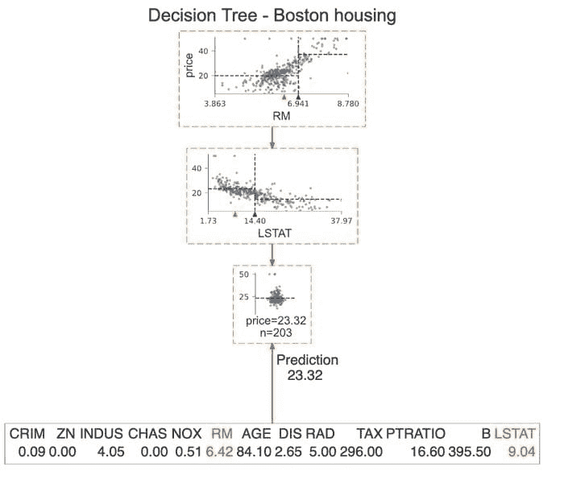

# 使用 dtreeviz 创建美丽的决策树可视化

> 原文：[`www.kdnuggets.com/2021/03/beautiful-decision-tree-visualizations-dtreeviz.html`](https://www.kdnuggets.com/2021/03/beautiful-decision-tree-visualizations-dtreeviz.html)

评论

**由[埃里克·刘文森](https://www.linkedin.com/in/eryklewinson/)，高级数据科学家**

决策树是机器学习模型中非常重要的一类，它们也是许多更高级算法的构建模块，例如随机森林或著名的 XGBoost。这些树也是基准模型的良好起点，我们随后尝试通过更复杂的算法来改进。

决策树最大的优点之一是它们的可解释性——在拟合模型后，它实际上是一组可以用来预测目标变量的规则。这也是为什么可以轻松绘制规则并向利益相关者展示它们，以便他们能轻松理解模型的基本逻辑。当然，前提是树不太深。

使用`scikit-learn`和`matplotlib`的组合可以非常简单地可视化决策树。然而，还有一个很棒的库叫做`dtreeviz`，它提供了更多功能，创建的可视化不仅更美观，还能传达更多有关决策过程的信息。

在本文中，我将首先展示“旧方式”绘制决策树，然后介绍使用`dtreeviz`的改进方法。

### 设置

一如既往，我们需要首先导入所需的库。

然后，我们从`scikit-learn`加载 Iris 数据集。我们还会讨论一个回归示例，但稍后我们会加载波士顿住房数据集。

### “旧方式”

下一步是创建训练/测试集，并将决策树分类器拟合到 Iris 数据集上。在本文中，我们纯粹关注于决策树的可视化。因此，我们不会关注模型拟合或寻找合适的超参数（这些主题有很多文章）。我们将“调整”的唯一内容是树的最大深度——我们将其限制为 3，以便树可以适应图像并保持可读。

现在我们已经有了一个拟合的决策树模型，可以继续可视化这棵树。我们从最简单的方法开始——使用`scikit-learn`中的`plot_tree`函数。

```py
tree.plot_tree(clf);
```



*图片由作者提供*

好吧，对于一行代码来说还不错。但它不是很易读，例如，没有特征名称（只有它们的列索引）或类别标签。我们可以通过运行以下代码轻松改进这一点。



*图片由作者提供*

好多了！现在，我们可以相对容易地解读决策树。也可以使用`graphviz`库来可视化决策树，不过，结果非常相似，包含与上图相同的元素。因此，我们在这里跳过这部分，但你可以在[GitHub 上的 Notebook](https://github.com/erykml/medium_articles/blob/master/Machine%20Learning/decision_tree_visualization.ipynb)中找到实现。

### dtreeviz 的实际应用

既然已经看到旧的决策树绘制方法，现在让我们直接进入`dtreeviz`的方法。

代码片段几乎可以自我解释，因此我们可以继续讨论结果。首先，让我们花一点时间来承认这是一项多么巨大的改进，尤其是考虑到函数调用非常相似。



*作者提供的图片*

让我们逐步查看这个图表。在每个节点，我们可以看到用于分裂观察结果的特征的堆叠直方图，以类别颜色标记。这样，我们可以看到各个类别是如何通过每次分裂进行分隔的。x 轴上的值和小三角形是分裂点。在第一个直方图中，我们可以清楚地看到所有*setosa*类别的观察数据的花瓣长度小于 2.45 cm。

树的右侧分支表示选择大于或等于分裂值的值，而左侧分支则表示小于分裂值的值。叶节点用饼图表示，显示叶节点内观察结果属于哪个类别的比例。这样，我们可以轻松看出哪个类别是多数，从而也能了解模型的预测。

在这个图表中，我们没有看到每个节点的基尼系数值。在我看来，直方图提供了更多关于分裂的直观信息，而系数的值在向利益相关者展示时可能也并不是那么重要。

**注意：**我们还可以为测试集创建类似的可视化，只需在调用函数时替换`x_data`和`y_data`参数即可。

如果你不喜欢直方图并且想简化图表，可以指定`fancy=False`来获得以下简化的图表。



*作者提供的图片*

`dtreeviz`的另一个有用功能是对图中的特定观察结果进行路径高亮显示，从而提高模型的可解释性。这样，我们可以清楚地看到哪些特征对类别预测有贡献。

使用下面的代码片段，我们高亮显示了测试集第一条观察数据的路径。

该图与之前的非常相似，但橙色高亮清楚地显示了观察值遵循的路径。此外，我们可以在每个直方图中看到橙色三角形。它代表了所示观察值的特征值。在最后，我们看到该观察值的所有特征值，其中用于决策的特征用橙色突出显示。在这种情况下，只有两个特征被用来预测该观察值属于*versicolor*类别。



*图片由作者提供*

**提示：** 我们还可以通过设置`orientation=”LR”`将图表的方向从自上而下更改为自左而右。由于图表在较窄屏幕的设备上显示效果不佳，因此本文未展示此选项。

最后，我们可以用简单的英语打印出用于该观察值预测的决策。为此，我们运行以下命令。

这样，我们可以清楚地看到该观察值满足的条件。

### 回归示例

我们已经介绍了一个分类示例，这展示了库的大多数有趣功能。但为了完整性，我们还讨论了回归问题的示例，以展示图表的不同。我们使用了另一个流行的数据集——波士顿住房数据集。这是一个问题，其中我们使用一组不同的区域来预测波士顿某些区域的中位数房价。

代码已经相似。唯一的变化是我们添加了`show_node_labels = True`。这对于较大的决策树特别有用。因此，在与小组讨论图表时，很容易通过节点编号来指示我们讨论的分割。



*图片由作者提供*

让我们深入探讨分类树和回归树之间的差异。这一次，我们不看直方图，而是检查用于分割的特征与目标的散点图。在这些散点图上，我们看到了一些虚线。它们的解释如下：

+   水平线是决策节点中左侧和右侧桶的目标均值。

+   垂直线是分割点。这与黑色三角形表示的信息完全相同，但它使得比较水平线更容易 -> 便于分隔两侧。

在叶子节点中，虚线表示叶子中的目标均值，这也是模型的预测。

我们已经展示了如何突出显示某个观察值的决策路径。我们可以更进一步，只绘制用于该预测的节点。我们通过指定`show_just_path=True`来实现这一点。以下图只显示了上面树中的选定节点。



*图片由作者提供*

### 结论

在这篇文章中，我展示了如何使用`dtreeviz`库来创建优雅且富有洞察力的决策树可视化。经过一段时间的使用，我将继续把它作为可视化决策树的首选工具。我确实相信，使用这个库创建的图表对于那些不日常从事机器学习的人来说更容易理解，并且有助于向利益相关者传达模型的逻辑。

还值得一提的是，`dtreeviz`支持一些 XGBoost 和 Spark MLlib 树的可视化。

你可以在我的[GitHub](https://github.com/erykml/medium_articles/blob/master/Machine%20Learning/decision_tree_visualization.ipynb)上找到这篇文章中使用的代码。像往常一样，欢迎任何建设性的反馈。你可以在[Twitter](https://twitter.com/erykml1?source=post_page---------------------------)上或在评论中联系我。

如果你喜欢这篇文章，你也许会对以下内容感兴趣：

[**利用哈希函数改进训练-测试分割**](https://towardsdatascience.com/improve-the-train-test-split-with-the-hashing-function-f38f32b721fb)

确保在更新数据集时训练集和测试集从未混合的最佳方法

[**Lazy Predict：用一行代码拟合和评估 scikit-learn 中的所有模型**](https://towardsdatascience.com/lazy-predict-fit-and-evaluate-all-the-models-from-scikit-learn-with-a-single-line-of-code-7fe510c7281)

最简单的方法来查看哪些模型最适合你的数据集！

[**通过随机森林示例解释特征重要性**](https://towardsdatascience.com/explaining-feature-importance-by-example-of-a-random-forest-d9166011959e)

学习在 Python 中确定特征重要性的最流行方法

**参考文献**

+   [`github.com/parrt/dtreeviz`](https://github.com/parrt/dtreeviz)

+   [`explained.ai/decision-tree-viz/index.html`](https://explained.ai/decision-tree-viz/index.html#sec:1.5.1)

**个人简介：[Eryk Lewinson](https://www.linkedin.com/in/eryklewinson/)** 目前在荷兰最大的电子商务平台担任高级数据科学家。在他的职业生涯中，他在为两家四大会计师事务所和一家荷兰金融科技初创公司工作时获得了数据科学方法的实际应用经验。在工作中，他专注于使用机器学习为公司提供商业价值。

[原始文章](https://towardsdatascience.com/beautiful-decision-tree-visualizations-with-dtreeviz-af1a66c1c180)。经许可转载。

**相关：**

+   2021 年你应该知道的所有机器学习算法

+   11 个完整 EDA（探索性数据分析）的必要代码块

+   讲述精彩的数据故事：可视化决策树

* * *

## 我们的前 3 个课程推荐

 1\. [谷歌网络安全证书](https://www.kdnuggets.com/google-cybersecurity) - 快速进入网络安全职业生涯

 2\. [谷歌数据分析专业证书](https://www.kdnuggets.com/google-data-analytics) - 提升你的数据分析技能

 3\. [谷歌 IT 支持专业证书](https://www.kdnuggets.com/google-itsupport) - 支持你的组织 IT 工作

* * *

### 了解更多相关主题

+   [用 Pandas 制作美观互动可视化的最简单方法](https://www.kdnuggets.com/2021/12/easiest-way-make-beautiful-interactive-visualizations-pandas.html)

+   [通过 Python 和 Scikit-learn 简化决策树解释](https://www.kdnuggets.com/2017/05/simplifying-decision-tree-interpretation-decision-rules-python.html)

+   [决策树算法解析](https://www.kdnuggets.com/2020/01/decision-tree-algorithm-explained.html)

+   [通过实现理解：决策树](https://www.kdnuggets.com/2023/02/understanding-implementing-decision-tree.html)

+   [讲述精彩数据故事：可视化决策树](https://www.kdnuggets.com/2021/02/telling-great-data-story-visualization-decision-tree.html)

+   [随机森林与决策树：关键区别](https://www.kdnuggets.com/2022/02/random-forest-decision-tree-key-differences.html)
