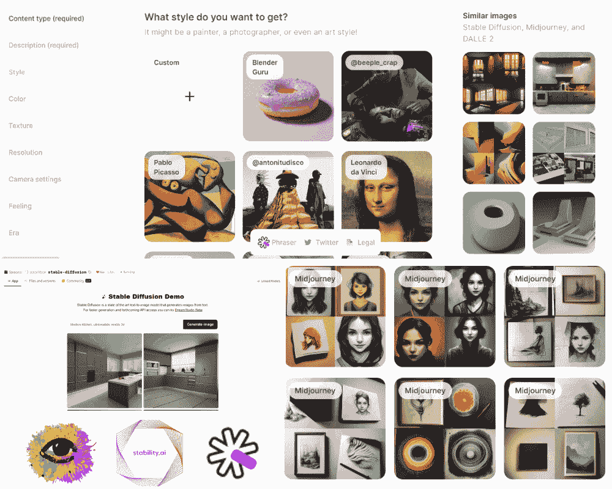
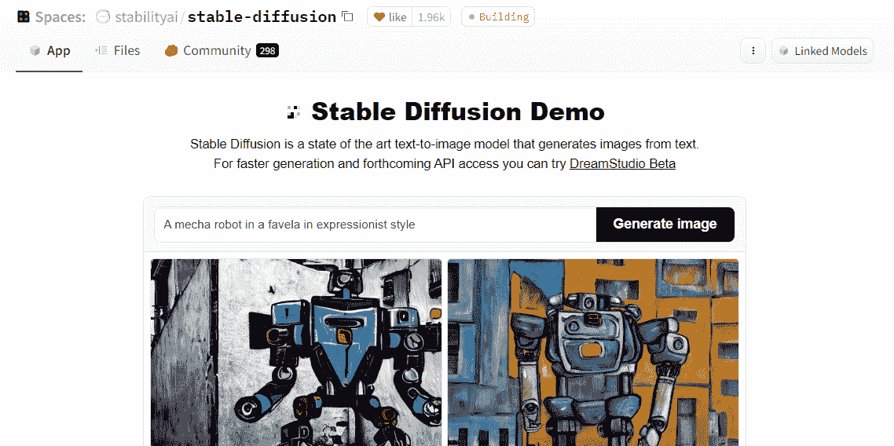
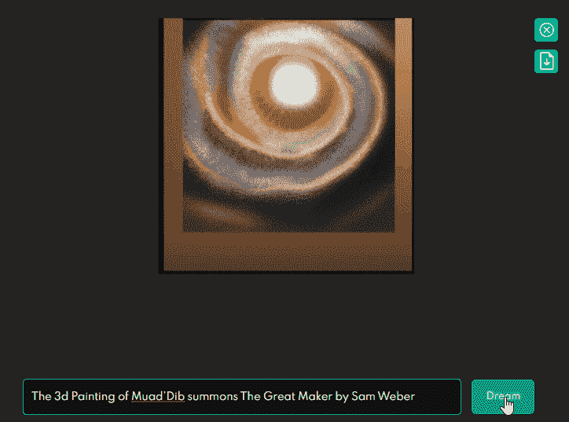
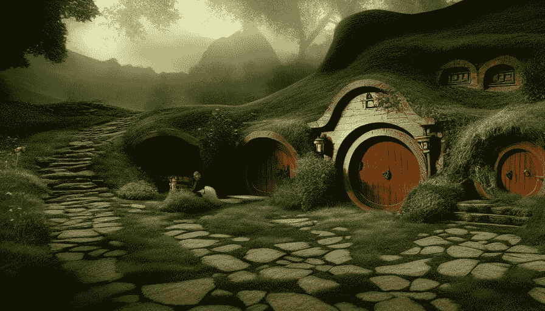
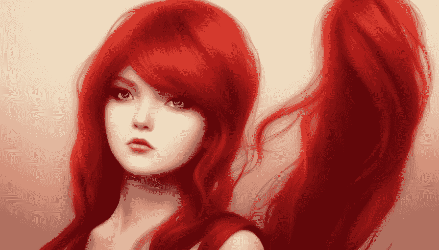
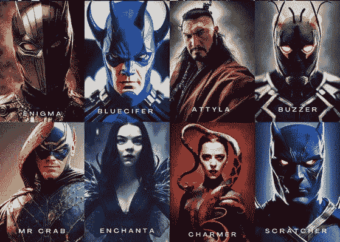
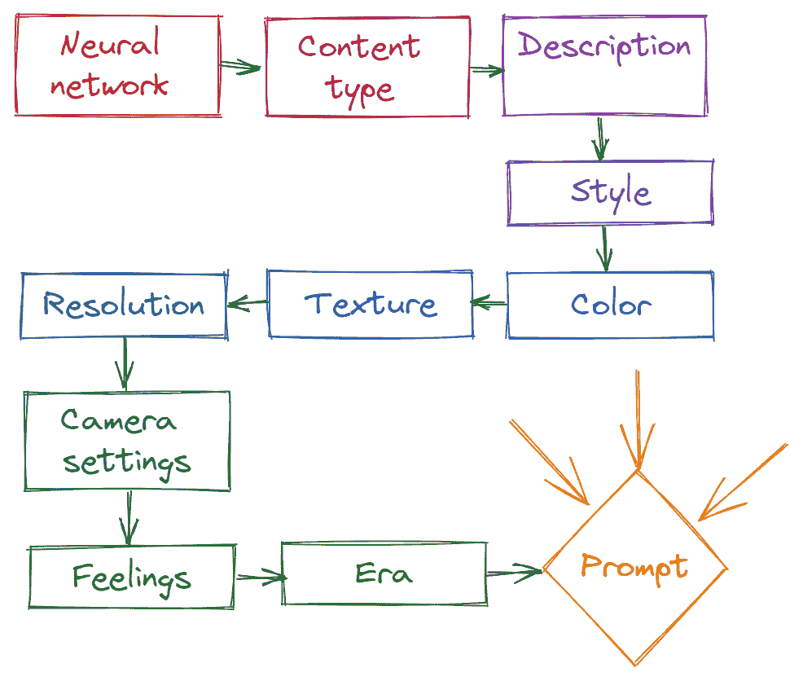
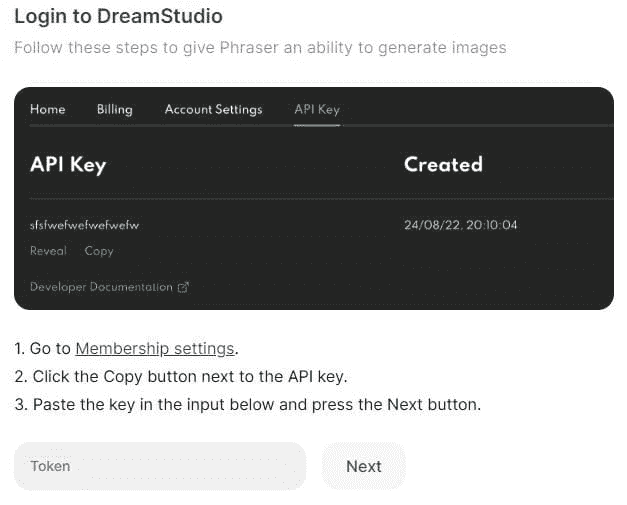

# 使用 Phraser 和 Stable Diffusion 成为 AI 艺术家

> 原文：[`www.kdnuggets.com/2022/09/become-ai-artist-phraser-stable-diffusion.html`](https://www.kdnuggets.com/2022/09/become-ai-artist-phraser-stable-diffusion.html)

图片由作者提供 | DreamStudio | Phraser | Stable Diffusion

我们生活在一个激动人心的时代，每周都有关于前沿技术的公告。几个月前，OpenAI 推出了最先进的文本到图像模型[DALL·E 2](https://openai.com/dall-e-2/)。只有少数人获得了早期访问体验这个新 AI 系统，它可以根据描述使用自然语言创建逼真的图像。它仍然对公众关闭。

几周后，[Stability AI](https://stability.ai/) 推出了名为 Stable Diffusion 模型的开源版本 DALLE2。这次发布改变了一切。因为互联网上的人们纷纷发布提示结果，对逼真的艺术作品感到惊叹。

模型的权重可以在 Hugging Face 的[CompVis/stable-diffusion-v1-4](https://huggingface.co/CompVis/stable-diffusion-v1-4)上获得。你还可以查看[源代码](https://github.com/CompVis/stable-diffusion)和[模型卡](https://huggingface.co/CompVis/stable-diffusion)。它在[The CreativeML OpenRAIL M](https://huggingface.co/spaces/CompVis/stable-diffusion-license)许可证下对公众开放。

在这篇文章中，我们将了解 Stable Diffusion，并理解一个优秀提示生成器的必要性。

# Stable Diffusion

Stable Diffusion 模型是一个开源的最先进文本到图像模型，用于使用自然语言生成艺术作品。它使用潜在扩散来识别形状和噪声，并将与提示同步的所有元素集中到核心焦点上。

该模型在一个[LAION-5B](https://laion.ai/blog/laion-5b/)图像集上进行了训练，该图像集包含了互联网上 50 亿张公开可用的图像。这些图像附带有标题和标签。

训练该模型花费了数百个高端 GPU（Nvidia A100），Stable Diffusion 的训练成本约为[$660,000](https://twitter.com/EMostaque/status/1563870674111832066?s=20&t=ZyvYA5pRQrx5jJlyD7QpWg)。在训练过程中，模型使用[CLIP](https://openai.com/blog/clip/)（对比语言–图像预训练）将词汇与图像相关联。

你不必自己训练模型。你可以在 Hugging Face Spaces 和 DreamStudio 上免费体验它。你甚至可以下载模型权重并在本地运行。

## Hugging Face Spaces

[Hugging Face - Stable Diffusion](https://huggingface.co/stabilityai)非常棒。只需写一个简单的描述，然后点击生成图像按钮。几秒钟后，你将看到 4 张与你的提示相关的生成图像。

图片由作者提供 | StableDiffusion | Hugging Face Spaces

有时，图像生成可能需要几分钟，甚至因需求量大而排队。这对于无限制的免费试用是可以接受的，但你始终可以查看名为 DreamStudio 的官方 Demo 应用程序。

## DreamStudio

注册一个免费的 [DreamStudio](https://beta.dreamstudio.ai/dream) 账户后，你会获得 2 美元或 200 次生成机会。生成速度很快，你可以玩转其他选项，如尺寸、Cfg 规模、种子、步骤和图像数量。你生成的图像始终保存在历史记录中，你可以使用 API 将其集成到现有应用程序中。

如你所见，使用提示生成完全新图像只需几秒钟。

DreamStudio | 作者

这是另一个示例。我是《魔戒》和霍比特人的忠实粉丝，所以我想，为什么不生成一张 3D 渲染的图像呢？

DreamStudio | 提示：3D 哈比特人的世界

你可以在提示中添加风格甚至平台名称。你可以尝试生成特定图像的许多方法。你甚至可以编写详细描述所有细节的长提示。

DreamStudio | 提示：Artstation HQ 上红发女孩的梦

但如何像下面这样创建详细和高质量的图像呢？真正的艺术家现在是那些想象新角色和新世界的推广者。他们使用关键词生成逼真的生成艺术。

图片来自 [nearcyan](https://twitter.com/nearcyan/status/1571984358059417601) | 假设的 Marvel 超级反派

# 使用 Phraser 生成提示

如果你想成为一名 AI 艺术家并出名，锻炼你的想象力并编写创意提示至关重要。你还需要工具来引导你，并允许你探索各种风格、纹理、颜色、内容、感觉和时代。

[Phraser](https://phraser.tech/) 是最好的提示生成器。你将从各种不同的部分中选择多样的选项，如风格和内容类型，而不是尝试不同的词汇。

开始时，它会要求你选择神经网络，如 DALLE2、midjourney 和 Stable Diffusion。之后是内容类型、描述、风格、颜色、纹理、分辨率、相机设置、感觉和时代。选择选项后，你将获得一个提示。

图片由作者提供 | 获取提示的步骤

你可以将提示复制粘贴到 Hugging Face Spaces，或者通过 API 连接 DreamStudio。

连接非常简单，API 连接指南在提示的末尾提供。

图像来自 Phraser | API 密钥指南

连接 API 的主要优势是你可以在 Phrase Web 应用程序中体验稳定扩散的结果，从而节省复制和粘贴提示的时间。

使用 Phraser 生成的提示

# 结论

我们正进入生成艺术的新时代，每周我们都看到社区带来了稳定扩散模型的新变体。例如，[nateraw/stable-diffusion-videos](https://github.com/nateraw/stable-diffusion-videos)通过插值稳定扩散的潜在空间生成视频。

> “请关注 Twitter 和 LinkedIn 上展示技能的专家图像和视频提示员。”

在这篇文章中，我们了解了稳定扩散模型以及如何使用 Hugging Face 和 DreamStudio 等免费平台创建 AI 生成的图像。此外，我们还了解了 Phraser，它帮助你为模型编写创意提示/描述。

## 参考

+   [认识 Phraser，这款提示神经网络的 AI 工具（analyticsindiamag.com）](https://analyticsindiamag.com/meet-phraser-the-ai-tool-that-prompts-neural-networks/)

+   [稳定扩散发布公告 — Stability.Ai](https://stability.ai/blog/stable-diffusion-announcement)

**[Abid Ali Awan](https://www.polywork.com/kingabzpro)**（[@1abidaliawan](https://twitter.com/1abidaliawan)）是一位认证数据科学专业人士，热衷于构建机器学习模型。目前，他专注于内容创作和撰写有关机器学习和数据科学技术的技术博客。Abid 拥有技术管理硕士学位和电信工程学士学位。他的愿景是使用图神经网络为在精神疾病中挣扎的学生构建 AI 产品。

### 更多相关内容

+   [生成式 AI 游乐场：文本到图像的稳定扩散](https://www.kdnuggets.com/2024/02/intel-generative-ai-playground-text-to-image-stable-diffusion)

+   [使用稳定扩散生成超现实面孔的 3 种方法](https://www.kdnuggets.com/3-ways-to-generate-hyper-realistic-faces-using-stable-diffusion)

+   [稳定扩散：生成式 AI 背后的基本直觉](https://www.kdnuggets.com/2023/06/stable-diffusion-basic-intuition-behind-generative-ai.html)

+   [扩散与去噪：解释文本到图像的生成式 AI](https://www.kdnuggets.com/diffusion-and-denoising-explaining-text-to-image-generative-ai)

+   [前 7 个扩散基础应用及演示](https://www.kdnuggets.com/2022/10/top-7-diffusionbased-applications-demos.html)

+   [成为优秀数据科学家的 5 个关键技能](https://www.kdnuggets.com/2021/12/5-key-skills-needed-become-great-data-scientist.html)
