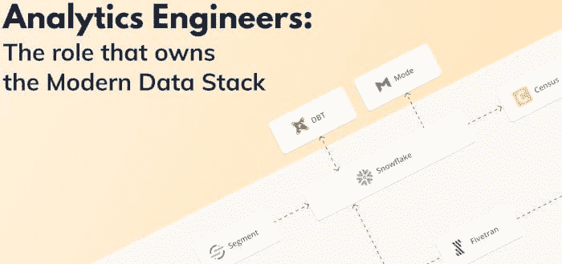
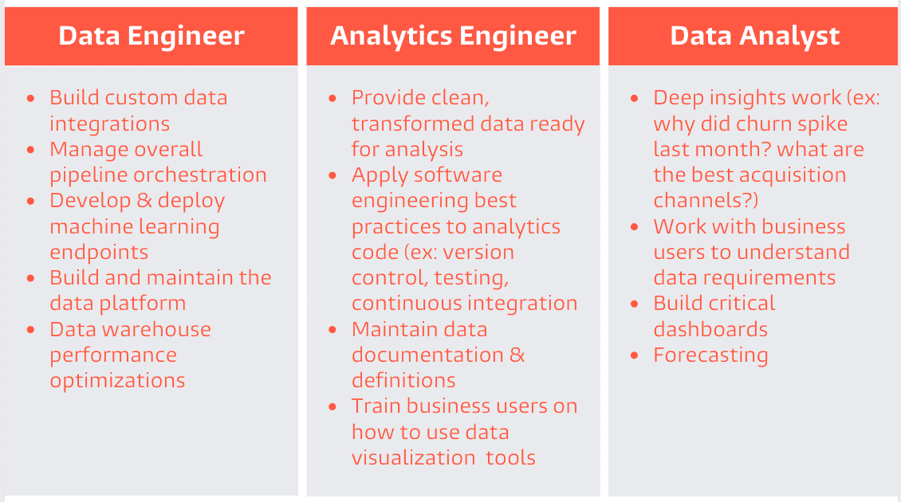
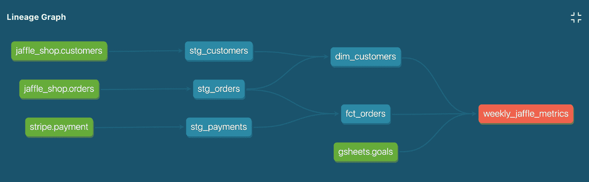
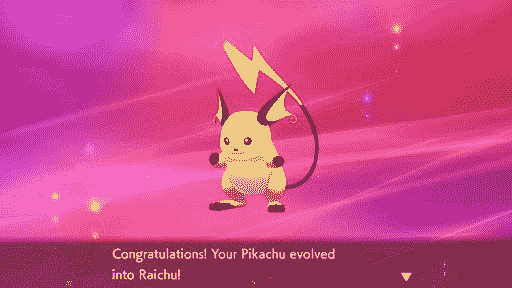

# 在 90 天内成为 Analytics Engineer

> 原文：[`www.kdnuggets.com/2021/07/become-analytics-engineer-90-days.html`](https://www.kdnuggets.com/2021/07/become-analytics-engineer-90-days.html)

评论

**作者：[Tuan Nguyen](https://www.tuanchris.com/)，Joon Solutions 的首席技术官及董事会成员**。

Analytics Engineer 是一个由 dbt 创造的全新职位。如果一个数据工程师（DE）和一个数据分析师（DA）结婚，他们有一个女儿，那么这个女儿将会是一个 Analytics Engineer（AE）。嗯，虽然实际上并不是这样，但你明白我的意思。

*[图片来源](https://www.getdbt.com/what-is-analytics-engineering/)*

### 背景

一名 AE 通常从 DA 开始，制作仪表盘并进行临时查询。她希望做更多的工作，因为那个 DE 家伙工作得像蜗牛一样。她对自己的数据非常了解，因为她每天花几个小时用她高超的 SQL 技能来浏览数据。她也非常了解业务，因为她每天都要与他们互动。但她面临着巨大的挑战，想要接手 DE 家伙的工作。以下是一些挑战：

+   管道是用 Python 构建的，而她不知道如何编程（除了 SQL 以外）。

+   DE 家伙提到过使用 git 来跟踪源代码的变化。她把 SQL 代码存储在 Word 文件中……

+   她对产生数据的系统了解甚少。

+   团队使用各种工具，而她并不熟悉所有这些工具。

+   那个 DE 家伙认为这超出了她的能力，这让她更加生气。

### 解决方案

如果我们的 DA 女孩能够完成那个傲慢 DE 的工作而不变成他就好了……来看看[dbt](http://getdbt.com/)（数据构建工具）吧！你问一个这样的工具如何在这个领域创造一个全新的职位？让我们看看。

+   她可以用 SQL 而不是 Python 编写转换代码。什么？

+   她可以用编程方式测试连接语句中的重复项。真的吗？

+   她可以编写数据文档，以便业务人员减少对她的打扰。很好！

+   她可以使用 for 循环和变量，使用 SQL 模板进行数据透视。太棒了！

+   她可以展示数据血缘，以便人们知道数据的来源以及对数据所做的处理。太棒了！

*[图片来源](https://blog.ml6.eu/trends-analytic-engineering-with-dbt-or-dataform-252afc8864ec)*

### 进化

就这样，我们的 DA 女孩变成了 AE。

*[图片来源](http://www.gamersheroes.com/game-guides/how-to-evolve-pikachu-in-pokemon-sword-shield/)*

我在开玩笑。实际上不是这样的。这需要时间、精力和对学习新事物的承诺。如果你能与我们 DA 女孩的故事产生共鸣，我认为这篇文章对你会有帮助。

这是我认为成为 AE 高手所需的技能和技术的有见解的清单。

+   ****SQL 忍者****：如果你是一个士兵，那么 SQL 就像你的武器。SQL 已成为数据提取和转换的标准。作为 AE 或 DA，你必须尽可能熟练掌握 SQL。

+   ****Git 战士****：Git 是团队协作中的一个强大工具。你需要像使用手臂一样使用这个工具。

+   ****dbt**** **专家**： dbt 是一种技术，使 AE 和 DA 能够完成 DE 的工作。借助 dbt，你可以轻松参与以前只有 DE 才能做的工作，并对数据进行大量操作。

+   ****BI 工具专家****：仪表板不仅仅是数字和图表，它们是讲述故事的强大工具。

+   ****云计算冠军****：云计算是我们拥有第四次工业革命的原因之一。成为云计算冠军只会对你的职业发展有所帮助。

+   ****Scrum 主任****：Scrum 是一种利用敏捷思维来开发、交付和维持复杂项目的框架。

+   ****文档倡导者****：作为人类，我们之所以能走到今天，全靠集体学习。写作是一个强大的沟通工具，你将从练习写作中受益匪浅。

### 资源

以下是我们在 [Joon Solutions](http://joonsolutions.com/) 用于培训新分析工程师的资源。它更像是一个清单，也许你可以将这些复制到你喜欢的记笔记应用中。

我不能保证按照此方法，你就能成为 AE。但我确信你可以通过这条路径学到很多东西，并且在正确的环境和团队下，你将发展成为一个****分析工程师忍者****。

*祝学习愉快！*

**我已经成为了 SQL 忍者**

+   我已完成 [W3School SQL](https://www.w3schools.com/sql/) 课程。

+   我已完成 [SQLBolt](https://sqlbolt.com/) 课程。

+   我已经浏览了 [BigQuery 语法文档](https://cloud.google.com/bigquery/docs/reference/standard-sql/query-syntax) 并提出了我需要的所有问题。

+   我已经探索了至少一个 [BigQuery 公共数据集](https://cloud.google.com/bigquery/public-data) 并进行了有趣的查询。

+   我知道什么是 [窗口函数](https://mode.com/sql-tutorial/sql-window-functions/) 以及如何使用它们。

+   我查阅了额外的资源，比如 [this](https://towardsdatascience.com/6-of-the-best-niche-platforms-to-learn-sql-and-python-f6f13808d2f5)、 [this](https://towardsdatascience.com/learning-sql-learn-how-to-practice-sql-with-a-complex-database-4b2ce933b1ef) 和 [this](https://websitesetup.org/sql-cheat-sheet/)。

+   我承认 [SQL 是强大的](https://medium.com/dataform/consider-sql-when-writing-your-next-processing-pipeline-5167f67afb16)。

**我已经成为了 Git 战士**

+   我知道什么是 [git](https://www.atlassian.com/git/tutorials/what-is-git)。

+   我知道一个典型的 [git 工作流程](https://www.atlassian.com/git/tutorials/comparing-workflows) 是什么样的。

+   我创建了一个测试仓库、一个提交，并提交了一个拉取请求。

+   我知道什么是 SSH 密钥，在哪里找到它，以及如何[将其添加到我的 GitHub 账户](https://docs.github.com/en/github/authenticating-to-github/adding-a-new-ssh-key-to-your-github-account)。

+   我查看了像[this](https://guides.github.com/)、[this](https://www.atlassian.com/git)和[this](https://medium.com/cs-code/beginners-guide-to-using-git-8e5001791fa6)这样的酷资源。

**我已经成为 dbt 大师**。

+   我知道[什么是 dbt](https://blog.getdbt.com/what--exactly--is-dbt-/#:~:text=dbt%20(data%20build%20tool)%20is,Casper%2C%20Seatgeek%2C%20and%20Wistia.)，以及它为什么强大。

+   我阅读了[分析工程师指南](https://www.getdbt.com/analytics-engineering/)。

+   我参加了 dbt 的[按需课程](https://courses.getdbt.com/collections)。

+   我从零开始设置了一个 dbt 项目，并建立了一些很棒的模型。

+   我已阅读并理解了[dbt 项目检查表](https://discourse.getdbt.com/t/your-essential-dbt-project-checklist/1377)。

+   我已阅读并理解了[dbt 最佳实践](https://docs.getdbt.com/docs/guides/best-practices)。

+   我已阅读并理解了[dbt 编码规范](https://github.com/fishtown-analytics/corp/blob/master/dbt_style_guide.md)。

+   我已经准备好并兴奋地想用 dbt 构建实际项目。

**我已经成为 BI 工具专家**。

+   我查看了 BI 工具的全景，并了解了有哪些工具。

+   我阅读了[Analytics Setup Guidebook](https://www.holistics.io/books/setup-analytics/)。

+   我尝试并建立了一个使用[Power BI](https://powerbi.microsoft.com/en-us/)的仪表盘。

+   我尝试并建立了一个使用[Metabase](https://www.metabase.com/)的仪表盘。

+   我尝试并建立了一个使用[Holistics](https://www.holistics.io/)的仪表盘。

+   我尝试并建立了一个使用[Data Studio](https://datastudio.google.com/u/0/navigation/reporting)的仪表盘。

+   我可以自信地说，我知道哪种 BI 工具适合不同的需求。

**我已经成为云计算冠军**。

+   我了解过一个主要云服务提供商的[many services](https://cloud.google.com/products/)。

+   我了解使用云计算的[many benefits](https://www.softwareadvisoryservice.com/en/blog/why-move-to-the-cloud-12-benefits-of-cloud-computing-in-2019/)。

+   我尝试创建了一个 BigQuery 数据集，并[加载了数据](https://cloud.google.com/bigquery/docs/loading-data)。

+   我尝试过[BigQuery ML](https://cloud.google.com/bigquery-ml/docs)，并了解到用 SQL 创建 ML 模型有多么简单。

**我已经成为 Scrum 大师**。

+   我了解[scrum 开发过程](https://www.atlassian.com/agile/scrum)。

+   我阅读过关于[scrum 开发](https://www.atlassian.com/agile/tutorials/how-to-do-scrum-with-jira-software)的内容。

+   我在[这里](https://towardsdatascience.com/agile-in-data-science-how-can-scrum-work-effectively-for-your-team-c567208e9d3f#:~:text=Scrum%20is%20an%20Agile%20framework,backlog%20and%20a%20sprint%20backlog.)和[这里](https://www.datascience-pm.com/scrum/)阅读过有关数据团队中 scrum 的内容。

+   我了解 [CI/CD](https://www.atlassian.com/continuous-delivery/principles/continuous-integration-vs-delivery-vs-deployment) 以及为什么数据团队也应该使用它

**我已成为一名文档推广者**

+   我已记录学习内容以备参考

+   我已经撰写了至少两篇博客文章，分享了我在 90 天内的学习经验

+   我努力提升我的写作技能，包括使用 [this](http://grammarly.com/)、阅读 [this](https://towardsdatascience.com/the-importance-of-writing-as-a-data-scientist-22feb2b1d33d) 和 [this](https://www.grammarly.com/blog/how-to-improve-writing-skills/)

[原文](https://www.tuanchris.com/blog/2021-06-12-become-an-analytics-engineer-in-90-days/)。经授权转载。

**简介：** [Tuan Nguyen](https://www.tuanchris.com/about/) 是 Joon Solutions 的首席技术官，该公司提供数据即服务。他的专业经验包括构建和管理数据科学团队、分析基础设施和分析用例。他热衷于将数据分析和云计算的激情结合起来，帮助企业在数字时代保持竞争力。他的兴趣广泛，包括天文学、阅读、音乐和物联网。

**相关：**

+   [数据科学在 10 年内不会灭绝，但你的技能可能会](https://www.kdnuggets.com/2021/06/data-science-not-becoming-extinct-10-years.html)

+   [数据科学家、数据工程师及其他数据职业解析](https://www.kdnuggets.com/2021/05/data-scientist-data-engineer-data-careers-explained.html)

+   [2021 年数据工程师最需要的技能](https://www.kdnuggets.com/2021/05/most-demand-skills-data-engineers-2021.html)

### 更多相关主题

+   [成为一名优秀数据科学家所需的 5 项关键技能](https://www.kdnuggets.com/2021/12/5-key-skills-needed-become-great-data-scientist.html)

+   [每位初学者数据科学家应掌握的 6 种预测模型](https://www.kdnuggets.com/2021/12/6-predictive-models-every-beginner-data-scientist-master.html)

+   [2021 年最佳 ETL 工具](https://www.kdnuggets.com/2021/12/mozart-best-etl-tools-2021.html)

+   [30 天内成为职业准备就绪的 4 个认证](https://www.kdnuggets.com/4-certifications-to-become-job-ready-in-30-days)

+   [停止学习数据科学以寻找目标，并找到目标去…](https://www.kdnuggets.com/2021/12/stop-learning-data-science-find-purpose.html)

+   [9 亿美元 AI 失败案例分析](https://www.kdnuggets.com/2021/12/9b-ai-failure-examined.html)
