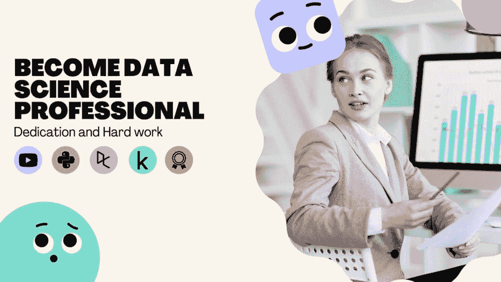
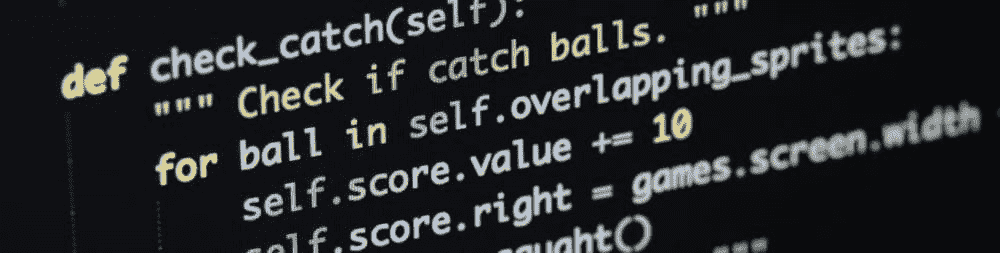
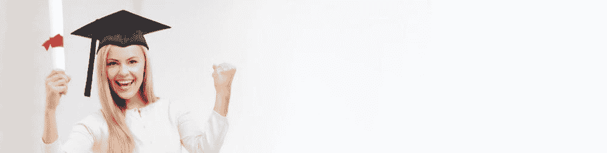

# 成为数据科学专业人士的五个步骤

> 原文：[`www.kdnuggets.com/2022/03/become-data-science-professional-five-steps.html`](https://www.kdnuggets.com/2022/03/become-data-science-professional-five-steps.html)

图片由作者提供

一个典型的初学者会花几个小时在谷歌上搜索数据科学课程，大多数人最终放弃。这是为什么呢？因为我们有多个开始的选项，我们无法确定哪个最适合自己。在我看来，我们都迷失在大量内容中，不知道从哪里开始。在这篇博客中，我将指导你什么对我有效，也许对你也有帮助。

* * *

## 我们的前三个课程推荐

 1\. [谷歌网络安全证书](https://www.kdnuggets.com/google-cybersecurity) - 快速进入网络安全职业。

 2\. [谷歌数据分析专业证书](https://www.kdnuggets.com/google-data-analytics) - 提升你的数据分析技能

 3\. [谷歌 IT 支持专业证书](https://www.kdnuggets.com/google-itsupport) - 支持你的组织 IT 工作

* * *

**指南包括：**

1.  学习数据科学基础

1.  提高编程语言水平

1.  完整的数据科学学习路径

1.  获取数据科学项目的实践经验

1.  获取数据科学认证

# 1\. 学习基础知识

学习数据科学基础是你旅程中最重要的部分，因为它将为你迎接学习挑战做好准备。大多数初学者会在不知道自己想要什么的情况下开始课程。最终，90%的人甚至未能完成课程，因为随着时间的推移，课程变得越来越难。因此，如果你正在跟随趋势，请了解数据科学和职业道路。

图片由 [Karolina Grabowska](https://www.pexels.com/@karolina-grabowska) 提供，来自 [pexels](https://www.pexels.com)

从观看初学者友好的视频教程开始学习统计学和数据科学基础。这些非技术性视频将帮助你理解数据科学的各个组成部分：数据采集、数据清理、数据分析、建模和应用。如果你不喜欢观看视频，也可以尝试阅读博客和书籍。学习数据科学基础将帮助你理解职业道路，并介绍数据分析和机器学习中使用的最常见工具。

**学习资源：**

+   [数据科学入门 - 初学者速成课程](https://www.youtube.com/watch?v=N6BghzuFLIg)

+   [5 分钟了解数据科学](https://www.youtube.com/watch?v=X3paOmcrTjQ)

+   [11 个塑造未来的数据科学职业](https://www.northeastern.edu/graduate/blog/data-science-careers-shaping-our-future/)

+   [前 9 大数据科学工具](https://www.upgrad.com/blog/top-data-science-tools/)

+   [数据分析师和数据科学家学习统计的 7 天计划](https://www.youtube.com/watch?v=TUn-prncFfU)

# 2\. 学习编程

学习基础知识后，是时候掌握**Python**了，因为你在工作中大部分时间都会编写代码。你也可以从**R**或**Julia**开始，因为它们本身就是为了统计和科学研究而开发的。掌握 Python 将帮助你进行研究、数据可视化、设计最先进的应用程序以及通过技术面试。

图片由作者提供

我开始我的旅程时学习了 R 和 Python。这帮助我更快地掌握了数据分析的核心概念。之后，我开始学习**SQL**，它是数据摄取和分析最重要的工具。几乎所有的数据科学面试都会包括 SQL 问题，因此，最好在早期阶段就学习它，以提高被聘用的机会。

**学习资源：**

+   Codecademy: [Python 课程与教程](https://www.codecademy.com/catalog/language/python)

+   Youtube: [1 小时学会 Python](https://www.youtube.com/watch?v=kqtD5dpn9C8)

+   Udemy: [Python 训练营](https://www.udemy.com/course/complete-python-bootcamp/)

+   Udacity: [免费 Python 入门课程](https://www.udacity.com/course/introduction-to-python--ud1110)

+   书籍: [Python Crash Course, 2nd Edition](https://www.amazon.com/Python-Crash-Course-2nd-Edition/dp/1593279280?ref_=Oct_d_obs_d_285856&pd_rd_w=TioGL&pf_rd_p=8000bc8c-c3b0-4816-9f00-5038ff54385c&pf_rd_r=1WE8EYRBJQ347XC5EGJB&pd_rd_r=d8b24d37-6744-483d-9721-a2898862d9f1&pd_rd_wg=cmea6&pd_rd_i=1593279280)

**额外内容：**

+   对于 Julia: [Julia 科学编程](https://www.coursera.org/learn/julia-programming)

+   对于 R: [统计学与 R](https://www.edx.org/course/statistics-and-r)

+   对于 SQL: [学习 SQL](https://www.codecademy.com/learn/learn-sql)

# 3\. 应用数据科学轨道

数据科学轨道包含你需要掌握的所有必要课程；数据管理、探索性分析、统计实验、模型开发、编程和报告。职业轨道还为你提供了一个结构和互动编程练习。这些课程将帮助你理解统计学、机器学习和自然语言处理的核心概念。

图片由作者提供

我的旅程始于 Python 数据科学职业路径，这帮助我理解了数据分析和机器学习。互动课程提高了我的编码技能。在我看来，带有**互动练习**、**编码挑战**、**作业**和**项目**的职业路径是最好的。它们将帮助你跟踪进展，并随着时间的推移不断提高。

**互动职业路径：**

+   DataCamp

    +   R: [R 数据科学家路径](https://app.datacamp.com/learn/career-tracks/data-scientist-with-r)

    +   Python: [Python 数据科学家路径](https://app.datacamp.com/learn/career-tracks/data-scientist-with-python?version=5)

    +   SQL: [SQL Server 数据分析师路径](https://app.datacamp.com/learn/career-tracks/data-analyst-with-sql-server)

+   Udacity: [在线学习成为数据科学家](https://www.udacity.com/course/data-scientist-nanodegree--nd025)

+   Coursera: [数据科学 | Coursera](https://www.coursera.org/specializations/jhu-data-science)

+   Codecademy: [数据科学家](https://www.codecademy.com/learn/paths/data-science?g_network=s&g_device=c&g_adid=&g_keyword=data%20science%20courses&g_acctid=243-039-7011&g_adtype=search&g_adgroupid=1269936738099593&g_keywordid=kwd-79371513265143:loc-144&g_campaign=US+Career+Path%3A+Pro+-+Phrase&g_campaignid=370540073&utm_id=t_kwd-79371513265143:loc-144:ag_1269936738099593:cp_370540073:n_s:d_c&hsa_acc=2430397011&hsa_cam=14390757338&hsa_grp=1269936738099593&hsa_ad=&hsa_src=s&hsa_tgt=kwd-79371513265143:loc-144&hsa_kw=data%20science%20courses&hsa_mt=p&hsa_net=adwords&hsa_ver=3&msclkid=4b2a2744f1e0194ae3e14696133166a6&utm_source=bing&utm_medium=cpc&utm_campaign=US%20Career%20Path%3A%20Pro%20-%20Phrase&utm_term=data%20science%20courses&utm_content=data%20science)

# 4\. 实践经验

是时候将你的技能应用到现实世界中，但如果没有一定的经验，找到工作会很困难。如何获得经验？通过参加数据科学竞赛、在 NGO 项目中志愿服务或申请实习来获得经验。

图片由作者提供

## 参与竞赛

参加数据分析或机器学习竞赛将帮助你建立数据科学作品集。这也将帮助你理解各种现实问题，如预测、医疗保健中的机器学习、机器人技术和计算机视觉。数据科学路径向我展示了数据的世界，**Kaggle** 竞赛将我塑造为一名数据科学专业人士。我强烈推荐大家参与竞赛并从其他参与者那里学习。

**竞赛平台：**

+   [Kaggle](https://www.kaggle.com/)

+   [DrivenData](https://www.drivendata.org/)

+   [Zindi](https://zindi.africa/)

+   [AICrowd](https://www.aicrowd.com/)

## 进行项目实践

你也可以为 NGO 项目做志愿者，这些项目的入门门槛较低。如果你在寻找合作经验，我建议你查看[Omdena](https://omdena.com/projects/)项目。为了提升你的数据科学作品集，尝试寻找适合初学者的项目。不要仅仅局限于工作机会，你也可以通过参与开源项目来获得经验。

## 实习

最后但同样重要的是实习选项。你可以在 LinkedIn 或本地招聘网站上找到学徒岗位、夏令营邀请或实习机会。实习是你进入职业世界的第一步，也是获得全职工作的快捷方式。如果你在寻找实习机会时遇到困难，可以询问朋友或在 LinkedIn 上发布信息。获得专业经验对你在该领域的成功至关重要。

# 5\. 认证

获得数据科学认证会让你在就业市场中占据优势。认证考试难度较大，会考察你的编程、数据管理、建模和报告知识。最好在参加认证考试前，先积累一些数据科学项目的初级经验。

作者提供的图片

我花了两周时间完成所有挑战。第一个挑战是**定时评估**，测试了我对 SQL、Python 和统计学的知识。随后，我进入了**编码挑战**，这花费了我整整一天的时间。最后部分是**案例研究**，包括撰写技术报告和非技术演示。在获得认证后，我从[DataCamp](https://app.datacamp.com/certification/career-services)免费获得了**职业服务**，这帮助我通过了多次求职面试。如果你想了解更多关于我的经历，请查看我的博客：如何获得数据科学认证。

**顶级数据科学认证列表：**

+   [DataCamp 认证](https://app.datacamp.com/certification/data-scientist-professional)

+   [Databricks 认证数据科学家](https://academy.databricks.com/exam/databricks-certified-professional-data-scientist)

+   [哈佛 X 数据科学专业证书 | edX](https://www.edx.org/professional-certificate/harvardx-data-science)

+   [IBM 数据科学专业证书](https://www.coursera.org/professional-certificates/ibm-data-science)

# 下一步是什么

下一步是寻找数据科学的全职工作。在等待被聘用的同时，最好继续学习新工具并参与项目。你也可以加入数据科学社区或撰写有关你所学内容的博客。

注册自由职业平台，参加竞赛，阅读最新研究话题，在 GitHub、Deepnote、DAGsHub 和 Kaggle 上创建你的作品集。如果你想被 Meta 和 Google 等顶尖公司注意到，持续学习和成长是非常重要的。

如果你正在寻找项目灵感，可以查看我在 [Deepnote](https://deepnote.com/@abid)、[Kaggle](https://www.kaggle.com/kingabzpro)、[GitHub](https://github.com/kingabzpro) 和 [DAGsHub](https://dagshub.com/kingabzpro) 上的个人资料。你还可以关注我在 [LinkedIn](https://www.linkedin.com/in/1abidaliawan/) 上，了解更多适合初学者的项目，阅读博客和教程。如果你对数据科学职业路径有任何疑问，请在下方评论，我会尽力回答你的问题。

**[Abid Ali Awan](https://www.polywork.com/kingabzpro)** ([@1abidaliawan](https://twitter.com/1abidaliawan)) 是一名认证的数据科学专业人士，热衷于构建机器学习模型。目前，他专注于内容创作，并撰写关于机器学习和数据科学技术的技术博客。Abid 拥有技术管理硕士学位和电信工程学士学位。他的愿景是利用图神经网络为那些面临心理健康问题的学生构建一个 AI 产品。

### 更多相关话题

+   [成为专业数据工程师所需的唯一免费课程](https://www.kdnuggets.com/the-only-free-course-you-need-to-become-a-professional-data-engineer)

+   [KDnuggets™ 新闻 22:n03, 1 月 19 日: 深入探讨 13 个数据...](https://www.kdnuggets.com/2022/n03.html)

+   [数据科学面试中你应该知道的五个 SQL 窗口函数](https://www.kdnuggets.com/2022/01/top-five-sql-window-functions-know-data-science-interviews.html)

+   [有效数据科学经理的五个标志](https://www.kdnuggets.com/2022/06/five-signs-effective-data-science-manager.html)

+   [作为数据分析/科学专业人士，我如何在 14 年内将薪水提高了 14 倍](https://www.kdnuggets.com/2021/12/14x-salary-in-14-years-data-professional.html)

+   [在 Pandas 中进行条件过滤的五种方法](https://www.kdnuggets.com/2022/12/five-ways-conditional-filtering-pandas.html)
