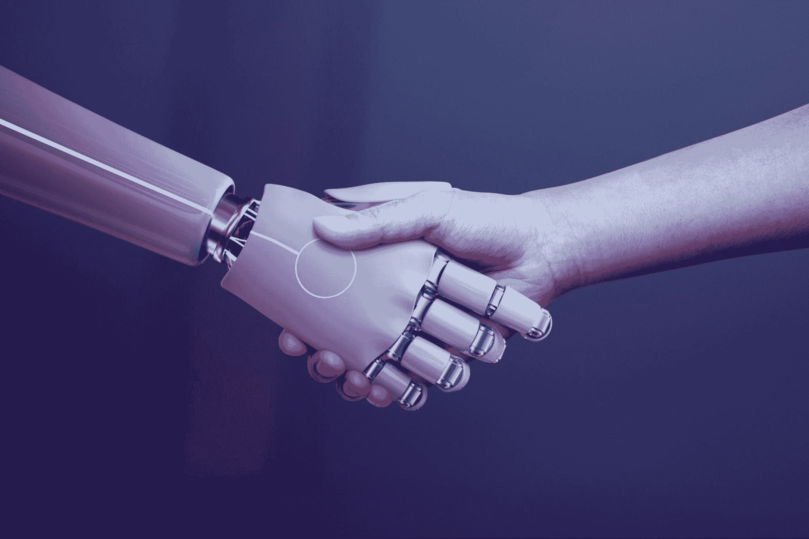

# 如何成为一名机器学习工程师

> 原文：[`www.kdnuggets.com/2022/05/become-machine-learning-engineer.html`](https://www.kdnuggets.com/2022/05/become-machine-learning-engineer.html)

图片来自 [rawpixel](https://www.freepik.com/free-photo/robot-handshake-human-background-futuristic-digital-age_17850426.htm#query=machine%20learning&position=23&from_view=search)

机器学习工程在迅速增长，超过了数据科学。这个职位需求量很大，许多数据科学职业的人转型成为机器学习工程师。根据 [glassdoor](https://www.glassdoor.com/List/Best-Jobs-in-America-LST_KQ0,20.htm)，它目前位列美国前 50 名最佳职业的第 6 位。

* * *

## 我们的前三名课程推荐

 1\. [谷歌网络安全证书](https://www.kdnuggets.com/google-cybersecurity) - 快速进入网络安全职业轨道。

 2\. [谷歌数据分析专业证书](https://www.kdnuggets.com/google-data-analytics) - 提升你的数据分析水平

 3\. [谷歌 IT 支持专业证书](https://www.kdnuggets.com/google-itsupport) - 支持你组织的 IT 需求

* * *

机器学习（ML）工程师是一个精通构建和设计软件以自动化预测模型的程序员。他们的计算机科学背景相较于数据科学家更为深入。

大多数机器学习工程师来自两个背景之一。第一个是拥有数据科学、软件工程、计算机科学和/或人工智能博士学位的人。另一个是那些有过数据科学家或软件工程师经验并转型到这一角色的人。

# 机器学习工程师的工作是什么？

数据科学家和机器学习工程师都处理动态数据集，进行复杂建模，并具备卓越的数据管理技能。

机器学习工程师的主要职责是设计软件来自动化预测模型，这些模型有助于进行未来预测。这就是‘机器’如何从‘工程’中‘学习’的过程。

执行此操作的子任务包括：

+   研究机器学习算法和工具及其实施方式。

+   选择适当的数据集

+   选择数据表示方法

+   验证数据的质量

+   识别数据中的分布以及它如何影响模型性能。

+   对机器学习系统和模型进行迭代训练

+   执行统计分析

+   微调模型

+   改进现有的机器学习框架和库

# 成为成功的机器学习工程师需要哪些技能？

成为机器学习工程师需要多种技能。

## 编程技能

你需要掌握多种编程语言，如 C++、Python 和 Java，以及 R 和 Prolog 等在机器学习中变得重要的编程语言。你掌握的编程语言越多越好；然而，这可能需要大量的学习。

## 统计学

机器学习更侧重于计算机科学，利用概率和其他统计工具来构建和验证模型。机器学习算法是统计建模程序的延伸，因此理解统计学和数学的基础是重要的。

## 问题解决者

模型失败的情况是常有的，这可能变得非常复杂，因此 ML 工程师需要具备良好的问题解决能力。不要轻易放弃，通过理解问题并开发相应的方法来高效解决问题，这样可以节省时间并更快地实现目标。

## 理解数据

ML 工程师能够迅速浏览大型数据集，识别模式，帮助他们了解下一步采取哪些措施以产生有意义的结果。使用 Excel、Tableau 和 Plotly 等工具也可以提供更深入的数据洞察。

# 如何开始你的 ML 工程师职业生涯

[David Iskander](https://unsplash.com/@diskander) via Unsplash

## 传统途径：大学

对 ML 工程师来说，理想的学位包括数学、数据科学、计算机科学、统计学和物理学。这些学位为 ML 工程师提供了基础知识以及编程、统计工具和分析技能。

如果你想更好地了解大学课程内容，可以阅读这篇文章：免费大学数据科学资源。

一旦完成学位，你需要在软件工程、数据科学等领域积累技能和经验。ML 工程师需要几年高水平的编程经验才能获得成功。

你可以通过获得数据科学、软件工程的硕士学位，或在机器学习领域攻读博士学位来进一步增加知识。

## 现代技术途径：电子学习

在当今对技术专家需求量大的情况下，另一种可能性是独立学习和/或电子学习。这可以通过 BootCamps、在线课程、YouTube 等途径实现。

如果你想通过 YouTube 学习，有很多 YouTube 频道可以帮助你实现目标。像 John Starmer、Krish Naik 等 YouTuber 都可以提供帮助。如果你想了解更多，可以阅读这篇文章：学习数据科学的顶级 YouTube 频道。

还有各种在线课程，其中一些是由大学提供的。这显示了对技术专家的需求，因为大学已经投入时间创建课程来满足这一需求。随着新的远程生活方式的出现，在线课程变得越来越受欢迎，有助于加速人们的职业发展。

最近令我感兴趣的一个优秀平台是 [Great Learning](https://www.mygreatlearning.com/)，提供数据科学与商业分析、人工智能与机器学习、云计算、软件开发等课程。他们最受欢迎的机器学习课程之一是：[数据科学与机器学习：数据驱动决策课程](https://www.mygreatlearning.com/mit-data-science-machine-learning-program)。

机器学习工程师需要掌握大量与机器学习相关的知识以及不同类型的算法。如果你想了解更多关于你将在机器学习中学习的算法类型，可以阅读这篇文章：流行的机器学习算法。

## 书籍

尽管许多东西已经转移到在线，但越来越少的人阅读书籍。书籍是学习的绝佳方式，然而，选择哪本书可能很困难。我强烈推荐 Oliver Theobald 的书籍 [机器学习入门](https://www.amazon.in/dp/B06VXKBLNG?tag=hackr0df-21)。

如果你想要更多针对不同学习水平的机器学习书籍推荐；初学者、中级和专家，可以阅读这篇文章：2022 年你需要阅读的机器学习书籍

# 这不是一条容易的道路，但值得付出

成为机器学习工程师不会一蹴而就，但一旦你获得了正确的资格、技能和经验，你将进入一个为你提供稳固未来的领域。这需要大量的努力和决心，你需要做的就是付出努力。

**[Nisha Arya](https://www.linkedin.com/in/nisha-arya-ahmed/)** 是一位数据科学家和自由职业技术作家。她特别关注提供数据科学职业建议或教程，以及围绕数据科学的理论知识。她还希望探索人工智能如何或能如何有益于人类寿命。她是一位热衷学习者，寻求拓宽她的技术知识和写作技能，同时帮助指导他人。

### 更多相关话题

+   [成为 SAS 认证机器学习工程师所需的一切](https://www.kdnuggets.com/2023/11/sas-everything-need-become-sas-certified-machine-learning-engineer)

+   [7 门免费的 Google 课程，让你成为机器学习工程师](https://www.kdnuggets.com/7-free-google-courses-to-become-a-machine-learning-engineer)

+   [成为数据工程师需要的 9 种技能](https://www.kdnuggets.com/2021/03/9-skills-become-data-engineer.html)

+   [成为数据工程师所需的必读书籍](https://www.kdnuggets.com/2022/10/essential-books-need-become-data-engineer.html)

+   [你成为专业数据工程师所需的唯一免费课程](https://www.kdnuggets.com/the-only-free-course-you-need-to-become-a-professional-data-engineer)

+   [你是否应该成为自由职业人工智能工程师？](https://www.kdnuggets.com/2021/12/ucsd-become-freelance-artificial-intelligence-engineer.html)
