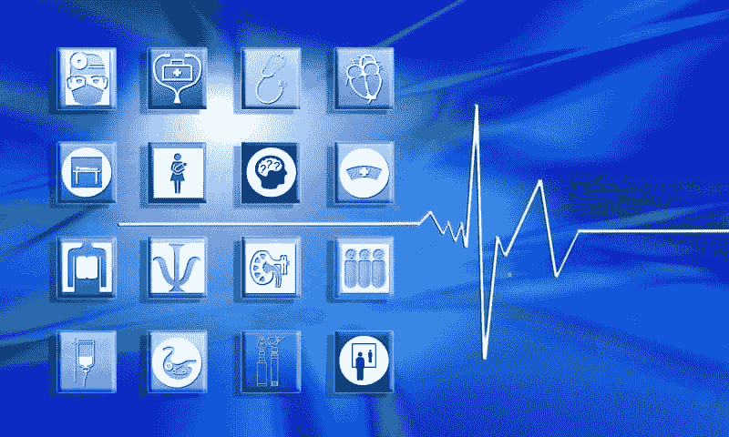

# 如何成为一名成功的医疗数据分析师

> 原文：[`www.kdnuggets.com/2019/11/become-successful-healthcare-data-analyst.html`](https://www.kdnuggets.com/2019/11/become-successful-healthcare-data-analyst.html)

评论

**作者：[Ritesh Patil](https://www.mobisoftinfotech.com)，Mobisoft Infotech 的联合创始人**

你是否有兴趣开始你的数据分析职业生涯？作为一名医疗数据分析师可能是你最好的选择！查看这篇文章，以获取有关健康数据分析师及其如何成为一名详细的信息。

* * *

## 我们的前三大课程推荐

 1\. [Google 网络安全证书](https://www.kdnuggets.com/google-cybersecurity) - 快速进入网络安全职业生涯。

 2\. [Google 数据分析专业证书](https://www.kdnuggets.com/google-data-analytics) - 提升你的数据分析技能

 3\. [Google IT 支持专业证书](https://www.kdnuggets.com/google-itsupport) - 在 IT 方面支持你的组织

* * *

随着新技术的出现，医疗行业不断进步。数据分析就是一种技术，它被应用于医院中，以改善患者结果并降低提供医疗服务的成本。因此，医院正在招聘熟练的数据分析师，以有效执行医疗活动。

候选人被健康数据分析师角色的高需求、职业发展和薪资吸引，并且对在这一领域取得卓越成绩表现出兴趣。

### **什么是健康数据分析师？**

数据分析是从大量信息中筛选出重要数据并获得关键见解的过程。这些关键见解主要提供给需要做出某些决策的医疗机构。

那些利用数据采集、分析、解释和数据维护等专业知识，并向专业人员提供重要医疗数据的人被称为医疗数据分析师。

### **医疗数据分析师的工作是什么？**

医疗数据分析师也被称为管理分析师，因为他们维护大量数据，并提供支持以提升医疗保健的效率。医疗分析师还利用大数据和数据科学为医疗保健领域提供最佳解决方案。医疗保健领域包括医生、药物、诊断、医院等多个实体。

数据分析师的主要目标是为管理者提供建议，以在不影响治疗成本的情况下增加利润。此外，数据科学在医疗保健中的应用还有很多。医疗分析师的主要角色包括：

+   利用大数据及其应用，收集和解释来自多个来源的数据，如成本报告、电子健康记录（EHR）等。

+   理解医院功能和系统，以支持决策过程

+   从收集、存储、检索到保护医疗保健数据的端到端数据库管理

+   创建报告和仪表板，以向医疗保健领域的利益相关者传达所需的信息

### **健康数据分析师将会在哪里就业？**

医疗保健数据分析师可以在不同领域开始他们的职业生涯，例如：

+   政府医疗部门

+   私立医院或公共部门医院

+   跨国公司的分析团队

+   诊断中心

+   健康保险公司

### **如何成为医疗保健数据分析师？**

**教育资格**

成为医疗保健数据分析师，你必须至少拥有学士学位。如果你拥有统计学、数据科学、信息技术或健康信息管理的学位更好。否则，你必须在声誉良好的学院学习这些课程之一。

另一方面，顶级公司寻找那些拥有工商管理硕士（MBA）学位的候选人。

候选人应具备一定的许可证和认证才能成为数据分析师。这些认证和许可证因国家而异，因此找到必要的注册信息非常重要。

大多数公司倾向于让有经验的候选人进行组织的数据分析。你必须在如人力资源、管理和信息技术等领域获得经验。

**所需技能**

希望成为医疗保健数据分析师的候选人必须具备以下技能。重要点包括：

+   分析技能

+   解决问题的技能

+   决策技能

+   沟通技能

+   时间管理技能

+   人际交往技能

### **最终思考**

这是你在计划成为医疗保健数据分析师时需要了解的基本信息。请通过所提供的信息，确定你是否有资格成为健康数据分析师。提升与健康数据分析师相关的技能和知识，并寻找提供良好工作机会的最佳公司。祝你的职业生涯好运！

**简介: [Ritesh Patil](https://www.mobisoftinfotech.com)** ([**@ritesh_patil**](https://twitter.com/ritesh_patil)) 是 Mobisoft Infotech 的联合创始人，该公司是印度和美国领先的[医疗保健软件开发](https://mobisoftinfotech.com/industry/healthcare-software-development)公司。他是一位热衷的博主，热爱创新，撰写多种医疗保健应用领域的文章。他与经验丰富的数字健康应用开发人员合作，推出了创新的移动应用程序。他相信知识共享，并专注于初创企业。

**相关：**

+   人工智能如何改变医疗保健（它能否解决美国医疗保健系统的问题？)

+   数据科学很无聊（第二部分）

+   乳腺癌分类的卷积神经网络

### 了解更多此主题的信息

+   [如何在 2022 年成为成功的数据科学自由职业者](https://www.kdnuggets.com/2022/02/become-successful-data-science-freelancer-2022.html)

+   [成功数据科学家的 5 个特征](https://www.kdnuggets.com/2021/12/5-characteristics-successful-data-scientist.html)

+   [数据质量在成功构建机器学习模型中的重要性](https://www.kdnuggets.com/2022/03/significance-data-quality-making-successful-machine-learning-model.html)

+   [通过 DataCamp 的分析师接管更快地实现数据驱动](https://www.kdnuggets.com/2022/10/datacamp-data-driven-faster-analyst-takeover.html)

+   [如果你想成为数据分析师，应该考虑的 3 个课程](https://www.kdnuggets.com/3-courses-you-should-consider-if-you-want-to-become-a-data-analyst)

+   [在不到 6 个月的时间里成为商业智能分析师](https://www.kdnuggets.com/become-a-business-intelligence-analyst-in-less-than-6-months)
